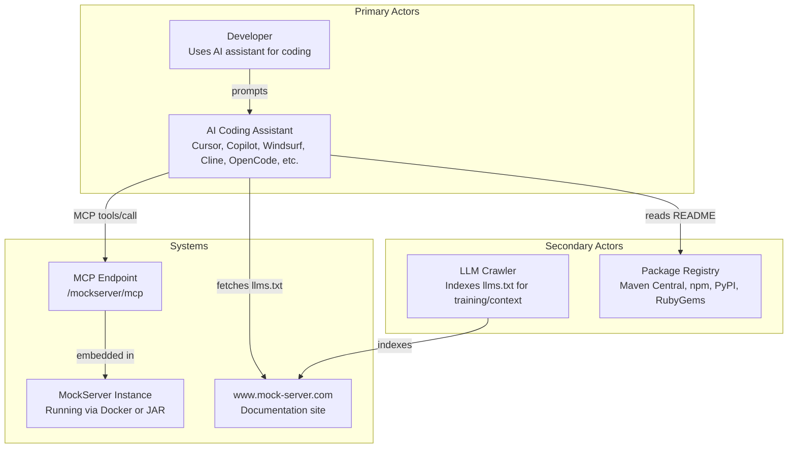
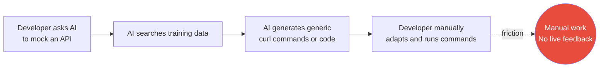
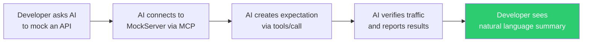

# Specification: AI Developer Experience for MockServer

**Created**: 2026-05-06
**Status**: Draft
**Author**: James Bloom with AI-assisted ideation

---

## Executive Summary

AI coding assistants (Cursor, Copilot, Windsurf, Cline, OpenCode, etc.) cannot currently discover, configure, or interact with MockServer programmatically. This limits MockServer's adoption among developers who increasingly rely on AI assistants for development workflows, and prevents AI-driven debugging of HTTP traffic between services. The desired outcome is a complete AI integration surface: an MCP server embedded in MockServer (via Netty), machine-readable documentation (`llms.txt`), AI-optimised package READMEs, and a website documentation page explaining how to use MockServer with AI tools. Out of scope: changes to MockServer's core mocking/proxy functionality and any Java 17+ dependency requirements.

---

## Problem Statement

Developers using AI coding assistants currently have no programmatic way to discover MockServer's capabilities, create mock expectations, verify HTTP traffic, or debug API integration issues through their AI tools. This results in MockServer being invisible to AI-assisted workflows and losing adoption to competitors (some already ship `llms.txt`). The desired outcome is that any AI coding assistant can discover MockServer via `llms.txt`, connect to a running instance via MCP, and perform the full mock/verify/debug workflow without the developer writing MockServer-specific code.

---

## Background & Context

MockServer is an HTTP(S) mock server and proxy with a well-defined REST API (documented in an OpenAPI 3.0 spec at `mockserver/mockserver-core/src/main/resources/org/mockserver/openapi/mock-server-openapi-embedded-model.yaml`). It has client libraries in Java, TypeScript, Python, and Ruby, published to Maven Central, npm, PyPI, and RubyGems respectively. The server runs on Netty and is commonly deployed via Docker (`mockserver/mockserver`).

The Model Context Protocol (MCP) is an open standard for AI tool integration. It enables AI assistants to discover and invoke tools exposed by servers. The "Streamable HTTP" transport runs over standard HTTP POST/SSE — a natural fit for MockServer's existing Netty pipeline. The MCP protocol is JSON-RPC 2.0, which can be implemented directly in Java 11 without external SDK dependencies (the official Java MCP SDK requires Java 17+, conflicting with MockServer's Java 11 policy).

The `llms.txt` convention (llmstxt.org) provides a standardised way for websites to expose machine-readable content summaries for LLMs. Some competing mock servers already ship `llms.txt`, `llms-small.txt`, and `llms-full.txt`. MockServer has none.

Currently, no package README (npm, PyPI, RubyGems, Maven Central) mentions AI tooling, MCP, or points to machine-readable documentation. Keywords are sparse (npm packages have only 3 keywords each, mostly Grunt-related).

---

## Actors



| Actor | Type | Role | Interaction |
|-------|------|------|-------------|
| Developer | Primary | Uses AI assistant to create mocks, verify traffic, debug HTTP issues | Prompts AI assistant with natural language |
| AI Coding Assistant | Primary | Discovers MockServer capabilities, connects via MCP, executes workflows | Fetches llms.txt, connects to MCP endpoint, calls tools |
| LLM Crawler | Secondary | Indexes llms.txt content for AI training and context retrieval | HTTP GET on llms.txt and llms-full.txt |
| Package Registry | Secondary | Hosts package metadata and README visible to AI search | Displays AI-optimised README with MCP mention |
| MockServer Instance | System | Runs the mock/proxy server and exposes MCP endpoint | Accepts MCP JSON-RPC over HTTP |
| Website | System | Hosts documentation including llms.txt | Serves llms.txt, llms-full.txt, and AI guide page |

---

## Current Behaviour

Today, when a developer asks their AI assistant to "set up a mock for my API endpoint" or "debug why my service call to the payment API is failing":

1. The AI has no structured knowledge of MockServer unless it happens to be in training data
2. The AI cannot discover MockServer's capabilities programmatically
3. The AI cannot create expectations, verify requests, or inspect traffic without the developer manually writing client code or curl commands
4. Package registry pages (npm, PyPI, etc.) have minimal/dated metadata that doesn't surface well in AI search
5. The website has no machine-readable summary (`llms.txt`)



For the HTTP debugging use case, the developer must manually:
1. Deploy MockServer as a proxy
2. Configure their service to route through it
3. Use the dashboard UI or REST API to inspect traffic
4. Interpret the results themselves

The AI assistant cannot participate in any of these steps.

---

## Desired Behaviour

After the change, when a developer asks their AI assistant to "set up a mock for my API endpoint" or "debug why my payment API call is failing":

1. The AI discovers MockServer's capabilities via `llms.txt` (if it needs context) or knows about MockServer from enriched registry metadata
2. The AI connects to a running MockServer instance via MCP at `/mockserver/mcp`
3. The AI creates expectations, starts proxy recording, verifies requests, retrieves traffic logs, and diagnoses issues — all through MCP tool calls
4. The developer sees results in natural language, without writing MockServer-specific code



For the HTTP debugging use case:
1. Developer tells AI "debug why my call to the payment API returns 500"
2. AI uses MCP tools to set up a forwarding proxy expectation, retrieve recorded request/response pairs, and analyse mismatches
3. AI reports findings: "The payment API is returning 500 because your request is missing the `Authorization` header — here's the recorded request/response"

---

## Scope

| In Scope | Out of Scope |
|----------|-------------|
| Embedded MCP server endpoint in MockServer (Netty handler) | Changes to MockServer's core mocking/proxy logic |
| MCP tools for expectation CRUD, verification, traffic retrieval, state management | MCP tools for TLS certificate management |
| MCP resources for active expectations, recorded traffic, logs | UTCP or other non-existent standards (UTCP has no spec, no SDK, no adoption) |
| Lifecycle tools (status, stop) within the embedded MCP | Starting MockServer from MCP (requires external orchestration) |
| `llms.txt` and `llms-full.txt` on www.mock-server.com | Automated llms.txt generation pipeline |
| AI-optimised READMEs for all package registries (npm, PyPI, RubyGems, Maven) | Rewriting existing consumer documentation beyond AI section |
| New "AI Integration" sidebar section on website (4 sub-pages) | Changes to existing website page content (only cross-references added) |
| Updated keywords/classifiers on all package registries | Version bumps or new releases of client libraries |
| JSON-RPC 2.0 implementation in Java 11 (no external MCP SDK) | Adopting the official Java MCP SDK (requires Java 17+) |
| MCP Streamable HTTP transport (POST + SSE) | MCP stdio transport |
| Control plane authentication support for MCP (reuse existing mTLS/JWT) | New authentication mechanisms |
| Enhanced OpenAPI spec served from running instances and website | Replacing the REST API with MCP (OpenAPI remains as fallback) |
| Root README AI integration one-liner with links | Detailed AI documentation in the README (that belongs on the website) |
| MCP Prompts capability (Phase 3) | MCP Prompts in initial delivery |

---

## Functional Requirements

### Component 1: Embedded MCP Server

| ID | Requirement | Priority |
|----|-------------|----------|
| FR-01 | MockServer MUST expose an MCP endpoint at `/mockserver/mcp` that implements the MCP Streamable HTTP transport (spec version 2025-03-26) | MUST |
| FR-02 | The MCP endpoint MUST handle POST (JSON-RPC requests/notifications), GET (SSE stream for server-initiated messages), and DELETE (session termination) HTTP methods | MUST |
| FR-03 | The MCP endpoint MUST implement the MCP initialization handshake (`initialize` request, `Mcp-Session-Id` header, `notifications/initialized` notification) | MUST |
| FR-04 | The MCP endpoint MUST support `tools/list` and `tools/call` protocol methods | MUST |
| FR-05 | The MCP endpoint MUST support `resources/list` and `resources/read` protocol methods | MUST |
| FR-06 | The MCP endpoint MUST be implemented in Java 11 compatible code using Netty directly, without the official MCP Java SDK | MUST |
| FR-07 | The MCP endpoint SHOULD reuse MockServer's existing control plane authentication (mTLS and JWT) when configured | SHOULD |
| FR-08 | The MCP endpoint MUST be enabled by default on all MockServer instances (no opt-in configuration required) | MUST |
| FR-09 | The MCP endpoint MAY support the `notifications/tools/list_changed` server notification when expectations or configuration change | MAY |

### Component 2: MCP Tools (High-Level Workflow)

| ID | Requirement | Priority |
|----|-------------|----------|
| FR-10 | The MCP server MUST expose a `create_expectation` tool that creates a mock expectation from a natural-language-friendly schema (method, path, response status, response body, optional headers, optional times) | MUST |
| FR-11 | The MCP server MUST expose a `verify_request` tool that verifies a request was received a specified number of times, returning a human-readable success/failure message | MUST |
| FR-12 | The MCP server MUST expose a `verify_request_sequence` tool that verifies requests were received in a specific order | MUST |
| FR-13 | The MCP server MUST expose a `retrieve_recorded_requests` tool that returns recorded requests matching an optional filter, formatted as readable JSON | MUST |
| FR-14 | The MCP server MUST expose a `retrieve_request_responses` tool that returns matched request-response pairs for debugging | MUST |
| FR-15 | The MCP server MUST expose a `clear_expectations` tool that clears expectations and/or logs matching a filter | MUST |
| FR-16 | The MCP server MUST expose a `reset` tool that clears all state (expectations, logs, recorded requests) | MUST |
| FR-17 | The MCP server MUST expose a `get_status` tool that returns MockServer's running status and bound ports | MUST |
| FR-18 | The MCP server SHOULD expose a `create_forward_expectation` tool that sets up a forwarding proxy for a path pattern (for HTTP debugging use case) | SHOULD |
| FR-19 | The MCP server SHOULD expose a `debug_request_mismatch` tool that runs the existing `MatchDifference` comparison engine against all active expectations with `detailedMatchFailures=true` and `matchersFailFast=false`, returning structured per-field failure reasons (METHOD, PATH, HEADERS, BODY, etc.) for each expectation | SHOULD |
| FR-20 | The MCP server SHOULD expose a `create_expectation_from_openapi` tool that generates expectations from an OpenAPI/Swagger specification URL or inline spec | SHOULD |
| FR-21 | The MCP server MAY expose a `stop_server` tool that gracefully stops the MockServer instance | MAY |

### Component 3: MCP Tools (Low-Level API Access)

| ID | Requirement | Priority |
|----|-------------|----------|
| FR-22 | The MCP server MUST expose a `raw_expectation` tool that accepts the full MockServer expectation JSON schema (identical to `PUT /mockserver/expectation` body) for advanced use cases | MUST |
| FR-23 | The MCP server MUST expose a `raw_retrieve` tool that accepts the full retrieve parameters (type, format, filter) for advanced retrieval | MUST |
| FR-24 | The MCP server MUST expose a `raw_verify` tool that accepts the full verification JSON schema for advanced verification scenarios | MUST |

### Component 4: MCP Resources

| ID | Requirement | Priority |
|----|-------------|----------|
| FR-25 | The MCP server MUST expose an `active_expectations` resource (URI: `mockserver://expectations`) that returns all currently active expectations as JSON | MUST |
| FR-26 | The MCP server MUST expose a `recorded_requests` resource (URI: `mockserver://requests`) that returns recently recorded requests as JSON | MUST |
| FR-27 | The MCP server SHOULD expose a `server_logs` resource (URI: `mockserver://logs`) that returns recent log entries | SHOULD |
| FR-28 | The MCP server SHOULD expose a `server_configuration` resource (URI: `mockserver://configuration`) that returns current configuration properties | SHOULD |

### Component 5: llms.txt and llms-full.txt

| ID | Requirement | Priority |
|----|-------------|----------|
| FR-29 | The website MUST serve `llms.txt` at `https://www.mock-server.com/llms.txt` following the llmstxt.org convention | MUST |
| FR-30 | `llms.txt` MUST contain: project name, summary blockquote, and H2 sections with links covering: Getting Started, Client Libraries (all 4 languages), REST API, Configuration, MCP Integration, Docker Deployment, and an `## Optional` section for advanced topics | MUST |
| FR-31 | The website MUST serve `llms-full.txt` at `https://www.mock-server.com/llms-full.txt` containing all linked content expanded inline | MUST |
| FR-32 | `llms-full.txt` MUST cover: complete REST API reference with example payloads, all configuration properties with defaults and environment variable names, client library quick-start examples for all 4 languages, MCP tool reference, Docker deployment options, and request matching syntax | MUST |
| FR-33 | `llms.txt` SHOULD be under 3,000 tokens to remain efficient for quick LLM context loading | SHOULD |
| FR-34 | `llms-full.txt` SHOULD be under 100,000 tokens to remain loadable by most LLM context windows | SHOULD |

### Component 6: AI-Optimised Package READMEs

| ID | Requirement | Priority |
|----|-------------|----------|
| FR-35 | Each package README (npm: `mockserver-client`, npm: `mockserver-node`, PyPI: `mockserver-client`, RubyGems: `mockserver-client`) MUST include a structured "AI Assistant Integration" section mentioning the MCP server and linking to `llms.txt` | MUST |
| FR-36 | Each npm `package.json` MUST have updated keywords including at minimum: `mockserver`, `mock`, `HTTP`, `HTTPS`, `testing`, `proxy`, `api`, `mcp`, `ai` | MUST |
| FR-37 | The Python `pyproject.toml` MUST include `MCP` and `AI` in its keywords list | MUST |
| FR-38 | The Maven parent POM description MUST be corrected (fix "In simple" grammar error) and updated to mention AI/MCP integration | SHOULD |
| FR-39 | Each README MUST include a structured quick-start section with: install command, minimal code example, link to full documentation | MUST |

### Component 7: Website "AI Integration" Documentation Section

| ID | Requirement | Priority |
|----|-------------|----------|
| FR-40 | The website MUST include a new sidebar section "AI Integration" containing multiple sub-pages, accessible from the main navigation | MUST |
| FR-41 | Sub-page "MCP Setup" MUST document how to connect an AI assistant via MCP, including a quick-start section showing the minimal MCP client configuration (JSON), and configuration examples for Cursor, Claude Code, Windsurf, Cline, Continue, and OpenCode | MUST |
| FR-42 | Sub-page "MCP Tools Reference" MUST document all MCP tools with descriptions, parameters, JSON Schema, and example JSON-RPC request/response pairs | MUST |
| FR-43 | Sub-page "Debugging with AI" MUST document the HTTP debugging workflow: setting up a forwarding proxy expectation, retrieving recorded traffic, diagnosing mismatches with the `debug_request_mismatch` tool, and example AI prompts for common debugging scenarios | MUST |
| FR-46 | Sub-page "OpenAPI for AI" MUST document how to use MockServer's OpenAPI spec as a fallback for AI tools that do not support MCP, including the spec URL (`/mockserver/openapi.yaml`), how to use it with ChatGPT Actions, and how to use it as context for any LLM | MUST |
| FR-47 | Existing website pages SHOULD include brief cross-references to the AI Integration section where relevant (e.g., "Getting Started" mentions MCP as an option, "Debugging Issues" links to the AI debugging workflow) | SHOULD |

### Component 8: Root README AI Section

| ID | Requirement | Priority |
|----|-------------|----------|
| FR-44 | The root `README.md` MUST include an "AI Integration" subsection (after the current README update is complete) with a one-liner summary and links to: `llms.txt`, the website AI Integration docs, and the MCP endpoint | MUST |
| FR-45 | The README AI section MUST NOT exceed 3-4 lines — it is a signpost to the full documentation, not documentation itself | MUST |

### Component 9: Enhanced OpenAPI Spec

| ID | Requirement | Priority |
|----|-------------|----------|
| FR-48 | MockServer MUST serve its OpenAPI spec at `GET /mockserver/openapi.yaml` on running instances | MUST |
| FR-49 | The website MUST publish the OpenAPI spec at `https://www.mock-server.com/mockserver-openapi.yaml` for static consumption by AI tools and developers | MUST |
| FR-50 | The OpenAPI spec SHOULD be enhanced with richer descriptions and example request/response payloads for each endpoint, optimised for LLM comprehension | SHOULD |
| FR-51 | The OpenAPI spec version field MUST be updated to match the current MockServer version (currently says `5.15.x`) | MUST |
| FR-52 | The OpenAPI spec `info.description` SHOULD mention MCP as the primary AI integration method, with the REST API as a direct alternative | SHOULD |

---

## Non-Functional Requirements

| ID | Requirement | Rationale |
|----|-------------|-----------|
| NFR-01 | All MCP server code MUST compile and run on Java 11 | MockServer's Java 11 compatibility policy; ~23% of Java projects still use Java 11 |
| NFR-02 | The MCP endpoint MUST NOT introduce any new external dependencies beyond what MockServer already uses | Minimise JAR size; JSON-RPC 2.0 is simple enough to implement with existing Jackson |
| NFR-03 | The MCP endpoint MUST add less than 5ms latency to tool calls compared to equivalent direct REST API calls | MCP is a thin wrapper; should not introduce meaningful overhead |
| NFR-04 | The MCP endpoint MUST NOT interfere with existing MockServer functionality (mocking, proxying, dashboard, WebSocket callbacks) | Backwards compatibility; existing users must not be affected |
| NFR-05 | `llms.txt` MUST be manually maintained alongside website content (not auto-generated) to ensure quality and token efficiency | Auto-generation tends to produce verbose, low-quality content |
| NFR-06 | The MCP implementation MUST conform to MCP specification version 2025-03-26 | Current stable MCP spec; ensures compatibility with all major AI assistants |
| NFR-07 | All MCP tool descriptions MUST be written for LLM consumption: clear, unambiguous, with explicit parameter descriptions and example values | Tool descriptions are the primary way AI assistants decide which tools to use |
| NFR-08 | Package README changes MUST NOT break existing CI/CD publishing workflows | READMEs are published to registries automatically; formatting must be compatible |

---

## Edge Cases & Error Handling

| Scenario | Expected Behaviour |
|----------|-------------------|
| AI sends MCP request before `initialize` handshake | Server returns JSON-RPC error with code `-32600` and message explaining initialization is required |
| AI sends `tools/call` with unknown tool name | Server returns JSON-RPC error with code `-32602` and lists available tool names |
| AI sends `tools/call` with invalid arguments | Server returns tool result with `isError: true` and a descriptive message explaining which arguments are invalid and what's expected |
| AI sends malformed JSON-RPC | Server returns JSON-RPC parse error (code `-32700`) |
| AI sends request with expired/invalid `Mcp-Session-Id` | Server returns HTTP 404; AI must re-initialize |
| AI calls `create_expectation` with conflicting/duplicate expectation | Server upserts (replaces) the existing expectation with the same ID (existing MockServer behaviour) |
| AI calls `verify_request` and verification fails | Tool returns `isError: false` with a human-readable failure explanation (not a protocol error — verification failure is a valid result) |
| AI calls `retrieve_recorded_requests` on a server with thousands of entries | Tool returns paginated results (first 50 by default, configurable via `limit` parameter) with `totalCount` indicating how many exist |
| MockServer has control plane authentication enabled (mTLS/JWT) | MCP endpoint requires the same authentication; returns HTTP 401/403 with a clear error message if credentials are missing |
| Multiple AI sessions connect to the same MockServer instance | Each MCP session is independent with its own `Mcp-Session-Id`; no cross-session interference |
| MockServer is stopped while MCP session is active | Server closes all SSE streams and MCP sessions; AI receives connection closed |
| `llms.txt` content becomes stale after a release | Captured as an operational process — llms.txt is updated as part of the release checklist |

---

## Success Criteria

| ID | Criterion | How to Verify |
|----|-----------|--------------|
| SC-01 | An AI assistant (Cursor, OpenCode, or Cline) can connect to a running MockServer via MCP and list available tools | Configure MCP client, run `tools/list`, verify all expected tools are returned |
| SC-02 | An AI assistant can create a mock expectation, send a request to MockServer, and verify the request was received — entirely through MCP tool calls | End-to-end test: `create_expectation` -> HTTP request -> `verify_request` |
| SC-03 | An AI assistant can set up a forwarding proxy and retrieve recorded request-response pairs for debugging | `create_forward_expectation` -> route traffic -> `retrieve_request_responses` |
| SC-04 | `https://www.mock-server.com/llms.txt` returns valid llms.txt content under 3,000 tokens | HTTP GET + token count |
| SC-05 | `https://www.mock-server.com/llms-full.txt` returns comprehensive content covering all features, languages, and configuration | HTTP GET + verify coverage of REST API, all 4 client libraries, Docker, MCP, configuration |
| SC-06 | All package READMEs mention MCP integration and link to llms.txt | Inspect published packages on npm, PyPI, RubyGems |
| SC-07 | The website "AI Assistants" page includes working MCP configuration examples for at least 3 AI tools | Manual verification of page content |
| SC-08 | Competitor llms.txt parity: MockServer's llms.txt provides equivalent or better coverage than competing mock servers' llms.txt for common use cases | Side-by-side comparison: prompt both llms.txt to an LLM and verify MockServer answers are at least as good |

---

## Open Questions

All open questions have been resolved. See Key Decisions below for resolutions.

---

## Key Decisions

### Decision 1: Embedded MCP via Netty (not external sidecar)
- **Decision**: The MCP server will be embedded directly in MockServer as a new Netty handler, not as a separate process
- **Context**: MockServer already has Netty with HTTP handling; the MCP Streamable HTTP transport is standard HTTP POST/SSE. Embedding eliminates deployment complexity — every MockServer instance automatically becomes an MCP server
- **Alternatives considered**: TypeScript sidecar (rejected: extra process, extra dependency, harder for users to set up), Java MCP SDK (rejected: requires Java 17+, violates Java 11 policy)

### Decision 2: Custom JSON-RPC 2.0 implementation (not official SDK)
- **Decision**: Implement MCP protocol directly using JSON-RPC 2.0 over Netty, using MockServer's existing Jackson for JSON handling
- **Context**: The official Java MCP SDK requires Java 17+. MockServer targets Java 11 as minimum. The MCP protocol is simple JSON-RPC 2.0 — implementable without an SDK
- **Alternatives considered**: Official Java MCP SDK (rejected: Java 17+ requirement), Kotlin MCP SDK (rejected: likely same JVM version issue, adds Kotlin dependency)

### Decision 3: Dual-granularity tools (high-level + low-level)
- **Decision**: Expose both high-level workflow tools (e.g., `create_expectation` with simplified parameters) and low-level raw API tools (e.g., `raw_expectation` accepting full JSON schema)
- **Context**: High-level tools make common workflows easy for AI assistants. Low-level tools provide escape hatch for advanced scenarios without AI having to fall back to curl/REST
- **Alternatives considered**: High-level only (rejected: too limiting for power users), 1:1 API mapping only (rejected: requires AI to understand full MockServer JSON schema)

### Decision 4: MCP Resources for passive data access
- **Decision**: Expose active expectations, recorded requests, logs, and configuration as MCP Resources
- **Context**: MCP Resources allow AI assistants to read data without calling tools — better for context-building workflows where the AI needs to understand current state
- **Alternatives considered**: Tools only (rejected: less ergonomic for read-heavy workflows)

### Decision 5: Both llms.txt and llms-full.txt
- **Decision**: Ship both files — `llms.txt` as a concise index (~3K tokens) and `llms-full.txt` as comprehensive reference
- **Context**: Follows the llmstxt.org convention. Different AI tools need different levels of detail. The concise version is for quick context loading; the full version for implementation-level queries
- **Alternatives considered**: Single file (rejected: either too long for quick queries or too shallow for implementation)

### Decision 6: Lifecycle tools included in embedded MCP
- **Decision**: The embedded MCP server will include lifecycle tools (status, stop) rather than building a separate sidecar for lifecycle management
- **Context**: Starting MockServer requires external orchestration (Docker, Maven, etc.) which is outside MCP's scope. But status checking and graceful shutdown are natural embedded operations
- **Alternatives considered**: Separate TypeScript sidecar for lifecycle (rejected: adds complexity, deferred in favour of embedded approach)

### Decision 7: MCP endpoint on same port (1080)
- **Decision**: The MCP endpoint will be served on the same port as MockServer's main HTTP listener (default 1080), at the path `/mockserver/mcp`
- **Context**: Zero configuration required. The `/mockserver/` path prefix prevents collision with mock traffic. Simplifies Docker port mapping and service discovery. Follows the same pattern as `/mockserver/dashboard` and other control plane endpoints.
- **Alternatives considered**: Separate port (rejected: requires extra config, extra port mapping in Docker, complicates discovery), Both modes (rejected: unnecessary complexity)

### Decision 8: Hand-authored llms-full.txt
- **Decision**: `llms-full.txt` will be hand-authored and manually maintained
- **Context**: Auto-generation from Jekyll pages produces verbose, low-quality content. Hand-authoring ensures token efficiency and quality. The file is updated as part of the release checklist.
- **Alternatives considered**: Generated from Jekyll (rejected: verbose, poor quality), Hybrid (rejected: adds build complexity for marginal benefit)

### Decision 9: MCP Prompts in Phase 3
- **Decision**: MCP `prompts` capability (pre-built prompt templates for workflows like "set up a REST API mock" or "debug HTTP 500 errors") will be added in Phase 3
- **Context**: Prompts guide AI assistants through multi-step workflows. Valuable but not required for core functionality. Tools and resources in Phase 2 provide the foundation.
- **Alternatives considered**: Phase 2 (rejected: adds scope to core delivery), Never (rejected: prompts add real value for complex workflows)

### Decision 10: 50-item default pagination with limit parameter
- **Decision**: MCP tools that return lists (retrieve tools, resources) default to 50 items per response, with an optional `limit` parameter
- **Context**: Data-driven analysis of actual JSON payload sizes from the codebase: worst-case complex expectations ~2,600 chars (659 tokens), realistic request-response pairs ~2,000 chars (517 tokens). At 50 items, worst case = ~33K tokens, well within the ~50K token budget. Response includes `totalCount` so AI knows if more items exist.
- **Alternatives considered**: 25 (rejected: too conservative, wastes 60-75% of budget), 100 (rejected: unsafe for complex expectations with large JSON bodies)

### Decision 11: Batch JSON-RPC from the start
- **Decision**: The MCP endpoint will support batch JSON-RPC requests (arrays of multiple requests in one POST body) from Phase 2
- **Context**: The MCP spec requires batch support. Implementation is minimal incremental effort — the JSON-RPC parser already needs to handle objects; handling arrays is a trivial extension.
- **Alternatives considered**: Defer to Phase 3 (rejected: spec compliance is important for interoperability)

### Decision 12: Configuration examples for 6 AI tools
- **Decision**: The website AI Assistants page will include MCP configuration examples for: Cursor, Claude Code, Windsurf, Cline, Continue, and OpenCode
- **Context**: Covers the most popular AI coding assistants. Each has a different MCP configuration format (JSON in different locations). Concrete examples eliminate the biggest friction point for adoption.
- **Alternatives considered**: Coding assistants only / excluding Claude Desktop (superseded: Claude Code is a coding tool and included)

### Decision 13: Debug mismatch tool uses existing comparison engine with full field comparison
- **Decision**: The `debug_request_mismatch` tool will use MockServer's existing `MatchDifference` / `HttpRequestPropertiesMatcher` infrastructure, always running with `detailedMatchFailures=true` and `matchersFailFast=false` (full comparison of all fields)
- **Context**: The existing comparison engine already produces structured per-field failures (`Map<Field, List<String>>`) across 12 field categories. No new comparison logic needed — only ~50 lines of new code to iterate active expectations, run matchers with a `MatchDifference` context, and return structured results. Always-full comparison ensures the AI sees every mismatch, not just the first.
- **Alternatives considered**: New comparison engine (rejected: existing engine already produces exactly the right data), Respect global `matchersFailFast` (rejected: debug tool should always show all mismatches)

### Decision 14: No UTCP — it does not exist as a standard
- **Decision**: UTCP will not be considered or supported. It does not exist as an established standard.
- **Context**: Research found no UTCP specification, website, SDK, GitHub repository, or adoption by any AI tool. The term appears to have been floated conceptually but never materialised. The real landscape is: MCP (primary, supported by all major coding assistants), OpenAPI (fallback for ChatGPT Actions and direct REST API usage), and llms.txt (discovery/context).
- **Alternatives considered**: None — there is nothing to implement

### Decision 15: Enhanced OpenAPI spec as MCP fallback
- **Decision**: The existing 1,029-line OpenAPI 3.0 spec will be enhanced with richer descriptions and examples, served from running MockServer instances at `GET /mockserver/openapi.yaml`, and published on the website at `www.mock-server.com/mockserver-openapi.yaml`
- **Context**: Only ChatGPT's GPT Actions natively consume OpenAPI specs — coding assistants (Cursor, Claude Code, Copilot, etc.) have all converged on MCP. However, the OpenAPI spec is cheap to enhance (it already exists), provides value for ChatGPT Actions users, and serves as documentation for the REST API that any AI can use as context. It also future-proofs against new tools that may consume OpenAPI.
- **Alternatives considered**: MCP + llms.txt only (rejected: OpenAPI enhancement is low effort and adds coverage for ChatGPT Actions), Full OpenAPI-to-tools conversion (rejected: MCP is the right tool for this, OpenAPI is the fallback)

### Decision 16: Consumer docs as multi-page sidebar section
- **Decision**: The website will have a new "AI Integration" sidebar section with 4 sub-pages (MCP Setup, MCP Tools Reference, Debugging with AI, OpenAPI for AI) rather than a single page
- **Context**: Comprehensive AI documentation doesn't fit well on a single page. A sidebar section with dedicated sub-pages is more discoverable, more maintainable, and follows the existing website structure pattern. Existing pages get brief cross-references to the AI section where relevant.
- **Alternatives considered**: Single page (rejected: too dense for comprehensive coverage), Single page + no cross-references (rejected: AI integration is less discoverable from other doc pages)

### Decision 17: Root README gets one-liner + links only
- **Decision**: The root README will have a minimal "AI Integration" subsection (3-4 lines max) with links to llms.txt, the AI docs, and the MCP endpoint. No detailed AI documentation in the README.
- **Context**: The README is a high-level summary. Detailed AI integration docs belong on the website. The README serves as a signpost. Will be added after the current README improvement work (running in another session) is complete.
- **Alternatives considered**: Short section with quick-start (rejected: README should stay lean), Badge + one-liner (rejected: too minimal — developers need at least the key links)

---

## Ideation Log

### 2026-05-06
- Q: Who is the primary audience? -> A: Both existing MockServer users wanting AI assistance AND new developers discovering MockServer through AI tools
- Q: Primary MCP workflow? -> A: Both setup/configuration AND HTTP traffic debugging as first-class use cases
- Q: MCP server technology? -> A: If embedded in MockServer, Java makes most sense using Netty directly. User asked: "if we're not going to run it as part of the mock server itself where would it be running?"
- Q: Lifecycle management? -> A: Both modes — connect to existing AND launch new. Later refined to: add lifecycle support to embedded MCP
- Q: Delivery scope? -> A: Plan everything, build incrementally
- Q: Artifact page strategy? -> A: README + llms.txt links + MCP mention on all registries
- Decision: Java MCP SDK requires Java 17+ — cannot be used directly. Custom JSON-RPC 2.0 implementation via Netty is the right approach
- Q: MCP architecture? -> A: Dual mode (embedded + sidecar). Later refined to: embedded only via Netty, with lifecycle tools included
- Q: llms.txt location? -> A: Website root, with detail covering all components, languages, and features considering token efficiency and answer quality
- Q: llms.txt structure? -> A: Both llms.txt (concise) and llms-full.txt (comprehensive)
- Q: TypeScript sidecar priority? -> A: "lets add that support for the embedded MCP via Netty" — lifecycle in embedded, no separate sidecar needed
- Q: MCP tool granularity? -> A: Rich workflow + low-level (high-level tools for common cases, raw API tools for advanced)
- Q: MCP Resources? -> A: Yes, expose active expectations, recorded traffic, logs, and configuration as MCP Resources
- Q: Artifact pages (npm, PyPI, RubyGems, Maven)? -> A: Should also be considered — enrich READMEs with AI section, update keywords, link to llms.txt and MCP docs
- Q: MCP endpoint port? -> A: Same port (1080), at path `/mockserver/mcp`. Zero config, follows existing control plane pattern.
- Q: llms-full.txt authoring? -> A: Hand-authored for quality and token efficiency. Updated as part of release checklist.
- Q: MCP Prompts? -> A: Yes, but in Phase 3. Tools and resources first.
- Q: Pagination limit? -> A: 50 items default with optional `limit` parameter. Data-driven: worst-case 50 complex expectations = ~33K tokens, well within budget. Response includes `totalCount`.
- Q: Batch JSON-RPC? -> A: Yes, from Phase 2. Spec requires it; minimal incremental effort.
- Q: Which AI tool config examples? -> A: Cursor, Claude Code, Windsurf, Cline, Continue, and OpenCode.
- Q: Debug mismatch tool? -> A: Existing `MatchDifference` engine already captures structured per-field failures. Tool just surfaces this data (~50 lines new code). Always runs full comparison (all fields, not just first failure).

---

## Delivery Phases

This specification is designed for incremental delivery. Suggested phasing:

### Phase 1: Discovery (llms.txt + website page + READMEs)
- `llms.txt` and `llms-full.txt` on www.mock-server.com
- "Using MockServer with AI Assistants" website page
- AI-optimised package READMEs and updated keywords/classifiers
- **Value**: AI assistants can discover and understand MockServer immediately, even before MCP exists

### Phase 2: Core MCP Server
- Netty handler for `/mockserver/mcp`
- JSON-RPC 2.0 protocol implementation
- MCP initialization handshake and session management
- Core tools: `create_expectation`, `verify_request`, `retrieve_recorded_requests`, `clear_expectations`, `reset`, `get_status`
- Core resources: `active_expectations`, `recorded_requests`
- **Value**: AI assistants can perform basic mock/verify workflows

### Phase 3: Advanced MCP Features
- Additional tools: `create_forward_expectation`, `debug_request_mismatch`, `create_expectation_from_openapi`, `verify_request_sequence`, `retrieve_request_responses`
- Low-level tools: `raw_expectation`, `raw_retrieve`, `raw_verify`
- Additional resources: `server_logs`, `server_configuration`
- SSE streaming for long-running operations
- **Value**: Full debugging workflow; power-user access to complete API

### Phase 4: Polish & Ecosystem
- MCP configuration examples for all major AI tools
- Example AI prompts on the website
- Integration tests with real AI assistants
- Update `llms-full.txt` with MCP tool documentation
- **Value**: Seamless end-to-end experience across the ecosystem

---

## Technical Architecture Notes

### MCP Endpoint Placement in Netty Pipeline

The MCP handler follows the same pattern as existing WebSocket handlers (`CallbackWebSocketServerHandler`, `DashboardWebSocketHandler`). It intercepts requests to `/mockserver/mcp` before they reach `MockServerHttpServerCodec` and `HttpRequestHandler`.

```
HttpObjectAggregator
CallbackWebSocketServerHandler     <- existing
DashboardWebSocketHandler          <- existing
McpStreamableHttpHandler           <- NEW
MockServerHttpServerCodec
HttpRequestHandler
```

For SSE responses (GET requests and streaming POST responses), the handler writes an initial `DefaultHttpResponse` with `Content-Type: text/event-stream` and `Transfer-Encoding: chunked`, then sends `DefaultHttpContent` frames for each SSE event. The `HttpObjectAggregator` is not an issue because only inbound requests are aggregated; outbound streaming is handled by Netty's `HttpServerCodec`.

### MCP Protocol Implementation

The protocol is JSON-RPC 2.0 with these method handlers:

| Method | Handler |
|--------|---------|
| `initialize` | Return server capabilities, generate session ID |
| `notifications/initialized` | Mark session as ready, return 202 |
| `tools/list` | Return tool definitions with JSON Schema |
| `tools/call` | Dispatch to tool handler, return result |
| `resources/list` | Return resource definitions |
| `resources/read` | Return resource content |

Session state is managed via `ConcurrentHashMap<String, McpSession>` keyed by `Mcp-Session-Id`.

### Tool-to-API Mapping

High-level tools delegate to the same internal APIs that `HttpState.handle()` uses:

| MCP Tool | Internal API |
|----------|-------------|
| `create_expectation` | `RequestMatchers.add()` via `HttpState.add()` (simplified schema) |
| `verify_request` | `MockServerEventLog.verify()` via `HttpState.verify()` |
| `retrieve_recorded_requests` | `MockServerEventLog.retrieveRequests()` via `HttpState.retrieve()` |
| `clear_expectations` | `HttpState.clear()` |
| `reset` | `HttpState.reset()` |
| `get_status` | `MockServer.getLocalPorts()` |
| `raw_expectation` | `HttpState.add()` (full schema passthrough) |
