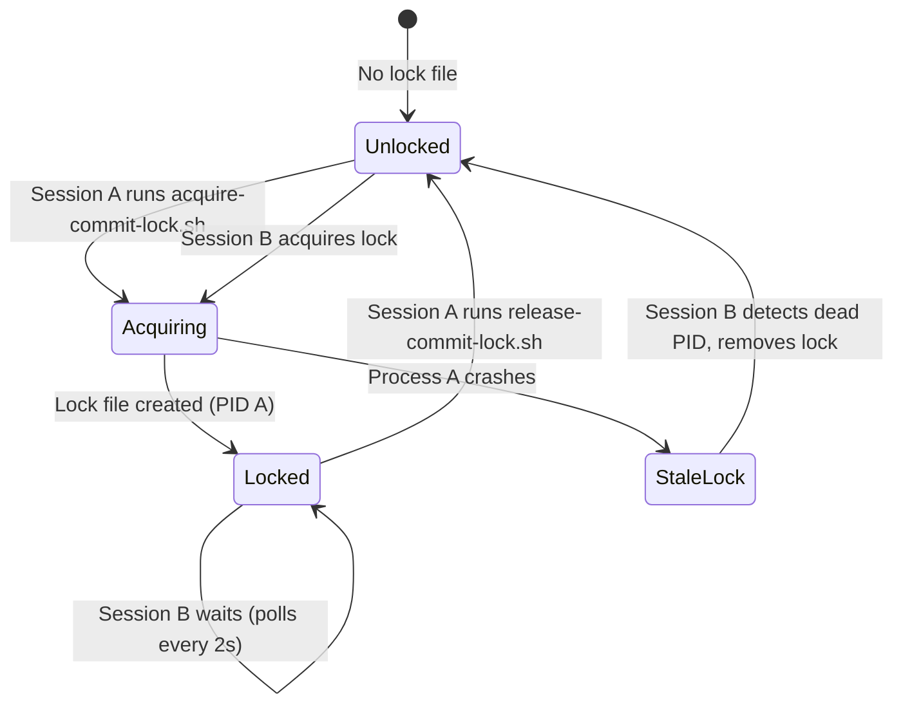

# Commit Locking Mechanism

## Purpose

Prevents concurrent commits from multiple parallel opencode sessions running in the same repository. Without locking, parallel sessions could:
- Stage and commit each other's files
- Create race conditions during `git add` and `git commit`
- Generate merge conflicts or interleaved commits
- Violate the principle that each session only commits its own changes

## Mechanism

Uses a filesystem-based lock file at `.tmp/.commit-lock` to ensure only one session can commit at a time.

### Lock File Format

```
<PID> <TIMESTAMP>
```

Example:
```
12345 1704067200
```

- **PID**: Process ID of the shell that acquired the lock
- **TIMESTAMP**: Unix timestamp when lock was acquired

## Scripts

### `.opencode/scripts/acquire-commit-lock.sh`

Acquires the commit lock before beginning commit workflow.

**Behavior:**
- Checks if lock file exists
- If lock exists and process is alive, waits (polls every 2 seconds, max 5 minutes)
- If lock exists but process is dead (stale lock), removes lock and acquires
- If no lock, creates lock file atomically with current PID and timestamp
- Returns 0 on success, 1 on timeout

**Output:**
```
Commit lock acquired (PID: 12345)
```

or if waiting:
```
Another opencode session is currently committing.
Lock held by PID 12345 (age: 1m 23s)
Waiting for lock (timeout: 300s)...
```

**Timeout behavior:**
```
ERROR: Failed to acquire commit lock after 300s
Lock held by PID 12345 (age: 6m 12s)

Options:
1. Wait for the other session to complete its commit
2. If the other session crashed, manually remove: /path/to/.tmp/.commit-lock
3. Cancel this commit and try again later
```

### `.opencode/scripts/release-commit-lock.sh`

Releases the commit lock held by current session.

**Behavior:**
- Checks if lock file exists
- If lock doesn't exist, silently succeeds (idempotent)
- If lock exists but is owned by another PID, warns and refuses (safety check)
- If lock is owned by current PID, removes lock file
- Returns 0 on success, 1 if lock owned by another process

**Output:**
```
Commit lock released (PID: 12345)
```

or if no lock:
```
No commit lock to release
```

or if lock owned by another process:
```
WARNING: Lock is owned by PID 67890, not this process (12345)
Not releasing lock owned by another process
```

## Usage Pattern

In commit workflow (`.opencode/rules/commit-workflow.md`):

```bash
# Set session PID to handle subshell execution
export OPENCODE_SESSION_PID=$$

# Always acquire lock before commit operations
.opencode/scripts/acquire-commit-lock.sh && {
    # ... all commit workflow steps ...
    git status
    git add <files>
    git commit -m "message"
    
    # Always release lock on success
    .opencode/scripts/release-commit-lock.sh
} || {
    # Always release lock on failure
    .opencode/scripts/release-commit-lock.sh
    exit 1
}
```

This pattern ensures lock is released whether commit succeeds or fails.

**Why `OPENCODE_SESSION_PID`?**
Bash commands run in subshells have different PIDs. Setting `OPENCODE_SESSION_PID` ensures the lock is owned by the parent session, not individual subshell PIDs.

## Lock Lifecycle



## Stale Lock Detection

A lock is considered stale if:
1. Lock file exists
2. PID in lock file does not correspond to a running process

When a stale lock is detected:
- Script logs: `Removing stale lock (process no longer exists)`
- Lock file is removed
- New lock is acquired immediately

This handles cases where:
- opencode crashes before releasing lock
- Terminal is force-quit
- System reboots

## Edge Cases

### Multiple Sessions Waiting

If 3 sessions (A, B, C) all try to commit:
1. Session A acquires lock
2. Session B waits (polls every 2s)
3. Session C waits (polls every 2s)
4. Session A releases lock
5. Whichever of B or C detects the unlock first acquires it (non-deterministic, but safe)

### Lock Timeout

If lock is held for >5 minutes:
- Waiting session times out with error
- User must manually investigate:
  - Is the other session still working? (check process with `ps -p <PID>`)
  - Did the other session crash? (if process dead, manually remove lock)
  - Is the commit genuinely taking >5 minutes? (terraform apply, large test suite)

### Manual Lock Removal

If lock is stuck (process dead but lock not auto-removed):
```bash
rm .tmp/.commit-lock
```

Safe to do if you've verified the PID in the lock file is not running.

## .gitignore Entry

```gitignore
# opencode commit lock (parallel session safety) #
###################################################
/.tmp/.commit-lock
```

Lock file is NEVER committed to git. It's a local, ephemeral coordination mechanism.

## Testing

### Test 1: Single Session

```bash
# Export session PID (required)
export OPENCODE_SESSION_PID=$$

# Should succeed immediately
.opencode/scripts/acquire-commit-lock.sh
echo $?  # 0

# Lock file should exist with current PID
cat .tmp/.commit-lock

# Release should succeed
.opencode/scripts/release-commit-lock.sh
echo $?  # 0

# Lock file should be gone
ls .tmp/.commit-lock  # No such file
```

### Test 2: Concurrent Sessions (Manual)

Terminal 1:
```bash
export OPENCODE_SESSION_PID=$$
.opencode/scripts/acquire-commit-lock.sh && sleep 30 && .opencode/scripts/release-commit-lock.sh
```

Terminal 2 (while Terminal 1 is sleeping):
```bash
export OPENCODE_SESSION_PID=$$
.opencode/scripts/acquire-commit-lock.sh
# Should wait and display: "Another opencode session is currently committing"
# After Terminal 1 releases, should acquire lock
```

### Test 3: Stale Lock

```bash
# Create fake stale lock with non-existent PID
echo "99999 $(date +%s)" > .tmp/.commit-lock

# Export session PID and acquire
export OPENCODE_SESSION_PID=$$
.opencode/scripts/acquire-commit-lock.sh
# Output: "Removing stale lock (process no longer exists)"
# Output: "Commit lock acquired (PID: <current>)"
```

## Monitoring

Check current lock status:
```bash
if [[ -f .tmp/.commit-lock ]]; then
    cat .tmp/.commit-lock
    read -r pid timestamp < .tmp/.commit-lock
    echo "Lock held by PID $pid"
    ps -p $pid && echo "Process alive" || echo "Process dead (stale lock)"
else
    echo "No lock"
fi
```

## Troubleshooting

| Symptom | Cause | Solution |
|---------|-------|----------|
| Commit waits (up to 5 minutes) | Another session holds lock | Wait for other session to complete or manually check lock file |
| "Failed to acquire commit lock after 300s" | Other session taking >5min or crashed | Check if PID in lock file is alive; remove lock if dead |
| "Lock is owned by PID X, not this process" on release | Script error or manual lock manipulation | Don't manually create lock files; let scripts manage |
| Lock file committed to git | .gitignore not up to date | Add `.tmp/.commit-lock` to .gitignore |
| Race condition between sessions | Lock not being used in commit workflow | Ensure all commit workflows call acquire before staging |

## Design Rationale

### Why Filesystem Lock vs Git Lock?

Git has internal locks (`.git/index.lock`), but they:
- Only protect individual git operations (add, commit)
- Don't prevent race between `git status` check and `git add`
- Don't prevent one session from staging another's files
- Are too fine-grained (operation-level vs workflow-level)

Filesystem lock protects the entire commit workflow as an atomic operation.

### Why Not Distributed Lock (Redis, DynamoDB)?

- Filesystem is always available (no external dependency)
- Lock is local to the repository (matches the problem scope)
- Simpler, faster, no network latency
- Fails safe (stale lock detection using `ps`)

### Why .tmp/ Location?

- Already gitignored (`.tmp/*`)
- Already used for scratch files (see `.opencode/rules/tmp-directory.md`)
- Clearly ephemeral, not a source artifact
- Consistent with project conventions

### Why 5-Minute Timeout?

Balances:
- Long enough for typical commit workflows (validations + review + commit = 1-3 minutes)
- Long enough for slow operations (terraform plan, large test suite)
- Short enough to detect actual deadlocks or crashes
- User can manually intervene if genuinely needed longer

### Why PID + Timestamp?

- **PID**: Enables stale lock detection (`ps -p $PID`)
- **Timestamp**: Enables age calculation for user-friendly messages ("lock held for 2m 15s")
- Both together enable safe automatic stale lock cleanup

## Future Enhancements

Possible improvements (not currently implemented):
- Lock with session identifier (git branch + timestamp) for better debugging
- Lock queue visibility (show waiting sessions)
- Integration with opencode's subagent communication (coordinator-based lock instead of filesystem)
