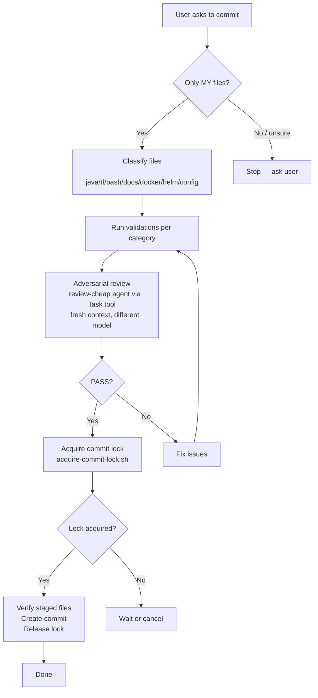

# Pre-Commit Workflow

When the user asks to commit changes, you MUST follow this workflow before creating the commit. Each step is mandatory unless explicitly skipped by the user.

## Parallel Session Safety

Multiple opencode sessions may be running concurrently on the same repository. To avoid conflicts:

1. **Use commit lock for all git operations.** Acquire the lock once after validation/review passes and before staging files (see Step 4). Release after commit completes (success or failure). Never hold the lock during validation or review as this blocks other sessions unnecessarily.
2. **Always release lock.** After commit completes (success or failure), run `.opencode/scripts/release-commit-lock.sh`. Use this pattern:
   ```bash
   .opencode/scripts/acquire-commit-lock.sh && {
       # ... commit workflow steps ...
       .opencode/scripts/release-commit-lock.sh
   } || {
       .opencode/scripts/release-commit-lock.sh
       exit 1
   }
   ```
3. **Only commit files you changed in THIS session.** Never stage or commit files modified by another session. Before staging, run `git status` and cross-reference with the files you know you created or edited. If in doubt, ask the user.
4. **Re-read before editing.** Always re-read a file immediately before editing it. Another session may have modified it since you last read it.
5. **Check for conflicts before committing.** Run `git status` right before `git commit`. If files you intend to commit show unexpected changes (modified by another session between your edit and the commit), stop and ask the user.
6. **Never run `git add .` or `git add -A`.** Always stage files individually by explicit path. Blanket staging will pick up changes from other sessions.
7. **Pull before push.** If the user asks to push, run `git pull --rebase` first. Another session may have pushed commits since your last check.
8. **Lock-sensitive operations.** Terraform state is locked via DynamoDB. If `terraform plan` or `terraform apply` fails with a lock error, another session is running Terraform — do not retry, inform the user.
9. **Branch awareness.** If working on a feature branch, verify you are on the correct branch before committing. Another session may have switched branches.

## Step 1: Classify Changed Files

Run `git status --short` to see all changed, staged, and untracked files. From the files you changed in this session, classify each into one or more categories:

| Category | File patterns |
|----------|--------------|
| `java` | `*.java`, `pom.xml` |
| `terraform` | `*.tf`, `*.tfvars.example` |
| `bash` | `*.sh` |
| `docker` | `Dockerfile*`, `docker-compose*.yml` |
| `docs` | `*.md`, `docs/**` |
| `config` | `.gitignore`, `*.yml`, `*.yaml`, `*.json` (non-terraform) |
| `helm` | `helm/**`, `Chart.yaml`, `values.yaml` |
| `website` | `jekyll-www.mock-server.com/**` |
| `npm` | `package.json`, `package-lock.json`, `*.js`, `*.ts`, `*.tsx`, `*.jsx` (in `mockserver-ui/`, `mockserver-client-node/`, `mockserver-node/`) |
| `python` | `*.py`, `pyproject.toml`, `requirements*.txt` (in `mockserver-client-python/`) |
| `ruby` | `*.rb`, `Gemfile`, `Gemfile.lock`, `*.gemspec` (in `mockserver-client-ruby/`) |

A commit may contain files from multiple categories. Run ALL applicable validations.

## Step 2: Run Category-Specific Validations

Validation principle: prefer executable verification over static inspection. When a file can be executed, built, rendered, or planned, run that command and use its output as evidence.

### Java changes (`java`)
1. Identify affected Maven modules from file paths (see testing-policy.md for module mapping)
2. Run unit tests: `cd mockserver && ./mvnw test -pl <module1>,<module2>`
3. If tests fail, fix before committing
4. If tests already passed earlier in this conversation for the exact same changes (no further edits since), skip re-running

### Terraform changes (`terraform`)
1. Run `terraform fmt -check -recursive` in the terraform directory to verify formatting
2. Run `terraform init -backend=false` if `.terraform/` does not exist (required before validate)
3. Run `terraform validate` in each affected terraform module directory
4. Run `terraform plan` with a placeholder token if no real token is available (e.g. `-var 'buildkite_agent_token=placeholder-for-plan'`)
5. If any step fails, fix before committing

### Bash script changes (`bash`)
1. Run `bash -n <script>` for each changed script to verify syntax
2. Verify the script is executable (`chmod +x` if needed)
3. Execute each changed script using the safest available runtime mode (`--help`, `--version`, `--dry-run`, or equivalent)
4. **Exception:** `.opencode/scripts/acquire-commit-lock.sh` and `.opencode/scripts/release-commit-lock.sh` have NO safe runtime mode (they perform lock I/O immediately). For these scripts, validate ONLY with `bash -n` and manual inspection.
5. If no safe runtime mode exists for other scripts, run the script with benign inputs in an isolated context or stop and ask the user for an explicit skip

### Docker changes (`docker`)
1. Build every changed Dockerfile with `docker build` (or `docker buildx build`) using the correct context
2. If `hadolint` is available, run `hadolint <Dockerfile>`
3. Run a basic smoke command from the built image when feasible (`--version`, startup help, or a short health command)
4. If the build uses an optional corporate CA cert, verify the placeholder file exists and the real cert file is in `.gitignore`

### Helm changes (`helm`)
1. Run `helm lint` on the chart directory
2. Run `helm template` to verify rendering

### Documentation changes (`docs`)
1. No tests required
2. Verify any internal links/cross-references point to files that exist (quick glob check)

### Config changes (`config`)
1. Validate YAML/JSON syntax if applicable
2. Run command-level verification when a tool-specific check exists (for example `jq` for JSON transforms, `yamllint` when available, or app-specific validation commands)

### Website changes (`website`)
1. Run `bundle exec jekyll build` if Jekyll files changed
2. Verify no broken links in generated output

### npm/Node.js changes (`npm`)
1. Identify affected package from file path (`mockserver-ui/`, `mockserver-client-node/`, or `mockserver-node/`)
2. Run validation for the affected package:
   - `mockserver-ui/`: `cd mockserver-ui && npm ci && npm run lint && npm run typecheck && npm test`
   - `mockserver-client-node/`: `cd mockserver-client-node && npm ci && npx grunt jshint && npx grunt ts`
   - `mockserver-node/`: `cd mockserver-node && npm ci && npx grunt jshint`
3. If tests or lint fail, fix before committing

### Python changes (`python`)
1. Run tests: `cd mockserver-client-python && python3 -m venv .venv && .venv/bin/pip install -e '.[dev]' && .venv/bin/pytest`
2. If tests fail, fix before committing
3. If tests already passed earlier in this conversation for the exact same changes, skip re-running

### Ruby changes (`ruby`)
1. Run tests: `cd mockserver-client-ruby && bundle install && bundle exec rspec`
2. If tests fail, fix before committing
3. If tests already passed earlier in this conversation for the exact same changes, skip re-running

## Step 3: Adversarial Code Review (MANDATORY for all commits)

After all validations pass, launch an adversarial review using a subagent on a **different model** with a **fresh context**. This catches issues the implementing agent may have blind spots for.

Use the **Task tool** with `subagent_type: "review-cheap"` and provide:
- The diff of files being committed: stage them first with `git add`, then capture `git diff --cached`
- The commit message you intend to use
- The file categories from Step 1

The review prompt MUST include:
```
Review these changes adversarially using `.opencode/rules/review-constitution.md`.

Apply all 8 lenses (Ambiguity, Incompleteness, Inconsistency, Infeasibility, Insecurity, 
Inoperability, Incorrectness, Overcomplexity). Pay special attention to:
- Hallucinated function/method/module names that don't exist (COR-07)
- Plausible-looking but incorrect logic (COR-05)
- Missing error handling or edge cases (INC-01, INC-07)
- Security issues (SEC-06: secrets in logs, SEC-05: input validation, SEC-12: template injection)
- Netty ByteBuf leaks (COR-10, INC-13)
- Java 11 compatibility violations (FEA-06)
- Module boundary violations (COR-08)
- Missing consumer documentation updates (OPS-09)

Format findings with principle IDs (e.g., [SEC-06] CRITICAL: ...).
Complete the Review Completeness Check.
Provide PASS or BLOCK verdict with severity-ranked findings.
```

**Security:** Before sending the diff to the reviewer, scan for obvious secrets (API keys, tokens, passwords, `.env` content). If found, warn the user and do NOT include the secret values in the review prompt — redact them or exclude those files from the review.

If the review returns **BLOCK**, fix the issues, re-run any affected validations (Step 2), and re-run the review before committing.
If the review returns **PASS**, proceed to commit.

## Step 4: Acquire Lock and Commit

Only after all validations and the adversarial review pass:

1. **Acquire commit lock**: Run `.opencode/scripts/acquire-commit-lock.sh`
   - If lock is held by another session, this will wait (up to 5 minutes)
   - If lock acquisition fails, stop and inform the user
2. **Verify staged files**: Run `git status` to ensure only your session's files are staged
3. **Create commit**: Run `git commit` with a descriptive message
4. **Release lock**: Run `.opencode/scripts/release-commit-lock.sh` (ALWAYS, even if commit fails)

**IMPORTANT**: Use this bash pattern to ensure lock is always released:
```bash
export OPENCODE_SESSION_PID=$$
.opencode/scripts/acquire-commit-lock.sh && {
    git status  # verify only your files
    git commit -m "message"
    .opencode/scripts/release-commit-lock.sh
} || {
    .opencode/scripts/release-commit-lock.sh
    exit 1
}
```

The `OPENCODE_SESSION_PID` environment variable tracks the parent shell PID to handle subshell execution correctly.

## Skip Conditions

- If the user says "skip tests" or "skip validation" — skip Step 2 but still run Step 3 (adversarial review)
- If the user says "skip review" — skip Step 3 but still run Step 2 (validations)
- If the user says "just commit" or "skip everything" — skip Steps 2 and 3
- Always warn the user what is being skipped

## Quick Reference


