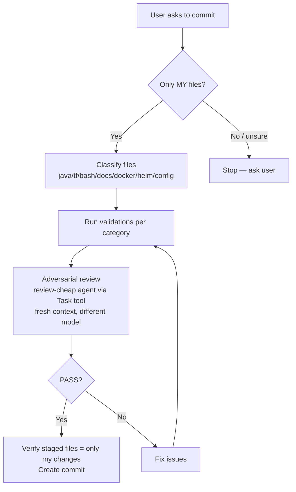

# Pre-Commit Workflow

When the user asks to commit changes, you MUST follow this workflow before creating the commit. Each step is mandatory unless explicitly skipped by the user.

## Parallel Session Safety

Multiple opencode sessions may be running concurrently on the same repository. To avoid conflicts:

1. **Only commit files you changed in THIS session.** Never stage or commit files modified by another session. Before staging, run `git status` and cross-reference with the files you know you created or edited. If in doubt, ask the user.
2. **Re-read before editing.** Always re-read a file immediately before editing it. Another session may have modified it since you last read it.
3. **Check for conflicts before committing.** Run `git status` right before `git commit`. If files you intend to commit show unexpected changes (modified by another session between your edit and the commit), stop and ask the user.
4. **Never run `git add .` or `git add -A`.** Always stage files individually by explicit path. Blanket staging will pick up changes from other sessions.
5. **Pull before push.** If the user asks to push, run `git pull --rebase` first. Another session may have pushed commits since your last check.
6. **Lock-sensitive operations.** Terraform state is locked via DynamoDB. If `terraform plan` or `terraform apply` fails with a lock error, another session is running Terraform — do not retry, inform the user.
7. **Branch awareness.** If working on a feature branch, verify you are on the correct branch before committing. Another session may have switched branches.

## Step 1: Classify Changed Files

Run `git status --short` to see all changed, staged, and untracked files. From the files you changed in this session, classify each into one or more categories:

| Category | File patterns |
|----------|--------------|
| `java` | `*.java`, `pom.xml` |
| `terraform` | `*.tf`, `*.tfvars.example` |
| `bash` | `*.sh` |
| `docker` | `Dockerfile*`, `docker-compose*.yml` |
| `docs` | `*.md`, `docs/**` |
| `config` | `.gitignore`, `*.yml`, `*.yaml`, `*.json` (non-terraform) |
| `helm` | `helm/**`, `Chart.yaml`, `values.yaml` |
| `website` | `jekyll-www.mock-server.com/**` |

A commit may contain files from multiple categories. Run ALL applicable validations.

## Step 2: Run Category-Specific Validations

Validation principle: prefer executable verification over static inspection. When a file can be executed, built, rendered, or planned, run that command and use its output as evidence.

### Java changes (`java`)
1. Identify affected Maven modules from file paths (see testing-policy.md for module mapping)
2. Run unit tests: `./mvnw test -pl <module1>,<module2>`
3. If tests fail, fix before committing
4. If tests already passed earlier in this conversation for the exact same changes (no further edits since), skip re-running

### Terraform changes (`terraform`)
1. Run `terraform fmt -check -recursive` in the terraform directory to verify formatting
2. Run `terraform init -backend=false` if `.terraform/` does not exist (required before validate)
3. Run `terraform validate` in each affected terraform module directory
4. Run `terraform plan` with a placeholder token if no real token is available (e.g. `-var 'buildkite_agent_token=placeholder-for-plan'`)
5. If any step fails, fix before committing

### Bash script changes (`bash`)
1. Run `bash -n <script>` for each changed script to verify syntax
2. Verify the script is executable (`chmod +x` if needed)
3. Execute each changed script using the safest available runtime mode (`--help`, `--version`, `--dry-run`, or equivalent)
4. If no safe runtime mode exists, run the script with benign inputs in an isolated context or stop and ask the user for an explicit skip

### Docker changes (`docker`)
1. Build every changed Dockerfile with `docker build` (or `docker buildx build`) using the correct context
2. If `hadolint` is available, run `hadolint <Dockerfile>`
3. Run a basic smoke command from the built image when feasible (`--version`, startup help, or a short health command)
4. If the build uses an optional corporate CA cert, verify the placeholder file exists and the real cert file is in `.gitignore`

### Helm changes (`helm`)
1. Run `helm lint` on the chart directory
2. Run `helm template` to verify rendering

### Documentation changes (`docs`)
1. No tests required
2. Verify any internal links/cross-references point to files that exist (quick glob check)

### Config changes (`config`)
1. Validate YAML/JSON syntax if applicable
2. Run command-level verification when a tool-specific check exists (for example `jq` for JSON transforms, `yamllint` when available, or app-specific validation commands)

### Website changes (`website`)
1. Run `bundle exec jekyll build` if Jekyll files changed
2. Verify no broken links in generated output

## Step 3: Adversarial Code Review (MANDATORY for all commits)

After all validations pass, launch an adversarial review using a subagent on a **different model** with a **fresh context**. This catches issues the implementing agent may have blind spots for.

Use the **Task tool** with `subagent_type: "review-cheap"` and provide:
- The diff of files being committed: stage them first with `git add`, then capture `git diff --cached`
- The commit message you intend to use
- The file categories from Step 1

The review prompt MUST include:
```
Review these changes adversarially. You are a second reviewer with fresh context.
Assume the code was written by an LLM agent and look for:
- Hallucinated function/method/module names that don't exist
- Plausible-looking but incorrect logic
- Missing error handling or edge cases
- Security issues (secrets, injection, auth bypass)
- Incorrect Terraform resource configurations
- Shell script portability issues
- Broken cross-references in documentation

Provide a PASS/BLOCK verdict with findings.
```

**Security:** Before sending the diff to the reviewer, scan for obvious secrets (API keys, tokens, passwords, `.env` content). If found, warn the user and do NOT include the secret values in the review prompt — redact them or exclude those files from the review.

If the review returns **BLOCK**, fix the issues, re-run any affected validations (Step 2), and re-run the review before committing.
If the review returns **PASS**, proceed to commit.

## Step 4: Commit

Only after all validations and the adversarial review pass:
1. Verify with `git status` that only your session's files are staged
2. Create the commit with a descriptive message

## Skip Conditions

- If the user says "skip tests" or "skip validation" — skip Step 2 but still run Step 3 (adversarial review)
- If the user says "skip review" — skip Step 3 but still run Step 2 (validations)
- If the user says "just commit" or "skip everything" — skip Steps 2 and 3
- Always warn the user what is being skipped

## Quick Reference


