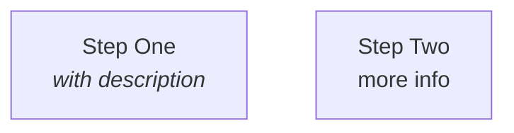
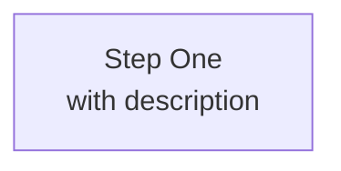
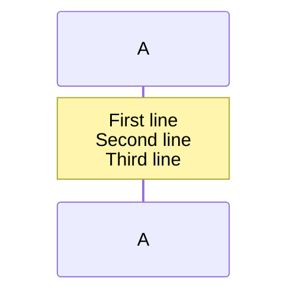
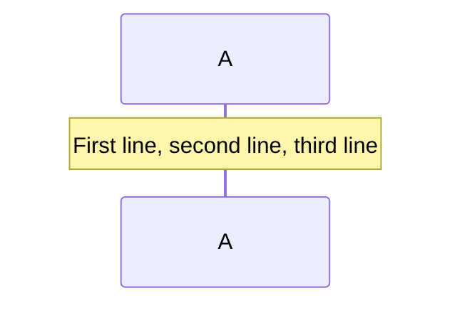
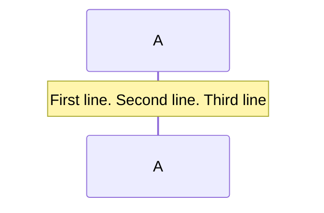

# Mermaid Diagram Formatting Rules

## Purpose

This rule ensures all Mermaid diagrams in markdown files render correctly on GitHub and other platforms.

## Non-Negotiable Rules

### 1. NEVER Use HTML Tags

GitHub's Mermaid renderer **does not support HTML tags** inside diagram nodes. The following are FORBIDDEN:

- ` ` or ` ` for line breaks
- `<i>` and `</i>` for italics
- `<b>` and `</b>` for bold
- `<em>`, `<strong>`, or any other HTML markup

### 2. Use Actual Line Breaks Instead

When you need multi-line node labels, use actual newlines inside quoted strings:

**❌ WRONG:**

**✅ CORRECT:**

### 3. Alternative: Use `\n` in Some Contexts

In some Mermaid diagram types, you can use `\n` for line breaks:

Both actual newlines and `\n` are acceptable — choose based on readability.

### 4. Sequence Diagram Notes

For `sequenceDiagram` notes, Mermaid has limited multi-line support. Keep notes concise or flatten content with commas/periods:

**❌ WRONG:**

**✅ CORRECT (option 1):**

**✅ CORRECT (option 2):**

## Validation

Before committing documentation with Mermaid diagrams:

1. **Preview on GitHub** — use the GitHub web editor preview or view the rendered markdown on GitHub
2. **Search for HTML tags** — run `grep -r " \|<i>\|</i>\|<b>\|</b>" docs/` to find violations
3. **Adversarial review** — the code reviewer should flag any HTML tags in Mermaid diagrams

## Context

GitHub's Mermaid renderer is based on mermaid.js but runs in a sandboxed environment that strips HTML for security. HTML tags will either:
- Render as literal text (e.g., ` ` appears in the diagram)
- Break the diagram rendering entirely
- Be silently stripped, causing content to run together

This rule was created after fixing 208 HTML tag instances across 20 documentation files in May 2026.
