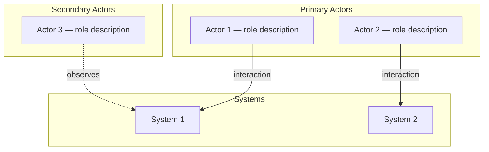
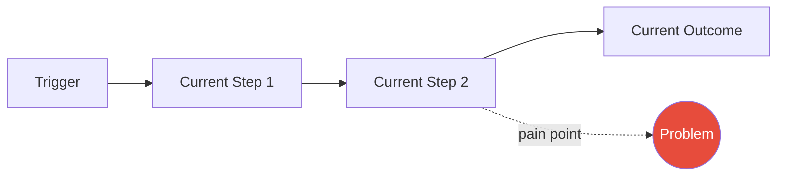
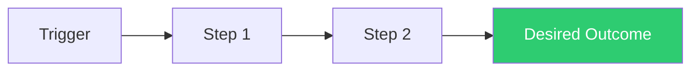

# Specification Template

Use this template when assembling the specification document in Phase 3.

## Formatting Guidance

This specification serves as a **contract between a human and an LLM**.
The human must be able to read, understand, and approve it quickly. Follow
these rules when filling in the template:

1. **Executive Summary first.** Write it last, but place it first. A reader
   who stops after the summary should understand the problem, scope, and
   desired outcome.

2. **Progressive disclosure.** The document is structured in three layers:
   - **Layer 1 — Summary** (30 seconds): Executive Summary alone.
   - **Layer 2 — Context** (2 minutes): Problem Statement through Scope.
   - **Layer 3 — Detail** (5+ minutes): Requirements, edge cases, and
     success criteria.

   Each section adds depth. Never introduce detail before its context has
   been established in an earlier section.

3. **Scannable over dense.** Prefer tables, bullet points, and short
   paragraphs (3-4 sentences max). Break long sections into sub-sections.

4. **Plain language.** No unexpanded acronyms. No shorthand. No
   references to "the thing we discussed." Every section must be
   understandable by someone who was not in the ideation conversation.

5. **Solution-neutral throughout.** Describe what the system should do,
   never how it should do it. Observable behaviours and constraints only.

---

```markdown
# Specification: [Short descriptive title]

**Created**: [YYYY-MM-DD]
**Status**: Draft
**Author**: [User] with AI-assisted ideation

---

## Executive Summary

[3-5 sentences maximum. State the problem in one sentence. State who is
affected. State what "done" looks like. State the key scope boundary
(what is explicitly excluded). A reader who stops here should know enough
to decide whether to read further.]

---

## Problem Statement

[The agreed problem statement from Phase 2, verbatim. Solution-neutral,
specific, testable, bounded.]

---

## Background & Context

[2-3 paragraphs. What exists today, why this matters, relevant history.
Reference specific files, modules, services, or documentation by name
and path where applicable. Establish the context that makes the problem
statement concrete.]

---

## Actors

[Mermaid diagram showing primary and secondary actors and their relationships.]



| Actor | Type | Role | Interaction |
|-------|------|------|-------------|
| [Name] | Primary / Secondary / System | [What they do] | [How they interact] |

---

## Current Behaviour

[Description of how the system behaves today. What the user experiences.
Where the pain surfaces. Be specific — reference actual error messages,
behaviours, or limitations.]



---

## Desired Behaviour

[Description of what the system should do after the change. What the user
observes. How the pain is eliminated. Describe the outcome, not the
mechanism. This section answers "what does success look like?" at a
high level, before the detailed requirements below.]



---

## Scope

[Place scope here — between the high-level behaviour descriptions and
the detailed requirements — so the reader knows the boundaries before
encountering specifics.]

| In Scope | Out of Scope |
|----------|-------------|
| [Concrete item that MUST be addressed] | [Concrete item that will NOT be addressed] |
| [Another in-scope item] | [Another out-of-scope item with reason] |

---

## Functional Requirements

Each requirement is testable and uses RFC 2119 language (MUST, SHOULD, MAY).
Requirements describe observable behaviours with specific inputs and
expected outputs — not internal implementation details.

| ID | Requirement | Priority |
|----|-------------|----------|
| FR-01 | The system MUST [observable behaviour with specific inputs/outputs] | MUST |
| FR-02 | The system SHOULD [observable behaviour] | SHOULD |
| FR-03 | The system MAY [optional behaviour] | MAY |

---

## Non-Functional Requirements

| ID | Requirement | Rationale |
|----|-------------|-----------|
| NFR-01 | [Performance, compatibility, security, or other constraint] | [Why this matters] |
| NFR-02 | [Backwards compatibility requirement] | [What breaks if violated] |

---

## Edge Cases & Error Handling

| Scenario | Expected Behaviour |
|----------|-------------------|
| [Unusual input, boundary condition, or failure mode] | [What the system should do] |
| [Another edge case] | [Expected response] |

---

## Success Criteria

Each criterion must be measurable or observable with no subjective language.

| ID | Criterion | How to Verify |
|----|-----------|--------------|
| SC-01 | [Observable outcome with threshold] | [Measurement method] |
| SC-02 | [Observable outcome with threshold] | [Measurement method] |

---

## Open Questions

These questions remain unanswered from ideation. They MUST be resolved
before implementation begins. Nothing in this list should be silently
assumed — each item represents a gap in the contract.

- [ ] [Question 1] — Impact: [what this affects if answered differently]
- [ ] [Question 2] — Impact: [what this affects if answered differently]

---

## Key Decisions

### Decision 1: [Short title]
- **Decision**: [What was decided]
- **Context**: [Why this was decided during ideation]
- **Alternatives considered**: [What was rejected and why]

---

## Ideation Log

Decisions and clarifications captured during the ideation conversation:

### [YYYY-MM-DD]
- Q: [Question asked] → A: [Answer given]
- Decision: [What was decided and why]
```
