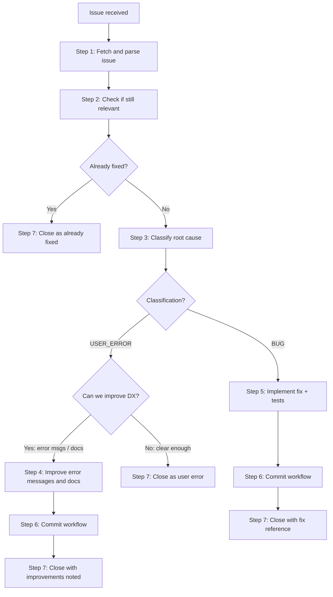

# GitHub Issue Review and Resolution

Systematically review a GitHub issue to determine its validity, classify it,
and take the appropriate action — whether that is improving documentation,
fixing a bug, or closing as not-a-bug.

## Prerequisites

- **`gh` CLI** authenticated to `github.com` (`gh auth login --hostname github.com`)

```bash
gh auth status --hostname github.com 2>/dev/null || echo "ERROR: run 'gh auth login --hostname github.com'"
```

## Repository

- **Owner:** `mock-server`
- **Repo:** `mockserver`

## Step 1: Parse Input and Fetch Issue

Extract the issue number from the user's input (URL or number).

**URL Pattern:**
```
https://github.com/mock-server/mockserver/issues/{number}
```

Fetch the full issue with comments:

```bash
gh issue view {number} --repo mock-server/mockserver --json number,title,body,author,createdAt,updatedAt,state,labels,comments,assignees
```

Read the issue carefully. Extract:
- **Reported behaviour**: what the user says is happening
- **Expected behaviour**: what the user expected
- **Steps to reproduce**: how to trigger the issue
- **Environment**: MockServer version, Java version, OS, deployment method (Docker, JAR, WAR, Maven plugin)
- **Configuration**: any custom properties, expectations, or settings mentioned
- **Error messages**: exact error text, stack traces, or log output
- **Attachments**: links to logs, screenshots, or configuration files

If critical information is missing (no version, no reproduction steps, no error output), note this as a gap but continue investigation with what is available.

## Step 2: Validate the Issue — Is This Still Relevant?

Before deep investigation, check if the issue is outdated:

### 2a: Check MockServer Version

```bash
# Current released version
gh release list --repo mock-server/mockserver --limit 1 --json tagName,publishedAt
```

```bash
# Version from pom.xml (development version — target the project version, not parent/plugin)
grep -m1 'SNAPSHOT' pom.xml | sed 's/.*<version>\(.*\)<\/version>.*/\1/'
```

If the issue was filed against a version more than 2 major versions old, check whether the affected code has been significantly rewritten. If so, the issue may no longer apply.

### 2b: Search for Existing Fixes

Search for commits and PRs that may have already addressed this issue:

Extract the issue creation date for use in `--since` filters:

```bash
ISSUE_DATE=$(gh issue view {number} --repo mock-server/mockserver --json createdAt --jq '.createdAt[:10]')
```

```bash
# Search commit history for references to this issue
git log --all --oneline --grep="#{number}"
git log --all --oneline --grep="issue {number}"
git log --all --oneline --grep="fix.*{keyword}" --since="$ISSUE_DATE"
```

```bash
# Search closed PRs
gh pr list --repo mock-server/mockserver --state closed --search "{keywords from issue title}" --json number,title,mergedAt --limit 10
```

```bash
# Search for related code changes
git log --all --oneline --since="$ISSUE_DATE" -- {files_likely_affected}
```

### 2c: Check if Reported Behaviour Still Exists

Locate the relevant code and verify whether the reported behaviour is still present in the current codebase:

```bash
# Find relevant source files — use a short, sanitised class name or keyword,
# not the full raw error message (which may contain shell metacharacters)
grep -rl "{sanitised_class_name_or_keyword}" --include="*.java" .
```

Read the relevant code to determine if the issue still applies.

**Classification at this point:**

| Finding | Classification | Next Step |
|---------|---------------|-----------|
| Fix commit found referencing this issue | `ALREADY_FIXED` | Go to Step 7 (close) |
| Code rewritten, behaviour no longer possible | `ALREADY_FIXED` | Go to Step 7 (close) |
| Code unchanged, behaviour still present | `POTENTIALLY_VALID` | Continue to Step 3 |
| Cannot determine from code alone | `NEEDS_REPRODUCTION` | Continue to Step 3 |

## Step 3: Classify — User Error or Bug?

Investigate the root cause by examining the code, documentation, and the user's report.

### 3a: Check Configuration and Usage

Review the user's configuration against the documentation:

```bash
# Check if the configuration property exists and what it does
grep -rl "{property_name}" --include="*.java" mockserver-core/src/main/java/org/mockserver/configuration/
```

```bash
# Check documentation for the feature
grep -rl "{feature_or_property}" jekyll-www.mock-server.com/ --include="*.html" --include="*.md"
```

Common user error patterns:
- Incorrect expectation JSON syntax
- Wrong content-type headers
- Misunderstanding of matching semantics (subString vs exact)
- Using HTTP features with HTTPS or vice versa
- Port conflicts or incorrect server lifecycle management
- Classpath issues with the Maven plugin or JUnit integration
- Docker networking issues (localhost vs container networking)
- Configuration property spelling/naming mistakes

### 3b: Attempt Reproduction (if feasible)

If the issue includes reproduction steps and can be verified via unit test:

1. Write a minimal test case that reproduces the reported behaviour
2. Run it against the current codebase

```bash
# Run a specific test
./mvnw test -pl {module} -Dtest="{TestClass}#{testMethod}"
```

### 3c: Classify

| Finding | Classification | Next Step |
|---------|---------------|-----------|
| User misconfigured or misused the API | `USER_ERROR` | Go to Step 4 |
| Documentation is misleading or incomplete | `DOCS_GAP` | Go to Step 4 |
| Error message is unhelpful or missing | `ERROR_MSG_GAP` | Go to Step 4 |
| Behaviour contradicts documentation | `BUG` | Go to Step 5 |
| Unexpected behaviour with valid configuration | `BUG` | Go to Step 5 |
| Edge case not handled | `BUG` | Go to Step 5 |

A single issue may have multiple classifications (e.g., `USER_ERROR` + `DOCS_GAP` + `ERROR_MSG_GAP`).

## Step 4: User Error — Improve Error Messages and Documentation

Even when an issue is user error, it signals a gap in developer experience. Address it.

### 4a: Improve Error Messages

If the error message could have guided the user to the correct solution:

1. Find the code that produces the error or handles the misconfiguration
2. Add or improve validation with a clear, actionable error message
3. The error message MUST include:
   - What was wrong (the specific invalid value or configuration)
   - What was expected (the correct format, valid values, or constraints)
   - Where to find help (link to documentation page or configuration property name)

Example pattern:
```java
throw new IllegalArgumentException(
    "Invalid value \"" + value + "\" for property \"" + propertyName + "\". "
    + "Expected: " + expectedFormat + ". "
    + "See: https://www.mock-server.com/mock_server/configuration_properties.html"
);
```

### 4b: Improve Documentation

If the documentation could have prevented the user's mistake:

1. Identify the relevant documentation page in `jekyll-www.mock-server.com/`
2. Add or clarify the section that would have helped
3. Consider adding:
   - A common pitfalls or troubleshooting section
   - A concrete example showing the correct usage
   - A note about the specific misconception
4. Keep changes minimal and user-focused — explain WHAT to do, not internal implementation details

### 4c: Validate Changes

Follow the validation steps from `.opencode/rules/commit-workflow.md` Step 2 for all changed file categories.

After validation passes, proceed to Step 6.

## Step 5: Real Bug — Implement the Fix

### 5a: Identify the Fix Location

Follow the Fix Placement Policy from AGENTS.md: fix the bug at the architecturally correct layer. If the bug surfaces in `mockserver-netty` but the root cause is in `mockserver-core`, fix it in `mockserver-core`.

Read the project's module overview at `docs/code/overview.md` to understand module boundaries.

### 5b: Implement the Fix

1. Read the surrounding code context thoroughly before making changes
2. Follow existing code conventions (see `.opencode/rules/coding-principles.md`)
3. Make the minimal change that correctly fixes the issue
4. Do not refactor adjacent code — surgical changes only

### 5c: Write or Update Tests

1. Add a test that reproduces the reported issue (fails before the fix, passes after)
2. Add edge case tests if the fix reveals related boundary conditions
3. Follow existing test conventions in the module (most modules use JUnit 4; use JUnit 5 only in `mockserver-junit-jupiter`)

### 5d: Run Tests

```bash
# Run tests for affected modules
./mvnw test -pl {affected_modules}
```

If tests fail, fix the code and re-run until all tests pass.

### 5e: Check for Regression

Verify the fix doesn't break other behaviour:

```bash
# Run the full test suite for the affected module
./mvnw test -pl {module}
```

After all tests pass, proceed to Step 6.

## Step 6: Commit — Follow the Full Pre-Commit Workflow

Follow the COMPLETE workflow from `.opencode/rules/commit-workflow.md`:

### 6a: Classify Changed Files

Run `git status --short` and classify all changed files by category.

### 6b: Run Category-Specific Validations

Run ALL validations for ALL categories of changed files (Java tests, doc link checks, etc.).

### 6c: Stage Files

Stage files individually by explicit path (NEVER `git add .`):

```bash
git add {file1} {file2} ...
```

### 6d: Adversarial Review

Launch a `review-cheap` subagent via the Task tool with `subagent_type: "review-cheap"`:

Provide the staged diff (`git diff --cached`) and ask the reviewer to check:
- Hallucinated function/method/module names that don't exist
- Plausible-looking but incorrect logic
- Missing error handling or edge cases
- Security issues
- Whether the fix actually addresses the reported issue
- Whether tests adequately cover the fix
- Whether error message improvements are clear and actionable
- Whether documentation changes are accurate and user-friendly

If the review returns **BLOCK**, fix the issues, re-run validations, and re-run the review.

### 6e: Re-run Tests After Review Fixes

If the adversarial review caused code changes, re-run all affected tests:

```bash
./mvnw test -pl {affected_modules}
```

### 6f: Commit

Only after all validations pass AND the adversarial review returns PASS, create the commit with a message that references the issue:

```
Fix #{number}: {concise description of the fix}

{Brief explanation of the root cause and what was changed}
```

For user-error issues with documentation/error-message improvements:

```
Improve error handling for {feature} (#{number})

{Brief explanation of what was improved and why}
```

## Step 7: Close the Issue

**GATE**: Before closing, present the classification, proposed resolution, and intended closing comment to the user. Only execute `gh issue close` after explicit user approval.

Close the issue with a clear, helpful message that explains the resolution.

### For ALREADY_FIXED issues:

```bash
gh issue close {number} --repo mock-server/mockserver --comment "$(cat <<'EOF'
This issue has been resolved. The fix was included in commit {sha} ({brief description}).

If you are still experiencing this issue, please ensure you are using MockServer version {version} or later. If the problem persists on the latest version, please open a new issue with updated reproduction steps.
EOF
)"
```

### For BUG fixes:

```bash
gh issue close {number} --repo mock-server/mockserver --comment "$(cat <<'EOF'
Fixed in commit {sha}.

**Root cause:** {one-line explanation of what was wrong}
**Fix:** {one-line explanation of what was changed}

This fix will be included in the next release. In the meantime, you can build from the `master` branch to get the fix immediately.
EOF
)"
```

### For USER_ERROR with improvements:

```bash
gh issue close {number} --repo mock-server/mockserver --comment "$(cat <<'EOF'
Thank you for reporting this. After investigation, this turned out to be a configuration issue rather than a bug — {brief explanation of the correct usage}.

However, your report highlighted that {the error message / documentation} could be clearer. We've made the following improvements in commit {sha}:

- {improvement 1}
- {improvement 2}

These improvements will help other users avoid the same issue. {Link to relevant documentation page if applicable}.
EOF
)"
```

### For USER_ERROR without improvements needed:

```bash
gh issue close {number} --repo mock-server/mockserver --comment "$(cat <<'EOF'
Thank you for reporting this. After investigation, this appears to be a {configuration/usage} issue rather than a bug.

**What's happening:** {explanation of the observed behaviour}
**Expected usage:** {correct way to achieve what the user wanted}

{Link to relevant documentation: https://www.mock-server.com/...}

If this doesn't resolve your issue, please feel free to reopen with additional details.
EOF
)"
```

## Decision Flowchart



## Notes

- Always be respectful in closing comments — the user took time to report the issue
- Even user errors are valuable signals about developer experience gaps
- Check the issue comments for additional context — the original report may have been updated
- If the issue has multiple problems (e.g., a real bug AND a documentation gap), address all of them
- If the fix is too complex or risky for a single session, document findings and recommend next steps instead of making a partial fix
- If the issue requires changes across multiple modules, verify the fix at each layer
- Never close an issue without a clear, actionable resolution message
- Reference the commit SHA in the closing comment so users can track the fix
- For issues filed against old versions, check the CHANGELOG or release notes for relevant fixes
- If reproduction requires infrastructure (Docker, specific OS, etc.) that isn't available, note this limitation and make a best-effort assessment from code review
