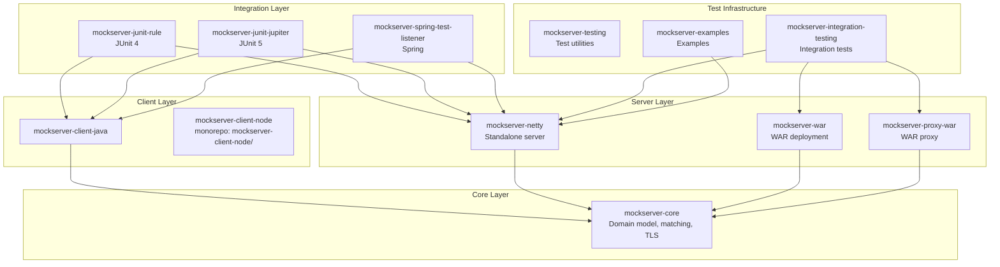
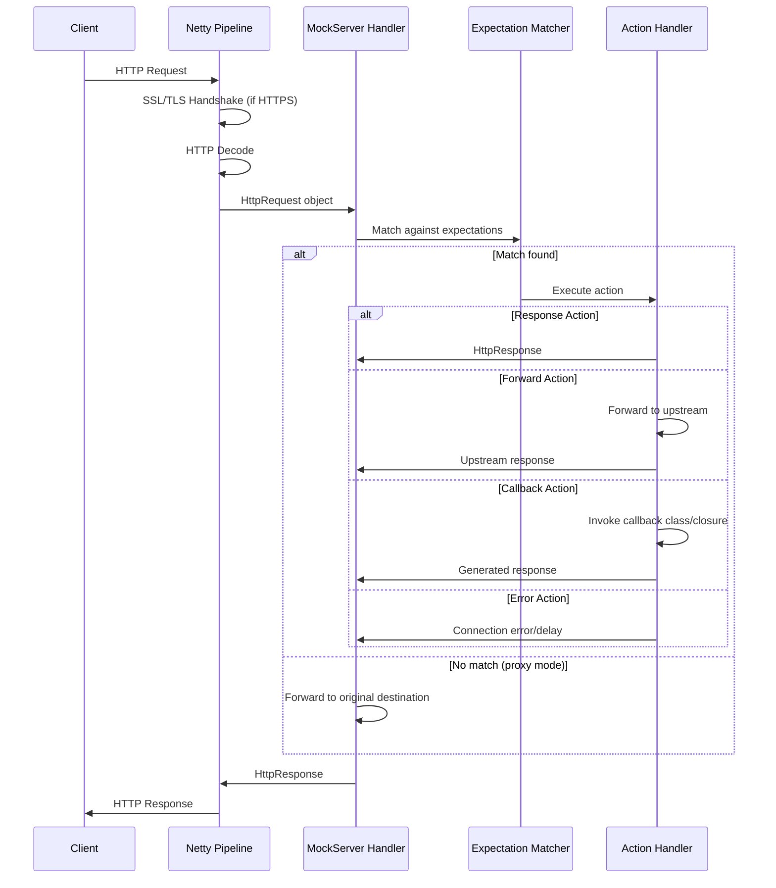

# Architecture

> For detailed code architecture documentation, see the [Code Architecture docs](code/overview.md) which provide hierarchical coverage from high-level module structure down to individual subsystems.

## Overview

MockServer is a multi-module Maven project that provides an HTTP(S) mock server and proxy for testing. The server is built on Netty 4.1 and can be deployed as a standalone JAR, Docker container, WAR file, or embedded via JUnit/Spring integrations.

## Module Descriptions

### mockserver-core

The foundation module containing all shared logic:

- **Domain model:** `HttpRequest`, `HttpResponse`, `Expectation`, `Action` (response, forward, callback, error)
- **Request matching:** body matchers (JSON, XML, regex, XPath, JSONPath, JSON Schema, XML Schema, OpenAPI), header/cookie/query matchers
- **Serialisation:** Jackson-based JSON serialisation for all model objects
- **TLS/SSL:** Dynamic certificate generation using BouncyCastle, CA management, mTLS support
- **Templating:** Velocity and Mustache response templates with JavaScript support (Nashorn on Java 11+)
- **Logging:** Structured event logging with SLF4J
- **Configuration:** Property-based configuration system (`mockserver.properties`)
- **OpenAPI:** Swagger/OpenAPI spec parsing and request matching
- **Metrics:** Prometheus metrics export
- **Control plane:** REST API handlers for expectation CRUD, verification, logging

### mockserver-netty

The primary server implementation:

- **Netty pipeline:** HTTP/1.1, HTTP/2, HTTPS, SOCKS proxy, WebSocket support
- **CLI:** `org.mockserver.cli.Main` — command-line entry point
- **Proxy modes:** Port forwarding, HTTP proxy, HTTPS tunneling (CONNECT), SOCKS
- **Packaging:** Fat JAR (`jar-with-dependencies`), shaded JAR, Debian package, Homebrew tarball

### mockserver-client-java

Java client for interacting with a running MockServer instance:

- `MockServerClient` — fluent API for creating expectations, verifying requests, resetting state
- HTTP-based communication with the MockServer REST API

### mockserver-war / mockserver-proxy-war

WAR-packaged deployments for servlet containers (Tomcat, Jetty, etc.):

- `mockserver-war` — mock server as a WAR
- `mockserver-proxy-war` — proxy-only WAR

### mockserver-junit-rule

JUnit 4 `@Rule` integration:

- `MockServerRule` — starts/stops MockServer per test or per class
- Auto-configures `MockServerClient`

### mockserver-junit-jupiter

JUnit 5 extension:

- `MockServerExtension` — `@ExtendWith` annotation support
- Parameter injection of `MockServerClient`

### mockserver-spring-test-listener

Spring Test integration:

- `MockServerPropertyCustomizer` — auto-configures Spring properties with MockServer ports

### mockserver-testing

Shared test utilities:

- Custom Hamcrest matchers
- `PrintOutCurrentTestRunListener` — test progress reporter for Surefire

### mockserver-integration-testing

Integration test infrastructure:

- Abstract base classes for HTTP/HTTPS integration tests
- Client connection factories for various proxy modes
- Shared test expectations and assertions

### mockserver-examples

Usage examples:

- Docker Compose configuration samples (10 scenarios)
- Code examples referenced by the Jekyll documentation site

## Request Processing Flow

## Package Structure

The main Java package is `org.mockserver` with sub-packages:

| Package | Module | Purpose |
|---------|--------|---------|
| `org.mockserver.model` | core | Domain objects (HttpRequest, HttpResponse, etc.) |
| `org.mockserver.matchers` | core | Request matching logic |
| `org.mockserver.mock` | core | Expectation storage and management |
| `org.mockserver.serialization` | core | JSON serialisation/deserialisation |
| `org.mockserver.codec` | core | Netty codec adapters |
| `org.mockserver.configuration` | core | Configuration properties |
| `org.mockserver.socket.tls` | core | TLS certificate generation |
| `org.mockserver.templates` | core | Response templating (Velocity, Mustache, JS) |
| `org.mockserver.openapi` | core | OpenAPI spec handling |
| `org.mockserver.log` | core | Structured event logging |
| `org.mockserver.cli` | netty | Command-line interface |
| `org.mockserver.netty` | netty | Netty server bootstrap |
| `org.mockserver.proxy` | netty | Proxy implementations |
| `org.mockserver.client` | client-java | MockServerClient API |
| `org.mockserver.junit` | junit-rule | JUnit 4 Rule |
| `org.mockserver.junit.jupiter` | junit-jupiter | JUnit 5 Extension |
| `org.mockserver.springtest` | spring-test-listener | Spring integration |
