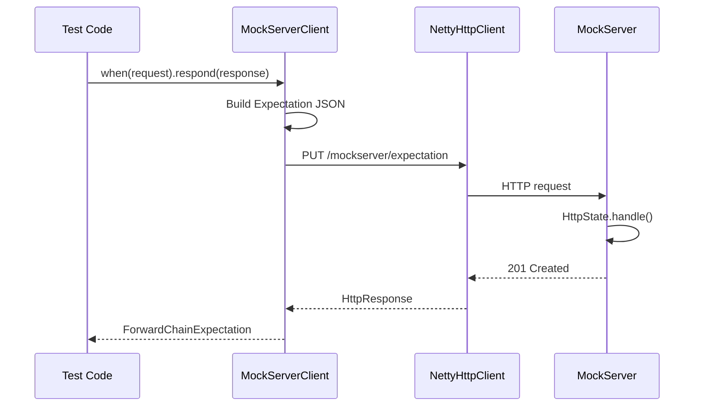
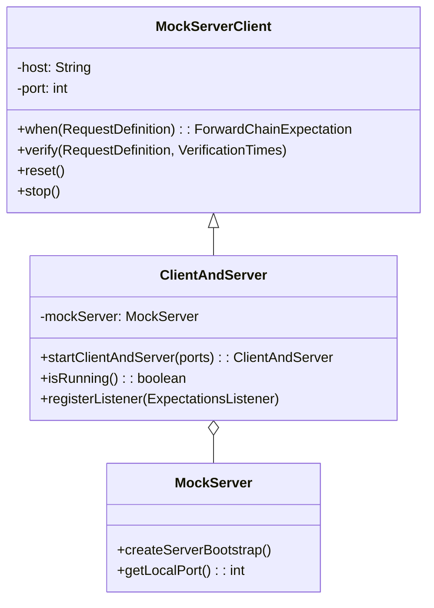
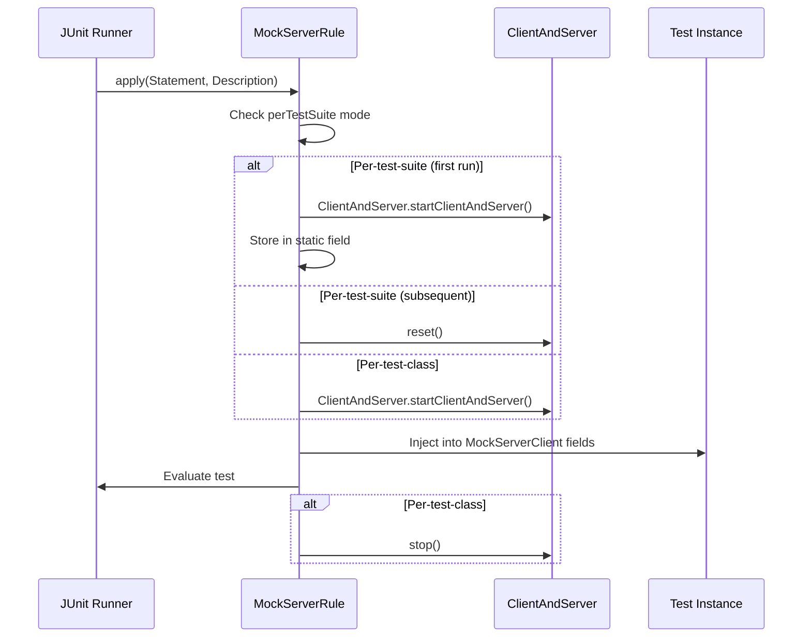
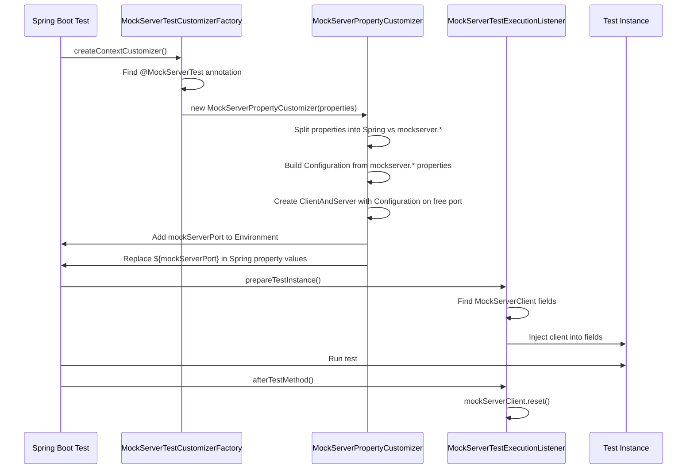

# Client API & Test Integrations

## MockServerClient

`MockServerClient` (`mockserver-client-java`) is the primary Java API for interacting with a running MockServer. All operations are performed via HTTP requests to the MockServer REST API.

### Communication Mechanism



### Fluent API

```java
MockServerClient client = new MockServerClient("localhost", 1080);

// Create expectation
client.when(
    request().withMethod("GET").withPath("/api/users")
).respond(
    response().withStatusCode(200).withBody("{\"users\": []}")
);

// Verify
client.verify(
    request().withPath("/api/users"),
    VerificationTimes.exactly(1)
);

// Retrieve
HttpRequest[] requests = client.retrieveRecordedRequests(
    request().withPath("/api/users")
);
```

### API Methods

#### Expectation Setup

| Method | Description |
|--------|-------------|
| `when(RequestDefinition)` | Create expectation with unlimited matches |
| `when(RequestDefinition, Times)` | Create expectation with limited matches |
| `when(RequestDefinition, Times, TimeToLive)` | Create with match limit and TTL |
| `when(RequestDefinition, Times, TimeToLive, Integer)` | Create with priority |
| `upsert(Expectation...)` | Create or update expectations (by ID) |
| `upsert(OpenAPIExpectation...)` | Create expectations from OpenAPI specs |

#### Verification

| Method | Description |
|--------|-------------|
| `verify(RequestDefinition, VerificationTimes)` | Verify request count |
| `verify(RequestDefinition...)` | Verify requests received in order |
| `verify(ExpectationId, VerificationTimes)` | Verify by expectation ID |
| `verify(ExpectationId...)` | Verify sequence by expectation IDs |
| `verifyZeroInteractions()` | Verify no requests received |

#### Retrieval

| Method | Return Type | Description |
|--------|-------------|-------------|
| `retrieveRecordedRequests(RequestDefinition)` | `HttpRequest[]` | Received requests |
| `retrieveRecordedRequests(RequestDefinition, Format)` | `String` | Received requests as JSON/Java |
| `retrieveRecordedRequestsAndResponses(RequestDefinition)` | `LogEventRequestAndResponse[]` | Request/response pairs |
| `retrieveRecordedExpectations(RequestDefinition)` | `Expectation[]` | Recorded proxy expectations |
| `retrieveActiveExpectations(RequestDefinition)` | `Expectation[]` | Currently active expectations |
| `retrieveActiveExpectations(RequestDefinition, Format)` | `String` | Active expectations as JSON/Java |
| `retrieveLogMessages(RequestDefinition)` | `String` | Log messages as text |
| `retrieveLogMessagesArray(RequestDefinition)` | `String[]` | Log messages as array |

#### Clear & Reset

| Method | Description |
|--------|-------------|
| `clear(RequestDefinition)` | Clear expectations and logs matching request |
| `clear(RequestDefinition, ClearType)` | Clear specific type (`EXPECTATIONS`, `LOG`, `ALL`) |
| `clear(ExpectationId)` | Clear by expectation ID |
| `clear(String)` | Clear by expectation ID string |
| `reset()` | Reset all state (expectations, logs, WebSocket registry) |

#### Lifecycle

| Method | Description |
|--------|-------------|
| `hasStarted()` | Whether server has started |
| `hasStopped()` | Whether server has stopped |
| `isRunning()` | (deprecated) Use `hasStarted()`/`hasStopped()` |
| `stop()` | Stop server synchronously |
| `stopAsync()` | Stop server asynchronously |
| `close()` | Alias for `stop()` |
| `bind(Integer...)` | Bind additional ports |
| `openUI()` | Launch dashboard UI in browser |

#### Configuration

| Method | Description |
|--------|-------------|
| `withSecure(boolean)` | Enable TLS for client communication |
| `withControlPlaneJWT(String)` | Set static JWT token |
| `withControlPlaneJWT(Supplier<String>)` | Set dynamic JWT supplier |
| `withRequestOverride(HttpRequest)` | Default headers for control-plane requests |
| `withProxyConfiguration(ProxyConfiguration)` | Route via proxy |

### ForwardChainExpectation

Returned by `when()`, provides terminal methods to define the action:

| Category | Methods |
|----------|---------|
| Response | `respond(HttpResponse)`, `respond(HttpTemplate)`, `respond(HttpClassCallback)`, `respond(ExpectationResponseCallback)` |
| Forward | `forward(HttpForward)`, `forward(HttpTemplate)`, `forward(HttpClassCallback)`, `forward(ExpectationForwardCallback)`, `forward(HttpOverrideForwardedRequest)` |
| Error | `error(HttpError)` |
| Configuration | `withId(String)`, `withPriority(int)` |

### Authentication Support

| Method | Purpose |
|--------|---------|
| `withControlPlaneJWT(String)` | Static JWT token |
| `withControlPlaneJWT(Supplier<String>)` | Dynamic JWT supplier |
| `withSecure(boolean)` | Enable TLS for client-to-server |
| `withRequestOverride(HttpRequest)` | Default headers for all control-plane requests |

## ClientAndServer

`ClientAndServer` (`mockserver-netty`) combines an embedded `MockServer` with a `MockServerClient`, used by all test framework integrations:



```java
// Embedded usage
ClientAndServer server = ClientAndServer.startClientAndServer(1080);
server.when(request().withPath("/test")).respond(response().withBody("OK"));
// ... run tests ...
server.stop();
```

## Test Framework Integrations

### JUnit 4 Rule



**Usage:**

```java
public class MyTest {
    @Rule
    public MockServerRule mockServerRule = new MockServerRule(this);

    private MockServerClient mockServerClient;  // Auto-injected

    @Test
    public void test() {
        mockServerClient.when(request()).respond(response().withBody("OK"));
    }
}
```

**Modes:**
- `new MockServerRule(this)` — auto-allocates port, per-test-class lifecycle
- `new MockServerRule(this, true)` — per-test-suite (static, shared across tests)
- `new MockServerRule(this, 1080)` — specific port, per-test-suite

### JUnit 5 Extension

```java
@MockServerSettings(ports = {1080})
class MyTest {
    @Test
    void test(MockServerClient client) {
        client.when(request()).respond(response().withBody("OK"));
    }
}
```

**`@MockServerSettings` attributes:**
- `perTestSuite` — boolean, default false. If true, single server per JVM
- `ports` — int[], default empty (auto-allocate)

**Parameter resolution**: Injects `MockServerClient` (or `ClientAndServer`) as test method parameters.

**Lifecycle:**
- `beforeAll`: Creates `ClientAndServer`, optionally registers JVM shutdown hook
- `afterAll`: Stops server (unless per-test-suite mode)

### Spring Test Integration



**Usage:**

```java
@MockServerTest({
    "my.service.url=http://localhost:${mockServerPort}",
    "mockserver.initializationClass=com.example.MyInit",
    "mockserver.logLevel=WARN"
})
@SpringBootTest
class MyTest {
    private MockServerClient mockServerClient;  // Auto-injected

    @MockServerPort
    private int serverPort;  // Injected via @Value

    @Test
    void test() { ... }
}
```

**How it works:**
1. `MockServerTestCustomizerFactory` (loaded via `spring.factories`) scans for `@MockServerTest`
2. `MockServerPropertyCustomizer` splits annotation properties: `mockserver.*`-prefixed properties are applied to a per-instance `Configuration` object; other properties go to the Spring `Environment`
3. `MockServerPropertyCustomizer` creates a `ClientAndServer` with the `Configuration` on a free port and injects `mockServerPort` into the Spring `Environment`
4. `MockServerTestExecutionListener` injects the `ClientAndServer` into `MockServerClient` fields
5. After each test, `reset()` clears state

## WebSocket Callback System

For object/closure callbacks, a WebSocket connection between the client JVM and MockServer enables the callback to execute on the client side:

```mermaid
graph TB
    subgraph "Client JVM"
        TEST[Test Code]
        FCE[ForwardChainExpectation]
        LCR[LocalCallbackRegistry]
        WSC[WebSocketClient]
    end

    subgraph "MockServer"
        CWSH[CallbackWebSocketServerHandler]
        WSCR[WebSocketClientRegistry]
        AH[HttpActionHandler]
    end

    TEST -->|respond(callback)| FCE
    FCE -->|store| LCR
    FCE -->|connect| WSC
    WSC <-->|WebSocket| CWSH
    CWSH -->|register| WSCR

    AH -->|RESPONSE_OBJECT_CALLBACK| WSCR
    WSCR -->|send request| CWSH
    CWSH -->|forward to client| WSC
    WSC -->|invoke callback| LCR
    LCR -->|return response| WSC
    WSC -->|send response| CWSH
    CWSH -->|dispatch| WSCR
    WSCR -->|return to| AH
```

### Registration Flow

1. `ForwardChainExpectation.respond(callback)` generates a UUID `clientId`
2. Callback stored in `LocalCallbackRegistry` keyed by `clientId`
3. `WebSocketClient` connects to `/_mockserver_callback_websocket`
4. Server's `CallbackWebSocketServerHandler` performs WebSocket handshake
5. Server's `WebSocketClientRegistry.registerClient(clientId, channel)` stores the mapping
6. Expectation created with `HttpObjectCallback(clientId)`

### Invocation Flow

1. Request arrives, matches expectation with `RESPONSE_OBJECT_CALLBACK`
2. `HttpResponseObjectCallbackActionHandler` calls `WebSocketClientRegistry.sendClientMessage(clientId, request)`
3. Server sends `HttpRequest` JSON to client via WebSocket
4. Client's `WebSocketClient.receivedTextWebSocketFrame()` deserializes request
5. Client looks up callback by `clientId`, invokes `callback.handle(request)`
6. Client sends `HttpResponse` JSON back via WebSocket
7. Server's `WebSocketClientRegistry.receivedTextWebSocketFrame()` dispatches response
8. Original request handler receives response and writes it to the client channel

### Cleanup

`MockServerEventBus` (per-port) publishes `STOP` and `RESET` events. `ForwardChainExpectation` subscribes to these events to close WebSocket connections and unregister callbacks.

## Callback Interfaces

| Interface | Method | Used By |
|-----------|--------|---------|
| `ExpectationResponseCallback` | `handle(HttpRequest): HttpResponse` | `respond(callback)` |
| `ExpectationForwardCallback` | `handle(HttpRequest): HttpRequest` | `forward(callback)` |
| `ExpectationForwardAndResponseCallback` | `handle(HttpRequest, HttpResponse): HttpResponse` | `forward(fwdCallback, respCallback)` |

## Class Reference

| Class | Module | Role |
|-------|--------|------|
| `MockServerClient` | client-java | Java client API (1621 lines) |
| `ForwardChainExpectation` | client-java | Fluent API action builder |
| `MockServerEventBus` | client-java | Internal pub/sub for stop/reset events |
| `ClientAndServer` | netty | Combined embedded server + client |
| `MockServerRule` | junit-rule | JUnit 4 `TestRule` |
| `MockServerExtension` | junit-jupiter | JUnit 5 `Extension` |
| `MockServerSettings` | junit-jupiter | Configuration annotation |
| `MockServerTest` | spring-test-listener | Spring test annotation |
| `MockServerPropertyCustomizer` | spring-test-listener | Spring context customizer |
| `MockServerTestExecutionListener` | spring-test-listener | Spring test lifecycle |
| `MockServerPort` | spring-test-listener | Port injection annotation |
| `WebSocketClient` | core | Client-side WebSocket connector |
| `WebSocketClientHandler` | core | Client-side WebSocket handshake |
| `WebSocketClientRegistry` | core | Server-side client registry |
| `CallbackWebSocketServerHandler` | netty | Server-side WebSocket handler |
| `LocalCallbackRegistry` | core | In-JVM callback storage |
| `MockServerServlet` | war | Servlet bridge for WAR deployment |
| `ProxyServlet` | proxy-war | Proxy servlet for WAR deployment |

## MCP (Model Context Protocol) Integration

MockServer exposes its control-plane capabilities via the [Model Context Protocol](https://modelcontextprotocol.io/) (MCP), enabling AI agents and LLM-based tools to interact with MockServer programmatically.

### Protocol Details

| Property | Value |
|----------|-------|
| Transport | Streamable HTTP (POST for JSON-RPC, DELETE for session termination) |
| MCP version | `2025-03-26` |
| Endpoint path | `/mockserver/mcp` |
| Session management | Sessions created by `initialize` JSON-RPC request; tracked via `Mcp-Session-Id` header |
| Enable/disable | `mcpEnabled` configuration property (default: `true`) |

### Available Tools

MCP tools map to MockServer control-plane operations:

| Tool | Description |
|------|-------------|
| `create_expectation` | Create a mock expectation (high-level, simplified parameters) |
| `create_forward_expectation` | Create a forwarding proxy expectation |
| `create_expectation_from_openapi` | Create expectations from an OpenAPI/Swagger specification |
| `verify_request` | Verify that requests matching criteria were received a specific number of times |
| `verify_request_sequence` | Verify that requests were received in a specific order |
| `retrieve_recorded_requests` | Retrieve requests that MockServer has received |
| `retrieve_request_responses` | Retrieve request/response pairs |
| `clear_expectations` | Clear expectations and/or logs matching a request |
| `reset` | Reset all MockServer state |
| `get_status` | Check MockServer running status and bound ports |
| `debug_request_mismatch` | Diagnose why a request did not match any expectation |
| `stop_server` | Stop the MockServer instance |
| `raw_expectation` | Full expectation JSON passthrough |
| `raw_retrieve` | Full retrieve parameters passthrough |
| `raw_verify` | Full verification JSON passthrough |

### Available Resources

MCP resources provide read-only access to MockServer state:

| Resource URI | Description |
|--------------|-------------|
| `mockserver://expectations` | All currently active expectations |
| `mockserver://requests` | All recorded requests |
| `mockserver://logs` | Current MockServer log messages |
| `mockserver://configuration` | Current MockServer configuration properties |

### Authentication

The MCP endpoint enforces the same control-plane authentication (mTLS and/or JWT) as the REST API. See [TLS & Security — MCP Endpoint Authentication](tls-and-security.md#mcp-endpoint-authentication).

### Key Classes

| Class | Module | Role |
|-------|--------|------|
| `McpStreamableHttpHandler` | netty | Netty channel handler; intercepts `/mockserver/mcp` requests, handles JSON-RPC 2.0, auth, session management |
| `McpToolRegistry` | netty | Defines and implements 15 MCP tools (high-level and low-level) by delegating to `HttpState` |
| `McpResourceRegistry` | netty | Implements 4 MCP resource reads by querying `HttpState` |
| `McpSessionManager` | netty | Singleton session store with LRU eviction, TTL, and executor lifecycle |
| `McpSession` | netty | Session state: ID, initialization flag, last-accessed timestamp |
| `JsonRpcMessage` | netty | JSON-RPC 2.0 request/response/error/notification types |
