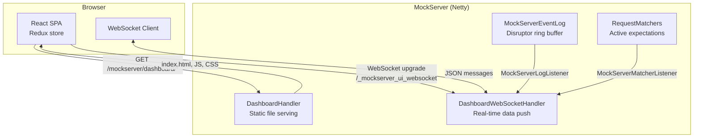
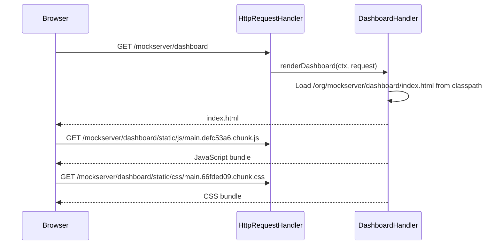
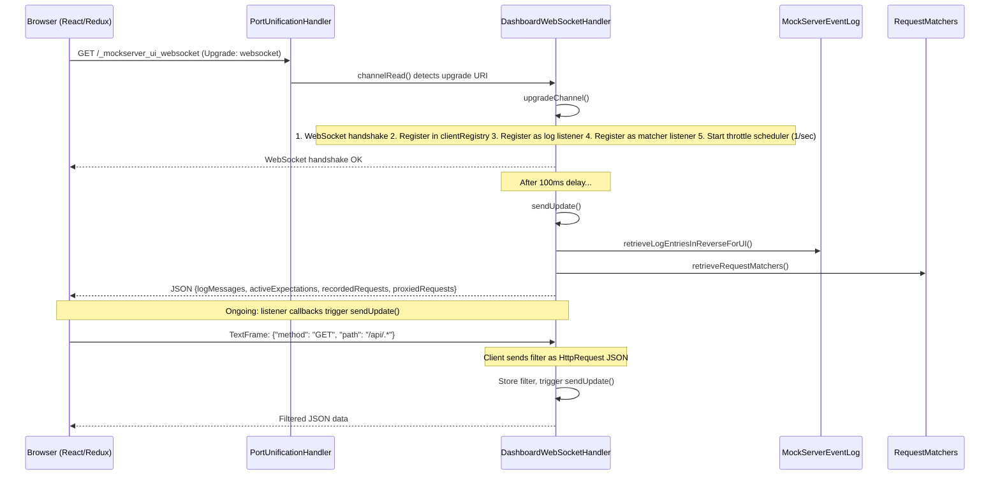
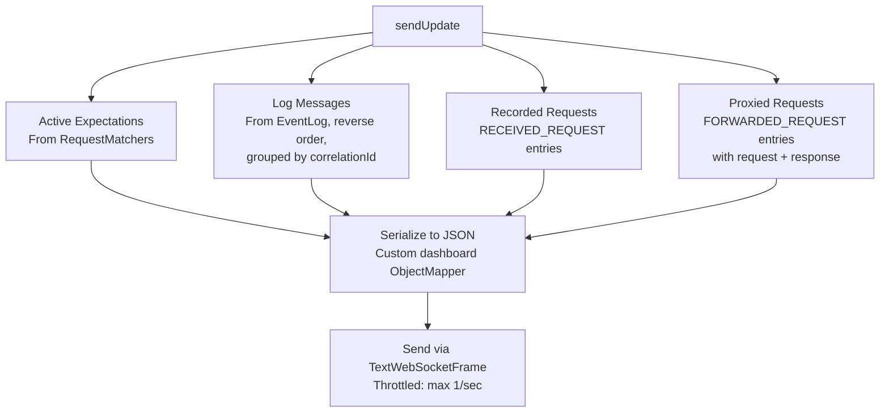

# Dashboard UI

## Architecture Overview

The MockServer dashboard is a React single-page application (SPA) that receives real-time updates via WebSocket. The frontend is pre-compiled with Webpack and served as static resources from the Java classpath.



## Request Flow

### 1. Initial Page Load



### 2. WebSocket Connection



### 3. Real-Time Updates

The `DashboardWebSocketHandler` implements both `MockServerLogListener` and `MockServerMatcherListener`. When either fires, `sendUpdate()` assembles and pushes the current state to all connected clients.

**Throttling**: A `Semaphore(1)` with a scheduled release every 1 second limits updates to at most one per second per client, preventing UI flooding during high-traffic scenarios.

## Frontend Application

### Technology Stack

| Component | Technology |
|-----------|-----------|
| Framework | React |
| State management | Redux |
| Build tool | Webpack (pre-compiled) |
| Service worker | Workbox (offline caching) |
| Font | Averia Sans Libre |

### Redux Store

```javascript
{
  entities: {
    activeExpectations: [],   // Currently active expectations
    proxiedRequests: [],      // Forwarded request+response pairs
    recordedRequests: [],     // All received requests
    logMessages: []           // Log entries (grouped by correlationId)
  }
}
```

### Redux Actions

| Action | Purpose |
|--------|---------|
| `CONNECT_SOCKET` | Initiate WebSocket connection |
| `SEND_MESSAGE` | Send filter to server |
| `MESSAGE_RECEIVED` | Received data update from server |
| `DISCONNECT_SOCKET` | Close WebSocket |

### WebSocket Middleware

The Redux middleware manages the WebSocket lifecycle:

```javascript
new WebSocket((secure ? "wss" : "ws") + "://" + host + ":" + port + "/_mockserver_ui_websocket")
```

- `onopen`: Sends the current filter (serialized `HttpRequest`)
- `onmessage`: Parses JSON, dispatches `MESSAGE_RECEIVED` to update all four entity arrays
- `onclose`: Triggers reconnection

### UI Panels

The dashboard displays four data panels:

| Panel | Data Source | Content |
|-------|------------|---------|
| Active Expectations | `activeExpectations` | Currently registered expectations with matchers and actions |
| Proxied Requests | `proxiedRequests` | Forwarded requests with their responses |
| Recorded Requests | `recordedRequests` | All received HTTP requests |
| Log Messages | `logMessages` | Grouped log entries with color-coded types |

### Filtering

Users can filter all panels by sending an `HttpRequest` JSON object as a text WebSocket frame. The server stores the filter per client and uses it when assembling data:

- **Active expectations**: Filtered by `requestMatchers.retrieveRequestMatchers(filter)`
- **Log entries**: Filtered by matching `LogEntry.httpRequests` against the filter
- **Recorded requests**: Filtered by type `RECEIVED_REQUEST` + request match
- **Proxied requests**: Filtered by type `FORWARDED_REQUEST` + request match

## Server-Side Data Assembly

### sendUpdate() Method

For each connected client, assembles four data categories (limited to 100 items each):



### Dashboard Model Classes

| Class | Package | Purpose |
|-------|---------|---------|
| `DashboardLogEntryDTO` | `o.m.dashboard.model` | Simplified log entry for UI display with description, style, and HTTP request/response data |
| `DashboardLogEntryDTOGroup` | `o.m.dashboard.model` | Groups related log entries by correlation ID (e.g., a request and its matching response) |
| `Description` | `o.m.dashboard.serializers` | Truncated request description (method + path) for UI column display |

### Custom Serializers

The dashboard uses specialized Jackson serializers for UI-friendly output:

| Serializer | Purpose |
|------------|---------|
| `DashboardLogEntryDTOSerializer` | Color-coded log entries with message parts |
| `DashboardLogEntryDTOGroupSerializer` | Groups related entries by correlation ID |
| `DescriptionSerializer` | Truncated request/log descriptions |
| `ThrowableSerializer` | Exception stack traces as string arrays |

### Log Entry Color Coding

| Log Type | Color | RGB |
|----------|-------|-----|
| RECEIVED_REQUEST | Blue | `rgb(114,160,193)` |
| EXPECTATION_RESPONSE | Light blue | `rgb(161,208,231)` |
| EXPECTATION_MATCHED | Teal | `rgb(117,185,186)` |
| EXPECTATION_NOT_MATCHED | Muted pink | `rgb(204,165,163)` |
| FORWARDED_REQUEST | Sky blue | `rgb(152,208,255)` |
| VERIFICATION | Purple | `rgb(178,148,187)` |
| VERIFICATION_FAILED | Red | `rgb(234,67,106)` |
| WARN | Coral | `rgb(245,95,105)` |
| ERROR | Dark pink | `rgb(179,97,122)` |
| EXCEPTION | Bright red | `rgb(211,33,45)` |
| INFO | Green | `rgb(59,122,87)` |
| TEMPLATE_GENERATED | Gold | `rgb(241,186,27)` |
| CREATED_EXPECTATION | (default) | Uses log level colour |
| UPDATED_EXPECTATION | (default) | Uses log level colour |
| REMOVED_EXPECTATION | (default) | Uses log level colour |
| CLEARED | (default) | Uses log level colour |
| RETRIEVED | (default) | Uses log level colour |
| VERIFICATION_PASSED | (default) | Uses log level colour |
| NO_MATCH_RESPONSE | (default) | Uses log level colour |
| SERVER_CONFIGURATION | (default) | Uses log level colour |
| AUTHENTICATION_FAILED | (default) | Uses log level colour |
| DEBUG | (default) | Uses log level colour |
| TRACE | (default) | Uses log level colour |
| RUNNABLE | (hidden) | Internal — not displayed in UI |

### JSON Message Structure

```json
{
  "logMessages": [
    {
      "key": "<id>_log",
      "value": {
        "description": "2024-01-15 10:30:45.123 RECEIVED_REQUEST",
        "style": { "paddingTop": "4px", "color": "rgb(114,160,193)" },
        "messageParts": [
          { "key": "<id>_0msg", "value": "received request:" },
          { "key": "<id>_0arg", "json": true, "argument": true, "value": { "method": "GET", "path": "/api/users" } }
        ]
      }
    }
  ],
  "activeExpectations": [ ... ],
  "recordedRequests": [ ... ],
  "proxiedRequests": [ ... ]
}
```

## Dashboard vs Callback WebSockets

MockServer has two distinct WebSocket systems:

| Feature | Dashboard WebSocket | Callback WebSocket |
|---------|--------------------|--------------------|
| URI | `/_mockserver_ui_websocket` | `/_mockserver_callback_websocket` |
| Handler | `DashboardWebSocketHandler` | `CallbackWebSocketServerHandler` |
| Purpose | Real-time UI data push | Closure callback execution |
| Direction | Server → Client (push) | Bidirectional (request/response) |
| Client | Browser (React SPA) | Java `WebSocketClient` |
| Pipeline impact | Keeps all handlers | Removes downstream handlers |
| Max clients | 100 (CircularHashMap) | Bounded by configuration |

## Static Resources

All frontend files are bundled in the JAR at `/org/mockserver/dashboard/`:

| File | Type | Purpose |
|------|------|---------|
| `index.html` | HTML | SPA entry point |
| `static/js/runtime~main.26e8d0d9.js` | JS | Webpack runtime |
| `static/js/2.d40871cb.chunk.js` | JS | Vendor chunk (React, Redux) |
| `static/js/main.defc53a6.chunk.js` | JS | Application code |
| `static/css/main.66fded09.chunk.css` | CSS | Styles |
| `AveriaSansLibre-Regular.woff2` | Font | Custom font |
| `service-worker.js` | JS | Offline caching |
| `asset-manifest.json` | JSON | Webpack asset manifest |

## Opening the Dashboard

From client code:

```java
MockServerClient client = new MockServerClient("localhost", 1080);
client.openUI();  // Opens http://localhost:1080/mockserver/dashboard in browser
```

Or directly in a browser: `http://localhost:1080/mockserver/dashboard`
