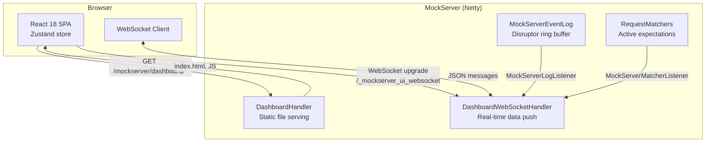
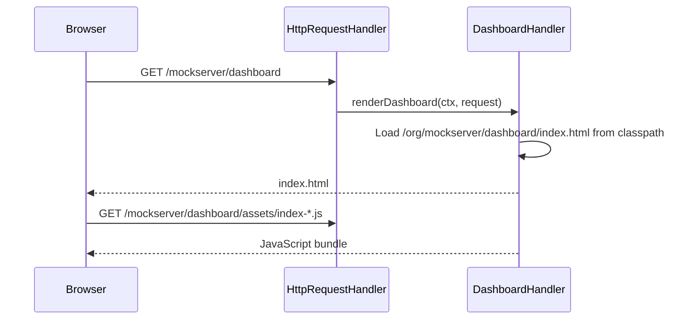
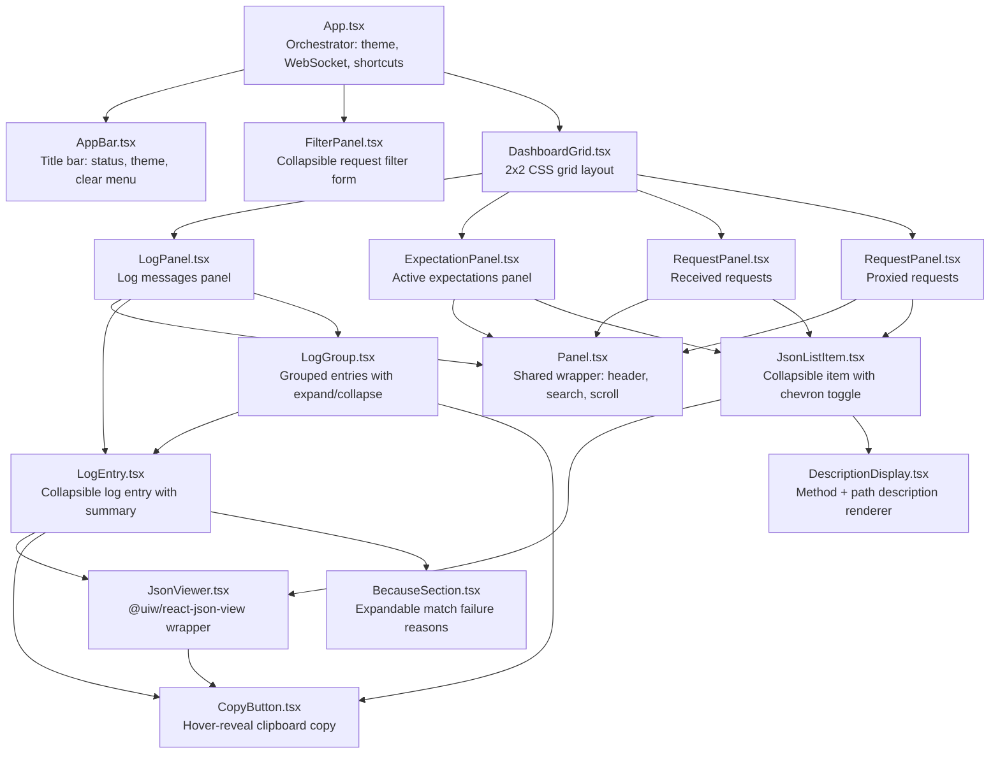
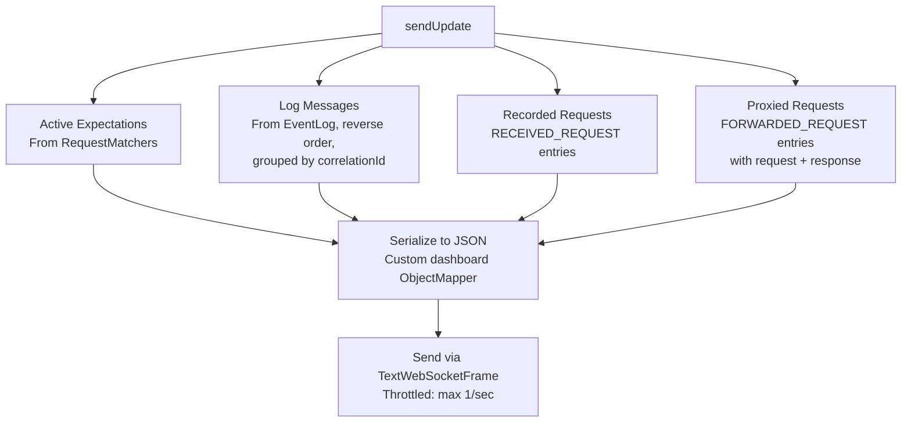

# Dashboard UI

## Architecture Overview

The MockServer dashboard is a React single-page application (SPA) that receives real-time updates via WebSocket. The frontend is built with Vite and served as static resources from the Java classpath. During the Maven build, the `build-ui` profile in `mockserver-netty` uses `frontend-maven-plugin` to install Node, run `npm ci` and `npm run build`, then copies the output to the classpath.



## Request Flow

### 1. Initial Page Load



### 2. WebSocket Connection


### 3. Real-Time Updates

The `DashboardWebSocketHandler` implements both `MockServerLogListener` and `MockServerMatcherListener`. When either fires, `sendUpdate()` assembles and pushes the current state to all connected clients.

**Throttling**: A `Semaphore(1)` with a scheduled release every 1 second limits updates to at most one per second per client, preventing UI flooding during high-traffic scenarios.

## Frontend Application

### Technology Stack

| Component | Technology |
|-----------|-----------|
| Framework | React 18 |
| State management | Zustand |
| Build tool | Vite |
| UI library | MUI v6 |
| Language | TypeScript |
| Testing | Vitest + React Testing Library |

### Zustand Store

```typescript
{
  logMessages: [],           // Log entries (grouped by correlationId)
  activeExpectations: [],    // Currently active expectations
  recordedRequests: [],      // All received requests
  proxiedRequests: [],       // Forwarded request+response pairs
  connectionStatus: 'disconnected',
  error: null,
  filterEnabled: false,
  filterExpanded: false,
  autoScroll: true,
  logSearch: '',
  expectationSearch: '',
  receivedSearch: '',
  proxiedSearch: '',
}
```

### WebSocket Hook

The `useWebSocket` hook manages the WebSocket lifecycle:

```typescript
const url = `${protocol}://${host}:${port}/_mockserver_ui_websocket`;
const ws = new WebSocket(url);
```

- `onopen`: Sends the current filter (serialized `HttpRequest`), resets reconnect counter
- `onmessage`: Parses JSON, calls `applyMessage()` to update all four entity arrays
- `onclose`: Triggers reconnection with exponential backoff (max 10 retries)
- `onerror`: Sets error status in store

### Component Architecture



### UI Components

The dashboard displays four data panels in a 2x2 grid:

| Panel | Component | Data Source | Content |
|-------|-----------|------------|---------|
| Log Messages | `LogPanel` → `LogEntry` / `LogGroup` | `logMessages` | Grouped log entries with color-coded types |
| Active Expectations | `ExpectationPanel` → `JsonListItem` | `activeExpectations` | Currently registered expectations |
| Received Requests | `RequestPanel` → `JsonListItem` | `recordedRequests` | All received HTTP requests |
| Proxied Requests | `RequestPanel` → `JsonListItem` | `proxiedRequests` | Forwarded requests with responses |

Supporting components:

| Component | File | Purpose |
|-----------|------|---------|
| `AppBar` | `AppBar.tsx` | Title bar with connection status chip, keyboard shortcut hints, auto-scroll toggle, dark/light mode toggle, clear/reset menu |
| `FilterPanel` | `FilterPanel.tsx` | Collapsible request filter form (method, path, headers, query params, cookies) with debounced WebSocket send |
| `Panel` | `Panel.tsx` | Shared panel wrapper with title, count chip, search box, auto-scroll content area |
| `LogEntry` | `LogEntry.tsx` | Renders a single log entry; supports `collapsible` mode (collapsed by default with summary) and `divider` mode |
| `LogGroup` | `LogGroup.tsx` | Groups related log entries (same correlation ID) with orange left border, expand/collapse, and group-level copy button |
| `JsonListItem` | `JsonListItem.tsx` | Renders request/expectation items with chevron toggle (collapsed by default), index number, and description |
| `JsonViewer` | `JsonViewer.tsx` | Thin wrapper around `@uiw/react-json-view` with theme-aware styling and hover-reveal copy button |
| `CopyButton` | `CopyButton.tsx` | Small hover-reveal icon button that copies text to clipboard via `navigator.clipboard.writeText` |
| `DescriptionDisplay` | `DescriptionDisplay.tsx` | Renders description variants: plain string, structured `{first, second}`, or JSON object with embedded viewer |
| `BecauseSection` | `BecauseSection.tsx` | Expandable list of match failure reasons for `EXPECTATION_NOT_MATCHED` entries |
| `DashboardGrid` | `DashboardGrid.tsx` | CSS grid layout for the four panels |

### Collapsible Items

All data items are **collapsed by default** across all four panels:

- **Requests and expectations** (`JsonListItem`): Show a chevron (`▸`), index number, and method+path description. Click to expand and reveal the full JSON body rendered by `JsonViewer`.
- **Standalone log entries** (`LogEntry` with `collapsible=true`): Show a chevron, description (timestamp + type), and a grey summary (first 80 chars of message text, truncated with `…`). Click to expand and see the full message parts.
- **Grouped log entries** (`LogGroup`): Show an expand button with the group header entry. Click to expand and reveal all child entries. Each child entry is itself a full `LogEntry`.
- Entries without a `description` show "SYSTEM_MESSAGE" as the label when in collapsible mode.

### Copy to Clipboard

Copy buttons appear on hover (CSS `opacity: 0` → `opacity: 1` on parent `:hover .copy-btn`):

- `JsonViewer`: Copy button in top-right copies the full JSON as formatted text
- `LogEntry`: Copy button copies description + all message parts as text (via exported `entryToText()`)
- `LogGroup`: Separate `.group-copy-btn` copies the full group (header + all child entries joined by `\n\n`)
- Built-in clipboard in `@uiw/react-json-view` is disabled (`enableClipboard={false}`) to avoid duplicate copy UIs

### Theme System

- Default: dark mode (unless user explicitly saved `'light'` in `localStorage` key `mockserver-theme`)
- `getInitialTheme()` in store checks `localStorage` first; falls back to `'dark'`
- `prefers-color-scheme` media query is **not** used — dark is always the default for new users
- `buildTheme()` in `theme.ts` creates MUI theme from the mode
- Toggle via AppBar sun/moon icon; saved to `localStorage`

### Keyboard Shortcuts

Handled by `useKeyboardShortcuts` hook in `App.tsx`:

| Shortcut | Handler | Action |
|----------|---------|--------|
| `⌘K` / `Ctrl+K` | `onSearch` | Focus log messages search input |
| `⌘L` / `Ctrl+L` | `onClear` | Call `clearServer('all')` (server reset + UI clear + WebSocket reconnect) |
| `Escape` | `onToggleFilter` | Toggle filter panel expanded/collapsed |

### Clear and Reset

The AppBar clear menu provides three server-side operations:

| Menu Item | API Call | UI Behavior |
|-----------|----------|-------------|
| Clear server logs | `PUT /mockserver/clear?type=log` | Calls `clearUI()` after success |
| Clear server expectations | `PUT /mockserver/clear?type=expectations` | Calls `clearUI()` after success |
| Reset server (all) | `PUT /mockserver/reset` | Calls `clearUI()` + reconnects WebSocket (server closes it on reset) |

The `clearServer()` function in `useWebSocket.ts`:
1. Sends HTTP `PUT` to the appropriate endpoint
2. On success, calls `useDashboardStore.getState().clearUI()` to immediately clear the UI (server throttles WebSocket updates to 1/sec, so waiting for the next push would feel laggy)
3. For `type === 'all'`, also calls `connect(lastFilterRef.current)` to re-establish the WebSocket (server-side reset closes the connection)

### Filtering

Users can filter all panels by sending an `HttpRequest` JSON object as a text WebSocket frame. The server stores the filter per client and uses it when assembling data:

- **Active expectations**: Filtered by `requestMatchers.retrieveRequestMatchers(filter)`
- **Log entries**: Filtered by matching `LogEntry.httpRequests` against the filter
- **Recorded requests**: Filtered by type `RECEIVED_REQUEST` + request match
- **Proxied requests**: Filtered by type `FORWARDED_REQUEST` + request match

### WebSocket Reconnection

The `connect()` function in `useWebSocket.ts` handles reconnection safely:

1. Clears any pending reconnect timer (`reconnectTimerRef`)
2. Nullifies `onclose`/`onerror` on the old socket before calling `close()` — prevents stale handlers from triggering spurious reconnection
3. Sets `socketRef.current = null` before creating the new socket
4. On `onclose`, schedules reconnection with exponential backoff (max 10 retries)

### Test Coverage

107 tests across 18 test files (Vitest + React Testing Library + jsdom):

| Test File | Tests | Coverage |
|-----------|-------|----------|
| `store.test.ts` | 12 | Zustand store actions and state updates |
| `types.test.ts` | 2 | Type guard functions |
| `theme.test.ts` | 7 | Theme building and initial theme detection |
| `useConnectionParams.test.ts` | 5 | URL parameter parsing for host/port/protocol |
| `useKeyboardShortcuts.test.ts` | 5 | Shortcut registration and handler dispatch |
| `useWebSocket.test.ts` | 8 | WebSocket lifecycle, message parsing, reconnection |
| `AppBar.test.tsx` | 6 | Status chip, theme toggle, clear menu actions |
| `BecauseSection.test.tsx` | 6 | Expandable reason list rendering |
| `CopyButton.test.tsx` | 2 | Clipboard API integration |
| `Panel.test.tsx` | 4 | Panel header, search, scroll behavior |
| `LogEntry.test.tsx` | 18 | Rendering, collapsible mode, summary, `entryToText()` |
| `LogGroup.test.tsx` | 5 | Group expand/collapse, group copy button |
| `LogPanel.test.tsx` | 5 | Panel integration with log messages |
| `RequestPanel.test.tsx` | 4 | Request filtering, count display |
| `ExpectationPanel.test.tsx` | 4 | Expectation rendering and search |
| `FilterPanel.test.tsx` | 5 | Filter form toggling and debounced submission |
| `JsonListItem.test.tsx` | 6 | Collapsible items, chevron icons, expand/collapse toggle |
| `DescriptionDisplay.test.tsx` | 3 | String, structured, and JSON description rendering |

## Server-Side Data Assembly

### sendUpdate() Method

For each connected client, assembles four data categories (limited to 100 items each):



### Dashboard Model Classes

| Class | Package | Purpose |
|-------|---------|---------|
| `DashboardLogEntryDTO` | `o.m.dashboard.model` | Simplified log entry for UI display with description, style, and HTTP request/response data |
| `DashboardLogEntryDTOGroup` | `o.m.dashboard.model` | Groups related log entries by correlation ID (e.g., a request and its matching response) |
| `Description` | `o.m.dashboard.serializers` | Truncated request description (method + path) for UI column display |

### Custom Serializers

The dashboard uses specialized Jackson serializers for UI-friendly output:

| Serializer | Purpose |
|------------|---------|
| `DashboardLogEntryDTOSerializer` | Color-coded log entries with message parts |
| `DashboardLogEntryDTOGroupSerializer` | Groups related entries by correlation ID |
| `DescriptionSerializer` | Truncated request/log descriptions |
| `ThrowableSerializer` | Exception stack traces as string arrays |

### Log Entry Color Coding

| Log Type | Color | RGB |
|----------|-------|-----|
| RECEIVED_REQUEST | Blue | `rgb(114,160,193)` |
| EXPECTATION_RESPONSE | Light blue | `rgb(161,208,231)` |
| EXPECTATION_MATCHED | Teal | `rgb(117,185,186)` |
| EXPECTATION_NOT_MATCHED | Muted pink | `rgb(204,165,163)` |
| FORWARDED_REQUEST | Sky blue | `rgb(152,208,255)` |
| VERIFICATION | Purple | `rgb(178,148,187)` |
| VERIFICATION_FAILED | Red | `rgb(234,67,106)` |
| WARN | Coral | `rgb(245,95,105)` |
| ERROR | Dark pink | `rgb(179,97,122)` |
| EXCEPTION | Bright red | `rgb(211,33,45)` |
| INFO | Green | `rgb(59,122,87)` |
| TEMPLATE_GENERATED | Gold | `rgb(241,186,27)` |
| CREATED_EXPECTATION | (default) | Uses log level colour |
| UPDATED_EXPECTATION | (default) | Uses log level colour |
| REMOVED_EXPECTATION | (default) | Uses log level colour |
| CLEARED | (default) | Uses log level colour |
| RETRIEVED | (default) | Uses log level colour |
| VERIFICATION_PASSED | (default) | Uses log level colour |
| NO_MATCH_RESPONSE | (default) | Uses log level colour |
| SERVER_CONFIGURATION | (default) | Uses log level colour |
| AUTHENTICATION_FAILED | (default) | Uses log level colour |
| DEBUG | (default) | Uses log level colour |
| TRACE | (default) | Uses log level colour |
| RUNNABLE | (hidden) | Internal — not displayed in UI |

### JSON Message Structure

```json
{
  "logMessages": [
    {
      "key": "<id>_log",
      "value": {
        "description": "2024-01-15 10:30:45.123 RECEIVED_REQUEST",
        "style": { "paddingTop": "4px", "color": "rgb(114,160,193)" },
        "messageParts": [
          { "key": "<id>_0msg", "value": "received request:" },
          { "key": "<id>_0arg", "json": true, "argument": true, "value": { "method": "GET", "path": "/api/users" } }
        ]
      }
    }
  ],
  "activeExpectations": [ ... ],
  "recordedRequests": [ ... ],
  "proxiedRequests": [ ... ]
}
```

## Dashboard vs Callback WebSockets

MockServer has two distinct WebSocket systems:

| Feature | Dashboard WebSocket | Callback WebSocket |
|---------|--------------------|--------------------|
| URI | `/_mockserver_ui_websocket` | `/_mockserver_callback_websocket` |
| Handler | `DashboardWebSocketHandler` | `CallbackWebSocketServerHandler` |
| Purpose | Real-time UI data push | Closure callback execution |
| Direction | Server → Client (push) | Bidirectional (request/response) |
| Client | Browser (React SPA) | Java `WebSocketClient` |
| Pipeline impact | Keeps all handlers | Removes downstream handlers |
| Max clients | 100 (CircularHashMap) | Bounded by configuration |

## Build Integration

The UI is built from source during the Maven build via the `build-ui` profile in `mockserver-netty/pom.xml`:

| Step | Plugin | Phase | Action |
|------|--------|-------|--------|
| Install Node | `frontend-maven-plugin` | `generate-resources` | Downloads Node v22.14.0 |
| Install dependencies | `frontend-maven-plugin` | `generate-resources` | Runs `npm ci` |
| Build UI | `frontend-maven-plugin` | `generate-resources` | Runs `npm run build` (tsc + vite) |
| Copy to classpath | `maven-resources-plugin` | `process-resources` | Copies `mockserver-ui/build/` to `target/classes/org/mockserver/dashboard/` |

The profile auto-activates when `../../mockserver-ui/package.json` exists. To skip the UI build: `./mvnw ... -P!build-ui`.

### Static Resources

All frontend files are bundled in the JAR at `/org/mockserver/dashboard/`:

| File | Type | Purpose |
|------|------|---------|
| `index.html` | HTML | SPA entry point |
| `assets/index-*.js` | JS | Application bundle (React, MUI, Zustand, all components) |
| `apple-touch-icon.png` | PNG | Touch icon |
| `favicon.ico` | ICO | Browser favicon |

## Opening the Dashboard

From client code:

```java
MockServerClient client = new MockServerClient("localhost", 1080);
client.openUI();  // Opens http://localhost:1080/mockserver/dashboard in browser
```

Or directly in a browser: `http://localhost:1080/mockserver/dashboard`

## Local Development

### Dev Environment Script

`scripts/local_ui_dev.sh` launches both MockServer and the Vite dev server for UI development:

```bash
./scripts/local_ui_dev.sh              # Build JAR if needed, start both servers, open browser
./scripts/local_ui_dev.sh --rebuild    # Force rebuild the MockServer JAR
./scripts/local_ui_dev.sh --no-browser # Don't auto-open browser
./scripts/local_ui_dev.sh --port 9090  # Use custom MockServer port
```

The script:
1. Checks port availability (offers to kill blocking processes interactively)
2. Builds the MockServer shaded JAR if not present
3. Installs UI npm dependencies if `node_modules/` is missing
4. Starts MockServer (logs to `mockserver-dev.log` in repo root)
5. Loads example data via `scripts/ui_dev_populate_data.sh`
6. Starts Vite dev server on port 3000
7. Opens `http://localhost:3000/mockserver/dashboard/`

### Vite Dev Proxy

`vite.config.ts` proxies API and WebSocket requests to the MockServer backend to avoid CORS issues during development:

| Path | Proxy Target | Notes |
|------|-------------|-------|
| `/_mockserver_ui_websocket` | `MOCKSERVER_URL` (default: `http://localhost:1080`) | WebSocket proxy |
| `/mockserver/*` (except `/mockserver/dashboard*`) | `MOCKSERVER_URL` | API proxy via `bypass` function |
| `/mockserver/dashboard*` | — | Served by Vite (returns `req.url` in bypass) |

The `MOCKSERVER_URL` env var is set by `local_ui_dev.sh` to match the configured MockServer port.
