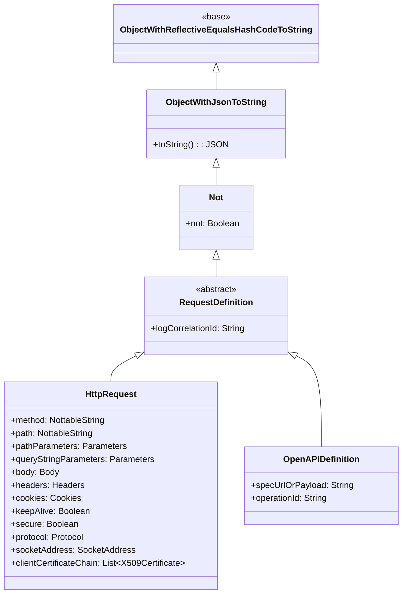
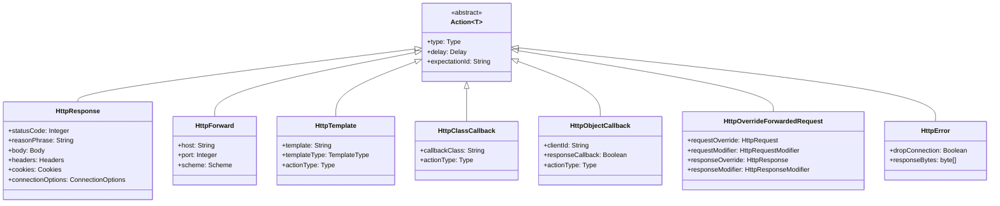
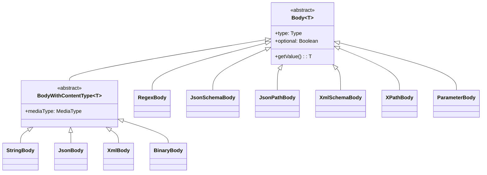
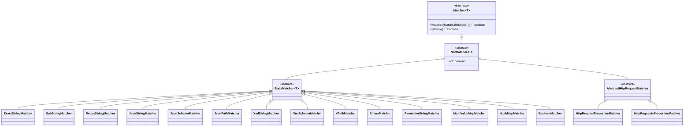
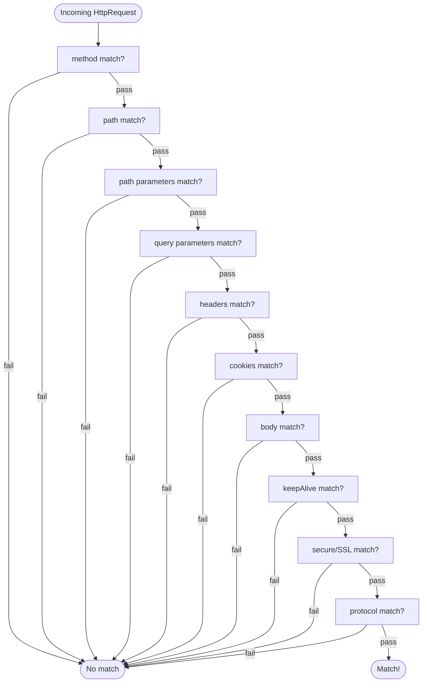
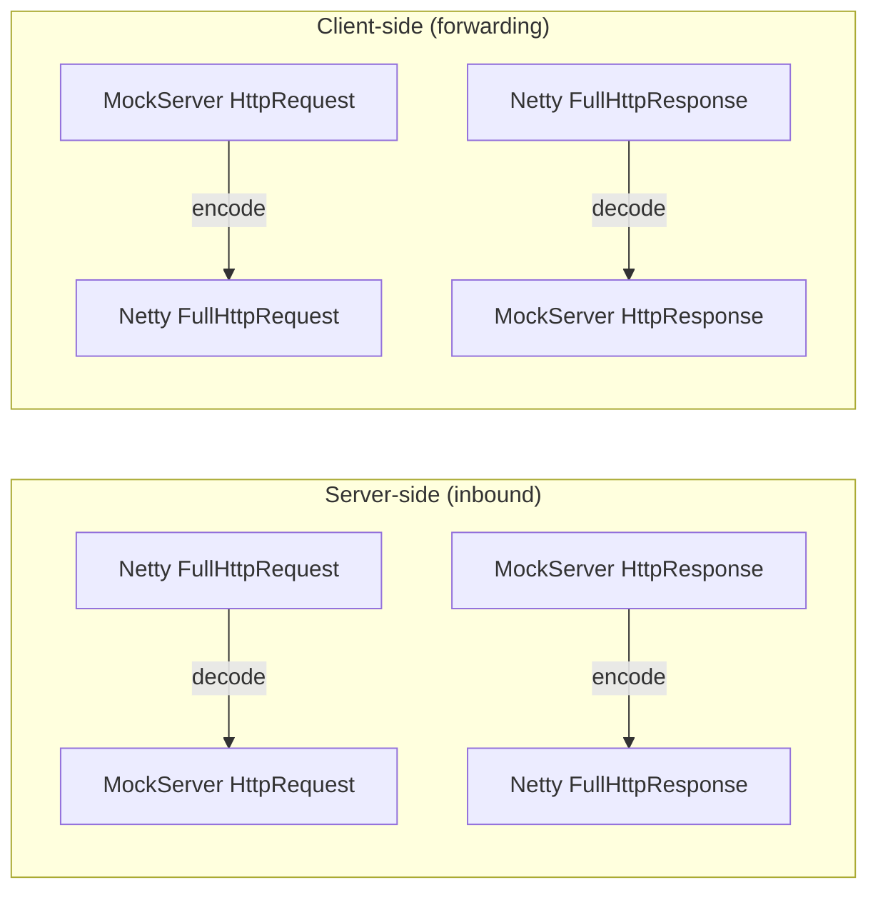

# Domain Model, Matchers & Serialization

## Domain Model Hierarchy

All domain objects descend from a common base providing reflection-based equality, JSON serialization, and a NOT operator:



### Action Types



### Body Types



Body `Type` enum: `BINARY`, `JSON`, `JSON_SCHEMA`, `JSON_PATH`, `PARAMETERS`, `REGEX`, `STRING`, `XML`, `XML_SCHEMA`, `XPATH`, `LOG_EVENT`

### ConnectionOptions

`ConnectionOptions` on `HttpResponse` provides low-level control over the HTTP connection:

| Field | Type | Description |
|-------|------|-------------|
| `suppressContentLengthHeader` | Boolean | Prevent `Content-Length` header from being added |
| `contentLengthHeaderOverride` | Integer | Override `Content-Length` with a specific value |
| `suppressConnectionHeader` | Boolean | Prevent `Connection` header from being added |
| `chunkSize` | Integer | If positive, response is sent with `Transfer-Encoding: chunked` in chunks of this size |
| `keepAliveOverride` | Boolean | If true, `Connection: keep-alive`; if false, `Connection: close` |
| `closeSocket` | Boolean | Force close (true) or keep open (false) the socket after responding |
| `closeSocketDelay` | Delay | Delay before closing the socket (ignored if socket is not being closed) |

### Request & Response Modifiers

Used by `HttpOverrideForwardedRequest` to modify forwarded requests and responses:

**`HttpRequestModifier`** fields:

| Field | Type | Description |
|-------|------|-------------|
| `path` | `PathModifier` | Regex-based path rewriting (`regex` + `substitution`) |
| `queryStringParameters` | `QueryParametersModifier` | Add, replace, or remove query parameters |
| `headers` | `HeadersModifier` | Add, replace, or remove headers |
| `cookies` | `CookiesModifier` | Add, replace, or remove cookies |

**`HttpResponseModifier`** fields:

| Field | Type | Description |
|-------|------|-------------|
| `headers` | `HeadersModifier` | Add, replace, or remove response headers |
| `cookies` | `CookiesModifier` | Add, replace, or remove response cookies |

Each modifier type (`HeadersModifier`, `CookiesModifier`, `QueryParametersModifier`) supports three operations: `add`, `replace`, and `remove`.

### NottableString

The fundamental primitive throughout the model. A string value that can be negated (`!value`) or made optional (`?value`):

| Variant | Class | Purpose |
|---------|-------|---------|
| Standard | `NottableString` | Exact or regex string matching with NOT operator |
| Optional | `NottableOptionalString` | Matches if present; absence also matches |
| Schema | `NottableSchemaString` | Validates against a JSON Schema |

### Expectation

The `Expectation` class binds a `RequestDefinition` (matcher) to an `Action`, with `Times` and `TimeToLive` constraints:

```java
Expectation.when(request)      // RequestDefinition
    .thenRespond(response)     // Action (only one allowed)
    .withTimes(Times.exactly(3))
    .withTimeToLive(TimeToLive.exactly(TimeUnit.MINUTES, 5))
    .withPriority(10)
    .withId("unique-id")
```

## Request Matching

### Matcher Hierarchy



### HttpRequestPropertiesMatcher

The primary matcher decomposes an `HttpRequest` into individual property matchers using a fail-fast strategy:



Each field uses the appropriate body matcher type:

| Field | Matcher Type |
|-------|-------------|
| Method | `RegexStringMatcher` |
| Path | `RegexStringMatcher` |
| Path parameters | `MultiValueMapMatcher` |
| Query parameters | `MultiValueMapMatcher` |
| Headers | `MultiValueMapMatcher` |
| Cookies | `HashMapMatcher` |
| Body (by type) | `JsonStringMatcher`, `XmlStringMatcher`, `RegexStringMatcher`, `BinaryMatcher`, etc. |
| keepAlive, secure | `BooleanMatcher` |

### HttpRequestsPropertiesMatcher (OpenAPI)

For `OpenAPIDefinition` request definitions, this matcher parses an OpenAPI spec and creates multiple `HttpRequestPropertiesMatcher` instances (one per operation + content-type combination). A request matches if it matches any of the generated matchers.

### MatchDifference

Collects per-field match failure details for debugging. Fields: `METHOD`, `PATH`, `PATH_PARAMETERS`, `QUERY_PARAMETERS`, `COOKIES`, `HEADERS`, `BODY`, `SECURE`, `PROTOCOL`, `KEEP_ALIVE`, `OPERATION`, `OPENAPI`.

## Codec Layer

The codec package bridges Netty's HTTP objects and MockServer's domain model:



| Codec | Direction | Conversion |
|-------|-----------|------------|
| `MockServerHttpServerCodec` | Server pipeline | Combines request decoder + response encoder |
| `MockServerHttpClientCodec` | Client pipeline | Combines response decoder + request encoder |
| `MockServerBinaryClientCodec` | Binary proxy | Binary message encode/decode |
| `BodyDecoderEncoder` | Both | Body ↔ ByteBuf conversion |
| `ExpandedParameterDecoder` | Inbound | Query/form parameter parsing (OpenAPI styles) |
| `PathParametersDecoder` | Inbound | URL path parameter extraction |

### OpenAPI Parameter Styles

`ExpandedParameterDecoder` handles 13 OpenAPI parameter serialization styles: `SIMPLE`, `SIMPLE_EXPLODED`, `LABEL`, `LABEL_EXPLODED`, `MATRIX`, `MATRIX_EXPLODED`, `FORM`, `FORM_EXPLODED`, `SPACE_DELIMITED`, `SPACE_DELIMITED_EXPLODED`, `PIPE_DELIMITED`, `PIPE_DELIMITED_EXPLODED`, `DEEP_OBJECT`.

## Serialization

### Architecture

Three serialization layers:

1. **Top-level serializers**: Public API for JSON (de)serialization (`ExpectationSerializer`, `HttpRequestSerializer`, etc.)
2. **DTO layer** (`serialization/model/`): Data Transfer Objects mirroring domain objects, each with a `buildObject()` method
3. **Custom Jackson modules** (`serialization/serializers/`, `serialization/deserializers/`): Type-specific JSON handling

### ObjectMapperFactory

Central registry configuring Jackson `ObjectMapper` with all custom serializers, deserializers, and modules. Used by all serialization operations.

### Java Code Serializers

`serialization/java/` package generates Java client API code from domain objects (e.g., `ExpectationToJavaSerializer` produces Java code that recreates an expectation programmatically).

## OpenAPI

### Processing Pipeline

```mermaid
flowchart LR
    SPEC["OpenAPI Spec
URL, file, or inline"] --> PARSER["OpenAPIParser
Swagger Parser + LRU cache"]
    PARSER --> CONV["OpenAPIConverter
Spec → Expectations"]
    CONV --> EXP[Expectation[]]
    
    CONV --> EB["ExampleBuilder
Schema → example values"]
    EB --> RESP[Example HttpResponse]
```

`OpenAPIConverter` creates one `Expectation` per operation, with an `OpenAPIDefinition` matcher and an example `HttpResponse` built from the spec's response schemas, headers, and examples.

## Configuration

Two complementary configuration mechanisms:

| Class | Scope | Source |
|-------|-------|--------|
| `Configuration` | Instance (runtime POJO) | Programmatic, ~1900 lines |
| `ConfigurationProperties` | Static (system properties) | `mockserver.properties` file + JVM system properties, ~1850 lines |
| `ClientConfiguration` | Client subset | Timeout, TLS, JWT settings |

Configuration properties cover: logging, memory usage, scalability, socket settings, HTTP parsing, CORS, template restrictions, initialization/persistence, verification, proxy settings, TLS (forward, control plane), ring buffer sizing, MCP.

### MCP Configuration

The Model Context Protocol endpoint is controlled by a single property:

| Property | Type | Default | Source |
|----------|------|---------|--------|
| `mcpEnabled` | `boolean` | `true` | `Configuration` / `ConfigurationProperties` / system property `mockserver.mcpEnabled` |

When `mcpEnabled` is `true` (the default), MockServer registers the `McpStreamableHttpHandler` in the Netty pipeline to serve MCP requests at `/mockserver/mcp`. When `false`, no MCP handler is registered and requests to that path are handled normally by `HttpRequestHandler`.
