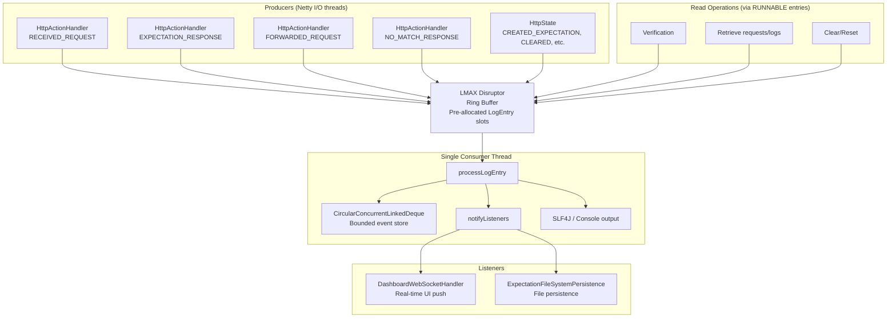
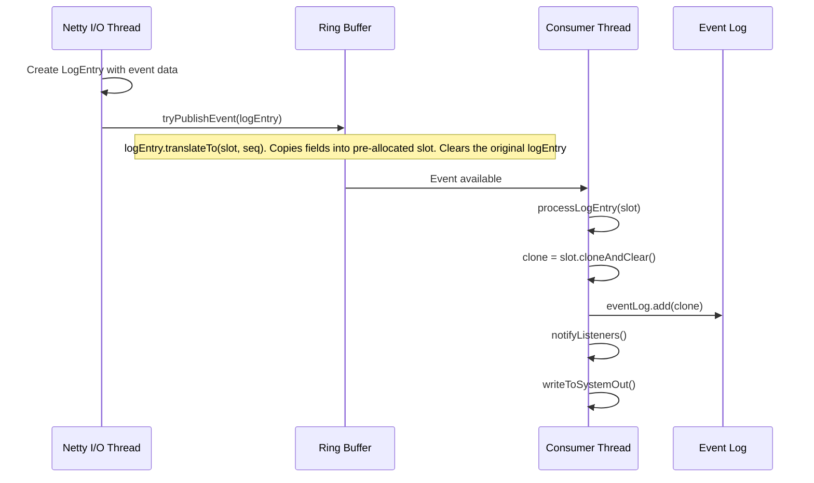
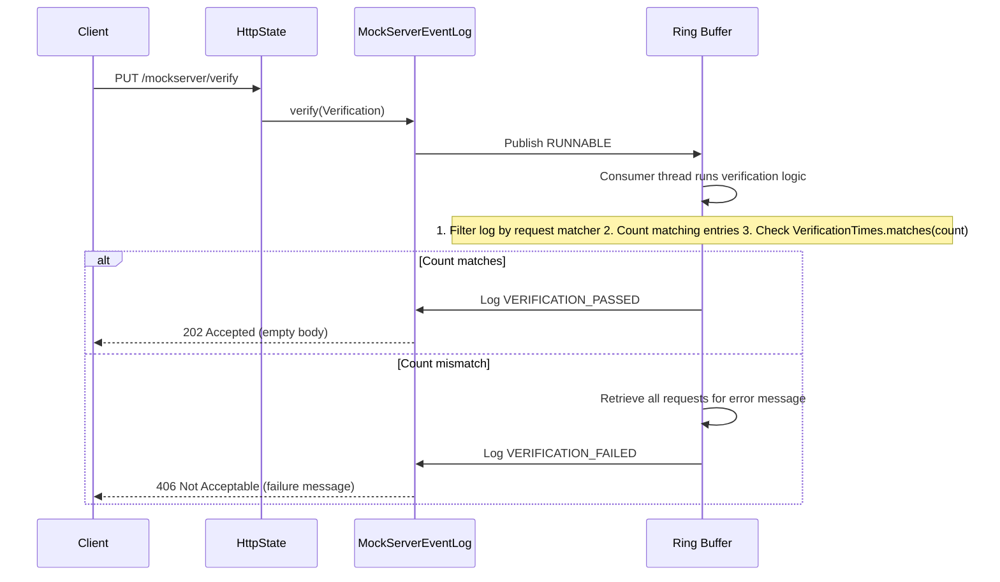
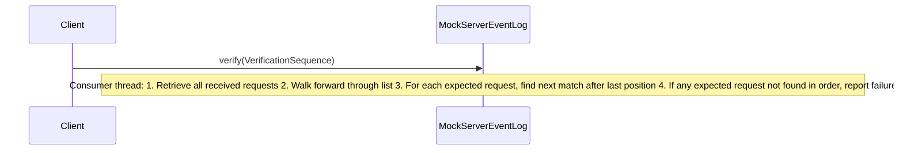
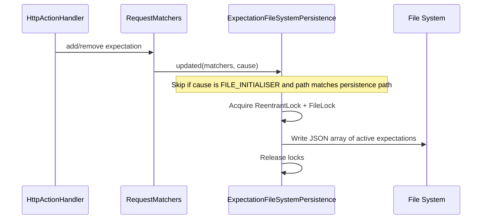
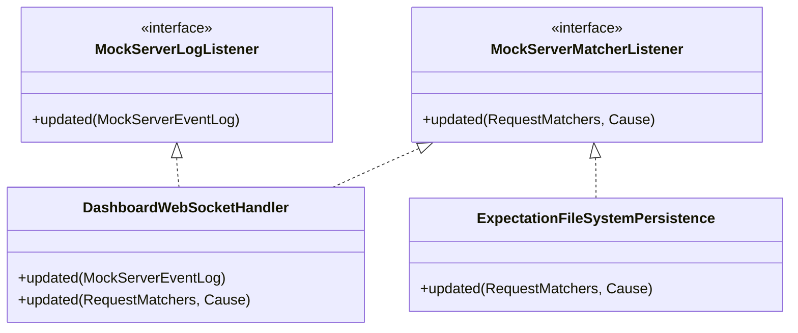

# Event System, Logging & Verification

## Architecture Overview

All events in MockServer -- received requests, matched expectations, forwarded requests, verification results -- flow through a high-performance LMAX Disruptor ring buffer. A single consumer thread serializes all reads and writes, eliminating the need for locks.



## LMAX Disruptor Integration

### Why Disruptor?

The Disruptor provides:
- **Lock-free publishing**: Multiple Netty I/O threads can publish events without contention
- **Single-writer principle**: One consumer thread processes all events, eliminating data races
- **Pre-allocated objects**: Ring buffer slots are pre-allocated `LogEntry` instances, reducing GC pressure
- **Backpressure**: `tryPublishEvent()` is non-blocking; if the ring buffer is full, low-priority events are dropped

### Ring Buffer Mechanics



### LogEntry as EventTranslator

`LogEntry` implements LMAX Disruptor's `EventTranslator<LogEntry>` interface. Its `translateTo()` method copies all fields from the source entry into the pre-allocated ring buffer slot, then clears the source. This avoids object allocation in the hot path.

### Serialized Read Operations

All read operations (verification, retrieval, clear, reset) are submitted as `RUNNABLE`-type `LogEntry` objects through the same ring buffer. This ensures that:

1. Reads see a consistent snapshot (no concurrent writes during iteration)
2. No locks are needed on the event log data structure
3. Operations are processed in FIFO order

```java
// Example: verify() publishes a RUNNABLE that runs on the consumer thread
disruptor.getRingBuffer().tryPublishEvent(
    new LogEntry()
        .setType(RUNNABLE)
        .setConsumer(() -> {
            // This runs on the single consumer thread
            List<LogEntry> matching = filterLog(predicate);
            future.complete(checkVerification(matching));
        })
);
```

## LogEntry

Each event is represented by a `LogEntry` with 24 possible types, organized into `LogMessageTypeCategory` groups for per-category log level overrides:

| Category Group | Types |
|----------------|-------|
| `MATCHING` | `EXPECTATION_MATCHED`, `EXPECTATION_NOT_MATCHED`, `NO_MATCH_RESPONSE` |
| `REQUEST_LIFECYCLE` | `RECEIVED_REQUEST`, `FORWARDED_REQUEST`, `EXPECTATION_RESPONSE`, `TEMPLATE_GENERATED` |
| `EXPECTATION_MANAGEMENT` | `CREATED_EXPECTATION`, `UPDATED_EXPECTATION`, `REMOVED_EXPECTATION`, `CLEARED` |
| `VERIFICATION` | `VERIFICATION`, `VERIFICATION_FAILED`, `VERIFICATION_PASSED`, `RETRIEVED` |
| `SERVER` | `SERVER_CONFIGURATION`, `AUTHENTICATION_FAILED`, `OPENAPI_RESPONSE_VALIDATION_FAILED` |
| `GENERAL` | `TRACE`, `DEBUG`, `INFO`, `WARN`, `ERROR`, `EXCEPTION` |
| (Internal) | `RUNNABLE` (used to serialize read operations through the ring buffer; excluded from categories) |

Users can override the log level per category or per individual type via the `logLevelOverrides` configuration property (a JSON map). Resolution order: individual type override > category group override > global `logLevel`. Overrides affect stdout/SLF4J output and the dashboard UI only; the event log stores entries based on the global `logLevel` threshold to preserve verification functionality. Note: overrides can only further suppress events that are already generated at the global `logLevel` — they cannot increase verbosity beyond the global threshold because events below the global level are never created or stored.

### Key Fields

| Field | Type | Purpose |
|-------|------|---------|
| `id` | String | UUID (lazy-generated) |
| `correlationId` | String | Groups related entries (e.g., request + response) |
| `type` | LogMessageType | Event type (see above) |
| `httpRequests` | RequestDefinition[] | Associated requests |
| `httpResponse` | HttpResponse | Associated response |
| `expectation` | Expectation | Associated expectation |
| `expectationId` | String | ID of matched expectation |
| `epochTime` | long | Timestamp |
| `messageFormat` | String | Format string with `{}` placeholders |
| `arguments` | Object[] | Arguments for formatting |
| `deleted` | boolean | Soft-delete flag |

## Event Log Storage

`CircularConcurrentLinkedDeque<LogEntry>` is a bounded, thread-safe deque. When capacity (`maxLogEntries`) is reached, the oldest entries are evicted and their `clear()` method is called (releasing references for GC).

### Filtering Predicates

Static predicates filter log entries for different retrieval operations:

| Predicate | Passes Types |
|-----------|-------------|
| `requestLogPredicate` | `RECEIVED_REQUEST` |
| `requestResponseLogPredicate` | `EXPECTATION_RESPONSE`, `NO_MATCH_RESPONSE`, `FORWARDED_REQUEST` |
| `recordedExpectationLogPredicate` | `FORWARDED_REQUEST` |
| `expectationLogPredicate` | `EXPECTATION_RESPONSE`, `FORWARDED_REQUEST` |
| `notDeletedPredicate` | Any non-deleted entry |

## Verification

### Request Count Verification



`VerificationTimes` supports:
- `never()` — must not have been received
- `once()` — exactly 1
- `exactly(n)` — exactly n
- `atLeast(n)` — n or more
- `atMost(n)` — n or fewer
- `between(min, max)` — within range

### Sequence Verification

Sequence verification checks that requests were received in a specific order:



Verification can be done by request matcher or by expectation ID.

**Request matcher count verification** filters `RECEIVED_REQUEST` entries. **Expectation ID verification** retrieves entries matching `expectationLogPredicate` (includes `EXPECTATION_RESPONSE`, `FORWARDED_REQUEST`). **Sequence verification** scans recorded requests in order rather than counting.

### Verification in Parallel Testing

**Common issue (#1713):** When running tests in parallel, verification may intermittently fail even though requests were sent successfully.

**Root causes:**

1. **Async application under test** — If your application sends requests asynchronously (e.g., fire-and-forget, background workers), calling `verify()` before the application has actually sent the request will fail. Verification operations are serialized through the same ring buffer as request recording (FIFO order), so once a request has reached MockServer and been published to the ring buffer, subsequent verification calls will see it.
2. **Log eviction** — The event log is bounded by `maxLogEntries` (default: `min(free heap KB / 8, 100000)`). In high-throughput parallel testing, old entries may be evicted before verification runs.
3. **Cross-test interference** — If multiple tests share the same MockServer instance, requests from other tests may inflate the count or interfere with sequence verification.

**Solutions:**

- **Increase `maxLogEntries`** if running many parallel tests that generate thousands of requests:
  ```java
  ConfigurationProperties.maxLogEntries(200_000);
  ```
- **Use separate MockServer instances per test** (different ports or separate containers) to isolate event logs
- **Use unique test identifiers** if sharing an instance:
  - Unique paths per test: `/test/{testId}/...`
  - Unique headers or query parameters in matchers
  - Avoid broad matchers like only `path("/api")` in parallel tests
- **Be careful with `clear()` / `reset()`** — they affect all tests sharing the instance
- **Retry verification with backoff** if testing asynchronous systems where you need to wait for the application to send requests:
  ```java
  // Wait for application under test to send request, not for MockServer to process it
  Awaitility.await()
      .atMost(Duration.ofSeconds(5))
      .pollInterval(Duration.ofMillis(100))
      .untilAsserted(() -> mockServerClient.verify(request, VerificationTimes.once()));
  ```
- **Debug by retrieving recorded requests** — if verification fails, check what was actually recorded:
  ```java
  // Retrieves recorded requests (not the full event log)
  HttpRequest[] recorded = mockServerClient.retrieveRecordedRequests(null);
  System.out.println("Recorded requests: " + Arrays.toString(recorded));
  ```

See consumer documentation at [/mock_server/verification.html#how_verification_works](https://www.mock-server.com/mock_server/verification.html#how_verification_works) for user-facing guidance.

## Persistence System

### File Persistence

When `configuration.persistExpectations()` is true, `ExpectationFileSystemPersistence` implements `MockServerMatcherListener` and writes all active expectations to a JSON file whenever they change.



### File Watcher

When `configuration.watchInitializationJson()` is true, `ExpectationFileWatcher` monitors the initialization JSON and OpenAPI files for changes:

- Uses `FileWatcher` which polls every 5 seconds using a `ScheduledExecutorService`
- Detects changes by comparing file content hashes (`Arrays.hashCode(Files.readAllBytes(path))`)
- On change, reloads expectations via `ExpectationInitializerLoader`

## Observer Pattern

Two observer interfaces drive real-time updates:



### Notification Flow

- `MockServerEventLogNotifier` (base of `MockServerEventLog`): Notifies `MockServerLogListener` instances when log entries are added
- `MockServerMatcherNotifier` (base of `RequestMatchers`): Notifies `MockServerMatcherListener` instances when expectations change

Notifications are dispatched asynchronously via the `Scheduler` to avoid blocking the Disruptor consumer thread.

## Scheduler

The `Scheduler` manages async task execution with a `ScheduledThreadPoolExecutor`:

| Method | Purpose |
|--------|---------|
| `schedule(Runnable, Delay...)` | Execute after delay |
| `submit(Runnable)` | Execute immediately |
| `submit(HttpForwardActionResult, Runnable)` | Execute when forward result completes |
| `submit(CompletableFuture<BinaryMessage>, Runnable)` | Execute when binary result completes |

Thread names follow the pattern `MockServer-<name><N>`. The pool uses `CallerRunsPolicy` as a backpressure mechanism when saturated.

## Memory Monitoring

`MemoryMonitoring` implements both `MockServerLogListener` and `MockServerMatcherListener` to track JVM memory usage. When `outputMemoryUsageCsv` is enabled, it writes memory statistics to a CSV file every 50 updates. See [Metrics & Monitoring](metrics.md) for full details.

## Class Reference

| Class | File | Role |
|-------|------|------|
| `MockServerEventLog` | `mockserver-core/.../log/MockServerEventLog.java` | Central event log with Disruptor ring buffer |
| `LogEntry` | `mockserver-core/.../log/model/LogEntry.java` | Event data object, implements `EventTranslator` |
| `MockServerLogger` | `mockserver-core/.../logging/MockServerLogger.java` | Logging facade, routes to event log |
| `Scheduler` | `mockserver-core/.../scheduler/Scheduler.java` | Async task execution |
| `CircularConcurrentLinkedDeque` | `mockserver-core/.../collections/CircularConcurrentLinkedDeque.java` | Bounded event store |
| `CircularPriorityQueue` | `mockserver-core/.../collections/CircularPriorityQueue.java` | Priority-sorted expectation store |
| `Verification` | `mockserver-core/.../verify/Verification.java` | Request count verification |
| `VerificationSequence` | `mockserver-core/.../verify/VerificationSequence.java` | Ordered sequence verification |
| `VerificationTimes` | `mockserver-core/.../verify/VerificationTimes.java` | Expected count constraints |
| `ExpectationFileSystemPersistence` | `mockserver-core/.../persistence/ExpectationFileSystemPersistence.java` | Write expectations to disk |
| `ExpectationFileWatcher` | `mockserver-core/.../persistence/ExpectationFileWatcher.java` | Monitor initialization files |
| `FileWatcher` | `mockserver-core/.../persistence/FileWatcher.java` | Low-level file polling |
| `MockServerEventLogNotifier` | `mockserver-core/.../mock/listeners/MockServerEventLogNotifier.java` | Observer pattern base for log |
| `MockServerMatcherNotifier` | `mockserver-core/.../mock/listeners/MockServerMatcherNotifier.java` | Observer pattern base for matchers |
