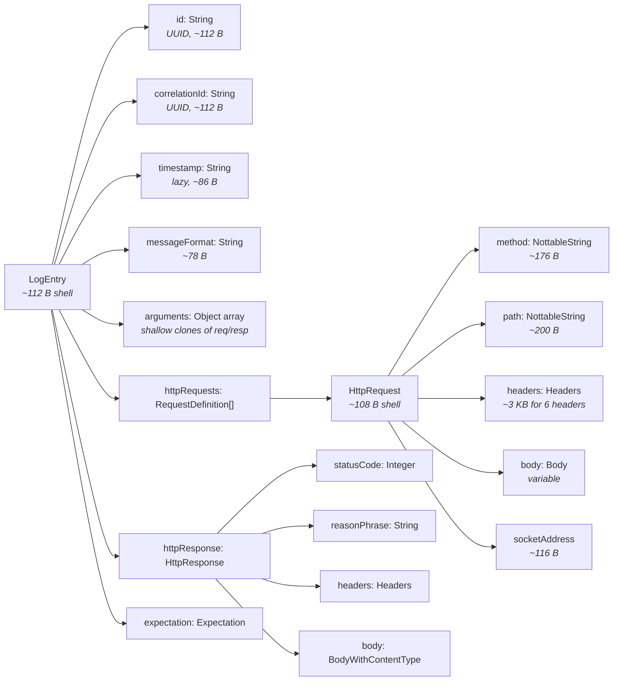

# Memory Management

This document covers how MockServer manages memory for log entries and expectations, how default limits are calculated, and how to tune them for your workload.

## Overview

MockServer stores two main categories of data in memory:

1. **Log entries** — recorded requests, matched expectations, forwarded requests, verification results, and operational log messages
2. **Expectations** — request matchers and their associated response/forward actions

Both are stored in bounded circular data structures that evict the oldest entries when full. The default size limits are computed dynamically based on available JVM heap memory.

```mermaid
graph TB
    subgraph "JVM Heap"
        subgraph "Log Entry Storage"
            RB[LMAX Disruptor Ring Buffer<br/><i>Pre-allocated LogEntry slots<br/>Size: nextPowerOfTwo(maxLogEntries)</i>]
            EL[CircularConcurrentLinkedDeque<br/><i>Persistent event store<br/>Max size: maxLogEntries</i>]
        end
        subgraph "Expectation Storage"
            PQ[CircularPriorityQueue<br/><i>Max size: maxExpectations</i>]
        end
        OTHER[Netty buffers, thread stacks,<br/>class metadata, GC overhead]
    end

    RB -->|"cloneAndClear()"| EL
    EL -->|"evict oldest → clear()"| GC[GC eligible]
```

## Default Limit Calculation

Both `maxLogEntries` and `maxExpectations` are computed from available heap at the time the property is first read.

### Formula

```
heapAvailableInKB = (maxHeap - usedHeap) / 1024 - 20480

maxLogEntries    = min(heapAvailableInKB / 8, 100000)
maxExpectations  = min(heapAvailableInKB / 10, 15000)
```

| Parameter | Value | Purpose |
|-----------|-------|---------|
| Base memory reservation | 20 MB (20,480 KB) | Reserved for JVM internals, Netty buffers, thread stacks |
| Per-log-entry estimate | 8 KB | Estimated heap cost per stored log entry (see [analysis below](#per-log-entry-type-estimates)) |
| Per-expectation estimate | 10 KB | Estimated heap cost per stored expectation including matcher (see [analysis below](#expectation-memory-analysis)) |
| Log entry hard cap | 100,000 | Upper bound regardless of heap |
| Expectation hard cap | 15,000 | Upper bound regardless of heap |

### Source Code

| Component | File | Line |
|-----------|------|------|
| `heapAvailableInKB()` | `ConfigurationProperties.java` | 357 |
| `maxLogEntries()` default | `ConfigurationProperties.java` | 381 |
| `maxExpectations()` default | `ConfigurationProperties.java` | 363 |
| `ringBufferSize()` | `Configuration.java` | 1894 |
| Heap measurement | `MemoryMonitoring.getJVMMemory()` | `MemoryMonitoring.java:59` |

### Example: Default Limits by Heap Size

The table below shows the computed defaults for different JVM heap configurations, assuming 30% of heap is used at the time the property is first read.

| Max Heap (`-Xmx`) | Used at Startup (~30%) | Available KB | Default `maxLogEntries` | Default `maxExpectations` |
|--------------------|----------------------|--------------|------------------------|--------------------------|
| 64 MB | 19 MB | 24,256 | 3,032 | 2,425 |
| 128 MB | 38 MB | 71,552 | 8,944 | 7,155 |
| 256 MB | 77 MB | 162,048 | 20,256 | 15,000 (capped) |
| 512 MB | 154 MB | 346,112 | 43,264 | 15,000 (capped) |
| 1 GB | 307 MB | 711,168 | 88,896 | 15,000 (capped) |
| 2 GB | 614 MB | 1,401,856 | 100,000 (capped) | 15,000 (capped) |
| 4 GB | 1,229 MB | 2,843,648 | 100,000 (capped) | 15,000 (capped) |

With the default Docker image (no `-Xmx` set, JVM defaults to ~256 MB), users get roughly **20,000 log entries**. Since each HTTP request generates 2-3 log entries (RECEIVED_REQUEST + EXPECTATION_MATCHED + EXPECTATION_RESPONSE), this means approximately **~7,000-10,000 HTTP requests** are retained before eviction begins.

### Shared Heap Pool

Both `maxLogEntries` and `maxExpectations` are calculated independently from the same available heap. In the worst case (both buffers completely full with average-sized entries), the combined memory usage could exceed the available heap. In practice this is mitigated by:

- The circular eviction means buffers rarely fill completely — older entries are GC'd as new ones arrive
- Most users have far fewer expectations than the cap allows
- The JVM's garbage collector reclaims memory from evicted entries promptly

On small heaps (< 256 MB), if you have both a large number of expectations AND high request volume, set explicit values for both properties rather than relying on the computed defaults.

### Timing Sensitivity

`heapAvailableInKB()` measures the *current* free heap at the moment the property is first read. During JVM startup, the heap may be more heavily used (class loading, initialisation) than during steady state. This means the computed default can be lower than what the JVM can actually sustain. After garbage collection runs and startup objects are freed, significantly more heap may be available.

## Log Entry Memory Analysis

### LogEntry Object Graph

Each `LogEntry` holds references to the HTTP request, response, expectation, and formatting data associated with an event.



### Field-Level Size Estimates

#### LogEntry Shell (~112 bytes)

| Field | Type | Bytes | Notes |
|-------|------|-------|-------|
| Object header | — | 16 | |
| `hashCode` | `int` | 4 | |
| `id` | `String` ref | 4 | UUID string allocated separately (~112 B) |
| `correlationId` | `String` ref | 4 | UUID string (~112 B) |
| `port` | `Integer` ref | 4 | Boxed int (16 B when non-null) |
| `logLevel` | `Level` ref | 4 | Enum singleton |
| `alwaysLog` | `boolean` | 1 | |
| `epochTime` | `long` | 8 | |
| `timestamp` | `String` ref | 4 | Lazy, ~86 B when materialised |
| `type` | `LogMessageType` ref | 4 | Enum singleton |
| `httpRequests` | `RequestDefinition[]` ref | 4 | |
| `httpUpdatedRequests` | `RequestDefinition[]` ref | 4 | Lazy shallow clone |
| `httpResponse` | `HttpResponse` ref | 4 | |
| `httpUpdatedResponse` | `HttpResponse` ref | 4 | Lazy shallow clone |
| `httpError` | `HttpError` ref | 4 | Usually null |
| `expectation` | `Expectation` ref | 4 | |
| `expectationId` | `String` ref | 4 | UUID (~112 B) |
| `throwable` | `Throwable` ref | 4 | Usually null |
| `consumer` | `Runnable` ref | 4 | Always null in stored entries |
| `deleted` | `boolean` | 1 | |
| `messageFormat` | `String` ref | 4 | ~78 B |
| `message` | `String` ref | 4 | Lazy |
| `arguments` | `Object[]` ref | 4 | |
| `because` | `String` ref | 4 | Usually null |
| *(padding)* | — | ~4 | Alignment |

#### HttpRequest (~3.5-5 KB typical)

| Component | Typical Size | Notes |
|-----------|-------------|-------|
| HttpRequest shell (19 fields) | ~108 B | Inherits from `Not` → `ObjectWithJsonToString` |
| `method` (NottableString) | ~176 B | e.g., "GET" — NottableString + value String + json String |
| `path` (NottableString) | ~200 B | e.g., "/api/users" |
| `headers` (Headers + Guava LinkedHashMultimap) | ~3,000 B | 6 typical headers (Host, Content-Type, Accept, User-Agent, Content-Length, Connection) |
| `body` (StringBody, if present) | 0-2,000 B | Null for GET; ~630 B for 100-char JSON; ~1,800 B for 500-char JSON |
| `socketAddress` | ~116 B | host String + port Integer + scheme enum |
| `localAddress` / `remoteAddress` | ~140 B | Two short strings |
| `keepAlive` / `secure` | ~32 B | Two boxed Booleans |
| **Total (GET, no body)** | **~3,800 B** | |
| **Total (POST, 200-char body)** | **~4,700 B** | |

#### NottableString (~176-284 bytes each)

Each `NottableString` wraps a value with optional negation and regex support:

| Component | Bytes |
|-----------|-------|
| Object header + 5 fields | ~48 B |
| `value` String (short, e.g., 3-15 chars) | ~64-100 B |
| `json` String (same content) | ~64-100 B |
| **Total (short value like "GET")** | **~176 B** |
| **Total (medium value like "application/json")** | **~250 B** |

#### Headers (~500 bytes per header pair)

Each header is a key-value pair of `NottableString` objects stored in a Guava `LinkedHashMultimap`:

| Component | Per-Header Bytes |
|-----------|-----------------|
| Key NottableString | ~176 B |
| Value NottableString | ~240 B |
| Multimap entry overhead | ~64 B |
| **Total per header** | **~480 B** |

The `Headers` object itself adds ~232 B of overhead (shell + multimap base structure).

#### HttpResponse (~3.5 KB typical)

| Component | Typical Size | Notes |
|-----------|-------------|-------|
| HttpResponse shell (8 fields) | ~76 B | Inherits from `Action` |
| `statusCode` (Integer) | ~16 B | Boxed int |
| `reasonPhrase` (String) | ~44 B | e.g., "OK" |
| `body` (StringBody) | ~630-1,800 B | 100-500 char JSON body |
| `headers` (Headers) | ~2,600 B | 5 typical response headers |
| **Total (200-char JSON body)** | **~3,400 B** | |

#### StringBody (~630 bytes for 100-char body)

| Component | Bytes |
|-----------|-------|
| StringBody shell (inherits 4 levels) | ~72 B |
| `value` String | ~240 B (100 chars × 2 bytes + 40 B overhead) |
| `rawBytes` byte array | ~116 B (100 bytes + 16 B header) |
| `contentType` MediaType | ~200 B |
| **Total (100-char body)** | **~630 B** |
| **Total (500-char body)** | **~1,800 B** |
| **Total (2 KB body)** | **~4,700 B** |

### Per Log Entry Type Estimates

Each log entry type populates a different subset of fields. These estimates assume a typical HTTP request with 6 headers and a small-to-medium JSON body.

| Log Entry Type | Typical Memory | What It Stores |
|---------------|----------------|----------------|
| `RECEIVED_REQUEST` (GET) | **~4.2 KB** | LogEntry shell + strings + HttpRequest |
| `RECEIVED_REQUEST` (POST, 200-char body) | **~5.2 KB** | As above + request body |
| `EXPECTATION_MATCHED` | **~7.8 KB** | LogEntry + HttpRequest + Expectation ref (shared, not copied) |
| `EXPECTATION_RESPONSE` | **~7.9 KB** | LogEntry + HttpRequest + HttpResponse |
| `FORWARDED_REQUEST` | **~10.2 KB** | LogEntry + HttpRequest + HttpResponse + Expectation wrapper |
| `NO_MATCH_RESPONSE` | **~6.5 KB** | LogEntry + HttpRequest + 404 response |
| `CREATED_EXPECTATION` | **~4.9 KB** | LogEntry + expectation definition |
| `INFO` / `WARN` / `ERROR` | **~0.5 KB** | LogEntry shell + message format + arguments |

### Per HTTP Transaction Memory

Each inbound HTTP request generates **2-3 log entries**:

| Scenario | Log Entries Created | Total Memory |
|----------|-------------------|-------------|
| GET matched to expectation | RECEIVED_REQUEST + EXPECTATION_MATCHED + EXPECTATION_RESPONSE | ~20 KB |
| POST matched to expectation | RECEIVED_REQUEST + EXPECTATION_MATCHED + EXPECTATION_RESPONSE | ~22 KB |
| Proxied/forwarded request | RECEIVED_REQUEST + FORWARDED_REQUEST | ~14 KB |
| No match (404) | RECEIVED_REQUEST + NO_MATCH_RESPONSE | ~11 KB |

### Arguments Array and Shallow Clones

The `arguments` field in `LogEntry` stores objects used for message formatting. When `setArguments()` is called with `HttpRequest` or `HttpResponse` objects, it creates **shallow clones** with updated body representations (`LogEntryBody`). These shallow clones share the same `headers`, `cookies`, `pathParameters`, and `queryStringParameters` references as the originals — only the body wrapper is replaced. This adds approximately **200-400 bytes** per clone rather than duplicating the entire request/response.

### Eviction and GC

When the `CircularConcurrentLinkedDeque` reaches capacity:

1. The oldest `LogEntry` is removed from the deque via `poll()`
2. The `onEvictCallback` calls `LogEntry.clear()`, which nulls all reference fields
3. All child objects (HttpRequest, HttpResponse, Strings, etc.) become eligible for garbage collection
4. The `LogEntry` object itself is also GC-eligible (it is fully removed from the deque)

The LMAX Disruptor ring buffer pre-allocates `LogEntry` slots separately. Data is copied into ring buffer slots via `translateTo()`, then the consumer calls `cloneAndClear()` — creating a new `LogEntry` for persistent storage and clearing the ring buffer slot. Ring buffer slots do not contribute to persistent memory usage.

## Expectation Memory Analysis

Stored expectations are heavier than they first appear because each expectation creates a matcher wrapper with sub-matchers for every field.

### Objects Per Stored Expectation

| Component | Typical Size | Notes |
|-----------|-------------|-------|
| `Expectation` shell | ~400 B | id, times, timeToLive, priority, 10 action refs |
| `HttpRequest` (matcher definition) | ~400-600 B | Usually just method + path, fewer headers than a real request |
| `HttpResponse` (response action) | ~500 B - 50+ KB | **Dominated by response body size** |
| `HttpRequestPropertiesMatcher` | ~900-1,200 B | Wrapper with sub-matchers for each field |
| Container overhead (CircularPriorityQueue) | ~350 B | ConcurrentLinkedQueue + ConcurrentSkipListSet + ConcurrentHashMap entries |
| **Total (simple, small response body)** | **~3.5 KB** | |
| **Total (medium, 2 KB response body)** | **~6-7 KB** | |
| **Total (large, 10 KB response body)** | **~15-20 KB** | |
| **Total (very large, 50 KB response body)** | **~55-75 KB** | |

The 75 KB per-expectation estimate in the default formula targets the worst case (large response bodies). For most workloads with small responses, it is 10-20x too conservative.

## How the Estimates Were Chosen

The per-entry estimates (8 KB for log entries, 10 KB for expectations) are based on the field-level analysis in the sections above. They target the **realistic weighted average** for typical API mocking workloads (small-to-medium JSON bodies, a handful of headers), with a modest safety margin.

| Metric | Estimate Used | Realistic Average | Worst Case |
|--------|--------------|-------------------|------------|
| Per log entry | 8 KB | 6-8 KB | 30+ KB (large bodies) |
| Per expectation | 10 KB | 3.5-7 KB | 75+ KB (huge response bodies) |

For workloads with very large request/response bodies (>10 KB), the automatic defaults may over-provision. Users with such workloads should set explicit values using the tuning guide below, and monitor memory via `outputMemoryUsageCsv`.

**History:** Prior to this change, the estimates were 80 KB per log entry and 75 KB per expectation — values that were 10-16x too conservative for typical workloads, resulting in unnecessarily low limits and unexpected log eviction (GitHub issue [#1285](https://github.com/mock-server/mockserver/issues/1285)).

## Tuning Guide

### Configuration Properties

| Property | System Property | Environment Variable | Default |
|----------|----------------|---------------------|---------|
| Max log entries | `mockserver.maxLogEntries` | `MOCKSERVER_MAX_LOG_ENTRIES` | `min(heapAvailableKB / 8, 100000)` |
| Max expectations | `mockserver.maxExpectations` | `MOCKSERVER_MAX_EXPECTATIONS` | `min(heapAvailableKB / 10, 15000)` |

Properties are resolved in this order (first match wins):

1. In-memory property cache (set programmatically)
2. Java system property (`-Dmockserver.maxLogEntries=...`)
3. Properties file (`mockserver.properties`)
4. Environment variable (`MOCKSERVER_MAX_LOG_ENTRIES`)
5. Computed default

### Choosing Values

**Step 1: Estimate your per-entry memory**

| Your workload | Estimated per-entry size | Entries per HTTP request |
|---------------|------------------------|------------------------|
| Small API responses (< 1 KB bodies) | 5-8 KB | 2-3 |
| Medium API responses (1-5 KB bodies) | 8-15 KB | 2-3 |
| Large API responses (5-50 KB bodies) | 15-50 KB | 2-3 |
| Proxy mode (request + response stored) | 10-30 KB | 2 |

**Step 2: Calculate how many entries your heap can support**

```
available_heap_MB = Xmx - (estimated_used_heap_MB + 50 MB safety margin)
entries = (available_heap_MB * 1024) / per_entry_KB
```

**Step 3: Account for entries per HTTP request**

```
http_requests_retained = entries / entries_per_request
```

### Examples

**Docker container, 256 MB heap, small API mocking:**
```
available = 256 - (80 + 50) = 126 MB = 129,024 KB
per_entry = 8 KB (typical small API)
max_log_entries = 129,024 / 8 = ~16,000
http_requests_retained = 16,000 / 3 = ~5,300
```

Set: `MOCKSERVER_MAX_LOG_ENTRIES=16000`

**Docker container, 512 MB heap, medium API responses:**
```
available = 512 - (150 + 50) = 312 MB = 319,488 KB
per_entry = 12 KB
max_log_entries = 319,488 / 12 = ~26,000
```

Set: `MOCKSERVER_MAX_LOG_ENTRIES=26000`

**Large test suite, 2 GB heap, needs to retain all requests:**
```
available = 2048 - (400 + 50) = 1,598 MB = 1,636,352 KB
per_entry = 8 KB
max_log_entries = 1,636,352 / 8 = ~204,000
```

Set: `MOCKSERVER_MAX_LOG_ENTRIES=200000`

### Memory Monitoring

Enable CSV memory tracking to observe actual memory usage under your workload:

```properties
mockserver.outputMemoryUsageCsv=true
mockserver.memoryUsageCsvDirectory=/tmp/mockserver-metrics
```

This writes a `memoryUsage_YYYY-MM-DD.csv` file every 50 log or expectation updates with columns including `eventLogSize`, `maxLogEntries`, `heapUsed`, and `heapMaxAllowed`. Use this to validate that your `maxLogEntries` setting is appropriate for your heap size.

### Ring Buffer Sizing

The LMAX Disruptor ring buffer size is computed as the next power of two greater than `maxLogEntries`:

| maxLogEntries | Ring Buffer Size | Ring Buffer Memory (empty LogEntry shells) |
|---------------|-----------------|-------------------------------------------|
| 1,000 | 1,024 | ~115 KB |
| 5,000 | 8,192 | ~920 KB |
| 10,000 | 16,384 | ~1.8 MB |
| 50,000 | 65,536 | ~7.4 MB |
| 100,000 | 131,072 | ~14.7 MB |

The ring buffer pre-allocates `LogEntry` objects (just the shells, ~112 bytes each). These are reused via `translateTo()` / `cloneAndClear()` and do not hold persistent data. The ring buffer memory is a fixed overhead that does not grow with request volume.

The `nextPowerOfTwo()` method in `Configuration.java` supports values up to `2^20 = 1,048,576`.
