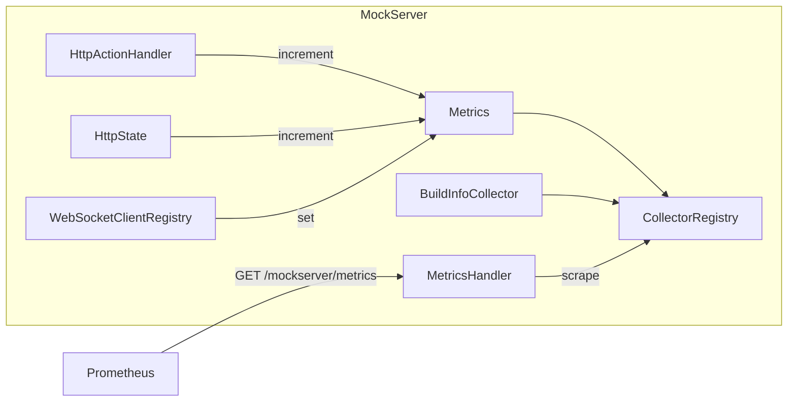

# Metrics & Monitoring

## Prometheus Metrics

MockServer exposes Prometheus-compatible metrics when the `metricsEnabled` configuration property is set to `true`. Metrics are served at the `/mockserver/metrics` endpoint in Prometheus text exposition format.

### Architecture

### Configuration

| Property | Default | Description |
|----------|---------|-------------|
| `metricsEnabled` | `false` | Enable Prometheus metrics collection and the `/mockserver/metrics` endpoint |

When metrics are disabled, the scrape endpoint returns a `404 Not Found` response.

### Metric Names

All metrics are Prometheus `Gauge` type. The `Metrics.Name` enum defines 17 gauges:

#### Request & Expectation Matching

| Metric Name | Description |
|-------------|-------------|
| `requests_received_count` | Total requests received |
| `expectations_not_matched_count` | Requests that did not match any expectation |
| `response_expectations_matched_count` | Requests matched to a response expectation |
| `forward_expectations_matched_count` | Requests matched to a forward expectation |

#### Action Execution (one per action type)

| Metric Name | Description |
|-------------|-------------|
| `forward_actions_count` | Forward actions executed |
| `forward_template_actions_count` | Forward template actions executed |
| `forward_class_callback_actions_count` | Forward class callback actions executed |
| `forward_object_callback_actions_count` | Forward object callback actions executed |
| `forward_replace_actions_count` | Forward replace (override) actions executed |
| `response_actions_count` | Response actions executed |
| `response_template_actions_count` | Response template actions executed |
| `response_class_callback_actions_count` | Response class callback actions executed |
| `response_object_callback_actions_count` | Response object callback actions executed |
| `error_actions_count` | Error actions executed |

#### WebSocket Callbacks

| Metric Name | Description |
|-------------|-------------|
| `websocket_callback_clients_count` | Active WebSocket callback client connections |
| `websocket_callback_response_handlers_count` | Registered response callback handlers |
| `websocket_callback_forward_handlers_count` | Registered forward callback handlers |

### Build Info Metric

`BuildInfoCollector` registers a `mock_server_build_info` gauge with labels:

| Label | Description |
|-------|-------------|
| `version` | Full version (e.g. `5.15.0`) |
| `major_minor_version` | Major.minor version (e.g. `5.15`) |
| `group_id` | Maven group ID (`org.mock-server`) |
| `artifact_id` | Maven artifact ID (`mockserver-netty`) |

### How Metrics Are Incremented

- `HttpActionHandler` calls `metrics.increment(action.getType())` after dispatching each action, which maps the `Action.Type` enum to the corresponding `*_ACTIONS_COUNT` gauge
- `HttpState` increments `REQUESTS_RECEIVED_COUNT` on each request and `EXPECTATIONS_NOT_MATCHED_COUNT` when no expectation matches
- `WebSocketClientRegistry` calls `metrics.set()` to update WebSocket client and handler counts
- `Metrics.clear()` resets all gauges to zero (called during server reset)

### Scrape Endpoint

`MetricsHandler` serves the `/mockserver/metrics` endpoint. It uses Prometheus `TextFormat.writeFormat()` to render all registered metrics from the default `CollectorRegistry`, respecting the client's `Accept` header for content negotiation.

## Memory Monitoring

`MemoryMonitoring` provides CSV-based memory usage tracking, enabled via the `outputMemoryUsageCsv` configuration property.

### Configuration

| Property | Default | Description |
|----------|---------|-------------|
| `outputMemoryUsageCsv` | `false` | Enable memory usage CSV output |
| `memoryUsageCsvDirectory` | `.` | Directory for CSV output files |

### How It Works

`MemoryMonitoring` implements both `MockServerLogListener` and `MockServerMatcherListener`. It receives notifications when log entries are added or expectations change, and writes memory statistics to a CSV file (named `memoryUsage_YYYY-MM-DD.csv`) every 50 updates.

### CSV Columns

| Column | Description |
|--------|-------------|
| `mockServerPort` | Server port |
| `eventLogSize` | Current log entry count |
| `maxLogEntries` | Configured max log entries |
| `expectationsSize` | Current expectation count |
| `maxExpectations` | Configured max expectations |
| `heapInitialAllocation` | JVM heap initial allocation (bytes) |
| `heapUsed` | JVM heap used (bytes) |
| `heapCommitted` | JVM heap committed (bytes) |
| `heapMaxAllowed` | JVM heap max allowed (bytes) |
| `nonHeapInitialAllocation` | JVM non-heap initial allocation (bytes) |
| `nonHeapUsed` | JVM non-heap used (bytes) |
| `nonHeapCommitted` | JVM non-heap committed (bytes) |
| `nonHeapMaxAllowed` | JVM non-heap max allowed (bytes) |

## Key Classes

| Class | Module | Path |
|-------|--------|------|
| `Metrics` | mockserver-core | `org.mockserver.metrics.Metrics` |
| `Metrics.Name` | mockserver-core | `org.mockserver.metrics.Metrics.Name` (enum) |
| `MetricsHandler` | mockserver-core | `org.mockserver.metrics.MetricsHandler` |
| `BuildInfoCollector` | mockserver-core | `org.mockserver.metrics.BuildInfoCollector` |
| `MemoryMonitoring` | mockserver-core | `org.mockserver.memory.MemoryMonitoring` |
| `Summary` | mockserver-core | `org.mockserver.memory.Summary` |
| `Detail` | mockserver-core | `org.mockserver.memory.Detail` |

## Dependencies

| GroupId | ArtifactId | Version | Purpose |
|---------|-----------|---------|---------|
| `io.prometheus` | `simpleclient` | 0.16.0 | Prometheus client library (Gauge, Collector, CollectorRegistry) |
| `io.prometheus` | `simpleclient_httpserver` | 0.16.0 | Prometheus text format exposition |
