# Netty Pipeline & Protocol Handling

## Server Bootstrap

The server is started from `Main.java` (CLI) or `ClientAndServer` (embedded). Both create a `MockServer` instance which extends `LifeCycle`.

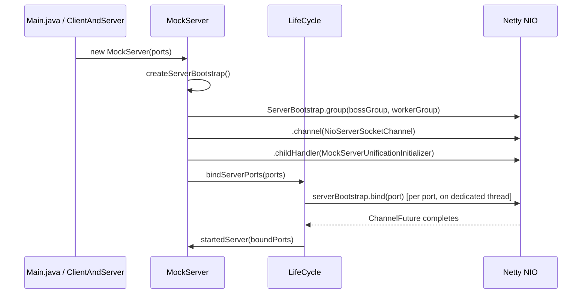

### Key Bootstrap Configuration

| Setting | Value | Purpose |
|---------|-------|---------|
| Boss group | `NioEventLoopGroup(5)` | Accept connections |
| Worker group | `NioEventLoopGroup(configurable)` | Handle I/O |
| Channel | `NioServerSocketChannel` | Non-blocking server socket |
| SO_BACKLOG | 1024 | Connection queue depth |
| AUTO_READ | true | Automatic read on new channels |
| ALLOCATOR | `PooledByteBufAllocator.DEFAULT` | Memory-efficient buffer allocation |
| WRITE_BUFFER_WATER_MARK | 8KB - 32KB | Backpressure control |

### Channel Attributes

| Attribute | Type | Purpose |
|-----------|------|---------|
| `REMOTE_SOCKET` | `InetSocketAddress` | Remote proxy target (port-forwarding mode) |
| `PROXYING` | `Boolean` | Whether channel is in proxy mode |
| `TLS_ENABLED_UPSTREAM` | `Boolean` | TLS active on client side |
| `TLS_ENABLED_DOWNSTREAM` | `Boolean` | TLS needed for upstream connections |
| `HTTP_ENABLED` | `Boolean` | HTTP pipeline configured |
| `HTTP2_ENABLED` | `Boolean` | HTTP/2 pipeline configured |
| `NETTY_SSL_CONTEXT_FACTORY` | `NettySslContextFactory` | SSL context for this channel |

## Channel Initializer

`MockServerUnificationInitializer` is a `@Sharable` `ChannelHandlerAdapter` that replaces itself with a `PortUnificationHandler` on `handlerAdded()`. This thin adapter ensures each new channel gets its own `PortUnificationHandler` instance (since the decoder maintains per-channel state).

## Port Unification Handler

`PortUnificationHandler` extends Netty's `ReplayingDecoder<Void>` and is **the heart of protocol detection**. It inspects the first bytes of every connection and routes to the appropriate protocol pipeline.

### Protocol Detection Order

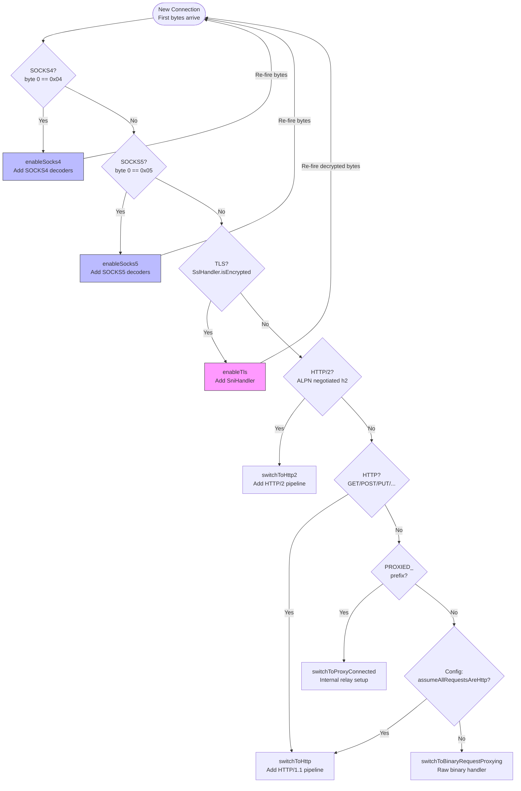

**Recursive detection**: When TLS or SOCKS is detected, the handler adds protocol-specific decoders, re-fires the bytes through the pipeline, and runs detection again on the decoded data. This enables arbitrary nesting (e.g., SOCKS5 → TLS → HTTP/2).

### Protocol-Specific Pipelines

#### HTTP/1.1 Pipeline

```mermaid
graph LR
    A[HttpServerCodec] --> B[PreserveHeadersNettyRemoves]
    B --> C[HttpContentDecompressor]
    C --> D[HttpContentLengthRemover]
    D --> E[HttpObjectAggregator]
    E --> F[CallbackWebSocketServerHandler]
    F --> G[DashboardWebSocketHandler]
    G --> MCP["McpStreamableHttpHandler
(conditional)"]
    MCP --> H[MockServerHttpServerCodec]
    H --> I[HttpRequestHandler]
```

| Handler | Class | Purpose |
|---------|-------|---------|
| HttpServerCodec | Netty built-in | HTTP/1.1 request decoding / response encoding |
| PreserveHeadersNettyRemoves | `o.m.codec` | Preserves `Host`, `Content-Length`, and `Transfer-Encoding` headers that Netty's HTTP codec would otherwise strip or modify during decode/encode |
| HttpContentDecompressor | Netty built-in | Decompresses gzipped request bodies |
| HttpContentLengthRemover | `o.m.netty.unification` | Strips empty Content-Length headers |
| HttpObjectAggregator | Netty built-in | Aggregates HTTP chunks into `FullHttpRequest` |
| CallbackWebSocketServerHandler | `o.m.netty.websocketregistry` | Intercepts `/_mockserver_callback_websocket` |
| DashboardWebSocketHandler | `o.m.dashboard` | Intercepts `/_mockserver_ui_websocket` |
| McpStreamableHttpHandler | `o.m.netty.mcp` | Intercepts `/mockserver/mcp` for MCP (Model Context Protocol) Streamable HTTP transport. Only added when `ConfigurationProperties.mcpEnabled()` is true. POST requests are offloaded to a dedicated executor (`McpSessionManager.getExecutor()`) to avoid blocking the Netty event loop during blocking tool calls (e.g., `Future.get()`) |
| MockServerHttpServerCodec | `o.m.codec` | Converts Netty HTTP ↔ MockServer model |
| HttpRequestHandler | `o.m.netty` | Main request processing |

#### HTTP/2 Pipeline

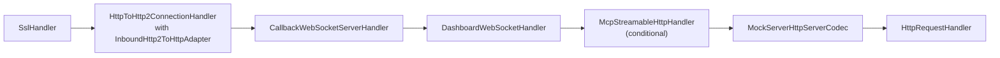

HTTP/2 frames are converted to HTTP/1.1 objects via `InboundHttp2ToHttpAdapter`, allowing the same `HttpRequestHandler` to process both protocols uniformly. When MCP is enabled (`ConfigurationProperties.mcpEnabled()`), the `McpStreamableHttpHandler` is also inserted in the HTTP/2 pipeline.

#### gRPC Pipeline (over HTTP/2)

When gRPC is enabled and the `GrpcProtoDescriptorStore` has loaded services, two additional handlers are inserted into both the h2c and TLS-negotiated HTTP/2 pipelines:

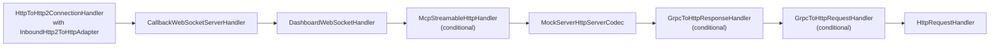

| Handler | Class | Purpose |
|---------|-------|---------|
| GrpcToHttpResponseHandler | `o.m.netty.grpc` | Outbound encoder — intercepts responses with `x-grpc-service` header, encodes JSON body back to gRPC-framed protobuf, appends `grpc-status` trailers |
| GrpcToHttpRequestHandler | `o.m.netty.grpc` | Inbound handler — intercepts `application/grpc` requests, decodes protobuf body to JSON using descriptors, rewrites as `POST /<service>/<method>` with `x-grpc-*` headers |

The handlers are placed after `MockServerHttpServerCodec` so they operate on MockServer model objects (`HttpRequest`/`HttpResponse`), not raw Netty HTTP objects.

h2c (HTTP/2 cleartext) is detected by `isH2cPreface()` in `PortUnificationHandler`, which checks for the HTTP/2 connection preface (`PRI * HTTP/2.0\r\n\r\nSM\r\n\r\n`). Both `switchToH2c()` and `switchToHttp2()` conditionally wire gRPC handlers when descriptors are loaded.

#### TLS Pipeline

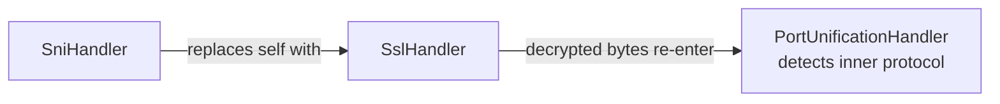

`SniHandler` (in `mockserver-core`) extends Netty's `AbstractSniHandler`. It extracts the hostname from the TLS ClientHello SNI extension, dynamically generates a certificate with that hostname as a Subject Alternative Name, and negotiates ALPN (HTTP/1.1 or HTTP/2).

#### SOCKS4 Pipeline

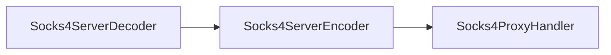

#### SOCKS5 Pipeline

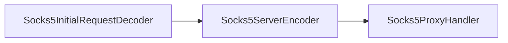

SOCKS5 is multi-phase: initial handshake → optional password auth → CONNECT command.

## Relay Connect Pattern

When HTTP CONNECT or SOCKS tunneling is established, MockServer uses a **self-loopback relay** rather than connecting directly to the target:

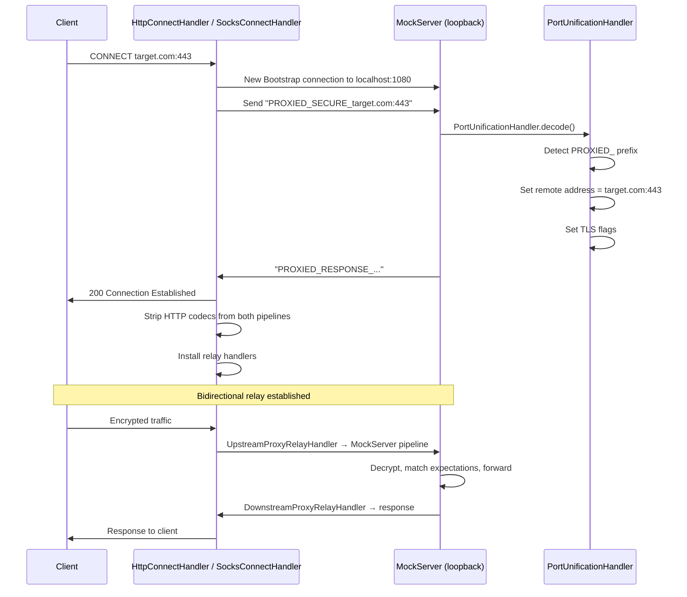

This pattern allows MockServer to:
- Intercept and log tunneled HTTPS traffic
- Match expectations against tunneled requests
- Generate dynamic TLS certificates for the target hostname

### Relay Handler Hierarchy

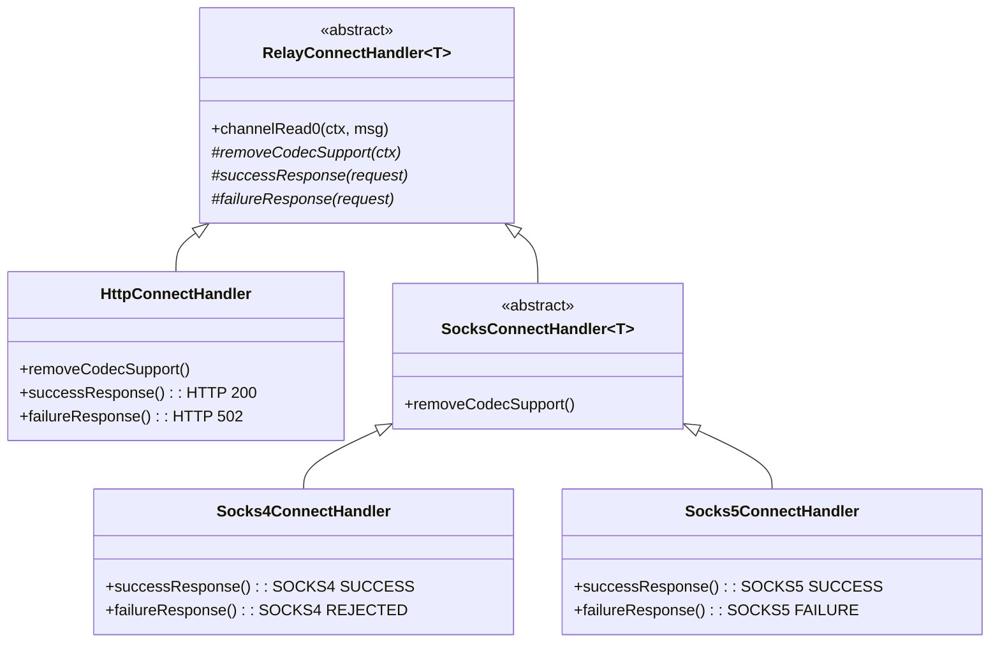

### Relay Data Flow

Once the relay is established, two handler pairs shuttle data:

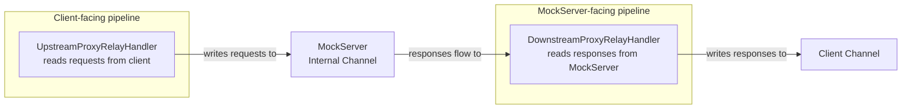

## Binary Protocol Proxying

When no known protocol is detected and a remote address is configured, `BinaryRequestProxyingHandler` forwards raw bytes via `NettyHttpClient.sendRequest(BinaryMessage, ...)`. It supports:

- **Waiting mode**: Blocks until upstream response arrives, writes it back
- **Non-waiting mode**: Fire-and-forget with optional `BinaryProxyListener` callback. `BinaryProxyListener` (`o.m.model.BinaryProxyListener`) is a functional interface with `onProxy(BinaryMessage binaryRequest, CompletableFuture<BinaryMessage> binaryResponse, SocketAddress serverAddress, SocketAddress clientAddress)` invoked when binary data is proxied

## SOCKS Protocol Detection

`SocksDetector` provides static detection methods:

**SOCKS4 detection** (`isSocks4`):
- Byte 0 = `0x04` (version)
- Byte 1 = valid command (CONNECT or BIND)
- Validates null-terminated username (max 256 chars)
- Optionally validates SOCKS4a hostname

**SOCKS5 detection** (`isSocks5`):
- Byte 0 = `0x05` (version)
- Byte 1 = auth method count
- Each auth method is NO_AUTH, PASSWORD, or GSSAPI

**SOCKS5 handshake lifecycle**:

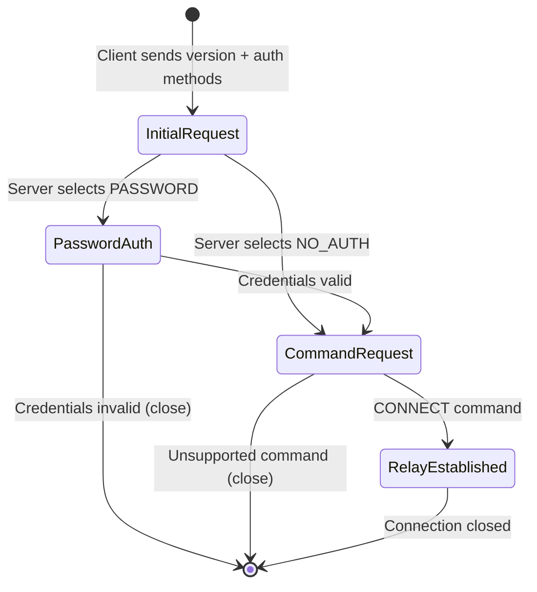

## Class Reference

| Class | File | Role |
|-------|------|------|
| `Main` | `mockserver-netty/.../cli/Main.java` | CLI entry point, argument parsing |
| `LifeCycle` | `mockserver-netty/.../lifecycle/LifeCycle.java` | Abstract server lifecycle (event loops, port binding, shutdown) |
| `MockServer` | `mockserver-netty/.../netty/MockServer.java` | Concrete server, configures `ServerBootstrap` |
| `MockServerUnificationInitializer` | `mockserver-netty/.../netty/MockServerUnificationInitializer.java` | Replaces self with `PortUnificationHandler` |
| `PortUnificationHandler` | `mockserver-netty/.../netty/unification/PortUnificationHandler.java` | Protocol detection and pipeline assembly |
| `HttpRequestHandler` | `mockserver-netty/.../netty/HttpRequestHandler.java` | Main request dispatcher |
| `NettyResponseWriter` | `mockserver-netty/.../netty/responsewriter/NettyResponseWriter.java` | Writes responses to Netty channels |
| `HttpConnectHandler` | `mockserver-netty/.../netty/proxy/connect/HttpConnectHandler.java` | HTTP CONNECT tunnel handler |
| `RelayConnectHandler` | `mockserver-netty/.../netty/proxy/relay/RelayConnectHandler.java` | Abstract relay establishment |
| `UpstreamProxyRelayHandler` | `mockserver-netty/.../netty/proxy/relay/UpstreamProxyRelayHandler.java` | Client → MockServer relay |
| `DownstreamProxyRelayHandler` | `mockserver-netty/.../netty/proxy/relay/DownstreamProxyRelayHandler.java` | MockServer → client relay |
| `BinaryRequestProxyingHandler` | `mockserver-netty/.../netty/proxy/BinaryRequestProxyingHandler.java` | Raw binary proxying |
| `SocksDetector` | `mockserver-netty/.../netty/proxy/socks/SocksDetector.java` | SOCKS4/5 protocol detection |
| `SocksProxyHandler` | `mockserver-netty/.../netty/proxy/socks/SocksProxyHandler.java` | Abstract SOCKS handler base |
| `Socks4ProxyHandler` | `mockserver-netty/.../netty/proxy/socks/Socks4ProxyHandler.java` | SOCKS4 CONNECT handling |
| `Socks5ProxyHandler` | `mockserver-netty/.../netty/proxy/socks/Socks5ProxyHandler.java` | SOCKS5 multi-phase handshake |
| `SocksConnectHandler` | `mockserver-netty/.../netty/proxy/socks/SocksConnectHandler.java` | Abstract SOCKS relay base |
| `SniHandler` | `mockserver-core/.../socket/tls/SniHandler.java` | TLS SNI extraction, dynamic cert generation |
| `HttpContentLengthRemover` | `mockserver-netty/.../netty/unification/HttpContentLengthRemover.java` | Strips empty Content-Length |
| `MockServerHttpServerCodec` | `mockserver-core/.../codec/MockServerHttpServerCodec.java` | Netty HTTP ↔ MockServer model codec |
| `GrpcToHttpRequestHandler` | `mockserver-netty/.../netty/grpc/GrpcToHttpRequestHandler.java` | gRPC request decode (protobuf→JSON) |
| `GrpcToHttpResponseHandler` | `mockserver-netty/.../netty/grpc/GrpcToHttpResponseHandler.java` | gRPC response encode (JSON→protobuf) |
