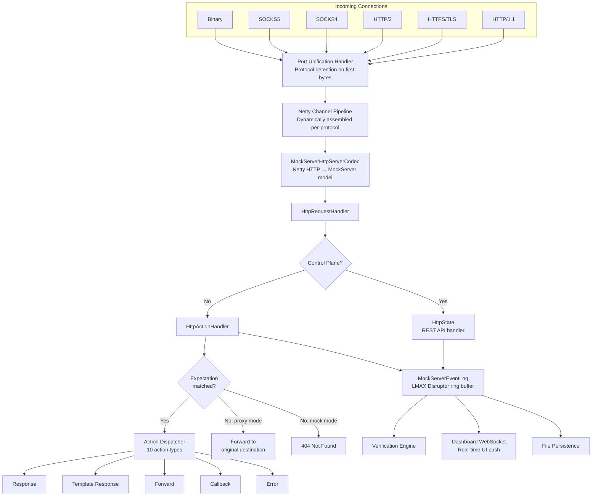
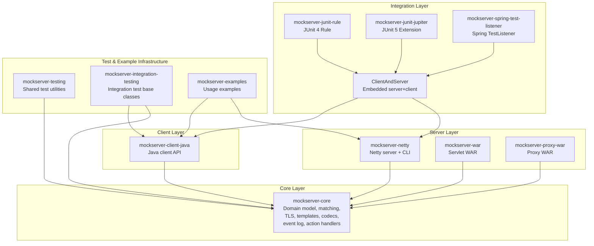

# Code Architecture Overview

## High-Level Architecture

MockServer is a multi-module Maven project providing an HTTP(S) mock server and proxy. Every incoming connection -- regardless of protocol -- enters through a single Netty port and is dynamically routed by a port unification handler.

## Module Dependency Hierarchy

## Java Compatibility

MockServer targets **Java 11** as the minimum supported version. This is a deliberate decision to maximise compatibility — approximately 23% of Java projects still run on Java 11 ([New Relic State of the Java Ecosystem](https://newrelic.com/resources/report/2024-state-of-the-java-ecosystem)).

The Maven compiler source and target are set to `11` in the root `pom.xml`. All dependencies must be compatible with Java 11:

| Constraint | Maximum Version | Reason |
|-----------|----------------|--------|
| Spring Framework | 5.x | Spring 6 requires Java 17+ and Jakarta EE 9+ |
| Spring Boot | 2.x | Spring Boot 3 requires Spring 6 |
| Tomcat Embed | 9.x | Tomcat 10+ uses `jakarta` namespace |
| Jetty | 9.x | Jetty 10+ requires Java 11+ minimum, Jetty 12+ requires Jakarta |
| Servlet API | `javax.servlet` | `jakarta.servlet` requires Jakarta EE 9+ |

When evaluating dependency upgrade PRs (Snyk, Dependabot, or community), reject any that transitively require Java 17+ or migrate from `javax` to `jakarta` namespace.

## Key Architectural Principles

### 1. Port Unification (Single-Port Multi-Protocol)

All protocols are served on a single port. The `PortUnificationHandler` inspects the first bytes of each connection and dynamically assembles the correct Netty pipeline. This is **recursive** -- when TLS is detected, decryption handlers are added and the detector runs again on the decrypted bytes, enabling nested protocols (e.g., SOCKS5 wrapping TLS wrapping HTTP/2).

See: [Netty Pipeline & Protocol Handling](netty-pipeline.md)

### 2. Self-Loopback Relay Pattern

For HTTPS CONNECT and SOCKS tunneling, MockServer does **not** connect directly to the target server. Instead, `RelayConnectHandler` opens a new connection back to MockServer itself, sending a `PROXIED_SECURE_host:port` message. This allows MockServer to intercept, log, and mock even tunneled traffic.

See: [Netty Pipeline & Protocol Handling](netty-pipeline.md#relay-connect-pattern)

### 3. LMAX Disruptor Single-Writer Event Log

All event logging (request received, expectation matched, forwarded, etc.) flows through an LMAX Disruptor ring buffer. A single consumer thread processes all writes and reads, eliminating the need for locks on the event log. Verification and UI retrieval are serialized through the same ring buffer as `RUNNABLE` entries.

See: [Event System, Logging & Verification](event-system.md)

### 4. Observer Pattern for Real-Time Updates

Both the dashboard UI and file persistence are driven by observer interfaces (`MockServerLogListener`, `MockServerMatcherListener`). When expectations or log entries change, listeners are notified and push updates to WebSocket clients or write to disk.

See: [Dashboard UI](dashboard-ui.md)

### 5. Action Dispatch Pattern

Matched expectations produce one of 10 action types across two categories (response vs forward), each with a dedicated handler class. This pattern cleanly separates matching from action execution.

See: [Request Processing, Mocking & Proxying](request-processing.md)

## Package Map

| Package | Module | Purpose | Doc Reference |
|---------|--------|---------|---------------|
| `org.mockserver.cli` | netty | CLI entry point | [Netty Pipeline](netty-pipeline.md) |
| `org.mockserver.netty` | netty | Server bootstrap, request handler | [Netty Pipeline](netty-pipeline.md) |
| `org.mockserver.netty.unification` | netty | Port unification, protocol detection | [Netty Pipeline](netty-pipeline.md) |
| `org.mockserver.netty.proxy` | netty | CONNECT, SOCKS, binary proxying | [Netty Pipeline](netty-pipeline.md) |
| `org.mockserver.netty.responsewriter` | netty | Netty response writing | [Request Processing](request-processing.md) |
| `org.mockserver.lifecycle` | netty | Server lifecycle management | [Netty Pipeline](netty-pipeline.md) |
| `org.mockserver.dashboard` | netty | Dashboard UI handlers & serializers | [Dashboard UI](dashboard-ui.md) |
| `org.mockserver.integration` | netty | `ClientAndServer` combined class | [Client & Integrations](client-and-integrations.md) |
| `org.mockserver.mock` | core | Expectation management, HttpState | [Request Processing](request-processing.md) |
| `org.mockserver.mock.action.http` | core | Action handlers (10 types) | [Request Processing](request-processing.md) |
| `org.mockserver.matchers` | core | Request matching (15+ matcher types) | [Domain Model](domain-model.md) |
| `org.mockserver.model` | core | Domain objects (HttpRequest, etc.) | [Domain Model](domain-model.md) |
| `org.mockserver.serialization` | core | JSON/Java serialization | [Domain Model](domain-model.md) |
| `org.mockserver.codec` | core | Netty ↔ MockServer codecs | [Domain Model](domain-model.md) |
| `org.mockserver.socket.tls` | core | TLS certificate generation | [TLS & Security](tls-and-security.md) |
| `org.mockserver.templates` | core | Velocity/Mustache/JS templates | [Request Processing](request-processing.md) |
| `org.mockserver.log` | core | LMAX Disruptor event log | [Event System](event-system.md) |
| `org.mockserver.verify` | core | Verification engine | [Event System](event-system.md) |
| `org.mockserver.configuration` | core | Configuration properties | [Domain Model](domain-model.md) |
| `org.mockserver.openapi` | core | OpenAPI spec parsing | [Domain Model](domain-model.md) |
| `org.mockserver.closurecallback` | core | WebSocket callback system | [Client & Integrations](client-and-integrations.md) |
| `org.mockserver.persistence` | core | File persistence & watching | [Event System](event-system.md) |
| `org.mockserver.metrics` | core | Prometheus metrics collection | [Metrics & Monitoring](metrics.md) |
| `org.mockserver.memory` | core | Memory usage monitoring/CSV export | [Metrics & Monitoring](metrics.md) |
| `org.mockserver.client` | client-java | MockServerClient API | [Client & Integrations](client-and-integrations.md) |
| `org.mockserver.junit` | junit-rule | JUnit 4 Rule | [Client & Integrations](client-and-integrations.md) |
| `org.mockserver.junit.jupiter` | junit-jupiter | JUnit 5 Extension | [Client & Integrations](client-and-integrations.md) |
| `org.mockserver.springtest` | spring-test-listener | Spring integration | [Client & Integrations](client-and-integrations.md) |

## Code Documentation Index

| Level | Document | Scope |
|-------|----------|-------|
| **High** | [This document](overview.md) | System-wide architecture, module map, design principles |
| **High** | [Netty Pipeline & Protocol Handling](netty-pipeline.md) | Server bootstrap, port unification, all protocol pipelines, proxy relay |
| **Medium** | [Request Processing, Mocking & Proxying](request-processing.md) | HttpState, expectation matching, action dispatch, proxy forwarding |
| **Medium** | [Event System, Logging & Verification](event-system.md) | LMAX Disruptor, event log, verification, persistence |
| **Medium** | [Dashboard UI](dashboard-ui.md) | WebSocket handler, React SPA, real-time data push |
| **Low** | [Domain Model, Matchers & Serialization](domain-model.md) | Model classes, matcher hierarchy, codec layer, OpenAPI, configuration |
| **Low** | [TLS, Certificates & Security](tls-and-security.md) | BouncyCastle CA, SNI, mTLS, JWT, control plane auth |
| **Low** | [Client API & Test Integrations](client-and-integrations.md) | MockServerClient, JUnit 4/5, Spring, WebSocket callbacks |
| **Low** | [Metrics & Monitoring](metrics.md) | Prometheus metrics, memory monitoring |
