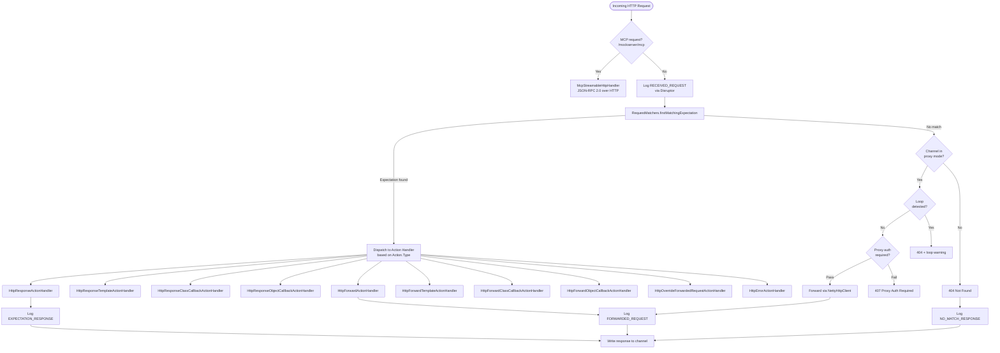
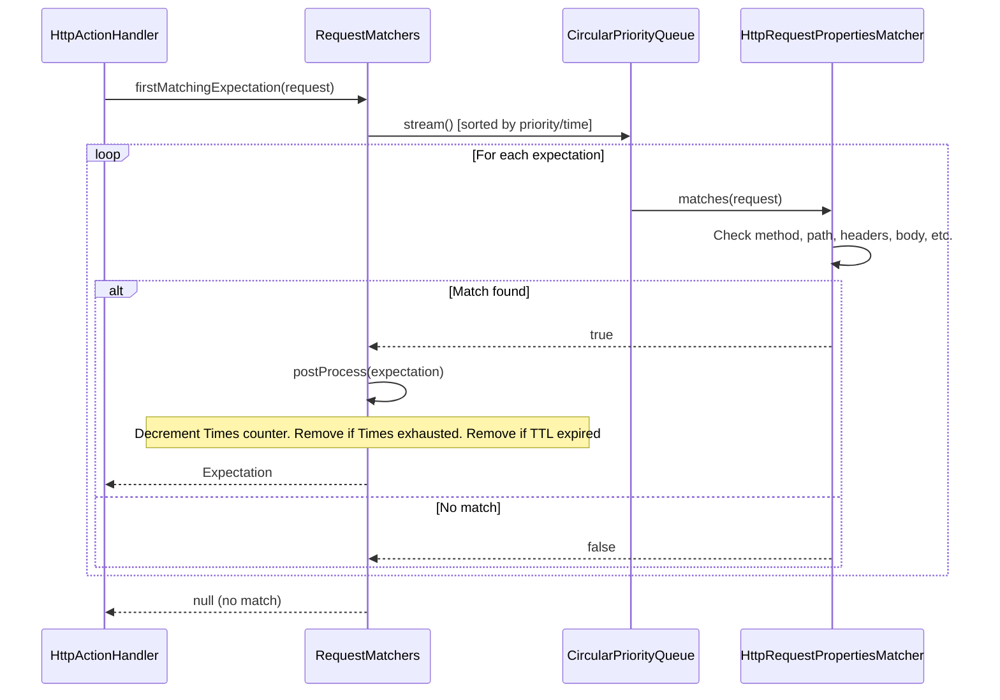
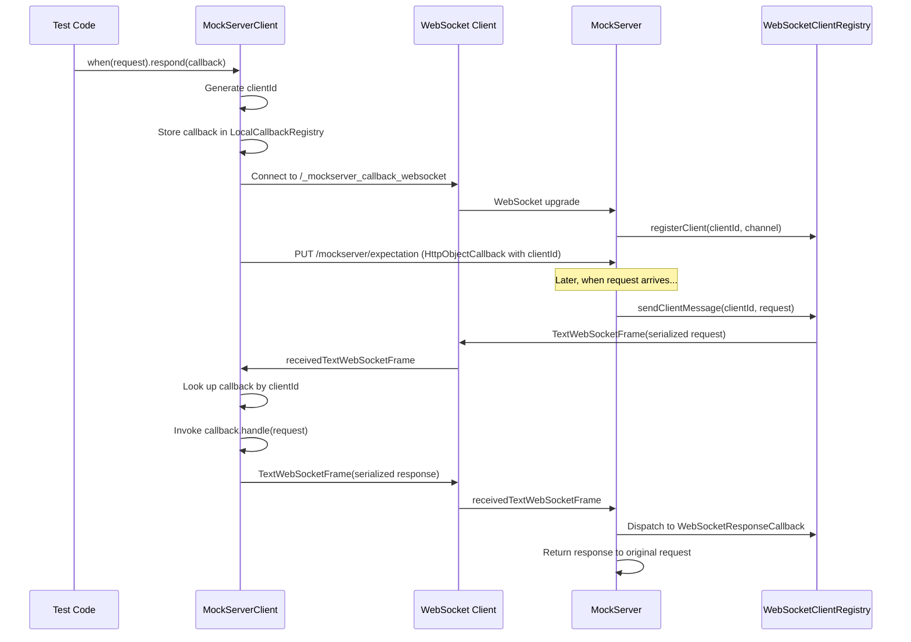
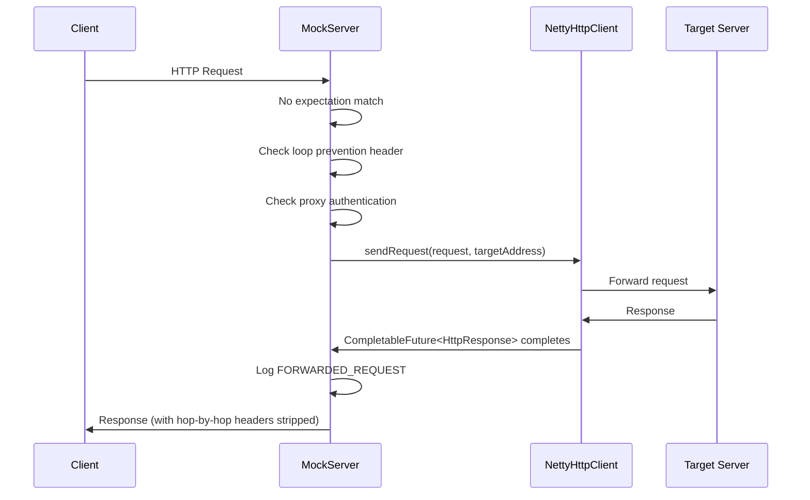
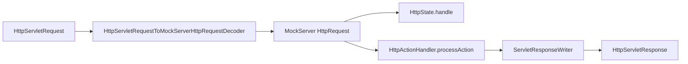

# Request Processing, Mocking & Proxying

## How Mocking and Proxying Work Together

MockServer operates in two modes simultaneously on every request:

1. **Mock mode**: Matches incoming requests against registered expectations and returns configured responses
2. **Proxy mode**: Forwards unmatched requests to their original destination (when the channel has `PROXYING=true`)

The decision is made per-request in `HttpActionHandler.processAction()`:

## HttpState -- The Control Plane Brain

`HttpState` (`mockserver-core/.../mock/HttpState.java`) is the central orchestrator. It owns:

- `RequestMatchers` -- active expectation collection
- `MockServerEventLog` -- event log (Disruptor-backed)
- `WebSocketClientRegistry` -- callback WebSocket clients
- `Scheduler` -- async task execution
- All serializers for JSON parsing

### Control Plane REST API

`HttpState.handle()` processes PUT requests to control-plane endpoints and returns `true` if handled:

| Endpoint | Action |
|----------|--------|
| `PUT /mockserver/expectation` | Deserialize + add/update expectations |
| `PUT /mockserver/openapi` | Convert OpenAPI spec to expectations |
| `PUT /mockserver/clear` | Clear expectations and/or logs by request matcher |
| `PUT /mockserver/reset` | Reset all state (expectations, logs, WebSocket registry) |
| `PUT /mockserver/retrieve` | Retrieve requests, responses, logs, or active expectations |
| `PUT /mockserver/verify` | Verify request count against `VerificationTimes` |
| `PUT /mockserver/verifySequence` | Verify ordered sequence of requests |
| `PUT /mockserver/grpc/descriptors` | Upload a compiled proto descriptor set (binary body) |
| `PUT /mockserver/grpc/services` | List all loaded gRPC services and their methods |
| `PUT /mockserver/grpc/clear` | Clear all loaded gRPC descriptors and reset the store |

All control-plane requests go through `controlPlaneRequestAuthenticated()` which enforces mTLS and/or JWT authentication if configured.

### Retrieve, Clear & Format Enums

The retrieve and clear endpoints accept type parameters:

**`RetrieveType`** (query parameter `?type=`):

| Value | Description |
|-------|-------------|
| `REQUESTS` | Received requests matching the filter |
| `REQUEST_RESPONSES` | Request/response pairs |
| `RECORDED_EXPECTATIONS` | Expectations recorded from proxy forwarding |
| `ACTIVE_EXPECTATIONS` | Currently active expectations |
| `LOGS` | Log messages |

**`Format`** (query parameter `?format=`):

| Value | Description |
|-------|-------------|
| `JSON` | Standard JSON serialization |
| `JAVA` | Generated Java client API code (via `ExpectationToJavaSerializer`) |
| `LOG_ENTRIES` | Raw log entry format |

**`ClearType`** (query parameter `?type=`):

| Value | Description |
|-------|-------------|
| `EXPECTATIONS` | Clear expectations only |
| `LOG` | Clear logs only |
| `ALL` | Clear both expectations and logs (default) |

Clear also supports clearing by `ExpectationId` (not just `RequestDefinition`).

### Pre-HttpRequestHandler Routes

Before a request reaches `HttpRequestHandler`, the Netty pipeline may intercept it at an earlier stage:

| Route | Handler | Description |
|-------|---------|-------------|
| `/mockserver/mcp` | `McpStreamableHttpHandler` | MCP (Model Context Protocol) server endpoint (Streamable HTTP transport with JSON-RPC 2.0). Intercepted in the pipeline before `MockServerHttpServerCodec`. Only active when `mcpEnabled=true`. |
| `/_mockserver_callback_websocket` | `CallbackWebSocketServerHandler` | WebSocket upgrade for object/closure callbacks |

### Non-Control-Plane Routes (in HttpRequestHandler)

| Route | Method | Handler |
|-------|--------|---------|
| `/mockserver/status` | PUT | Returns port binding JSON |
| Liveness path | GET | Returns port binding JSON |
| `/mockserver/bind` | PUT | Dynamically bind additional ports |
| `/mockserver/stop` | PUT | Graceful shutdown |
| `/mockserver/dashboard` | GET | `DashboardHandler.renderDashboard()` |
| `/mockserver/metrics` | GET | `MetricsHandler` (Prometheus) |
| CONNECT method | - | HTTP CONNECT tunnel setup |
| Everything else | - | `HttpActionHandler.processAction()` |

## Expectation Matching

### RequestMatchers

Expectations are stored in a `CircularPriorityQueue` sorted by priority (highest first), then creation time (earliest first). The `firstMatchingExpectation()` method iterates in sort order and returns the first match.

When no expectation matches, the method logs a **closest match summary** identifying the expectation with the fewest field differences, along with a match score (e.g., "matched 8/12 fields"). This helps users quickly identify which expectation was closest to matching.

A `MatchDifference` context is always created for each comparison (regardless of log level), so detailed field-level difference information is always available in the `EXPECTATION_NOT_MATCHED` log entries. The `MatchFailureHints` utility adds actionable suggestions for common mistakes (trailing slashes, Content-Type charset mismatches, unescaped regex metacharacters).

### Debug Mismatch Endpoint

The `PUT /mockserver/debugMismatch` endpoint (implemented in `HttpState.debugMismatch()`) provides programmatic access to match analysis. It accepts a `RequestDefinition` body and returns structured JSON showing per-expectation, per-field match results with the closest match highlighted. The MCP `debug_request_mismatch` tool delegates to this same implementation. The Java client exposes this via `MockServerClient.debugMismatch(RequestDefinition)`.

### Correlation ID Retrieval

All log entries for a single incoming HTTP request share the same `correlationId` (a UUID assigned in `HttpState.handle()`). The `PUT /mockserver/retrieve?type=LOGS&correlationId=<id>` endpoint retrieves all log entries for a specific correlation ID, enabling request-to-match-attempts correlation. The Java client exposes this via `MockServerClient.retrieveLogsByCorrelationId(String)`, and the MCP `raw_retrieve` tool supports a `correlationId` parameter.

### Typed Log Entry Retrieval

The `LOGS` retrieve type now supports `format=LOG_ENTRIES` to return structured `LogEntry[]` JSON instead of plain text. This enables typed programmatic access to log entries in the Java client:

- `MockServerClient.retrieveLogEntries(RequestDefinition)` — returns `LogEntry[]` matching a request pattern
- `MockServerClient.retrieveLogEntriesByCorrelationId(String)` — returns `LogEntry[]` for a specific correlation ID
- `MockServerClient.retrieveLogEntries(RequestDefinition, long, long)` — time-filtered variant using epoch milliseconds

Deserialization is handled by `LogEntrySerializer.deserializeArray()` using Jackson's `ObjectMapper.readValue()` directly against the `LogEntry` class. Fields that survive the round-trip: `logLevel`, `epochTime`, `timestamp`, `type`, `correlationId`, `port`, `expectationId`, `messageFormat`, `arguments`, `because`. Fields serialized by the custom `LogEntrySerializer` but NOT deserialized (returned as `null`): `httpRequest`, `httpResponse`, `httpError`, `expectation`, `throwable` — their setters are `@JsonIgnore` because the types (`RequestDefinition`, `Expectation`) lack default constructors needed for Jackson deserialization.

### Post-Processing

After a match, `postProcess()`:
1. Decrements the `Times` counter
2. Checks if `Times` is exhausted → removes expectation
3. Checks if `TimeToLive` has expired → removes expectation
4. Notifies `MockServerMatcherListener`s of the change

## Action Types

Each `Expectation` binds a request matcher to exactly one action. There are 11 action types across two categories:

### Response Actions

| Type | Handler | Description |
|------|---------|-------------|
| `RESPONSE` | `HttpResponseActionHandler` | Returns a static `HttpResponse` |
| `RESPONSE_TEMPLATE` | `HttpResponseTemplateActionHandler` | Evaluates a template (Velocity/Mustache/JavaScript) to generate the response |
| `RESPONSE_CLASS_CALLBACK` | `HttpResponseClassCallbackActionHandler` | Loads a Java class implementing `ExpectationResponseCallback`, invokes `handle(request)` |
| `RESPONSE_OBJECT_CALLBACK` | `HttpResponseObjectCallbackActionHandler` | Sends request to a WebSocket-connected client, awaits response callback |
| `GRPC_STREAM_RESPONSE` | `GrpcStreamResponseActionHandler` | Streams gRPC-framed protobuf messages with per-message delays and grpc-status trailers (Netty only; returns 501 in WAR) |

### Forward Actions

| Type | Handler | Description |
|------|---------|-------------|
| `FORWARD` | `HttpForwardActionHandler` | Forwards to a specified host:port:scheme |
| `FORWARD_TEMPLATE` | `HttpForwardTemplateActionHandler` | Template generates the forwarding request |
| `FORWARD_CLASS_CALLBACK` | `HttpForwardClassCallbackActionHandler` | Java class modifies the request before forwarding |
| `FORWARD_OBJECT_CALLBACK` | `HttpForwardObjectCallbackActionHandler` | WebSocket client modifies request before forwarding |
| `FORWARD_REPLACE` | `HttpOverrideForwardedRequestActionHandler` | Applies request/response overrides and modifiers |

### Host Header Auto-Adjustment

When forwarding requests via `FORWARD_REPLACE` or `FORWARD_TEMPLATE` actions, MockServer can automatically adjust the `Host` header to match the target server. This is controlled by the `forwardAdjustHostHeader` configuration property (default: `true`).

This prevents HTTP 421 "Misdirected Request" errors that occur when the target server validates the Host header against its own server name. The adjustment uses the `socketAddress` on the request to compute the correct Host value. If an explicit Host header is provided in the request override, it is always preserved.

The `FORWARD` action type (`HttpForwardActionHandler`) has always adjusted the Host header to match the forward target; this behaviour is unchanged.

### Error Action

| Type | Handler | Description |
|------|---------|-------------|
| `ERROR` | `HttpErrorActionHandler` | Writes raw bytes and/or drops the connection |

### Template Engines

Three template engines are supported for `RESPONSE_TEMPLATE` and `FORWARD_TEMPLATE`:

| Engine | Class | Template Variable |
|--------|-------|-------------------|
| Velocity | `VelocityTemplateEngine` | `$request` |
| Mustache | `MustacheTemplateEngine` | `request` (with `#jsonPath` and `#xPath` lambdas) |
| JavaScript | `JavaScriptTemplateEngine` | `request` (Nashorn, Java 11+ only) |

All engines receive built-in dynamic variables from `TemplateFunctions.BUILT_IN_FUNCTIONS` (`now`, `now_epoch`, `now_iso_8601`, `uuid`, `rand_int`, `rand_bytes`, etc.) and helper objects from `TemplateFunctions.BUILT_IN_HELPERS`:

| Helper | Variable | Description |
|--------|----------|-------------|
| `JwtTemplateHelper` | `jwt` | Generate signed JWTs (`jwt.generate()`, `jwt.generate(claims)`) and JWKS (`jwt.jwks()`) for OAuth2/OIDC testing |
| `StringTemplateHelper` | `strings` | String manipulation: `trim`, `capitalize`, `uppercase`, `lowercase`, `urlEncode`, `urlDecode`, `base64Encode`, `base64Decode`, `substringBefore`, `substringAfter`, `length`, `contains`, `replace` |
| `JsonTemplateHelper` | `json` | JSON manipulation: `merge`, `sort`, `arrayAdd`, `remove`, `prettyPrint`, `field`, `size` |
| `DateTemplateHelper` | `dates` | Date/time arithmetic: `format(pattern)`, `plusSeconds/Minutes/Hours/Days`, `minusSeconds/Minutes/Hours/Days`, `epochSeconds`, `epochMillis`, `epochSecondsPlus/Minus` |
| `MathTemplateHelper` | `math` | Math operations: `randomInt(min,max)`, `randomDouble()`, `abs`, `min`, `max`, `round(value,scale)`, `format(value,pattern)`, `ceil`, `floor` |

Helper objects are registered as template context variables, so methods are called directly (e.g., Velocity: `$strings.uppercase($!request.method)`, JavaScript: `dates.plusHours(1)`, Mustache: `{{ jwt }}`).

## WebSocket Object Callbacks

For `RESPONSE_OBJECT_CALLBACK` and `FORWARD_OBJECT_CALLBACK`, the callback runs on the client side:

## Global Response Delay

The `globalResponseDelayMillis` configuration property adds a fixed delay to all matched expectation responses. The delay is **additive** — it combines with any per-action delay. Implementation:

- `HttpActionHandler.combineWithGlobalDelay(Delay actionDelay)` returns a `Delay[]` passed as varargs to `Scheduler.schedule()`
- `Scheduler.sampleCombinedDelayMillis()` sums all delay samples
- Only applies to the primary response path (not after-actions or secondary actions)
- Only applies when an expectation matches (unmatched/proxied requests are not delayed)

## Proxy Forwarding

When no expectation matches and the channel is in proxy mode, `HttpActionHandler` forwards via `NettyHttpClient`:

### ProxyPass (Reverse Proxy)

The `proxyPass` configuration property allows MockServer to act as a reverse proxy, mapping incoming path prefixes to upstream servers with automatic path rewriting. This is evaluated in `HttpActionHandler.handleProxyPass()` after expectation matching and CORS, but before the speculative proxy attempt.

Each mapping specifies a `pathPrefix` (e.g. `/api/`), a `targetUri` (e.g. `https://backend:8443/services/`), and an optional `preserveHost` flag. When a request path starts with the prefix, the path is rewritten (prefix stripped, target path prepended) and forwarded to the target host:port. The Host header is adjusted to match the target unless `preserveHost` is true.

### Non-Proxy Hosts

The `noProxyHosts` configuration property (comma-separated list) controls which hosts MockServer will not proxy to. When a request's Host header matches a pattern in this list, MockServer returns a 404 instead of forwarding. This applies both to MockServer's speculative "attempt to proxy if no matching expectation" behaviour and to upstream proxy bypass in `NettyHttpClient`.

Patterns support exact hostnames (`example.com`), wildcard prefixes (`*.internal.corp`), and IP addresses (`192.168.1.1`). Matching is case-insensitive. The shared utility `NoProxyHostsUtils.isHostOnNoProxyList()` is used by both `HttpActionHandler` and `NettyHttpClient`.

### Loop Prevention

To prevent infinite forwarding loops (where MockServer forwards to itself), an `x-forwarded-by` header with a unique per-instance value (`MockServer_<UUID>`) is added to forwarded requests. If an incoming request already has this header with the matching value, it is identified as a loop and returned with a 404.

### Proxy Authentication

HTTP proxy requests can require Basic authentication. The `HttpRequestHandler` checks the `Proxy-Authorization` header against configured credentials. On failure, it returns 407 with a `Proxy-Authenticate: Basic` header.

## WAR Deployment (Servlet Mode)

`MockServerServlet` and `ProxyServlet` bridge the Servlet API to the same core processing:

The only difference between the two servlets is a single boolean flag: `ProxyServlet` passes `proxyRequest=true` to `processAction()`, enabling forwarding of unmatched requests.

**WAR limitations**: WebSocket callbacks, dynamic port binding, and server stop are not supported.

## Startup Initialisation

`HttpState` performs several initialisation steps in its constructor:

| Step | Condition | Class |
|------|-----------|-------|
| File persistence | `configuration.persistExpectations()` | `ExpectationFileSystemPersistence` |
| Expectation loading | `initializationJsonPath`, `initializationOpenAPIPath`, or `initializationClass` set | `ExpectationInitializerLoader` |
| JSON file watching | `watchInitializationJson` enabled | `ExpectationFileWatcher` |
| Memory monitoring | `outputMemoryUsageCsv` enabled | `MemoryMonitoring` |

### Loop Prevention Header

MockServer adds an `x-forwarded-by` header to forwarded requests to prevent infinite loops. The header name is fixed (`x-forwarded-by`); the value is generated per server instance using the pattern `MockServer_<UUID>`. If an incoming request already contains this header with the matching value, it is identified as a loop and returned with a 404.
