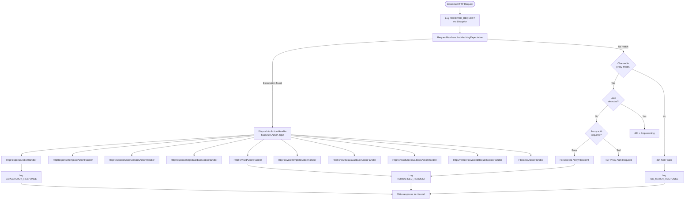
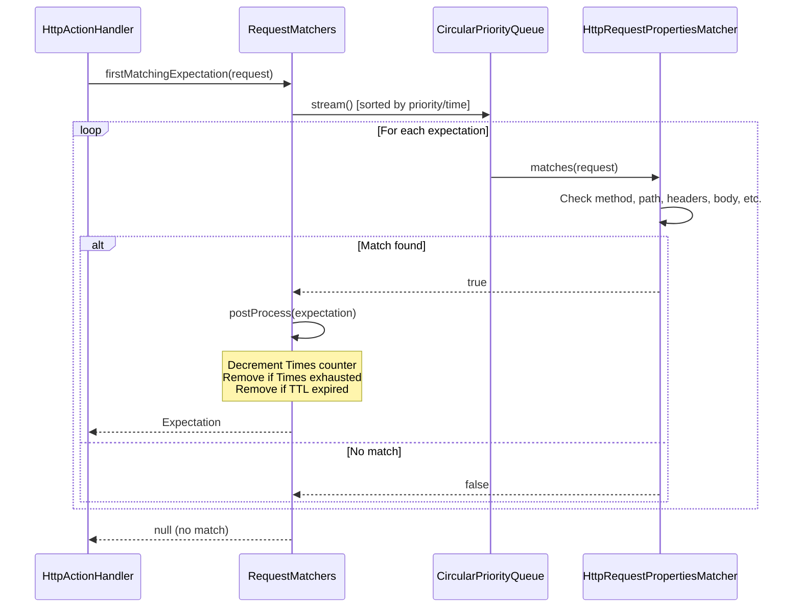
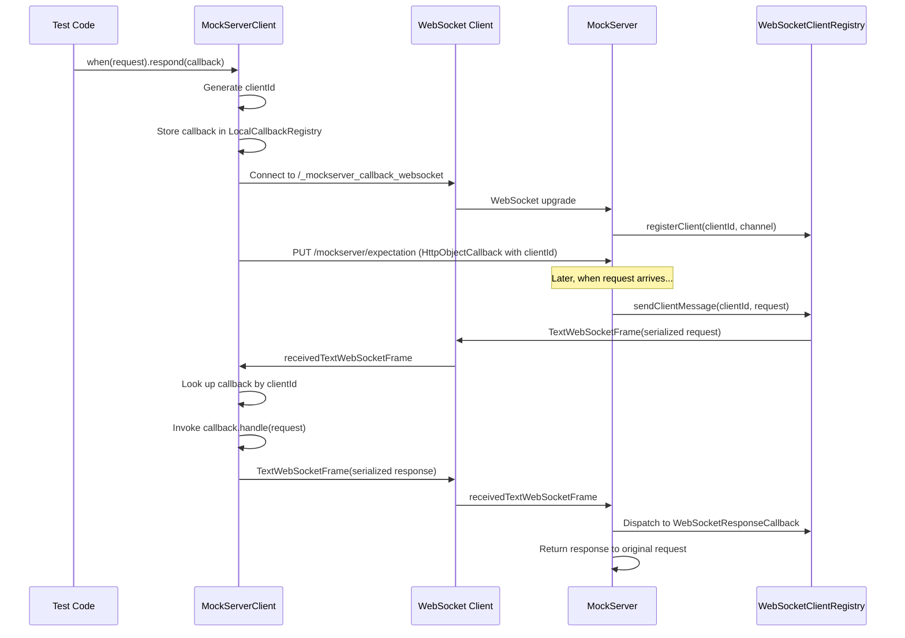
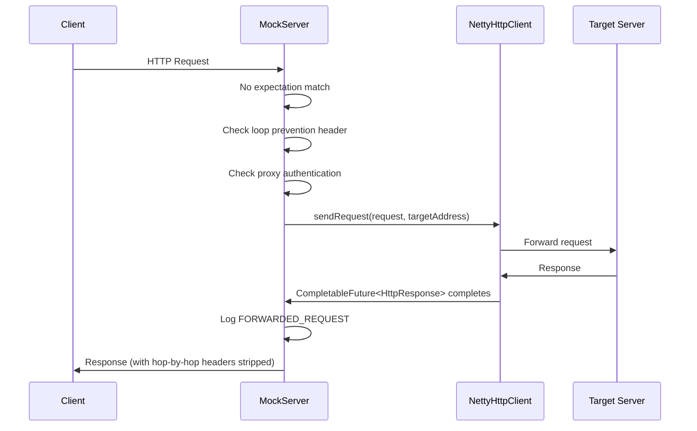
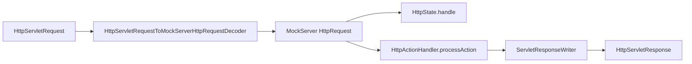

# Request Processing, Mocking & Proxying

## How Mocking and Proxying Work Together

MockServer operates in two modes simultaneously on every request:

1. **Mock mode**: Matches incoming requests against registered expectations and returns configured responses
2. **Proxy mode**: Forwards unmatched requests to their original destination (when the channel has `PROXYING=true`)

The decision is made per-request in `HttpActionHandler.processAction()`:

## HttpState -- The Control Plane Brain

`HttpState` (`mockserver-core/.../mock/HttpState.java`) is the central orchestrator. It owns:

- `RequestMatchers` -- active expectation collection
- `MockServerEventLog` -- event log (Disruptor-backed)
- `WebSocketClientRegistry` -- callback WebSocket clients
- `Scheduler` -- async task execution
- All serializers for JSON parsing

### Control Plane REST API

`HttpState.handle()` processes PUT requests to control-plane endpoints and returns `true` if handled:

| Endpoint | Action |
|----------|--------|
| `PUT /mockserver/expectation` | Deserialize + add/update expectations |
| `PUT /mockserver/openapi` | Convert OpenAPI spec to expectations |
| `PUT /mockserver/clear` | Clear expectations and/or logs by request matcher |
| `PUT /mockserver/reset` | Reset all state (expectations, logs, WebSocket registry) |
| `PUT /mockserver/retrieve` | Retrieve requests, responses, logs, or active expectations |
| `PUT /mockserver/verify` | Verify request count against `VerificationTimes` |
| `PUT /mockserver/verifySequence` | Verify ordered sequence of requests |

All control-plane requests go through `controlPlaneRequestAuthenticated()` which enforces mTLS and/or JWT authentication if configured.

### Retrieve, Clear & Format Enums

The retrieve and clear endpoints accept type parameters:

**`RetrieveType`** (query parameter `?type=`):

| Value | Description |
|-------|-------------|
| `REQUESTS` | Received requests matching the filter |
| `REQUEST_RESPONSES` | Request/response pairs |
| `RECORDED_EXPECTATIONS` | Expectations recorded from proxy forwarding |
| `ACTIVE_EXPECTATIONS` | Currently active expectations |
| `LOGS` | Log messages |

**`Format`** (query parameter `?format=`):

| Value | Description |
|-------|-------------|
| `JSON` | Standard JSON serialization |
| `JAVA` | Generated Java client API code (via `ExpectationToJavaSerializer`) |
| `LOG_ENTRIES` | Raw log entry format |

**`ClearType`** (query parameter `?type=`):

| Value | Description |
|-------|-------------|
| `EXPECTATIONS` | Clear expectations only |
| `LOG` | Clear logs only |
| `ALL` | Clear both expectations and logs (default) |

Clear also supports clearing by `ExpectationId` (not just `RequestDefinition`).

### Non-Control-Plane Routes (in HttpRequestHandler)

| Route | Method | Handler |
|-------|--------|---------|
| `/mockserver/status` | PUT | Returns port binding JSON |
| Liveness path | GET | Returns port binding JSON |
| `/mockserver/bind` | PUT | Dynamically bind additional ports |
| `/mockserver/stop` | PUT | Graceful shutdown |
| `/mockserver/dashboard` | GET | `DashboardHandler.renderDashboard()` |
| `/mockserver/metrics` | GET | `MetricsHandler` (Prometheus) |
| CONNECT method | - | HTTP CONNECT tunnel setup |
| Everything else | - | `HttpActionHandler.processAction()` |

## Expectation Matching

### RequestMatchers

Expectations are stored in a `CircularPriorityQueue` sorted by priority (highest first), then creation time (earliest first). The `firstMatchingExpectation()` method iterates in sort order and returns the first match.

### Post-Processing

After a match, `postProcess()`:
1. Decrements the `Times` counter
2. Checks if `Times` is exhausted → removes expectation
3. Checks if `TimeToLive` has expired → removes expectation
4. Notifies `MockServerMatcherListener`s of the change

## Action Types

Each `Expectation` binds a request matcher to exactly one action. There are 10 action types across two categories:

### Response Actions

| Type | Handler | Description |
|------|---------|-------------|
| `RESPONSE` | `HttpResponseActionHandler` | Returns a static `HttpResponse` |
| `RESPONSE_TEMPLATE` | `HttpResponseTemplateActionHandler` | Evaluates a template (Velocity/Mustache/JavaScript) to generate the response |
| `RESPONSE_CLASS_CALLBACK` | `HttpResponseClassCallbackActionHandler` | Loads a Java class implementing `ExpectationResponseCallback`, invokes `handle(request)` |
| `RESPONSE_OBJECT_CALLBACK` | `HttpResponseObjectCallbackActionHandler` | Sends request to a WebSocket-connected client, awaits response callback |

### Forward Actions

| Type | Handler | Description |
|------|---------|-------------|
| `FORWARD` | `HttpForwardActionHandler` | Forwards to a specified host:port:scheme |
| `FORWARD_TEMPLATE` | `HttpForwardTemplateActionHandler` | Template generates the forwarding request |
| `FORWARD_CLASS_CALLBACK` | `HttpForwardClassCallbackActionHandler` | Java class modifies the request before forwarding |
| `FORWARD_OBJECT_CALLBACK` | `HttpForwardObjectCallbackActionHandler` | WebSocket client modifies request before forwarding |
| `FORWARD_REPLACE` | `HttpOverrideForwardedRequestActionHandler` | Applies request/response overrides and modifiers |

### Error Action

| Type | Handler | Description |
|------|---------|-------------|
| `ERROR` | `HttpErrorActionHandler` | Writes raw bytes and/or drops the connection |

### Template Engines

Three template engines are supported for `RESPONSE_TEMPLATE` and `FORWARD_TEMPLATE`:

| Engine | Class | Template Variable |
|--------|-------|-------------------|
| Velocity | `VelocityTemplateEngine` | `$request` |
| Mustache | `MustacheTemplateEngine` | `request` (with `#jsonPath` and `#xPath` lambdas) |
| JavaScript | `JavaScriptTemplateEngine` | `request` (Nashorn, Java 11+ only) |

All engines receive a `TemplateFunctions` object providing built-in functions: `now`, `now_epoch`, `now_iso_8601`, `uuid`, `rand_int`, `rand_bytes`, etc.

## WebSocket Object Callbacks

For `RESPONSE_OBJECT_CALLBACK` and `FORWARD_OBJECT_CALLBACK`, the callback runs on the client side:

## Proxy Forwarding

When no expectation matches and the channel is in proxy mode, `HttpActionHandler` forwards via `NettyHttpClient`:

### Loop Prevention

To prevent infinite forwarding loops (where MockServer forwards to itself), an `x-forwarded-by` header with a unique per-instance value (`MockServer_<UUID>`) is added to forwarded requests. If an incoming request already has this header with the matching value, it is identified as a loop and returned with a 404.

### Proxy Authentication

HTTP proxy requests can require Basic authentication. The `HttpRequestHandler` checks the `Proxy-Authorization` header against configured credentials. On failure, it returns 407 with a `Proxy-Authenticate: Basic` header.

## WAR Deployment (Servlet Mode)

`MockServerServlet` and `ProxyServlet` bridge the Servlet API to the same core processing:

The only difference between the two servlets is a single boolean flag: `ProxyServlet` passes `proxyRequest=true` to `processAction()`, enabling forwarding of unmatched requests.

**WAR limitations**: WebSocket callbacks, dynamic port binding, and server stop are not supported.

## Startup Initialisation

`HttpState` performs several initialisation steps in its constructor:

| Step | Condition | Class |
|------|-----------|-------|
| File persistence | `configuration.persistExpectations()` | `ExpectationFileSystemPersistence` |
| Expectation loading | `initializationJsonPath` or `initializationClass` set | `ExpectationInitializerLoader` |
| JSON file watching | `watchInitializationJson` enabled | `ExpectationFileWatcher` |
| Memory monitoring | `outputMemoryUsageCsv` enabled | `MemoryMonitoring` |

### Loop Prevention Header

MockServer adds an `x-forwarded-by` header to forwarded requests to prevent infinite loops. The header name is fixed (`x-forwarded-by`); the value is generated per server instance using the pattern `MockServer_<UUID>`. If an incoming request already contains this header with the matching value, it is identified as a loop and returned with a 404.
