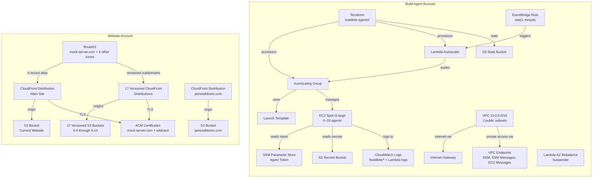
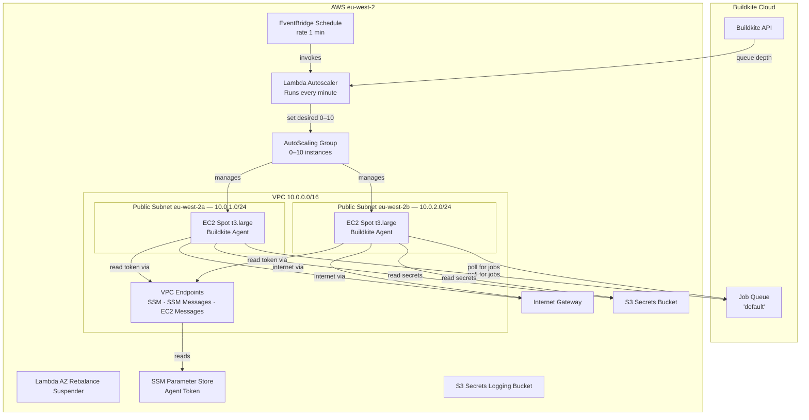
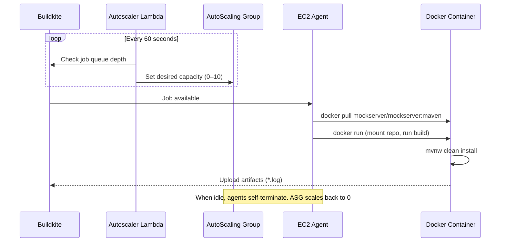
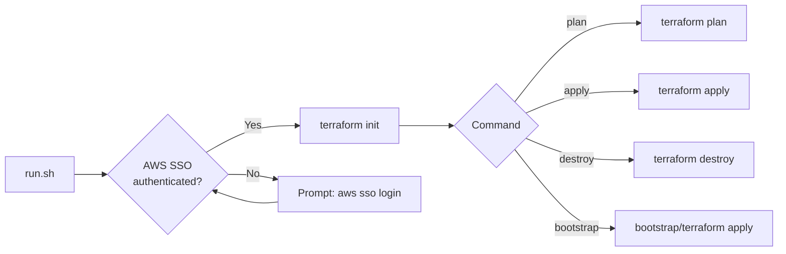
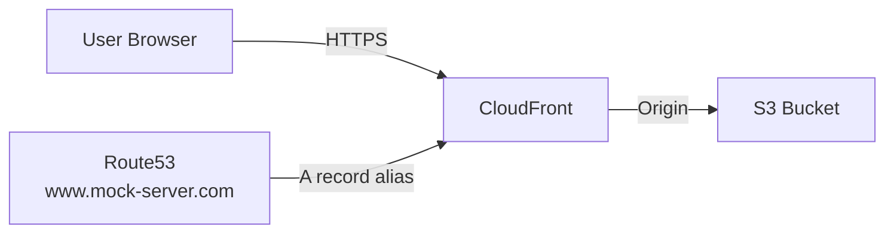

# AWS Infrastructure

## Overview

MockServer uses two AWS accounts for different purposes:



## Account Details

| Purpose | Region | AWS CLI Profile |
|---------|--------|-----------------|
| Pipeline build agents and infrastructure | `eu-west-2` | `mockserver-build` |
| Website (S3, CloudFront, DNS, TLS) | `us-east-1` | `mockserver-website` |

Specific account IDs, SSO portal URLs, and resource identifiers are stored in `~/mockserver-aws-ids.md` (not committed to the repo).

## Build Agent Account

All active resources are in `eu-west-2`, managed by Terraform in `terraform/buildkite-agents/`.

### Architecture



### Resource Inventory

#### Compute

| Resource | Details |
|----------|---------|
| AutoScaling Group | Min 0, Max 10, 100% Spot, `t3.large`, AZRebalance suspended |
| Launch Template | t3.large, 250 GiB gp3 root volume, delete-on-termination |
| EC2 Instances | 0–10 Spot instances (ephemeral), scale to zero when idle |

#### Networking

| Resource | Details |
|----------|---------|
| VPC | `10.0.0.0/16` |
| Subnets | `10.0.1.0/24` (eu-west-2a), `10.0.2.0/24` (eu-west-2b), both public |
| Internet Gateway | Attached to Buildkite VPC |
| Route Table | Public: local + default to IGW |
| Security Group (agents) | Agent traffic, no inbound rules |
| Security Group (VPC endpoints) | HTTPS (443) from VPC CIDR only |
| VPC Endpoints | SSM, SSM Messages, EC2 Messages (Interface type) |

#### Lambda

| Function | Runtime | Purpose |
|----------|---------|---------|
| Scaler | `provided.al2023` | Scales ASG based on Buildkite queue depth |
| AZ Rebalance Suspender | `python3.13` | Suspends AZRebalance on the ASG |

#### EventBridge

| Schedule | Target |
|----------|--------|
| `rate(1 minute)` | Scaler Lambda |

#### Storage

| Resource | Purpose |
|----------|---------|
| S3 Bucket (state) | Terraform state (versioned, encrypted, public access blocked) |
| S3 Bucket (secrets) | Buildkite managed secrets (versioned, encrypted, public access blocked) |
| S3 Bucket (secrets logs) | Secrets bucket access logs (versioned, encrypted, public access blocked) |
| S3 Bucket (CloudTrail) | CloudTrail audit logs (encrypted, 90-day lifecycle, public access blocked) |

#### Secrets

| Resource | Type | Purpose |
|----------|------|---------|
| SSM Parameter | SecureString | Buildkite agent registration token |
| Secrets Manager Secret (`mockserver-build/dockerhub`) | JSON | Docker Hub credentials for CI image push |
| Secrets Manager Secret (`mockserver-build/buildkite-api-token`) | String | Buildkite API token for Terraform pipeline management |

#### CloudWatch Log Groups (eu-west-2)

| Log Group | Retention | Purpose |
|-----------|-----------|---------|
| Scaler Lambda | 1 day | Scaler Lambda logs |
| AZ Rebalance Suspender Lambda | 30 days | AZ rebalance suspender logs |
| `/buildkite/auth` | 30 days | Agent auth logs |
| `/buildkite/buildkite-agent` | 30 days | Agent logs |
| `/buildkite/cloud-init` | 30 days | Instance bootstrap logs |
| `/buildkite/cloud-init/output` | 30 days | Instance bootstrap output |
| `/buildkite/docker-daemon` | 30 days | Docker daemon logs |
| `/buildkite/elastic-stack` | 30 days | Elastic stack logs |
| `/buildkite/lifecycled` | 30 days | Instance lifecycle logs |
| `/buildkite/system` | 30 days | System logs |

#### IAM

| Resource | Purpose |
|----------|---------|
| EC2 Instance Role | Buildkite agent permissions (SSM, S3 secrets, Secrets Manager, CloudWatch) |
| Scaler Lambda Role | ASG scaling + CloudWatch Logs |
| AZ Rebalance Suspender Role | ASG process management |
| Instance Profile | Attached to EC2 instances |
| IAM Policy (`buildkite-read-dockerhub-secret`) | Allows agents to read Docker Hub credentials from Secrets Manager |
| Service-linked roles | AutoScaling, EC2Spot, Organizations, SSO, Support, TrustedAdvisor, ResourceExplorer |

#### Security

| Control | Status |
|---------|--------|
| Account-level S3 public access block | Enabled (all 4 flags) |
| CloudTrail | `mockserver-management-trail` — multi-region, log file validation, 90-day retention |
| Root MFA | Enabled |
| IAM users | None (SSO-only access) |
| Password policy | Not set (no IAM users exist) |

### Scaling Behaviour

- **Minimum:** 0 instances (scales to zero when idle)
- **Maximum:** 10 instances
- **Agents per instance:** 1
- **Scaling frequency:** Every 60 seconds
- **Scale trigger:** Buildkite job queue depth
- **Instance type:** `t3.large` (100% Spot)
- **Idle cost:** $0 (scales to zero)
- **Build cost:** ~$0.02/hr per agent (spot pricing)

### Build Flow



## Infrastructure as Code (Terraform)

The Buildkite agent infrastructure is managed by Terraform in `terraform/buildkite-agents/`, using the official [Buildkite Elastic CI Stack for AWS](https://github.com/buildkite/terraform-buildkite-elastic-ci-stack-for-aws) module.

### Directory Structure

```
terraform/
└── buildkite-agents/
    ├── bootstrap/           # One-time state backend setup
    │   ├── main.tf          #   S3 bucket
    │   └── README.md        #   Bootstrap instructions
    ├── main.tf              # Elastic CI Stack module
    ├── backend.tf           # S3 remote state configuration
    ├── build-secrets.tf     # Docker Hub secret + Buildkite agent IAM policy
    ├── variables.tf         # Input variables
    ├── outputs.tf           # Outputs (ASG name, VPC ID)
    ├── versions.tf          # Terraform + provider versions
    ├── terraform.tfvars.example  # Example variable values
    ├── run.sh               # Wrapper script (auth + plan/apply)
    └── README.md
```

### Module Configuration

| Property | Value |
|----------|-------|
| Terraform module | `buildkite/elastic-ci-stack-for-aws/buildkite` ~0.7.x |
| Region | `eu-west-2` |
| Instance type | `t3.large` (Spot) |
| Scaling | 0–10 instances |
| State backend | S3 in `eu-west-2` (native lockfile) |

### State Backend

Remote state is stored in S3 with `use_lockfile = true` for S3-native file locking (`.tflock`).

The bootstrap (`terraform/buildkite-agents/bootstrap/`) uses `import` blocks, making it idempotent — safe to re-run against existing resources.

### Variables

| Variable | Type | Default | Description |
|----------|------|---------|-------------|
| `buildkite_agent_token` | `string` | *(required)* | Buildkite agent registration token |
| `region` | `string` | `eu-west-2` | AWS region |
| `instance_types` | `string` | `t3.large` | EC2 instance types (comma-separated) |
| `min_size` | `number` | `0` | Minimum instances (0 = scale to zero) |
| `max_size` | `number` | `10` | Maximum instances |
| `on_demand_percentage` | `number` | `0` | % on-demand vs spot (0 = all spot) |

### Quick Start

```bash
# Bootstrap state backend (first time only)
./terraform/buildkite-agents/run.sh bootstrap

# Preview changes
./terraform/buildkite-agents/run.sh plan

# Apply changes
./terraform/buildkite-agents/run.sh apply
```

The `run.sh` wrapper handles AWS SSO authentication and environment workarounds (corporate TLS proxy, macOS pyexpat).



## Website Account

### Architecture



### AWS Organization and SSO

The website account runs its own AWS Organization with a separate IAM Identity Center instance. This is independent from the build account's organization. Access is managed via SSO — no IAM users or long-lived credentials exist.

### S3 Buckets

19 S3 buckets — 1 for the current website, plus versioned archives for each MockServer major/minor release and a personal site. See `~/mockserver-aws-ids.md` for bucket names.

### CloudFront Distributions

19 distributions — one per S3 bucket, each mapped to a domain alias. The main site serves `mock-server.com`, with versioned subdomains (`4-0` through `5-14`) for archived documentation.

All distributions use Origin Access Control (OAC) to authenticate requests to S3. S3 buckets are not publicly accessible — only CloudFront can read objects.

Main distribution config: `PriceClass_All`, HTTP/2+3, TLSv1.2_2021 minimum, redirect HTTP→HTTPS, custom 403 error page.

### Route53 Hosted Zones

| Domain | Records | Purpose |
|--------|---------|---------|
| `mock-server.com` | 26 | Main site + all versioned subdomains |
| `mock-server.org` | 4 | Redirects to `mock-server.com` via CloudFront |
| `jamesdbloom.com` | 8 | Personal site |
| `bluesquashtechnology.com` | 6 | Other domain |
| `subdomain.bluesquashtechnology.com` | 4 | Subdomain delegation |

`mock-server.com` DNS records: apex → CloudFront (main), `www` → alias to apex, `org` → alias to apex, plus 15 versioned subdomain A records (`4-0` through `5-14`) each pointing to their respective CloudFront distribution. ACM validation CNAME records for certificate renewal.

### ACM Certificates (us-east-1)

| Domain | Expires | Renewal |
|--------|---------|---------|
| `mock-server.com` (+ `*.mock-server.com`, `org.`, `www.`) | 2026-09-17 | Eligible (auto-renew) |
| `*.mock-server.com` | 2026-09-29 | Eligible (auto-renew) |
| `blog.jamesdbloom.com` | — | Eligible |

### S3 Bucket Contents

| Path | Content |
|------|---------|
| `/` (root) | Jekyll website (`www.mock-server.com`) |
| `/versions/<version>/` | Javadoc for each release |
| `/*.tgz` + `index.yaml` | Helm chart repository |

### Website Deployment Process

1. Build Jekyll site: `bundle exec jekyll build`
2. Upload `_site/` contents to S3 bucket root
3. Invalidate CloudFront cache
4. See [Release Process](../operations/release-process.md) for full details

### Security

| Control | Status |
|---------|--------|
| Account-level S3 public access block | Enabled (all 4 flags) |
| Bucket-level S3 public access blocks | Enabled on all 19 buckets |
| CloudFront OAC | All 19 distributions use OAC — S3 not directly accessible |
| CloudTrail | `mockserver-website-trail` — multi-region, log file validation, 90-day retention |
| Root MFA | Enabled |
| IAM users | None (SSO-only access) |
| CloudFront TLS | TLSv1.2_2021 minimum, HTTP→HTTPS redirect |

### Monthly Cost

~$3.36/month: Route53 ($2.88 for 5 hosted zones), S3 ($0.31), CloudFront (<$0.01).

## Recommendations

No outstanding recommendations. All infrastructure is current.

## AWS CLI Operations

These commands target the Terraform-managed infrastructure in `eu-west-2`. The ASG name is dynamically generated by the Elastic CI Stack module, so look it up first:

```bash
aws sso login --profile mockserver-build

ASG_NAME=$(aws autoscaling describe-auto-scaling-groups \
  --profile mockserver-build --region eu-west-2 \
  --query 'AutoScalingGroups[?contains(Tags[?Key==`Name`].Value | [0], `buildkite`)].AutoScalingGroupName' \
  --output text)

aws autoscaling describe-auto-scaling-groups \
  --auto-scaling-group-names "$ASG_NAME" \
  --region eu-west-2 --profile mockserver-build \
  --query 'AutoScalingGroups[0].{Desired:DesiredCapacity,Instances:Instances[*].{ID:InstanceId,State:LifecycleState}}'

aws ec2 describe-instances \
  --filters "Name=tag:aws:autoscaling:groupName,Values=$ASG_NAME" \
  --region eu-west-2 --profile mockserver-build \
  --query 'Reservations[].Instances[].{ID:InstanceId,State:State.Name,Launch:LaunchTime}'

aws ec2 get-console-output --instance-id <instance-id> \
  --region eu-west-2 --profile mockserver-build

aws autoscaling set-desired-capacity \
  --auto-scaling-group-name "$ASG_NAME" \
  --desired-capacity 4 --region eu-west-2 --profile mockserver-build
```

## AWS CLI Prerequisites

1. **Install AWS CLI:** `brew install awscli`
2. **Configure SSO profiles:** see `~/mockserver-aws-ids.md` for SSO start URLs and regions
   - `aws configure sso --profile mockserver-build`
   - `aws configure sso --profile mockserver-website`
3. **Authenticate:**
   - `aws sso login --profile mockserver-build` (or shell alias `awsl-build`)
   - `aws sso login --profile mockserver-website` (or shell alias `awsl-web`)
4. **Corporate TLS proxy:** set `AWS_CA_BUNDLE` to your corporate root CA PEM file (e.g., `export AWS_CA_BUNDLE=$NODE_EXTRA_CA_CERTS`)
5. **macOS + Python 3.14 + Homebrew:** if `pyexpat` symbol errors occur, set `export DYLD_LIBRARY_PATH=/opt/homebrew/opt/expat/lib`
