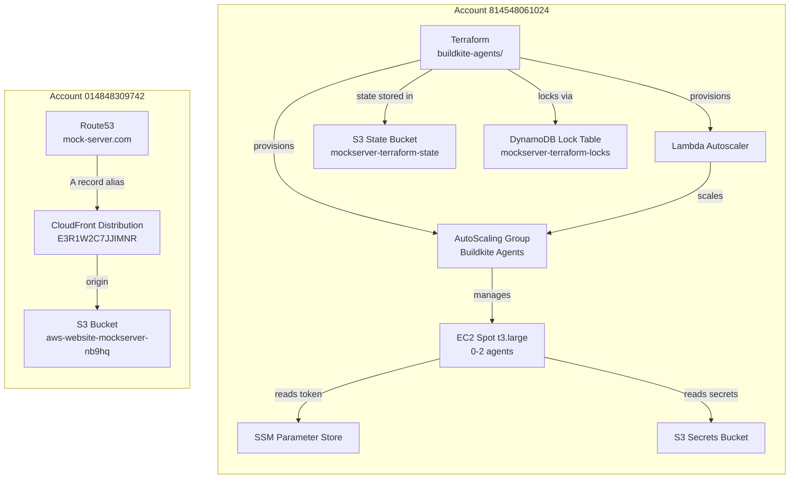
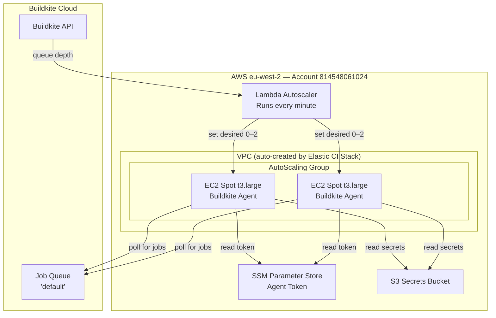
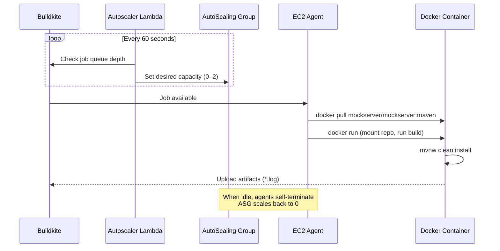
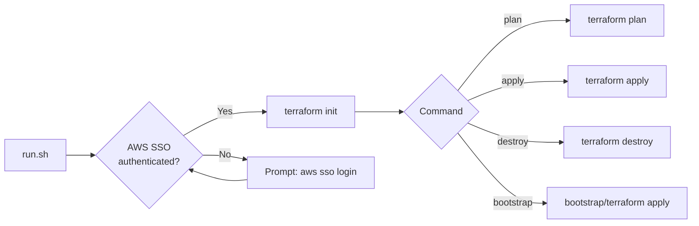
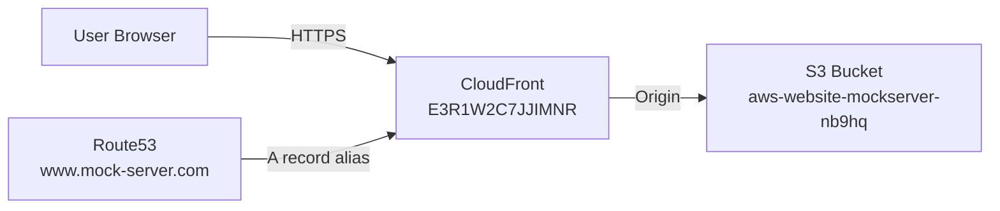

# AWS Infrastructure

## Overview

MockServer uses two AWS accounts for different purposes:



## Account Details

| Account ID | Purpose | Region |
|------------|---------|--------|
| `814548061024` | Pipeline build agents and infrastructure | `eu-west-2` (Terraform) / `us-east-1` (legacy CFn) |
| `014848309742` | Website (S3, CloudFront, DNS, TLS) | `us-east-1` |

## Buildkite Agent Infrastructure

### Architecture



### Scaling Behaviour

- **Minimum:** 0 instances (scales to zero when idle)
- **Maximum:** 2 instances
- **Agents per instance:** 1
- **Scaling frequency:** Every 60 seconds
- **Scale trigger:** Buildkite job queue depth
- **Instance type:** `t3.large` (100% Spot)
- **Idle cost:** $0 (scales to zero)
- **Build cost:** ~$0.02/hr per agent (spot pricing)

### Build Flow



## Infrastructure as Code (Terraform)

The Buildkite agent infrastructure is managed by Terraform in `terraform/buildkite-agents/`, using the official [Buildkite Elastic CI Stack for AWS](https://github.com/buildkite/terraform-buildkite-elastic-ci-stack-for-aws) module.

### Directory Structure

```
terraform/
└── buildkite-agents/
    ├── bootstrap/           # One-time state backend setup
    │   ├── main.tf          #   S3 bucket + DynamoDB table
    │   └── README.md        #   Bootstrap instructions
    ├── main.tf              # Elastic CI Stack module
    ├── backend.tf           # S3 remote state configuration
    ├── variables.tf         # Input variables
    ├── outputs.tf           # Outputs (ASG name, VPC ID)
    ├── versions.tf          # Terraform + provider versions
    ├── terraform.tfvars.example  # Example variable values
    ├── run.sh               # Wrapper script (auth + plan/apply)
    └── README.md
```

### Module Configuration

| Property | Value |
|----------|-------|
| Terraform module | `buildkite/elastic-ci-stack-for-aws/buildkite` ~0.7.x |
| Region | `eu-west-2` |
| Instance type | `t3.large` (Spot) |
| Scaling | 0–2 instances |
| State backend | S3 + DynamoDB in `eu-west-2` |

### State Backend

Remote state is stored in S3 with DynamoDB locking, bootstrapped by `terraform/buildkite-agents/bootstrap/`:

| Resource | Name | Region |
|----------|------|--------|
| S3 Bucket | `mockserver-terraform-state` | `eu-west-2` |
| DynamoDB Table | `mockserver-terraform-locks` | `eu-west-2` |

The bootstrap uses `import` blocks, making it idempotent — safe to re-run against existing resources.

### Variables

| Variable | Type | Default | Description |
|----------|------|---------|-------------|
| `buildkite_agent_token` | `string` | *(required)* | Buildkite agent registration token |
| `region` | `string` | `eu-west-2` | AWS region |
| `instance_types` | `string` | `t3.large` | EC2 instance types (comma-separated) |
| `min_size` | `number` | `0` | Minimum instances (0 = scale to zero) |
| `max_size` | `number` | `2` | Maximum instances |
| `on_demand_percentage` | `number` | `0` | % on-demand vs spot (0 = all spot) |

### Quick Start

```bash
# Bootstrap state backend (first time only)
./terraform/buildkite-agents/run.sh bootstrap

# Preview changes
./terraform/buildkite-agents/run.sh plan

# Apply changes
./terraform/buildkite-agents/run.sh apply
```

The `run.sh` wrapper handles AWS SSO authentication and environment workarounds (corporate TLS proxy, macOS pyexpat).



### Legacy CloudFormation

A legacy CloudFormation stack `buildkite` exists in `us-east-1` (account `814548061024`). Its template is not stored in this repository. The Terraform configuration in `eu-west-2` replaces this stack.

| Property | Legacy (CloudFormation) | Current (Terraform) |
|----------|------------------------|---------------------|
| Region | `us-east-1` | `eu-west-2` |
| Instance pricing | On-Demand | Spot (100%) |
| IaC stored in repo | No | Yes (`terraform/`) |
| State management | AWS-managed | S3 + DynamoDB |

## Website Hosting

### Architecture



### S3 Bucket Contents

The S3 bucket `aws-website-mockserver-nb9hq` hosts:

| Path | Content |
|------|---------|
| `/` (root) | Jekyll website (`www.mock-server.com`) |
| `/versions/<version>/` | Javadoc for each release |
| `/*.tgz` + `index.yaml` | Helm chart repository |

### CloudFront Distribution

- **Distribution ID:** `E3R1W2C7JJIMNR`
- **Domain:** `www.mock-server.com`
- **Cache invalidation:** Use `/*` pattern after website updates

```bash
# Invalidate CloudFront cache after website deployment
aws cloudfront create-invalidation \
  --distribution-id E3R1W2C7JJIMNR \
  --paths "/*" \
  --profile mockserver-website
```

### DNS

Route53 manages the `mock-server.com` domain:

- `www.mock-server.com` — A record aliased to CloudFront distribution `E3R1W2C7JJIMNR`
- Versioned subdomains (e.g., `5.14.x.mock-server.com`) may have separate CloudFront distributions and S3 buckets

### Website Deployment Process

1. Build Jekyll site: `bundle exec jekyll build`
2. Upload `_site/` contents to S3 bucket root
3. Invalidate CloudFront cache
4. See [Release Process](../operations/release-process.md) for full details

## AWS CLI Operations

```bash
# Authenticate via SSO
aws sso login --profile mockserver-build

# Check ASG status
aws autoscaling describe-auto-scaling-groups \
  --auto-scaling-group-names "buildkite-AgentAutoScaleGroup-VGG28FR0DE6Q" \
  --region us-east-1 --profile mockserver-build \
  --query 'AutoScalingGroups[0].{Desired:DesiredCapacity,Instances:Instances[*].{ID:InstanceId,State:LifecycleState}}'

# List running EC2 instances
aws ec2 describe-instances \
  --filters "Name=tag:aws:autoscaling:groupName,Values=buildkite-AgentAutoScaleGroup-VGG28FR0DE6Q" \
  --region us-east-1 --profile mockserver-build \
  --query 'Reservations[].Instances[].{ID:InstanceId,State:State.Name,Launch:LaunchTime}'

# Check instance console output (debugging)
aws ec2 get-console-output --instance-id <instance-id> \
  --region us-east-1 --profile mockserver-build

# Manually scale up agents
aws autoscaling set-desired-capacity \
  --auto-scaling-group-name "buildkite-AgentAutoScaleGroup-VGG28FR0DE6Q" \
  --desired-capacity 2 --region us-east-1 --profile mockserver-build
```

## AWS CLI Prerequisites

1. **Install AWS CLI:** `brew install awscli`
2. **Configure SSO profile:** `aws configure sso --profile mockserver-build` (SSO region: `eu-west-1`, default region: `us-east-1`)
3. **Authenticate:** `aws sso login --profile mockserver-build`
4. **Corporate TLS proxy:** set `AWS_CA_BUNDLE` to your corporate root CA PEM file (e.g., `export AWS_CA_BUNDLE=$NODE_EXTRA_CA_CERTS`)
5. **macOS + Python 3.14 + Homebrew:** if `pyexpat` symbol errors occur, set `export DYLD_LIBRARY_PATH=/opt/homebrew/opt/expat/lib`
