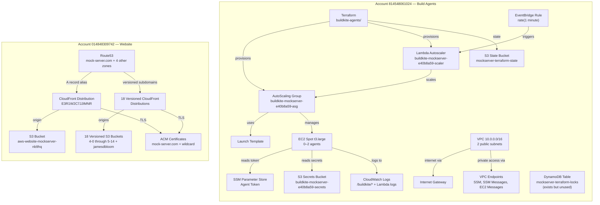
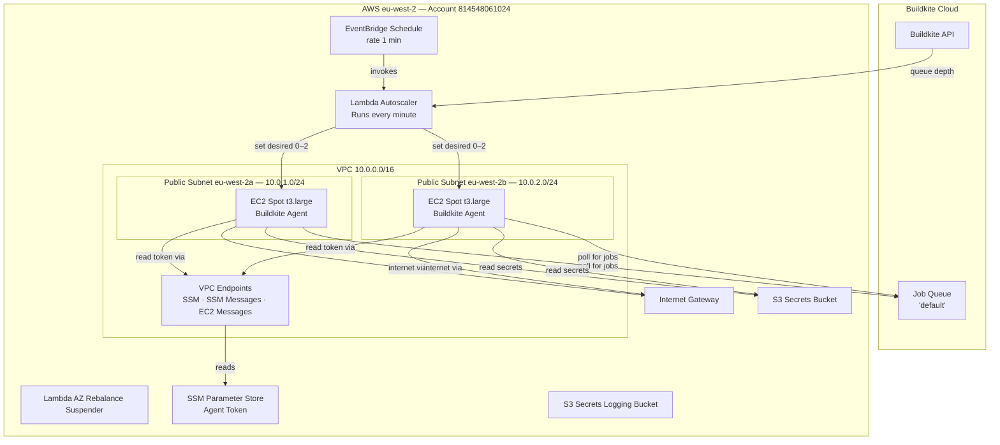
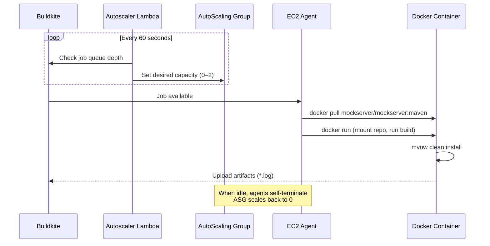
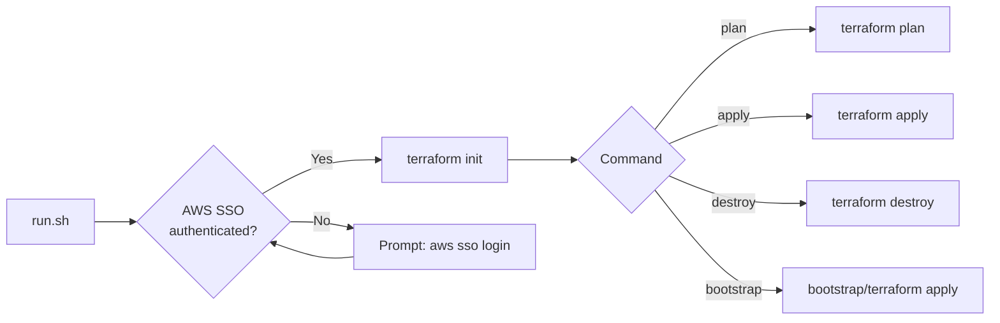
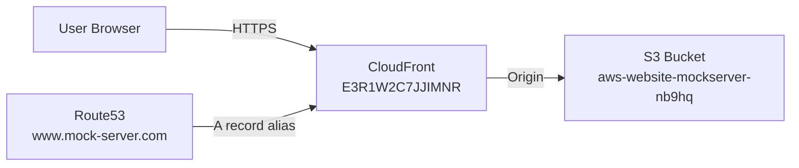

# AWS Infrastructure

## Overview

MockServer uses two AWS accounts for different purposes:



## Account Details

| Account ID | Purpose | Region | AWS CLI Profile |
|------------|---------|--------|-----------------|
| `814548061024` | Pipeline build agents and infrastructure | `eu-west-2` | `mockserver-build` |
| `014848309742` | Website (S3, CloudFront, DNS, TLS) | `us-east-1` | `mockserver-website` (SSO via `d-9c674c1c64.awsapps.com`) |

## Build Agent Account — 814548061024

All active resources are in `eu-west-2`, managed by Terraform in `terraform/buildkite-agents/`.

### Architecture



### Complete Resource Inventory

#### Compute

| Resource | Identifier | Details |
|----------|-----------|---------|
| AutoScaling Group | `buildkite-mockserver-e40b8a59-asg` | Min 0, Max 2, 100% Spot, `t3.large`, AZRebalance suspended |
| Launch Template | `lt-0017604425320a39e` (`buildkite-mockserver-e40b8a59-launch-template`) | t3.large, 250 GiB gp3 root volume, delete-on-termination |
| EC2 Instances | 0–2 Spot instances (ephemeral) | Scale to zero when idle |

#### Networking

| Resource | Identifier | Details |
|----------|-----------|---------|
| VPC | `vpc-02112b77808da56e2` | `10.0.0.0/16` |
| Subnet (eu-west-2a) | `subnet-03e8108703c38def4` | `10.0.1.0/24`, public |
| Subnet (eu-west-2b) | `subnet-03f7a1a41480783a7` | `10.0.2.0/24`, public |
| Internet Gateway | `igw-0adbbc9b735e66916` | Attached to Buildkite VPC |
| Route Table | `rtb-0bd5cfbfb1230d2f6` | Public: local + default to IGW |
| Security Group (agents) | `sg-0acec07eee89038e0` (`buildkite-mockserver-e40b8a59-agent-sg`) | Agent traffic |
| Security Group (VPC endpoints) | `sg-0159a96b0d67c9c3c` (`buildkite-mockserver-e40b8a59-vpc-endpoints`) | VPC endpoint traffic |
| VPC Endpoint (SSM) | `vpce-038866ae1fb83b1fb` | `com.amazonaws.eu-west-2.ssm` |
| VPC Endpoint (SSM Messages) | `vpce-08fe0666e7b23da54` | `com.amazonaws.eu-west-2.ssmmessages` |
| VPC Endpoint (EC2 Messages) | `vpce-0484c6580c8a14c92` | `com.amazonaws.eu-west-2.ec2messages` |

#### Lambda

| Function | Runtime | Purpose |
|----------|---------|---------|
| `buildkite-mockserver-e40b8a59-scaler` | `provided.al2023` | Scales ASG based on Buildkite queue depth |
| `buildkite-mockserver-e40b8a59-az-rebalancing-suspender` | `python3.13` | Suspends AZRebalance on the ASG |

#### EventBridge

| Rule | Schedule | Target |
|------|----------|--------|
| `buildkite-mockserver-e40b8a59-scaler-schedule` | `rate(1 minute)` | Scaler Lambda |

#### Storage

| Resource | Name | Region | Purpose |
|----------|------|--------|---------|
| S3 Bucket | `mockserver-terraform-state` | `eu-west-2` | Terraform state |
| S3 Bucket | `buildkite-mockserver-e40b8a59-secrets` | `eu-west-2` | Buildkite managed secrets |
| S3 Bucket | `buildkite-mockserver-e40b8a59-secrets-logs` | `eu-west-2` | Secrets bucket access logs |
| DynamoDB Table | `mockserver-terraform-locks` | `eu-west-2` | Created by bootstrap, **unused** (backend uses S3-native lockfile) |

#### SSM Parameter Store

| Parameter | Type | Purpose |
|-----------|------|---------|
| `/buildkite/elastic-ci-stack/buildkite-mockserver-e40b8a59/agent-token` | SecureString | Buildkite agent registration token |

#### CloudWatch Log Groups (eu-west-2)

| Log Group | Retention | Purpose |
|-----------|-----------|---------|
| `/aws/lambda/buildkite-mockserver-e40b8a59-scaler` | 1 day | Scaler Lambda logs |
| `/aws/lambda/buildkite-mockserver-e40b8a59-az-rebalancing-suspender` | None set | AZ rebalance suspender logs |
| `/buildkite/auth` | None set | Agent auth logs |
| `/buildkite/buildkite-agent` | None set | Agent logs |
| `/buildkite/cloud-init` | None set | Instance bootstrap logs |
| `/buildkite/cloud-init/output` | None set | Instance bootstrap output |
| `/buildkite/docker-daemon` | None set | Docker daemon logs |
| `/buildkite/elastic-stack` | None set | Elastic stack logs |
| `/buildkite/lifecycled` | None set | Instance lifecycle logs |
| `/buildkite/system` | None set | System logs |

#### IAM

| Resource | Name | Purpose |
|----------|------|---------|
| Role | `buildkite-mockserver-e40b8a59-Role` | EC2 instance role for Buildkite agents |
| Role | `buildkite-mockserver-e40b8a59-scaler-lambda-role` | Scaler Lambda execution role |
| Role | `buildkite-mockserver-e40b8a59-AsgProcessSuspenderRole` | AZ rebalance suspender Lambda role |
| Instance Profile | `buildkite-mockserver-e40b8a59-InstanceProfile` | Attached to EC2 instances |
| Service-linked roles | AutoScaling, EC2Spot, Organizations, SSO, Support, TrustedAdvisor, ResourceExplorer | AWS-managed |

#### Build Secrets (Terraform-defined, not yet applied)

The following resources are defined in `terraform/buildkite-agents/build-secrets.tf` but have **not yet been applied** to AWS:

| Resource | Name | Purpose |
|----------|------|---------|
| Secrets Manager Secret | `mockserver-build/dockerhub` | Docker Hub credentials for CI image push |
| OIDC Provider | `token.actions.githubusercontent.com` | GitHub Actions federation |
| IAM Role | `github-actions-mockserver` | GitHub Actions role (reads Docker Hub secret) |

These will be created on the next `terraform apply`.

### Scaling Behaviour

- **Minimum:** 0 instances (scales to zero when idle)
- **Maximum:** 2 instances
- **Agents per instance:** 1
- **Scaling frequency:** Every 60 seconds
- **Scale trigger:** Buildkite job queue depth
- **Instance type:** `t3.large` (100% Spot)
- **Idle cost:** $0 (scales to zero)
- **Build cost:** ~$0.02/hr per agent (spot pricing)

### Build Flow



## Infrastructure as Code (Terraform)

The Buildkite agent infrastructure is managed by Terraform in `terraform/buildkite-agents/`, using the official [Buildkite Elastic CI Stack for AWS](https://github.com/buildkite/terraform-buildkite-elastic-ci-stack-for-aws) module.

### Directory Structure

```
terraform/
└── buildkite-agents/
    ├── bootstrap/           # One-time state backend setup
    │   ├── main.tf          #   S3 bucket + DynamoDB table
    │   └── README.md        #   Bootstrap instructions
    ├── main.tf              # Elastic CI Stack module
    ├── backend.tf           # S3 remote state configuration
    ├── build-secrets.tf     # Docker Hub secret + GitHub OIDC
    ├── variables.tf         # Input variables
    ├── outputs.tf           # Outputs (ASG name, VPC ID)
    ├── versions.tf          # Terraform + provider versions
    ├── terraform.tfvars.example  # Example variable values
    ├── run.sh               # Wrapper script (auth + plan/apply)
    └── README.md
```

### Module Configuration

| Property | Value |
|----------|-------|
| Terraform module | `buildkite/elastic-ci-stack-for-aws/buildkite` ~0.7.x |
| Region | `eu-west-2` |
| Instance type | `t3.large` (Spot) |
| Scaling | 0–2 instances |
| State backend | S3 in `eu-west-2` (native lockfile) |

### State Backend

Remote state is stored in S3, bootstrapped by `terraform/buildkite-agents/bootstrap/`:

| Resource | Name | Region | Status |
|----------|------|--------|--------|
| S3 Bucket | `mockserver-terraform-state` | `eu-west-2` | Used by `backend.tf` |
| DynamoDB Table | `mockserver-terraform-locks` | `eu-west-2` | Created by bootstrap, but **not referenced** in `backend.tf` |

The current `backend.tf` uses `use_lockfile = true` for S3-native file locking (`.tflock`) rather than DynamoDB-based locking. The DynamoDB table exists because the bootstrap creates it, but the backend configuration does not set `dynamodb_table`, so it is unused.

The bootstrap uses `import` blocks, making it idempotent — safe to re-run against existing resources.

### Variables

| Variable | Type | Default | Description |
|----------|------|---------|-------------|
| `buildkite_agent_token` | `string` | *(required)* | Buildkite agent registration token |
| `region` | `string` | `eu-west-2` | AWS region |
| `instance_types` | `string` | `t3.large` | EC2 instance types (comma-separated) |
| `min_size` | `number` | `0` | Minimum instances (0 = scale to zero) |
| `max_size` | `number` | `2` | Maximum instances |
| `on_demand_percentage` | `number` | `0` | % on-demand vs spot (0 = all spot) |

### Quick Start

```bash
# Bootstrap state backend (first time only)
./terraform/buildkite-agents/run.sh bootstrap

# Preview changes
./terraform/buildkite-agents/run.sh plan

# Apply changes
./terraform/buildkite-agents/run.sh apply
```

The `run.sh` wrapper handles AWS SSO authentication and environment workarounds (corporate TLS proxy, macOS pyexpat).



## Website Account — 014848309742

### Architecture



### AWS Organization and SSO

Account `014848309742` runs its own AWS Organization (`o-ox78mh9eoy`) with a separate IAM Identity Center instance (`d-9c674c1c64`, `eu-west-2`). This is independent from the build account's organization.

| Property | Value |
|----------|-------|
| Organization ID | `o-ox78mh9eoy` |
| SSO Instance | `ssoins-7535fd4fff11d5ae` |
| Identity Store | `d-9c674c1c64` |
| SSO Region | `eu-west-2` |
| SSO Portal | `https://d-9c674c1c64.awsapps.com/start` |

### S3 Buckets

19 S3 buckets — 1 for the current website, plus versioned archives for each MockServer major/minor release and a personal site:

| Bucket | Purpose |
|--------|---------|
| `aws-website-mockserver-nb9hq` | **Current** `mock-server.com` website |
| `aws-website-mockserver-5-14` | 5.14.x docs archive |
| `aws-website-mockserver-5-13` | 5.13.x docs archive |
| `aws-website-mockserver-5-12` | 5.12.x docs archive |
| `aws-website-mockserver-5-11` | 5.11.x docs archive |
| `aws-website-mockserver-5-10` | 5.10.x docs archive |
| `aws-website-mockserver----9684b` | 5.5.x docs archive |
| `aws-website-mockserver----f10aa` | 5.6.x docs archive |
| `aws-website-mockserver--c89db` | 5.7.x docs archive |
| `aws-website-mockserver--8001a` | 5.8.x docs archive |
| `aws-website-mockserver--ad01b` | 5.9.x docs archive |
| `aws-website-mockserver----mz777` | 5.4.x docs archive |
| `aws-website-mockserver----l2i8l` | 5.3.x docs archive |
| `aws-website-mockserver----azamg` | 5.2.x docs archive |
| `aws-website-mockserver----pknro` | 5.1.x docs archive |
| `aws-website-mockserver--8hyll` | 5.0.x docs archive |
| `aws-website-mockserver--mp81c` | 4.0.x docs archive |
| `aws-website-mockserver--r4wey` | 4.1.x docs archive |
| `aws-website-jamesdbloom-hjgqf` | Personal site (`jamesdbloom.com`) |

### CloudFront Distributions

19 distributions — one per S3 bucket, each serving a versioned subdomain:

| Alias | Distribution ID | Origin Bucket |
|-------|----------------|---------------|
| `mock-server.com` | `E3R1W2C7JJIMNR` | `aws-website-mockserver-nb9hq` |
| `5-14.mock-server.com` | `E38P1C17FU9XAU` | `aws-website-mockserver-5-14` |
| `5-13.mock-server.com` | `E2NT5BX49P7VGV` | `aws-website-mockserver-5-13` |
| `5-12.mock-server.com` | `E31AA4UPOP1ISF` | `aws-website-mockserver-5-12` |
| `5-11.mock-server.com` | `EQEHG4UN046U0` | `aws-website-mockserver-5-11` |
| `5-10.mock-server.com` | `EHSBU8184DSMF` | `aws-website-mockserver-5-10` |
| `5-9.mock-server.com` | `E1Z1U192EA89YJ` | `aws-website-mockserver--ad01b` |
| `5-8.mock-server.com` | `E3FYZ40C61VAFK` | `aws-website-mockserver--8001a` |
| `5-7.mock-server.com` | `E2Y27H0SO94OAW` | `aws-website-mockserver--c89db` |
| `5-6.mock-server.com` | `E4GAEPU2S5Y5S` | `aws-website-mockserver----f10aa` |
| `5-5.mock-server.com` | `EK3VOO8T8YPBY` | `aws-website-mockserver----9684b` |
| `5-4.mock-server.com` | `E3262K5GO7S9IK` | `aws-website-mockserver----mz777` |
| `5-3.mock-server.com` | `E3A2MQ7KAFI34L` | `aws-website-mockserver----l2i8l` |
| `5-2.mock-server.com` | `E1P21PWXDL2CQ4` | `aws-website-mockserver----azamg` |
| `5-1.mock-server.com` | `E1K8O3M4YFMFVV` | `aws-website-mockserver----pknro` |
| `5-0.mock-server.com` | `E1HB1YQLUIA3ZO` | `aws-website-mockserver--8hyll` |
| `4-1.mock-server.com` | `E33MJNJAKQJUCV` | `aws-website-mockserver--r4wey` |
| `4-0.mock-server.com` | `E1DTBKVX1UIHU9` | `aws-website-mockserver--mp81c` |
| `jamesdbloom.com` | `E26HKOK9FRPUZN` | `aws-website-jamesdbloom-hjgqf` |

Main distribution config: `PriceClass_All`, HTTP/2+3, TLSv1.2_2021 minimum, custom 403 error page.

### Route53 Hosted Zones

| Zone | Domain | Records | Purpose |
|------|--------|---------|---------|
| `Z1R2IC6XAWK4Y6` | `mock-server.com` | 26 | Main site + all versioned subdomains |
| `Z3SCWIVW06BLQP` | `mock-server.org` | 4 | Redirects to `mock-server.com` via CloudFront |
| `Z3S7Y37135WVPS` | `jamesdbloom.com` | 8 | Personal site |
| `Z3T3VFXGY3RJCQ` | `bluesquashtechnology.com` | 6 | Other domain |
| `Z07231662DQOFYPO6SVE7` | `subdomain.bluesquashtechnology.com` | 4 | Subdomain delegation |

`mock-server.com` DNS records: apex → CloudFront `E3R1W2C7JJIMNR`, `www` → alias to apex, `org` → alias to apex, plus 15 versioned subdomain A records (`4-0` through `5-14`) each pointing to their respective CloudFront distribution. ACM validation CNAME records for certificate renewal.

### ACM Certificates (us-east-1)

| Domain | ARN | Expires | Renewal |
|--------|-----|---------|---------|
| `mock-server.com` (+ `*.mock-server.com`, `org.`, `www.`) | `80ca7e79-1a03-406a-a0ef-d75317459232` | 2026-09-17 | Eligible (auto-renew) |
| `*.mock-server.com` | `79c0be46-c194-4166-af4f-bb5aa961ba7a` | 2026-09-29 | Eligible (auto-renew) |
| `blog.jamesdbloom.com` | `50c26dba-0230-44ed-b340-fb16b2c4b6ef` | — | Eligible |

### S3 Bucket Contents

| Path | Content |
|------|---------|
| `/` (root) | Jekyll website (`www.mock-server.com`) |
| `/versions/<version>/` | Javadoc for each release |
| `/*.tgz` + `index.yaml` | Helm chart repository |

### Website Deployment Process

1. Build Jekyll site: `bundle exec jekyll build`
2. Upload `_site/` contents to S3 bucket root
3. Invalidate CloudFront cache
4. See [Release Process](../operations/release-process.md) for full details

### IAM (Legacy)

| Resource | Details | Status |
|----------|---------|--------|
| User `Administrator` | Created 2017-04-01, last console login 2019-06-07, no access keys | **Unused** — candidate for deletion |
| User `APIAdministrator` | Created 2017-04-01, never logged in, has active access key (created 2017) | **Security risk** — should rotate or delete |
| Role `EC2DomainJoin` | Created 2020-02-10, never used | **Unused** — candidate for deletion |
| Role `ecsInstanceRole` | Created 2017-04-01 | Legacy ECS role (no ECS clusters exist) |
| Role `ecsServiceRole` | Created 2017-04-01 | Legacy ECS role (no ECS clusters exist) |
| Role `google_assistant` | Created 2017-07-16, never used | **Unused** — candidate for deletion |

### Other Resources

| Resource | Details | Status |
|----------|---------|--------|
| ECR Repository `jamesdbloom_two` | Created 2017-04-01, us-east-1 | Legacy, likely unused |
| VPC `vpc-e78d579e` | `10.0.0.0/16`, 1 subnet (us-east-1d), 3 security groups, non-default | Legacy, no instances running |
| CloudWatch Log Groups (8) | Buildkite agent logs in us-east-1, no retention set | Orphaned from old Buildkite stack |

### Monthly Cost (April 2026)

~$3.87/month: Route53 ($2.88 for 5 hosted zones), S3 ($0.31), EC2-Other/EIPs ($0.15), ECR ($0.01), CloudFront (<$0.01).

## Remaining Minor Resources

### Build Account (814548061024)

| Resource | Details | Status |
|----------|---------|--------|
| Default VPC (`vpc-2db2e745`) | `172.31.0.0/16`, 3 subnets, IGW, route table in eu-west-2 | Unused — candidate for deletion |
| DynamoDB table `mockserver-terraform-locks` | Created by Terraform bootstrap, 0 items, not referenced by `backend.tf` (uses S3-native lockfile) | Unused — candidate for deletion |

### Website Account (014848309742)

| Resource | Details | Status |
|----------|---------|--------|
| VPC `vpc-e78d579e` | `10.0.0.0/16`, 1 subnet (us-east-1d), 3 security groups, non-default | Unused — candidate for deletion |
| 8 CloudWatch Log Groups | Buildkite agent logs in us-east-1, no retention set, ~2.5 MB total | Orphaned — candidate for deletion |
| ECR repo `jamesdbloom_two` | Created 2017, us-east-1 | Likely unused — verify before deletion |
| IAM user `Administrator` | Last login 2019-06-07, no access keys | Unused — candidate for deletion |
| IAM user `APIAdministrator` | Active access key from 2017, never logged in | **Security risk** — rotate or delete key |
| IAM roles `EC2DomainJoin`, `ecsInstanceRole`, `ecsServiceRole`, `google_assistant` | Legacy roles, never or rarely used | Candidates for deletion |

## Recommendations

| # | Action | Impact | Effort |
|---|--------|--------|--------|
| 1 | Rotate or delete `APIAdministrator` access key (active since 2017) | **Security** — eliminate 8-year-old credential | Trivial |
| 2 | Delete unused IAM users/roles in website account | Reduce attack surface | Trivial |
| 3 | Delete 8 orphaned CloudWatch log groups in website account (us-east-1) | Clean up legacy Buildkite remnants | Trivial |
| 4 | Set retention on eu-west-2 `/buildkite/*` log groups (build account) | Prevent unbounded log growth | Trivial |
| 5 | Run `terraform apply` to create build-secrets resources | Enable GitHub Actions OIDC + Docker Hub secret | Low |
| 6 | Delete unused VPCs in both accounts | Reduce clutter | Low |
| 7 | Delete unused DynamoDB table and ECR repo | Reduce clutter | Trivial |
| 8 | Tag `mockserver-terraform-state` bucket | Improve resource identification | Trivial |

## AWS CLI Operations

These commands target the Terraform-managed infrastructure in `eu-west-2`. The ASG name is dynamically generated by the Elastic CI Stack module, so look it up first:

```bash
aws sso login --profile mockserver-build

ASG_NAME=$(aws autoscaling describe-auto-scaling-groups \
  --profile mockserver-build --region eu-west-2 \
  --query 'AutoScalingGroups[?contains(Tags[?Key==`Name`].Value | [0], `buildkite`)].AutoScalingGroupName' \
  --output text)

aws autoscaling describe-auto-scaling-groups \
  --auto-scaling-group-names "$ASG_NAME" \
  --region eu-west-2 --profile mockserver-build \
  --query 'AutoScalingGroups[0].{Desired:DesiredCapacity,Instances:Instances[*].{ID:InstanceId,State:LifecycleState}}'

aws ec2 describe-instances \
  --filters "Name=tag:aws:autoscaling:groupName,Values=$ASG_NAME" \
  --region eu-west-2 --profile mockserver-build \
  --query 'Reservations[].Instances[].{ID:InstanceId,State:State.Name,Launch:LaunchTime}'

aws ec2 get-console-output --instance-id <instance-id> \
  --region eu-west-2 --profile mockserver-build

aws autoscaling set-desired-capacity \
  --auto-scaling-group-name "$ASG_NAME" \
  --desired-capacity 2 --region eu-west-2 --profile mockserver-build
```

## AWS CLI Prerequisites

1. **Install AWS CLI:** `brew install awscli`
2. **Configure SSO profiles:**
   - Build: `aws configure sso --profile mockserver-build` (SSO start URL: `https://d-9c674c6f2f.awsapps.com/start`, SSO region: `eu-west-2`)
   - Website: `aws configure sso --profile mockserver-website` (SSO start URL: `https://d-9c674c1c64.awsapps.com/start`, SSO region: `eu-west-2`)
3. **Authenticate:**
   - `aws sso login --profile mockserver-build` (or shell alias `awsl-build`)
   - `aws sso login --profile mockserver-website` (or shell alias `awsl-web`)
4. **Corporate TLS proxy:** set `AWS_CA_BUNDLE` to your corporate root CA PEM file (e.g., `export AWS_CA_BUNDLE=$NODE_EXTRA_CA_CERTS`)
5. **macOS + Python 3.14 + Homebrew:** if `pyexpat` symbol errors occur, set `export DYLD_LIBRARY_PATH=/opt/homebrew/opt/expat/lib`

## Audit History

| Date | Action |
|------|--------|
| 2026-05-03 | Legacy CloudFormation stack `buildkite` deleted from us-east-1. Full resource audit of account 814548061024 completed. All legacy orphaned resources in us-east-1 cleaned up: 17 S3 buckets (including 2 logging buckets with 120K+ objects), 25 CloudWatch log groups, and EC2 key pair `mockserver-buildkite`. |
| 2026-05-03 | Website account 014848309742 SSO configured (separate IAM Identity Center instance `d-9c674c1c64`). Full audit completed: 19 S3 buckets (1 current + 18 versioned archives), 19 CloudFront distributions, 5 Route53 hosted zones, 3 ACM certificates, 2 legacy IAM users (1 with active 2017 access key), 4 legacy IAM roles, 1 unused VPC, 8 orphaned CloudWatch log groups, 1 legacy ECR repo. Monthly cost ~$3.87. Build account monthly cost ~$7.78. |
