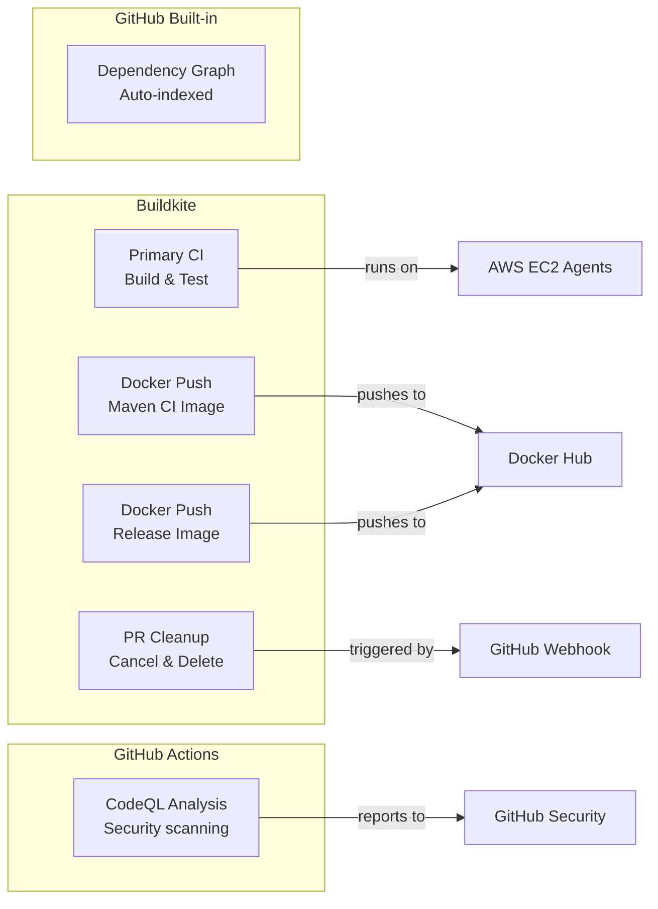
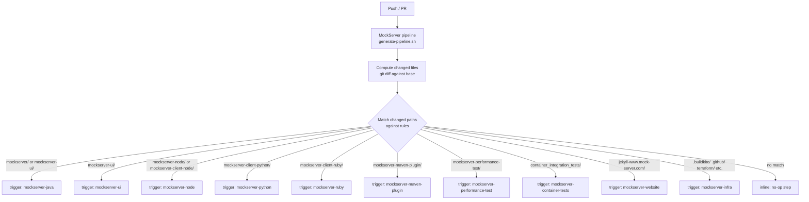
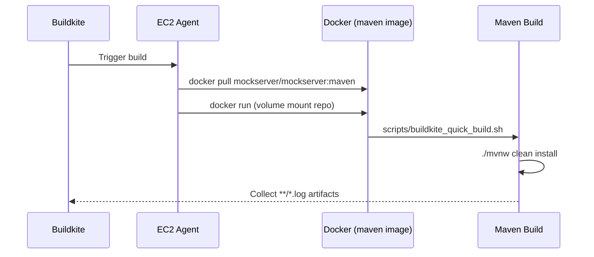
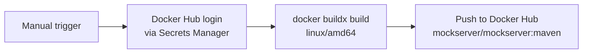
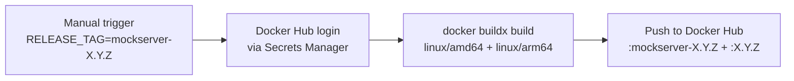
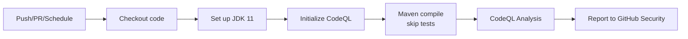

# CI/CD

## Overview

MockServer uses two CI/CD systems:



### CI Security Model

All custom CI pipelines run on Buildkite with self-managed EC2 agents. This keeps secrets (API tokens, Docker Hub credentials, AWS credentials) within the Buildkite/AWS boundary and avoids exposing them as GitHub Actions secrets.

**Principle:** Use Buildkite for any pipeline that needs secrets or performs actions. Use GitHub Actions only for read-only analysis that requires no secrets (e.g., CodeQL). Use Buildkite Pipeline Triggers to react to GitHub events without giving GitHub access to CI credentials.

| Concern | Approach |
|---|---|
| Build & test | Buildkite (EC2 agents, secrets in AWS Secrets Manager) |
| Docker push | Buildkite (Docker Hub credentials in AWS Secrets Manager) |
| GitHub event reactions | Buildkite Pipeline Triggers (GitHub webhook → Buildkite, no secrets in GitHub) |
| Security scanning | GitHub Actions CodeQL (read-only, no secrets needed) |
| Dependency graph | GitHub built-in (auto-indexed from manifests, no workflow needed) |

## Buildkite Pipelines

The monorepo uses a path-based pipeline orchestrator that dynamically triggers separate child pipelines based on changed files. Each child pipeline appears individually in the Buildkite dashboard, giving per-project visibility. Build pipelines use the `default` queue (EC2 Spot pool). Release pipeline steps that access release secrets use a dedicated `release` queue with its own agent stack and IAM permissions.

### Pipeline Orchestrator

**File:** `.buildkite/scripts/generate-pipeline.sh`

The orchestrator runs as the first step of every build (via the main "MockServer" pipeline). It determines which files changed since the last successful build and emits command steps that call `trigger-pipeline.sh` to create child builds via the Buildkite API. For PRs, it diffs against the merge-base. For pushes to master, it queries the Buildkite API for the last successful build's commit SHA and diffs against it — this ensures that batch pushes with multiple commits correctly trigger all affected pipelines. If the base commit cannot be determined (API failure, first build, shallow clone), the orchestrator conservatively triggers all pipelines.



### Buildkite Pipelines

All pipelines are managed via Terraform in `terraform/buildkite-pipelines/pipelines.tf`. Only the main orchestrator pipeline triggers from GitHub webhooks; all child pipelines have `trigger_mode = "none"` and are triggered by the orchestrator.

| Pipeline (Buildkite slug) | Pipeline File | Trigger | What It Builds |
|---|---|---|---|
| `mockserver` | `pipeline.yml` | GitHub push/PR | Orchestrator — triggers child pipelines |
| `mockserver-java` | `pipeline-java.yml` | Orchestrator | Full Maven build and test |
| `mockserver-ui` | `pipeline-ui.yml` | Orchestrator | UI lint, typecheck, test, build |
| `mockserver-node` | `pipeline-node.yml` | Orchestrator | Node.js lint and typecheck |
| `mockserver-python` | `pipeline-python.yml` | Orchestrator | Python unit + integration tests |
| `mockserver-ruby` | `pipeline-ruby.yml` | Orchestrator | Ruby unit + integration tests |
| `mockserver-maven-plugin` | `pipeline-maven-plugin.yml` | Orchestrator | Maven plugin build and test |
| `mockserver-performance-test` | `pipeline-perf-test.yml` | Orchestrator | Perf test script validation |
| `mockserver-container-tests` | `pipeline-container-tests.yml` | Orchestrator | Shell script validation |
| `mockserver-website` | `pipeline-website.yml` | Orchestrator | Jekyll site build |
| `mockserver-infra` | `pipeline-infra.yml` | Orchestrator | Infrastructure validation |
| `mockserver-build-image` | `docker-push-maven.yml` | Manual | Build/push maven CI image |
| `mockserver-release-image` | `docker-push-release.yml` | Manual | Build/push release image |
| `mockserver-release` | `release-pipeline.yml` | Manual | Automated release pipeline (TOTP, Maven Central, Docker, Helm, npm, PyPI, RubyGems, website) |
| `mockserver-cleanup` | `pipeline-cleanup.yml` | GitHub webhook + scheduled | Clean up builds for closed PRs |

A single commit can trigger multiple child pipelines if it changes files in multiple areas. For example, a commit touching both `mockserver/` and `mockserver-ui/` triggers both `mockserver-java` and `mockserver-ui` pipelines.

All pipelines have `cancel_intermediate_builds` and `skip_intermediate_builds` enabled. When a new build arrives for the same branch (e.g. Dependabot rebases a PR), Buildkite automatically cancels any running builds and skips queued builds for that branch. Native trigger steps automatically cancel child builds when the parent build is cancelled.

### Closed PR Build Cleanup

**File:** `.buildkite/pipeline-cleanup.yml`

When a PR is closed or merged, its Buildkite builds are no longer needed. The cleanup pipeline cancels any running builds and deletes all builds for the closed PR's branch across all child pipelines. This keeps the Buildkite dashboard clean — only builds for open PRs and master are visible.

The cleanup pipeline operates in two modes:

1. **Webhook-triggered (primary):** A Buildkite Pipeline Trigger receives GitHub `pull_request:closed` webhooks directly. The webhook payload is available to the build step via `buildkite-agent meta-data get buildkite:webhook`. This provides immediate cleanup when a PR is closed.
2. **Scheduled sweep (safety net):** A daily cron schedule sweeps all pipelines for builds on branches whose PRs are no longer open on GitHub. This catches anything missed by the webhook.

#### Why Buildkite Pipeline Triggers instead of GitHub Actions

Buildkite Pipeline Triggers can receive GitHub webhooks directly with HMAC-SHA256 signature verification. This avoids storing a Buildkite API token as a GitHub Actions secret, keeping all CI credentials within the Buildkite/AWS boundary:

| Approach | Secrets exposed to GitHub | Event-driven | Complexity |
|---|---|---|---|
| **Buildkite Pipeline Trigger** | None (webhook URL only) | Yes | Low |
| GitHub Actions workflow | Buildkite API token | Yes | Low |
| AWS Lambda webhook receiver | None | Yes | High |
| Buildkite scheduled sweep only | None | No (polling) | Low |

#### Setup

Steps 1 and 4 are managed by Terraform (`terraform/buildkite-pipelines/pipelines.tf`). Steps 2 and 3 require manual setup because Buildkite Pipeline Triggers don't have a Terraform resource yet (the feature is in public preview).

1. **Pipeline + schedule** (Terraform): Run `terraform apply` in `terraform/buildkite-pipelines/` to create the `mockserver-cleanup` pipeline and its daily schedule.
2. **Pipeline Trigger** (Buildkite UI): Go to the [cleanup pipeline settings](https://buildkite.com/mockserver/mockserver-cleanup/settings) → Triggers → New Trigger → GitHub:
   - Description: `GitHub PR closed/merged`
   - Branch: `master`, Commit: `HEAD`
   - Security: check "Validate webhook deliveries", enter a secret (`openssl rand -hex 32`)
   - Copy the trigger URL (`https://webhook.buildkite.com/deliver/bktr_...`)
3. **GitHub webhook** (GitHub UI): Go to [repo webhook settings](https://github.com/mock-server/mockserver-monorepo/settings/hooks) → Add webhook:
   - Payload URL: paste the Buildkite trigger URL from step 2
   - Content type: `application/json`
   - Secret: same as step 2
   - Events: select "Let me select individual events" → check only "Pull requests"
4. **Daily schedule** (Terraform): Created automatically by step 1 — runs at 06:00 UTC daily as a safety net.

### CI Build Pipeline

**File:** `.buildkite/pipeline-java.yml`

Triggered by the orchestrator when files change in `mockserver/` or `mockserver-ui/`. The pipeline has two sequential steps (separated by an explicit `- wait` directive):



#### Step 1: Update Docker Image

```yaml
- label: "update docker image"
  command: "docker pull mockserver/mockserver:maven"
```

Pulls the latest `mockserver/mockserver:maven` build image to ensure the CI environment is current.

#### Step 2: Build

```yaml
- label: "build"
  command: "docker run -v $(pwd):/build/mockserver -w /build/mockserver \
    -a stdout -a stderr \
    -e BUILDKITE_BRANCH=$BUILDKITE_BRANCH \
    mockserver/mockserver:maven \
    /build/mockserver/scripts/buildkite_quick_build.sh"
  artifact_paths:
    - "**/*.log"
```

Runs the full Maven build inside the `mockserver/mockserver:maven` Docker image:

- Volume-mounts the repository into the container
- Passes the `BUILDKITE_BRANCH` environment variable
- Executes `scripts/buildkite_quick_build.sh` which runs `./mvnw clean install`
- JVM memory: `-Xms2048m -Xmx8192m`
- Collects all `.log` files as build artifacts

### Maven CI Image Push Pipeline

**File:** `.buildkite/docker-push-maven.yml`

**Trigger:** Manual (via Buildkite UI or API)

Builds and pushes `mockserver/mockserver:maven` — the Docker image used by the CI build pipeline. Run this when:
- `docker_build/maven/Dockerfile` or `docker_build/maven/settings.xml` change
- Monthly, to pick up base OS security updates
- After upgrading Maven or JDK versions



Docker Hub credentials are fetched from AWS Secrets Manager (`mockserver-build/dockerhub`) by `.buildkite/scripts/docker-login.sh`.

### Release Image Push Pipeline

**File:** `.buildkite/docker-push-release.yml`

**Trigger:** Manual (during release process, step 7)

Builds and pushes the production MockServer Docker image as a multi-arch image (`linux/amd64` + `linux/arm64` via QEMU).

Set the `RELEASE_TAG` environment variable when triggering the build (e.g., `mockserver-5.15.0`). If triggered from a git tag, `BUILDKITE_TAG` is used as fallback.

Two Docker tags are pushed:
- `mockserver/mockserver:mockserver-X.Y.Z` (full tag)
- `mockserver/mockserver:X.Y.Z` (short tag)



### Build Docker Image

The `mockserver/mockserver:maven` image is defined in `docker_build/maven/Dockerfile`:

- Base: Ubuntu 24.04 (Noble)
- JDK: OpenJDK 21
- Maven: 3.9.15 (manually installed from Apache)
- Dependencies: Pre-fetched by running a throwaway build during image creation
- Corporate CA: Optional certificate injection for TLS proxy environments (see [Docker](docker.md#maven-ci-image))

### Docker Hub Authentication

All Docker push pipelines authenticate to Docker Hub using credentials stored in AWS Secrets Manager (`mockserver-build/dockerhub`). The secret is a JSON object:

```json
{"username": "...", "token": "..."}
```

The shared script `.buildkite/scripts/docker-login.sh` fetches the secret and runs `docker login`. Buildkite agent EC2 instances have IAM permissions to read this secret (via `managed_policy_arns` in `terraform/buildkite-agents/main.tf`).

### Managing Buildkite Pipelines

Pipelines are managed via Terraform in `terraform/buildkite-pipelines/`. The Terraform stack includes all 13 pipelines (orchestrator, 10 child pipelines, and 2 Docker image push pipelines), each pointing to `mock-server/mockserver-monorepo.git`. To add a new pipeline:

1. Create the pipeline YAML in `.buildkite/`
2. Add an entry to `local.pipelines` in `terraform/buildkite-pipelines/pipelines.tf`
3. Add a `trigger_if_changed` call in `.buildkite/scripts/generate-pipeline.sh`
4. Run `terraform apply` in `terraform/buildkite-pipelines/`

The Buildkite API token is stored in AWS Secrets Manager (`mockserver-build/buildkite-api-token`) and is used by the Terraform Buildkite provider for pipeline management.

## GitHub Actions

Two workflows run on GitHub Actions, both triggered automatically on push and pull requests.

### CodeQL Security Analysis

**File:** `.github/workflows/codeql-analysis.yml`

**Triggers:**
- Push to `master`
- Pull requests targeting `master`
- Weekly schedule: Tuesdays at 22:00 UTC

**Languages scanned:** Java, JavaScript

**Process:**



The workflow:
1. Checks out the repository
2. Sets up JDK 11 (Temurin distribution)
3. Initializes CodeQL for Java and JavaScript
4. For Java: Runs `./mvnw clean compile -DskipTests -Dmaven.javadoc.skip=true` (CodeQL autobuild)
5. For JavaScript: Analyzes source files directly (no build required)
6. Performs CodeQL static analysis to detect security vulnerabilities
7. Uploads results to GitHub Security tab

**Results:** Vulnerabilities appear in the repository's Security tab under "Code scanning alerts".

### Maven Dependency Submission

GitHub's built-in dependency graph automatically indexes all manifest files (`pom.xml`, `package.json`, `Gemfile`, `requirements.txt`) and their transitive dependencies. No custom workflow is needed.

**Powers:**
- Dependency insights in the repository (Insights → Dependency graph)
- Dependabot vulnerability alerts for transitive dependencies
- Dependency review in pull requests (shows dependency changes and known vulnerabilities)

**Note:** A custom `dependency-submission.yml` workflow was previously used but was removed because it never worked (the workflow failed on every run due to a GitHub-level configuration issue). The built-in dependency graph provides equivalent coverage.

## Build Agent Infrastructure

See [AWS Infrastructure](aws-infrastructure.md) for details on the Buildkite agent EC2 instances, AutoScaling Group, and Lambda-based autoscaler.

## Buildkite CLI Access

The Buildkite CLI (`bk`) provides authenticated access to builds, pipelines, and agents from the terminal. It uses browser-based OAuth login (similar to `aws sso login`) — no long-lived API tokens to manage.

### Install

```bash
brew tap buildkite/buildkite
brew install buildkite/buildkite/bk
```

Or download a binary from the [GitHub releases page](https://github.com/buildkite/cli/releases).

### Authenticate

```bash
bk auth login
```

This opens a browser window for OAuth login to Buildkite (similar to `aws sso login`). Once authenticated, the CLI stores credentials in the macOS keychain. No API token creation or manual secret management required.

After login, select the organization:

```bash
bk auth switch mockserver
```

### Verify

```bash
bk auth status
```

### Common Operations

The `bk` CLI uses `-p {pipeline}` for pipeline selection. The organization is set globally via `bk auth switch`.

```bash
# List recent builds
bk build list -p mockserver

# View a specific build
bk build view 3292 -p mockserver

# View a build as JSON
bk build view 3292 -p mockserver --json

# Cancel a build
bk build cancel 3292 -p mockserver -y

# Rebuild (retrigger) a build
bk build rebuild 3292 -p mockserver -y

# List agents (across all pipelines in the org)
bk agent list

# List agents as JSON
bk agent list --json
```

### REST API Token (via CLI)

The `bk` CLI can extract its OAuth token for use with the REST API:

```bash
TOKEN=$(bk auth token)
curl -sH "Authorization: Bearer $TOKEN" \
  "https://api.buildkite.com/v2/organizations/mockserver/pipelines/mockserver/builds/3292"
```

This avoids creating and managing separate API tokens. The token is the same OAuth token created by `bk auth login`.

### Opencode Integration

Once `bk` is installed and authenticated, opencode agents can use it directly for build operations (cancel, rebuild, inspect) without needing a separate API token. The `bk` CLI is the recommended approach.

**Note:** `bk auth login` requires an interactive TTY (browser OAuth flow), so it must be run by the user in a separate terminal before opencode can use `bk` commands. If the agent detects `bk` is not authenticated, it will prompt the user to run `bk auth login` manually.

## Local CI Simulation

To run the Buildkite build locally:

```bash
# Using the same Docker image as CI
scripts/local_buildkite_build.sh

# Or directly
docker run -v $(pwd):/build/mockserver \
  -w /build/mockserver \
  -a stdout -a stderr \
  mockserver/mockserver:maven \
  /build/mockserver/scripts/buildkite_quick_build.sh
```
