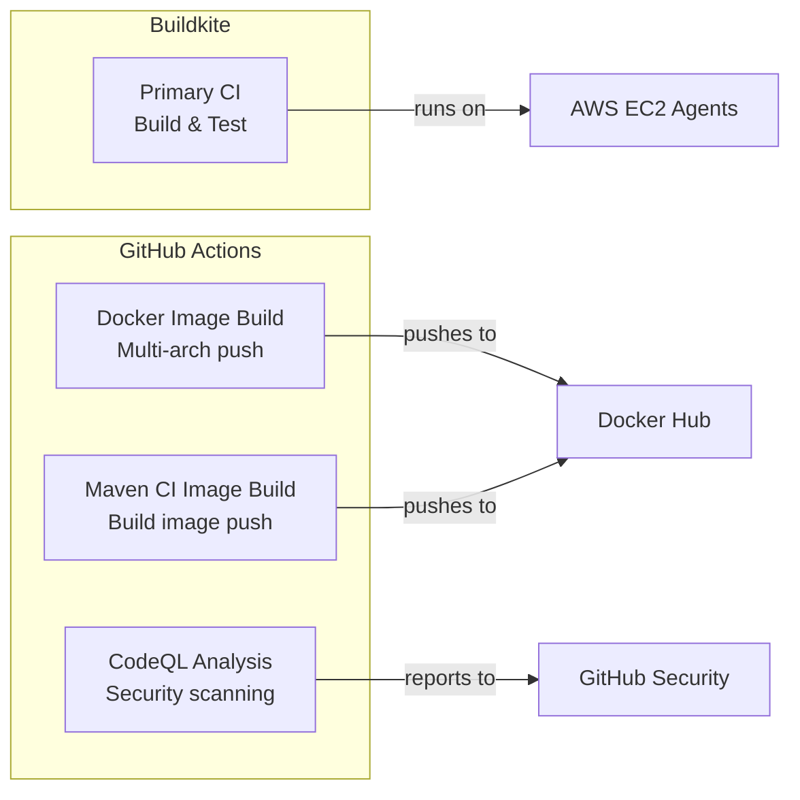
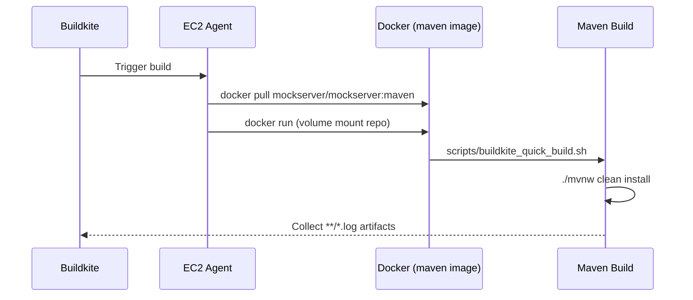
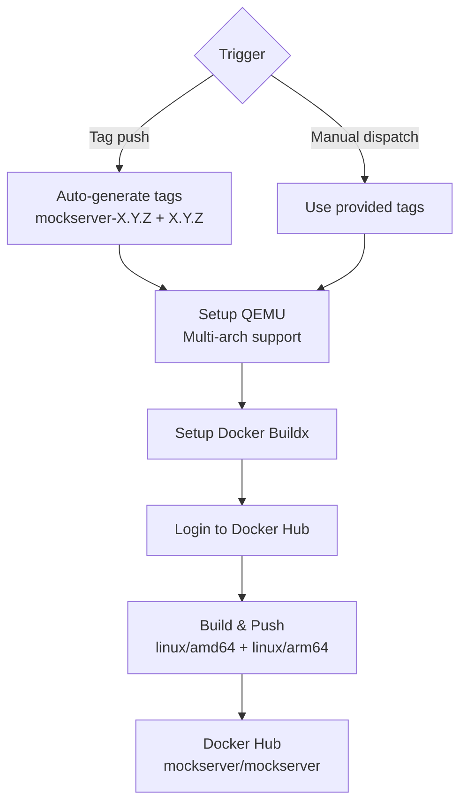

# CI/CD

## Overview

MockServer uses two CI/CD systems:



## Buildkite Pipeline

**File:** `.buildkite/pipeline.yml`

The pipeline has two sequential steps (separated by an explicit `- wait` directive):



### Step 1: Update Docker Image

```yaml
- label: "update docker image"
  command: "docker pull mockserver/mockserver:maven"
```

Pulls the latest `mockserver/mockserver:maven` build image to ensure the CI environment is current.

### Step 2: Build

```yaml
- label: "build"
  command: "docker run -v $(pwd):/build/mockserver -w /build/mockserver \
    -a stdout -a stderr \
    -e BUILDKITE_BRANCH=$BUILDKITE_BRANCH \
    mockserver/mockserver:maven \
    /build/mockserver/scripts/buildkite_quick_build.sh"
  artifact_paths:
    - "**/*.log"
```

Runs the full Maven build inside the `mockserver/mockserver:maven` Docker image:

- Volume-mounts the repository into the container
- Passes the `BUILDKITE_BRANCH` environment variable
- Executes `scripts/buildkite_quick_build.sh` which runs `./mvnw clean install`
- JVM memory: `-Xms2048m -Xmx8192m`
- Collects all `.log` files as build artifacts

### Build Docker Image

The `mockserver/mockserver:maven` image is defined in `docker_build/maven/Dockerfile`:

- Base: Ubuntu 24.04 (Noble)
- JDK: OpenJDK 21
- Maven: 3.9.15 (manually installed from Apache)
- Dependencies: Pre-fetched by running a throwaway build during image creation
- Corporate CA: Optional certificate injection for TLS proxy environments (see [Docker](docker.md#maven-ci-image))

## GitHub Actions

### Docker Image Build & Push

**File:** `.github/workflows/build-docker-image.yml`

**Triggers:**
- Push of `mockserver-*` tags (e.g., `mockserver-5.15.0`)
- Manual `workflow_dispatch` with custom tag override



**Tag generation:** From a git tag like `mockserver-5.15.0`, two Docker tags are created:
- `mockserver/mockserver:mockserver-5.15.0`
- `mockserver/mockserver:5.15.0`

**Platforms:** `linux/amd64` and `linux/arm64` (via QEMU emulation)

**Dockerfile:** `docker/Dockerfile` (see [Docker documentation](docker.md))

### Maven CI Image Build & Push

**File:** `.github/workflows/build-maven-ci-image.yml`

**Triggers:**
- Push to `master` when `docker_build/maven/**` changes
- Monthly schedule (1st of month, 06:00 UTC) for base OS security updates
- Manual `workflow_dispatch`

Builds and pushes the `mockserver/mockserver:maven` CI image to Docker Hub. This is the image used by the Buildkite pipeline to compile and test the project. The image is built for `linux/amd64` only (matching the Buildkite EC2 agents).

**Docker Hub credentials** are stored as GitHub Actions secrets (`DOCKERHUB_USERNAME`, `DOCKERHUB_TOKEN`). AWS Secrets Manager infrastructure for centralised credential management is provisioned in `terraform/buildkite-agents/build-secrets.tf` for future use.

### CodeQL Security Analysis

**File:** `.github/workflows/codeql-analysis.yml`

**Triggers:**
- Push to `master`
- Pull requests targeting `master`
- Weekly schedule: Tuesdays at 22:00 UTC

**Languages scanned:** Java, JavaScript

**Process:** Uses GitHub's CodeQL autobuild to compile Java sources, then runs static analysis queries to detect security vulnerabilities.

## Build Agent Infrastructure

See [AWS Infrastructure](aws-infrastructure.md) for details on the Buildkite agent EC2 instances, AutoScaling Group, and Lambda-based autoscaler.

## Local CI Simulation

To run the Buildkite build locally:

```bash
# Using the same Docker image as CI
scripts/local_buildkite_build.sh

# Or directly
docker run -v $(pwd):/build/mockserver \
  -w /build/mockserver \
  -a stdout -a stderr \
  mockserver/mockserver:maven \
  /build/mockserver/scripts/buildkite_quick_build.sh
```
