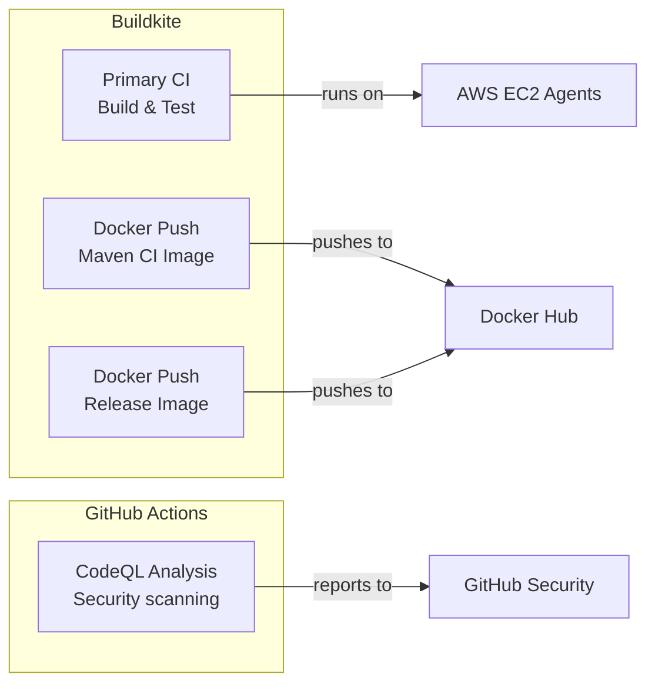
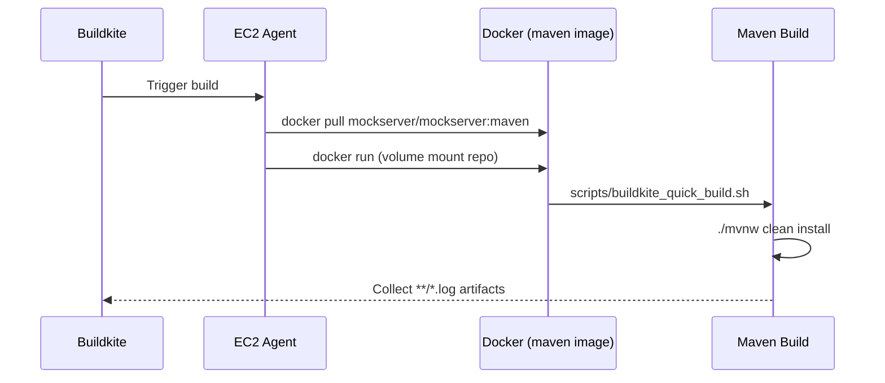
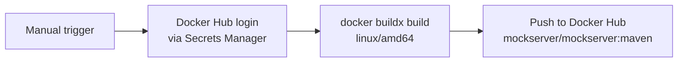
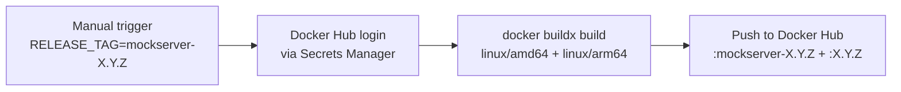

# CI/CD

## Overview

MockServer uses two CI/CD systems:



## Buildkite Pipelines

Three pipelines run on Buildkite, all using the same EC2 Spot agent pool (`default` queue).

### CI Build Pipeline

**File:** `.buildkite/pipeline.yml`

The pipeline has two sequential steps (separated by an explicit `- wait` directive):



#### Step 1: Update Docker Image

```yaml
- label: "update docker image"
  command: "docker pull mockserver/mockserver:maven"
```

Pulls the latest `mockserver/mockserver:maven` build image to ensure the CI environment is current.

#### Step 2: Build

```yaml
- label: "build"
  command: "docker run -v $(pwd):/build/mockserver -w /build/mockserver \
    -a stdout -a stderr \
    -e BUILDKITE_BRANCH=$BUILDKITE_BRANCH \
    mockserver/mockserver:maven \
    /build/mockserver/scripts/buildkite_quick_build.sh"
  artifact_paths:
    - "**/*.log"
```

Runs the full Maven build inside the `mockserver/mockserver:maven` Docker image:

- Volume-mounts the repository into the container
- Passes the `BUILDKITE_BRANCH` environment variable
- Executes `scripts/buildkite_quick_build.sh` which runs `./mvnw clean install`
- JVM memory: `-Xms2048m -Xmx8192m`
- Collects all `.log` files as build artifacts

### Maven CI Image Push Pipeline

**File:** `.buildkite/docker-push-maven.yml`

**Trigger:** Manual (via Buildkite UI or API)

Builds and pushes `mockserver/mockserver:maven` — the Docker image used by the CI build pipeline. Run this when:
- `docker_build/maven/Dockerfile` or `docker_build/maven/settings.xml` change
- Monthly, to pick up base OS security updates
- After upgrading Maven or JDK versions



Docker Hub credentials are fetched from AWS Secrets Manager (`mockserver-build/dockerhub`) by `.buildkite/scripts/docker-login.sh`.

### Release Image Push Pipeline

**File:** `.buildkite/docker-push-release.yml`

**Trigger:** Manual (during release process, step 7)

Builds and pushes the production MockServer Docker image as a multi-arch image (`linux/amd64` + `linux/arm64` via QEMU).

Set the `RELEASE_TAG` environment variable when triggering the build (e.g., `mockserver-5.15.0`). If triggered from a git tag, `BUILDKITE_TAG` is used as fallback.

Two Docker tags are pushed:
- `mockserver/mockserver:mockserver-X.Y.Z` (full tag)
- `mockserver/mockserver:X.Y.Z` (short tag)



### Build Docker Image

The `mockserver/mockserver:maven` image is defined in `docker_build/maven/Dockerfile`:

- Base: Ubuntu 24.04 (Noble)
- JDK: OpenJDK 21
- Maven: 3.9.15 (manually installed from Apache)
- Dependencies: Pre-fetched by running a throwaway build during image creation
- Corporate CA: Optional certificate injection for TLS proxy environments (see [Docker](docker.md#maven-ci-image))

### Docker Hub Authentication

All Docker push pipelines authenticate to Docker Hub using credentials stored in AWS Secrets Manager (`mockserver-build/dockerhub`). The secret is a JSON object:

```json
{"username": "...", "token": "..."}
```

The shared script `.buildkite/scripts/docker-login.sh` fetches the secret and runs `docker login`. Buildkite agent EC2 instances have IAM permissions to read this secret (via `managed_policy_arns` in `terraform/buildkite-agents/main.tf`).

### Managing Buildkite Pipelines

Pipelines are managed via Terraform in `terraform/buildkite-pipelines/`. To add a new pipeline:

1. Create the pipeline YAML in `.buildkite/`
2. Add an entry to `local.pipelines` in `terraform/buildkite-pipelines/pipelines.tf`
3. Run `terraform apply` in `terraform/buildkite-pipelines/`

The Buildkite API token is stored in AWS Secrets Manager (`mockserver-build/buildkite-api-token`).

## GitHub Actions

### CodeQL Security Analysis

**File:** `.github/workflows/codeql-analysis.yml`

**Triggers:**
- Push to `master`
- Pull requests targeting `master`
- Weekly schedule: Tuesdays at 22:00 UTC

**Languages scanned:** Java, JavaScript

**Process:** Uses GitHub's CodeQL autobuild to compile Java sources, then runs static analysis queries to detect security vulnerabilities.

## Build Agent Infrastructure

See [AWS Infrastructure](aws-infrastructure.md) for details on the Buildkite agent EC2 instances, AutoScaling Group, and Lambda-based autoscaler.

## Buildkite CLI Access

The Buildkite CLI (`bk`) provides authenticated access to builds, pipelines, and agents from the terminal. It uses browser-based OAuth login (similar to `aws sso login`) — no long-lived API tokens to manage.

### Install

```bash
brew tap buildkite/buildkite
brew install buildkite/buildkite/bk
```

Or download a binary from the [GitHub releases page](https://github.com/buildkite/cli/releases).

### Authenticate

```bash
bk auth login
```

This opens a browser window for OAuth login to Buildkite (similar to `aws sso login`). Once authenticated, the CLI stores credentials in the macOS keychain. No API token creation or manual secret management required.

After login, select the organization:

```bash
bk auth switch mockserver
```

### Verify

```bash
bk auth status
```

### Common Operations

The `bk` CLI uses `-p {pipeline}` for pipeline selection. The organization is set globally via `bk auth switch`.

```bash
# List recent builds
bk build list -p mockserver

# View a specific build
bk build view 3292 -p mockserver

# View a build as JSON
bk build view 3292 -p mockserver --json

# Cancel a build
bk build cancel 3292 -p mockserver -y

# Rebuild (retrigger) a build
bk build rebuild 3292 -p mockserver -y

# List agents (across all pipelines in the org)
bk agent list

# List agents as JSON
bk agent list --json
```

### REST API Token (via CLI)

The `bk` CLI can extract its OAuth token for use with the REST API:

```bash
TOKEN=$(bk auth token)
curl -sH "Authorization: Bearer $TOKEN" \
  "https://api.buildkite.com/v2/organizations/mockserver/pipelines/mockserver/builds/3292"
```

This avoids creating and managing separate API tokens. The token is the same OAuth token created by `bk auth login`.

### Opencode Integration

Once `bk` is installed and authenticated, opencode agents can use it directly for build operations (cancel, rebuild, inspect) without needing a separate API token. The `bk` CLI is the recommended approach.

**Note:** `bk auth login` requires an interactive TTY (browser OAuth flow), so it must be run by the user in a separate terminal before opencode can use `bk` commands. If the agent detects `bk` is not authenticated, it will prompt the user to run `bk auth login` manually.

## Local CI Simulation

To run the Buildkite build locally:

```bash
# Using the same Docker image as CI
scripts/local_buildkite_build.sh

# Or directly
docker run -v $(pwd):/build/mockserver \
  -w /build/mockserver \
  -a stdout -a stderr \
  mockserver/mockserver:maven \
  /build/mockserver/scripts/buildkite_quick_build.sh
```
