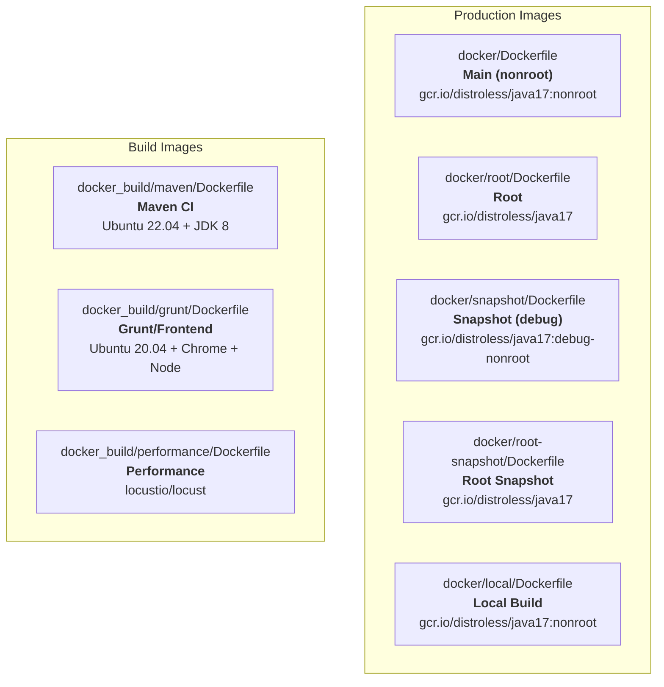
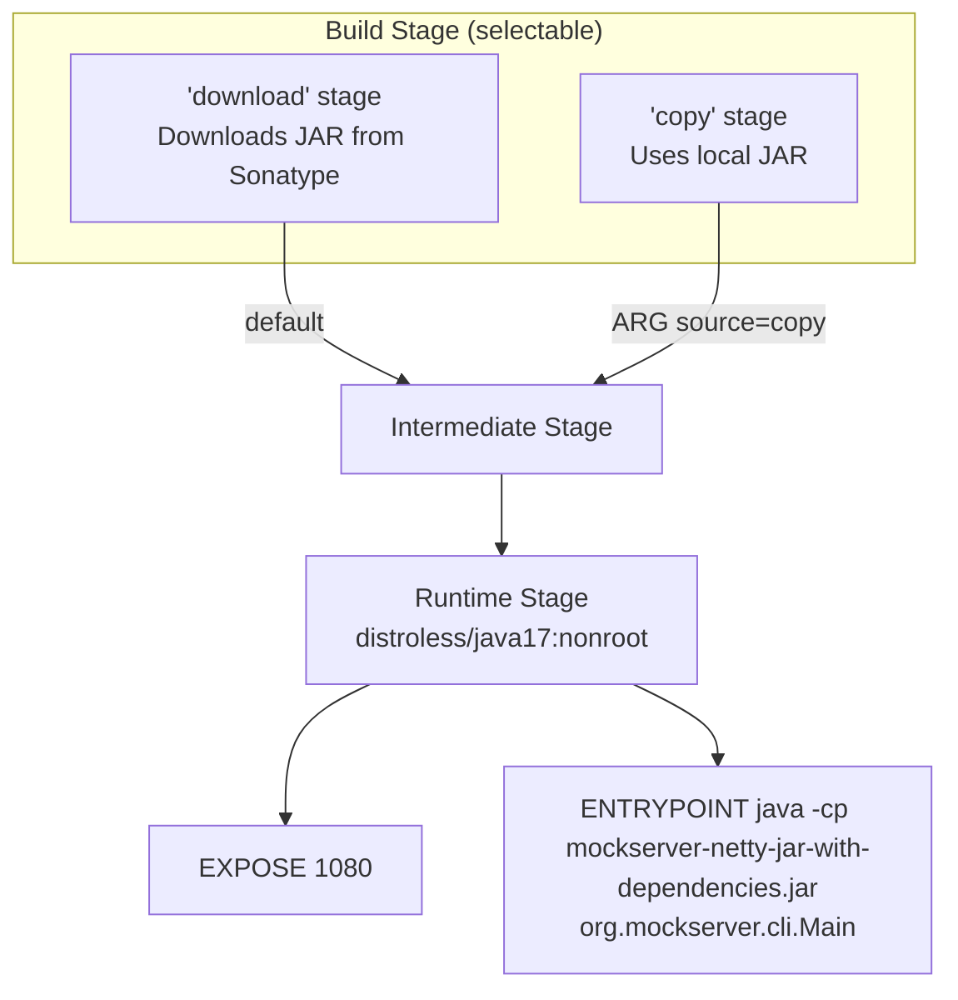

# Docker

## Image Variants

MockServer provides multiple Docker image variants for different use cases:



### Production Images

| Variant | Dockerfile | Base Image | User | Purpose |
|---------|-----------|------------|------|---------|
| Main | `docker/Dockerfile` | `gcr.io/distroless/java17:nonroot` | `nonroot` | Default production image |
| Root | `docker/root/Dockerfile` | `gcr.io/distroless/java17` | `root` | When root access is needed |
| Snapshot | `docker/snapshot/Dockerfile` | `gcr.io/distroless/java17:debug-nonroot` | `nonroot` | Testing pre-release builds |
| Root Snapshot | `docker/root-snapshot/Dockerfile` | `gcr.io/distroless/java17` | `root` | Testing pre-release (root) |
| Local | `docker/local/Dockerfile` | `gcr.io/distroless/java17:nonroot` | `nonroot` | Building from local JAR |

### Main Dockerfile Build Process



The main Dockerfile supports two source modes via the `source` build ARG:

- **`download`** (default): Downloads `mockserver-netty-jar-with-dependencies.jar` from Sonatype
- **`copy`**: Copies a locally-built JAR

It also bundles `netty-tcnative-boringssl-static` native library for TLS performance.

**Exposed port:** 1080

**Entry point:** `java -Dfile.encoding=UTF-8 -cp /mockserver-netty-jar-with-dependencies.jar:/libs/* -Dmockserver.propertyFile=/config/mockserver.properties org.mockserver.cli.Main`

### Build Images

| Image | Dockerfile | Base | Purpose |
|-------|-----------|------|---------|
| `mockserver/mockserver:maven` | `docker_build/maven/Dockerfile` | Ubuntu 22.04 | CI builds — JDK 8, Maven, pre-fetched deps |
| `mockserver/mockserver:grunt` | `docker_build/grunt/Dockerfile` | Ubuntu 20.04 | Frontend tests — JDK 8, Chrome, Node 16, Grunt |
| Performance | `docker_build/performance/Dockerfile` | `locustio/locust` | Load testing with Locust |

## Docker Compose Examples

Three reference configurations demonstrate different MockServer setup approaches:

### By Volume Mount

```
docker/docker-compose/configure_by_volume_mount/
```

Mounts a `mockserver.properties` file and `initializerJson.json` into the container.

### By Command Arguments

```
docker/docker-compose/configure_by_command/
```

Passes configuration via command-line arguments to the MockServer CLI.

### By Environment Properties

```
docker/docker-compose/configure_by_environment_properties/
```

Uses environment variables (`MOCKSERVER_*`) for configuration.

## Multi-Architecture Build

Production images are built for both `linux/amd64` and `linux/arm64` using GitHub Actions:

```bash
# Automated via GitHub Actions on tag push
# Manual trigger:
gh workflow run build-docker-image.yml \
  -f tag="mockserver/mockserver:5.15.0,mockserver/mockserver:latest"
```

See [CI/CD](ci-cd.md) for full GitHub Actions workflow details.

## Local Docker Operations

```bash
# Build from local JAR
docker/local/local_docker_build.sh

# Run locally built image
docker/local/local_docker_run.sh

# Run with cAdvisor monitoring
docker/local/local_docker_cadvisor_run.sh

# Launch interactive Maven container
scripts/local_docker_launch.sh
```

## Container Integration Tests

The `container_integration_tests/` directory contains 14 automated tests:

```mermaid
graph TD
    TESTS[integration_tests.sh]

    subgraph "Docker Compose Tests (10)"
        DC1[Without server port]
        DC2[Default properties file]
        DC3[Custom properties file]
        DC4[Server port by command]
        DC5[Env var long name]
        DC6[Env var short name]
        DC7[Remote host/port]
        DC8[Persisted expectations]
        DC9[Expectation initialiser]
        DC10[Forward with override]
    end

    subgraph "Helm Tests (4)"
        H1[Default Helm values]
        H2[Helm with config map]
        H3[Helm with custom port]
        H4[Helm with ingress]
    end

    TESTS --> DC1
    TESTS --> DC2
    TESTS --> DC3
    TESTS --> DC4
    TESTS --> DC5
    TESTS --> DC6
    TESTS --> DC7
    TESTS --> DC8
    TESTS --> DC9
    TESTS --> DC10
    TESTS --> H1
    TESTS --> H2
    TESTS --> H3
    TESTS --> H4
```



Each test:
1. Starts MockServer (via Docker Compose or Helm/Kind)
2. Creates expectations via the REST API
3. Validates responses using a curl-based client container
4. Tears down the environment
