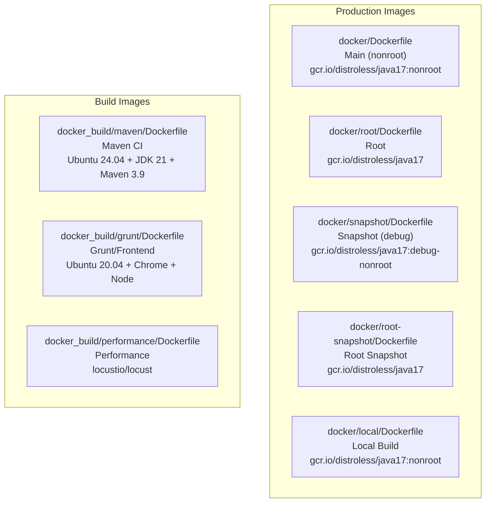
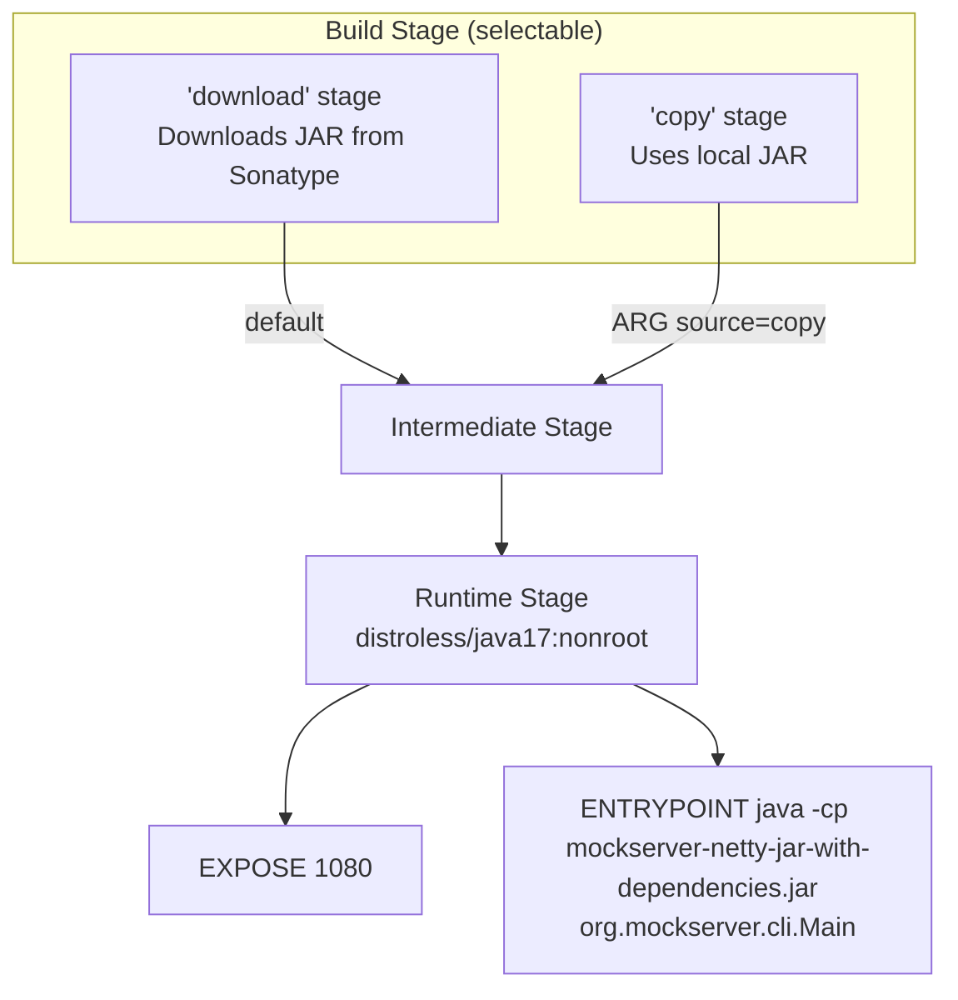

# Docker

## Image Variants

MockServer provides multiple Docker image variants for different use cases:



### Production Images

| Variant | Dockerfile | Base Image | User | Purpose |
|---------|-----------|------------|------|---------|
| Main | `docker/Dockerfile` | `gcr.io/distroless/java17:nonroot` | `nonroot` | Default production image |
| Root | `docker/root/Dockerfile` | `gcr.io/distroless/java17` | `root` | When root access is needed |
| Snapshot | `docker/snapshot/Dockerfile` | `gcr.io/distroless/java17:debug-nonroot` | `nonroot` | Testing pre-release builds |
| Root Snapshot | `docker/root-snapshot/Dockerfile` | `gcr.io/distroless/java17` | `root` | Testing pre-release (root) |
| Local | `docker/local/Dockerfile` | `gcr.io/distroless/java17:nonroot` | `nonroot` | Building from local JAR |

### Main Dockerfile Build Process



The main Dockerfile supports two source modes via the `source` build ARG:

- **`download`** (default): Downloads `mockserver-netty-jar-with-dependencies.jar` from Sonatype
- **`copy`**: Copies a locally-built JAR

It also bundles `netty-tcnative-boringssl-static` native library for TLS performance.

**Exposed port:** 1080

> **MCP endpoint:** When `mcpEnabled=true` (via system property or `mockserver.properties`), the MCP (Model Context Protocol) endpoint is available at `/mockserver/mcp` on the same port. AI agents can connect using HTTP+SSE transport.

**Entry point:** `java -Dfile.encoding=UTF-8 -cp /mockserver-netty-jar-with-dependencies.jar:/libs/* -Dmockserver.propertyFile=/config/mockserver.properties org.mockserver.cli.Main`

### Build Images

| Image | Dockerfile | Base | Purpose |
|-------|-----------|------|---------|
| `mockserver/mockserver:maven` | `docker_build/maven/Dockerfile` | Ubuntu 24.04 | CI builds — JDK 21, Maven 3.9.15, pre-fetched deps |
| `mockserver/mockserver:grunt` | `docker_build/grunt/Dockerfile` | Ubuntu 20.04 | Frontend tests — JDK 8, Chrome, Node 16, Grunt |
| Performance | `docker_build/performance/Dockerfile` | `locustio/locust` | Load testing with Locust |

## Docker Compose Examples

Three reference configurations demonstrate different MockServer setup approaches:

### By Volume Mount

```
docker/docker-compose/configure_by_volume_mount/
```

Mounts a `mockserver.properties` file and `initializerJson.json` into the container.

### By Command Arguments

```
docker/docker-compose/configure_by_command/
```

Passes configuration via command-line arguments to the MockServer CLI.

### By Environment Properties

```
docker/docker-compose/configure_by_environment_properties/
```

Uses environment variables (`MOCKSERVER_*`) for configuration.

## Multi-Architecture Build

Production images are built for both `linux/amd64` and `linux/arm64` using Buildkite with QEMU emulation on x86_64 agents:

```bash
# Triggered via Buildkite docker-push-release pipeline
# Set RELEASE_TAG=mockserver-X.Y.Z environment variable when triggering
```

See [CI/CD](ci-cd.md) for full pipeline details.

## Local Docker Operations

```bash
# Build from local JAR
docker/local/local_docker_build.sh

# Run locally built image
docker/local/local_docker_run.sh

# Run with cAdvisor monitoring
docker/local/local_docker_cadvisor_run.sh

# Launch interactive Maven container
scripts/local_docker_launch.sh
```

## Container Integration Tests

The `container_integration_tests/` directory contains 14 automated tests:

```mermaid
graph TD
    TESTS[integration_tests.sh]

    subgraph "Docker Compose Tests (10)"
        DC1[Without server port]
        DC2[Default properties file]
        DC3[Custom properties file]
        DC4[Server port by command]
        DC5[Env var long name]
        DC6[Env var short name]
        DC7[Remote host/port]
        DC8[Persisted expectations]
        DC9[Expectation initialiser]
        DC10[Forward with override]
    end

    subgraph "Helm Tests (4)"
        H1[Default Helm values]
        H2[Helm with config map]
        H3[Helm with custom port]
        H4[Helm with ingress]
    end

    TESTS --> DC1
    TESTS --> DC2
    TESTS --> DC3
    TESTS --> DC4
    TESTS --> DC5
    TESTS --> DC6
    TESTS --> DC7
    TESTS --> DC8
    TESTS --> DC9
    TESTS --> DC10
    TESTS --> H1
    TESTS --> H2
    TESTS --> H3
    TESTS --> H4
```



Each test:
1. Starts MockServer (via Docker Compose or Helm/Kind)
2. Creates expectations via the REST API
3. Validates responses using a curl-based client container
4. Tears down the environment

### Helper Scripts

| Script | Purpose |
|--------|---------|
| `integration_tests.sh` | Main orchestrator: builds images, runs all tests, prints summary |
| `docker-compose.sh` | Docker Compose helpers: `start-up`, `tear-down`, `docker-exec`, `container-logs` |
| `helm-deploy.sh` | Kind cluster lifecycle: `start-up-k8s`, `tear-down-k8s`, Helm install/uninstall |
| `logging.sh` | Coloured terminal output, `runCommand`, `retryCommand`, `logTestResult` |

### Environment Variable Controls

| Variable | Purpose |
|----------|---------|
| `SKIP_JAVA_BUILD` | Skip `mvnw package` step |
| `SKIP_DOCKER_BUILD_MOCKSERVER` | Skip building MockServer Docker image |
| `SKIP_DOCKER_REBUILD_CLIENT` | Skip rebuilding the curl client image |
| `SKIP_ALL_TESTS` | Skip all tests (build only) |
| `SKIP_DOCKER_TESTS` | Skip Docker Compose tests |
| `SKIP_HELM_TESTS` | Skip Helm/Kind tests |

See [Testing](../testing.md) for full details on running container integration tests.

## Maven CI Image

### Building Locally

The Maven CI image supports an optional corporate CA certificate for environments behind a TLS inspection proxy:

```bash
# Copy your corporate root CA certificate (optional, for TLS proxy environments)
cp /path/to/your/corporate-root-ca.pem docker_build/maven/corporate-root-ca.pem

# Build the image (native architecture)
docker build -t mockserver/mockserver:maven docker_build/maven/
```

Without a corporate CA cert, create an empty `corporate-root-ca.pem` file (or copy the `.pem.example` placeholder). The Dockerfile detects the empty file and skips certificate injection.

### Cross-Architecture Build (amd64 on Apple Silicon)

Buildkite agents run on amd64 EC2 instances. When building on Apple Silicon, cross-compile to amd64 before pushing:

```bash
docker buildx build \
    --builder desktop-linux \
    --platform linux/amd64 \
    --load \
    -t mockserver/mockserver:maven \
    docker_build/maven/
```

**Important:** Use the `desktop-linux` buildx builder, not `docker-container` builders (e.g. `multiplatform`). The `docker-container` driver runs in its own container and does not inherit the host's TLS certificate trust store, causing `x509: certificate signed by unknown authority` errors behind corporate TLS proxies.

Verify the architecture before pushing:

```bash
docker inspect mockserver/mockserver:maven --format '{{.Architecture}}'
# Should print: amd64
```

### Corporate CA Certificate

The Dockerfile supports injecting a corporate root CA certificate at build time:

- **Placeholder:** `docker_build/maven/corporate-root-ca.pem.example` (empty, committed to git)
- **Real cert:** `docker_build/maven/corporate-root-ca.pem` (gitignored, local only)
- If the cert file has content, it is added to the OS trust store (`update-ca-certificates`) and the Java truststore (`keytool`)
- In CI (Buildkite), the empty placeholder is used — no corporate CA is needed

### Automated Build

The Maven CI image is built and pushed to Docker Hub by the Buildkite pipeline `.buildkite/docker-push-maven.yml`:

- **Trigger:** Manual (via Buildkite UI or API)
- **Auth:** Docker Hub credentials from AWS Secrets Manager (`mockserver-build/dockerhub`)
- **Tag:** `mockserver/mockserver:maven`

See [CI/CD](ci-cd.md) for details.
