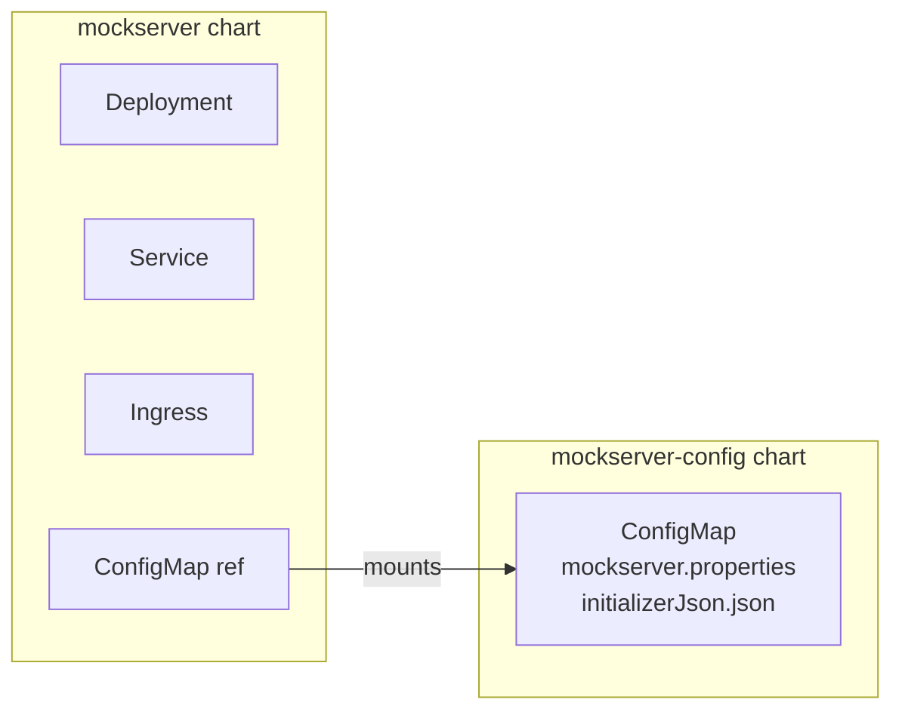
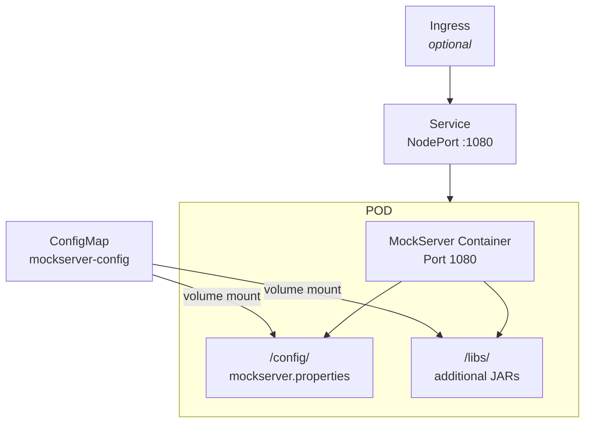
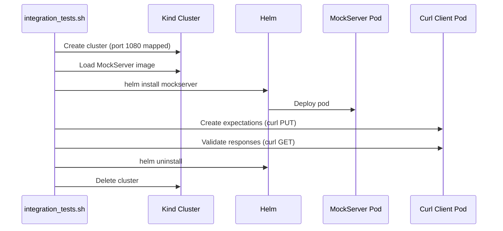

# Helm & Kubernetes

## Charts Overview

MockServer provides two Helm charts:



| Chart | Path | Version | Purpose |
|-------|------|---------|---------|
| `mockserver` | `helm/mockserver/` | 5.15.0 | Main deployment chart |
| `mockserver-config` | `helm/mockserver-config/` | 5.15.0 | Configuration ConfigMap |

## mockserver Chart

### Templates

| Template | Purpose |
|----------|---------|
| `deployment.yaml` | Single-replica Deployment with ConfigMap volume mount |
| `service.yaml` | Service (NodePort/LoadBalancer/ClusterIP) |
| `ingress.yaml` | Optional Ingress resource |
| `service-test.yaml` | Helm test pod (curl readiness check) |
| `_helpers.tpl` | Template helper functions |
| `NOTES.txt` | Post-install instructions |

### Default Values

```yaml
replicaCount: 1
app:
  logLevel: "INFO"
  serverPort: "1080"
  mountedConfigMapName: "mockserver-config"
  propertiesFileName: "mockserver.properties"
  readOnlyRootFilesystem: false
  serviceAccountName: default
  runAsUser: 65534
image:
  repository: mockserver
  snapshot: false
  pullPolicy: IfNotPresent
service:
  type: NodePort
  port: 1080
ingress:
  enabled: false
```

### Deployment Architecture



### Health Checks

- **Readiness probe:** TCP socket check on port 1080
- **Liveness probe:** TCP socket check on port 1080

### Installation

```bash
# Add the chart repo (hosted on S3)
helm repo add mockserver https://www.mock-server.com
helm repo update

# Install with defaults
helm install mockserver mockserver/mockserver

# Install with custom values
helm install mockserver mockserver/mockserver \
  --set app.serverPort=1080 \
  --set service.type=ClusterIP

# Install config chart first
helm install mockserver-config mockserver/mockserver-config
helm install mockserver mockserver/mockserver
```

## mockserver-config Chart

Provides a ConfigMap containing:

- `mockserver.properties` — server configuration
- `initializerJson.json` — pre-loaded expectations

### Template

```yaml
apiVersion: v1
kind: ConfigMap
metadata:
  name: {{ .Chart.Name }}
data:
  mockserver.properties: |-
    {{ .Files.Get "static/mockserver.properties" | nindent 4 }}
  initializerJson.json: |-
    {{ .Files.Get "static/initializerJson.json" | nindent 4 }}
```

## Chart Repository

The Helm chart repository is hosted on S3 alongside the website:

- **Bucket:** `aws-website-mockserver-nb9hq`
- **Index:** `helm/charts/index.yaml`
- **Charts:** `helm/charts/mockserver-*.tgz` (versions 5.3.0 through 5.15.0)

### Publishing a New Chart Version

```bash
# Package the chart
cd helm
helm package ./mockserver/

# Move to charts directory
mv mockserver-X.Y.Z.tgz charts/
cd charts

# Regenerate index
helm repo index .

# Upload to S3
# (manual upload via AWS Console or aws s3 cp)
```

## Kind-Based Integration Testing

The container integration tests use Kind (Kubernetes in Docker) for Helm testing:



**Kind config** (`container_integration_tests/kind-config.yaml`):

```yaml
kind: Cluster
apiVersion: kind.x-k8s.io/v1alpha4
nodes:
  - role: control-plane
    extraPortMappings:
      - containerPort: 1080
        hostPort: 1080
```
