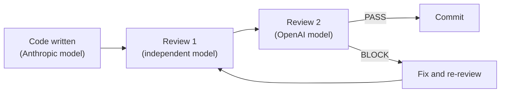
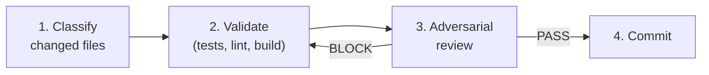

# AI-Assisted Development

How MockServer uses AI coding assistants safely, with rigorous guardrails that ensure code quality and security.

## Overview

MockServer uses AI coding assistants to accelerate development. AI does not operate autonomously or unchecked. Every AI-generated change passes through a structured harness of specialist agents, mandatory reviews, automated tests, and structural safety controls before it reaches the codebase.

The approach follows three core principles:

1. **Verify, don't trust** -- AI output is treated as a draft, never as a finished product. Every change is validated by tests, linters, and independent reviewers before commit.
2. **What you teach the AI is code** -- The instructions, rules, and knowledge that guide AI behaviour are version-controlled alongside the codebase. They are reviewed and improved like any other code.
3. **Structural enforcement over trust** -- Safety controls are enforced at the framework and configuration level, not by relying on the AI to follow instructions. Destructive operations are blocked by permission denials, not by asking nicely.

## Multi-Model Adversarial Review

Every commit receives at least two independent adversarial reviews from AI models produced by different providers. This eliminates shared blind spots that occur when the same model family reviews its own output.

### The Review Constitution

Reviews are not free-form opinions. They follow a formal **Review Constitution** with 6 core axioms and 8 structured lenses containing approximately 100 specific review principles:

| Lens | Focus | MockServer-Specific Checks |
|------|-------|---------------------------|
| Ambiguity | Vague or unclear requirements | Control plane vs data plane distinction |
| Incompleteness | Missing edge cases or error handling | ByteBuf lifecycle, ring buffer sizing, pipeline handler order |
| Inconsistency | Contradictions between components | Serialisation round-trip, client library mirroring |
| Infeasibility | Technically impossible or impractical | Java 11 compatibility, Netty version constraints |
| Insecurity (STRIDE) | Security vulnerabilities | TLS certificate validation, template injection, CORS |
| Inoperability | Operational issues | Config property documentation, Docker env vars |
| Incorrectness | Logic errors and bugs | ByteBuf ref counting, ring buffer power-of-two, Jackson serialisation |
| Overcomplexity | Unnecessary complexity | Premature abstraction, templating engine choice |

The review constitution includes LLM-specific checks that actively hunt for:
- **Hallucinated function/method/module names** that look plausible but don't exist
- **Plausible-looking but incorrect logic** that an AI might generate confidently
- **Missing error handling** that AI tools systematically omit
- **Module boundary violations** that cross architectural lines

Reviews produce a binary **PASS** or **BLOCK** verdict. No hedging.

## Specialist Agents with Least Privilege

The AI harness defines 12 specialist agents, each with its own model, tools, and permissions. An agent can only access what its role requires.

| Role | Can Write Files | Can Run Commands | Purpose |
|------|:-:|:-:|---------|
| Implementer | Yes | Yes | Writes production code and tests |
| Simplifier | Yes | Yes | Reduces code to smallest correct form |
| Code Reviewer | No | Read-only | Pre-commit quality review |
| Security Auditor | No | Read-only | Security-focused code audit |
| Review (intermediate) | No | Read-only | Adversarial review using independent model |
| Review (final) | No | Read-only | Authoritative PASS/BLOCK verdict using a different AI provider |
| Test Runner | No | Test commands only | Runs tests and reports results |
| Docs Writer | Yes | Yes | Technical documentation |
| Debugger | No | Read-only | Investigates issues via logs and CI data |
| Pipeline Investigator | No | Read-only | Analyses CI/CD failures |
| Council Seat | No | No | Design debate participant |
| Task Decomposer | Yes | Yes | Breaks specifications into task graphs |

Key design decisions:
- **Reviewers cannot edit files.** A code reviewer that can also edit code is not a reviewer.
- **Test runners cannot modify code.** They report results; they don't fix what they find.
- **The final reviewer runs on a different AI provider** (e.g., OpenAI) than the model that wrote the code (e.g., Anthropic), ensuring genuinely independent review.

## Mandatory Pre-Commit Workflow

Every commit follows a 4-step workflow. Steps cannot be skipped without explicit human override.

### Step 1: Classify Changed Files

Every changed file is classified by type (Java, Terraform, Docker, docs, config, etc.). This determines which validations run in step 2.

### Step 2: Run Category-Specific Validations

Executable verification, not static inspection:
- **Java:** `./mvnw test -pl <affected-modules>` for targeted test runs
- **Docker:** `docker build` + `hadolint` lint
- **Helm:** `helm lint` + `helm template`
- **Node.js/Python/Ruby:** Language-specific test and lint commands

### Step 3: Adversarial Code Review

After validations pass, an independent reviewer (running on a **different AI model** with a **fresh context**) performs an adversarial review using the full Review Constitution. If it issues a **BLOCK**, the code is fixed and the cycle repeats.

### Step 4: Commit

Only after tests pass and review approves. A filesystem-based commit lock prevents concurrent AI sessions from creating conflicting commits.

## The Testing Backstop

Ultimately, the strongest defence against AI-generated errors is MockServer's extensive test suite. Tests are the final arbiter of correctness -- no amount of AI review substitutes for executable verification.

### Test Suite Scale

| Metric | Value |
|--------|-------|
| Total test methods (`@Test` annotations) | **4,044** |
| Test source files (across monorepo) | **573** |
| Test source files (core Java modules) | **~435** |
| Modules with tests | **11** |

### Code Coverage (JaCoCo — All Maven Tests)

Coverage is measured by JaCoCo across both unit tests and integration tests, with cross-module coverage merged (e.g., integration tests in `mockserver-netty` that exercise `mockserver-core` classes are counted towards core's coverage).

| Module | Instruction Coverage | Line Coverage | Branch Coverage |
|--------|--------------------:|-------------:|----------------:|
| mockserver-junit-jupiter | 97.2% | 73.7% | 5.9% |
| mockserver-war | 91.8% | 84.2% | 25.0% |
| mockserver-spring-test-listener | 91.7% | 75.0% | 23.8% |
| mockserver-proxy-war | 89.9% | 78.9% | 28.6% |
| mockserver-netty | 77.8% | 61.6% | 45.2% |
| mockserver-client-java | 76.9% | 63.4% | 46.9% |
| mockserver-core | 73.3% | 64.3% | 46.2% |
| mockserver-junit-rule | 70.2% | 73.9% | 53.8% |
| mockserver-testing | 59.4% | 46.4% | 60.7% |
| **Overall (excl. examples)** | **74.1%** | **63.9%** | **46.1%** |

### Test Architecture

MockServer uses a **template-method pattern** for integration tests: abstract base classes in `mockserver-integration-testing` define hundreds of inherited test cases (e.g., `AbstractExtendedMockingIntegrationTest` has over 120 test methods). Concrete subclasses in each module inherit all tests and wire up the specific server configuration. This means a single test method in a base class exercises the same behaviour across multiple server modes (Netty, WAR, proxy).

### Tests Must Pass Before Commit

The pre-commit workflow (step 2) requires all affected module tests to pass. This is enforced structurally -- the commit step will not execute if validation fails.

## Structural Safety Controls

Beyond reviews and tests, safety is enforced at the framework configuration level:

### Permission Denials

The following operations are **denied at the configuration level** -- the AI cannot execute them regardless of what it is instructed to do:

- `git push --force` (and variants)
- `git reset --hard` (and variants)
- `git clean -fd` (and variants)
- `rm -rf` targeting `.`, `..`, `~`, `/`, or `/*`

### Parallel Session Safety

Multiple AI sessions can operate on the repository concurrently. Safety is maintained by:
- **Filesystem-based commit locking** -- only one session can commit at a time
- **Explicit path staging** -- sessions never run `git add .` or `git add -A`
- **Session-scoped file tracking** -- each session only commits files it modified

## Further Reading

- [OpenCode Configuration](opencode-configuration.md) -- full technical details of the AI harness, all 12 agents, model strategy, rules, skills, and commands
- [OpenCode Building Blocks](opencode-building-blocks.md) -- generic guide to the configuration patterns used
- [Testing](../testing.md) -- complete test framework documentation, module inventory, and coverage analysis
