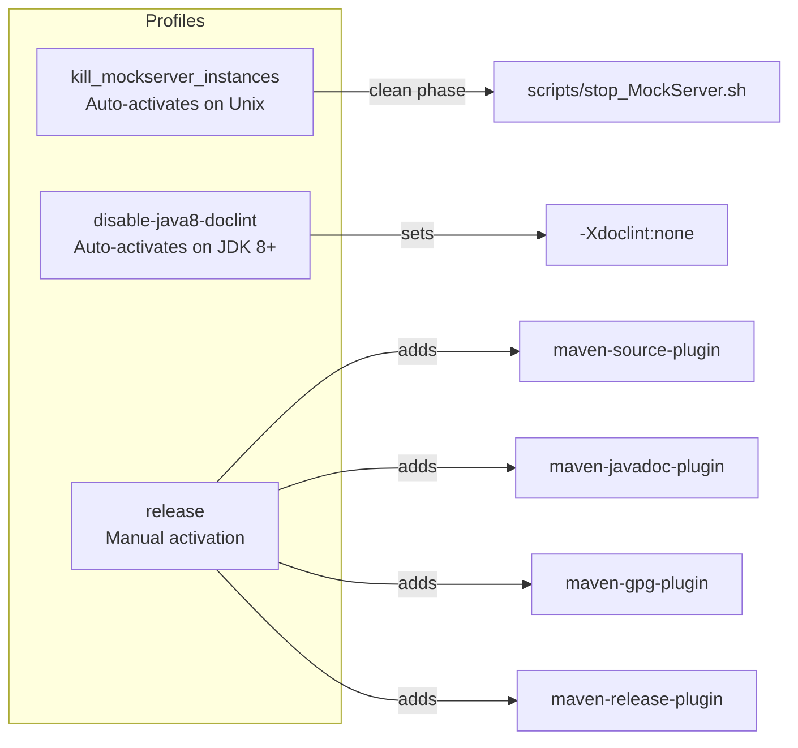
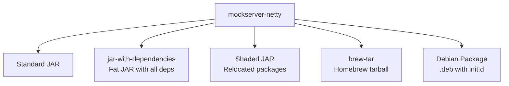

# Build System

## Monorepo Build Landscape

The monorepo contains multiple projects with different build tools:

| Directory | Build Tool | Build Command (from repo root) |
|-----------|-----------|-------------------------------|
| `mockserver/` | Maven (`./mvnw`) | `cd mockserver && ./mvnw clean install` |
| `mockserver-ui/` | Vite + npm | `cd mockserver-ui && npm ci && npm run build` |
| `mockserver-node/` | Grunt + npm | `cd mockserver-node && npm ci && npx grunt` |
| `mockserver-client-node/` | npm + TypeScript | `cd mockserver-client-node && npm ci && npm test` |
| `mockserver-client-python/` | pip + pytest | `cd mockserver-client-python && pip install -e '.[dev]' && pytest` |
| `mockserver-client-ruby/` | Bundler + RSpec | `cd mockserver-client-ruby && bundle install && bundle exec rspec` |
| `mockserver-maven-plugin/` | Maven | `cd mockserver && ./mvnw clean install -DskipTests && ./mvnw -f ../mockserver-maven-plugin/pom.xml clean verify` |
| `mockserver-performance-test/` | Locust (Python) | `cd mockserver-performance-test && python3 -m py_compile locustfile.py` |

CI builds are orchestrated by `.buildkite/scripts/generate-pipeline.sh` which selects pipelines based on changed files. See [CI/CD](../infrastructure/ci-cd.md) for details.

## Java Server Build (mockserver/)

### Maven Configuration

MockServer uses Maven 3.9.0 via the Maven Wrapper (`mvnw`). The project targets Java 11 source/target compatibility.

### Modules

The project comprises 11 Maven modules:

| Module | Packaging | Purpose |
|--------|-----------|---------|
| `mockserver-core` | jar | Domain model, matching, TLS, templates, codecs, event log, action handlers |
| `mockserver-netty` | jar (+fat, shaded) | Netty server, CLI, dashboard, proxy relay |
| `mockserver-client-java` | jar (+shaded) | Java client API (`MockServerClient`) |
| `mockserver-war` | war | Servlet WAR deployment |
| `mockserver-proxy-war` | war | Proxy-only WAR deployment |
| `mockserver-junit-rule` | jar (+shaded) | JUnit 4 `@Rule` integration |
| `mockserver-junit-jupiter` | jar (+shaded) | JUnit 5 `@ExtendWith` integration |
| `mockserver-spring-test-listener` | jar (+shaded) | Spring Test integration |
| `mockserver-testing` | jar | Shared test utilities |
| `mockserver-integration-testing` | jar (+shaded) | Integration test base classes |
| `mockserver-examples` | jar | Usage examples |

### Quick Reference

All Maven commands run from within the `mockserver/` directory:

```bash
cd mockserver

# Full build (clean + compile + test + package)
./mvnw clean install

# Build without tests
./mvnw clean install -DskipTests

# Build a single module
./mvnw clean install -pl mockserver-core

# Run unit tests only
./mvnw test -pl mockserver-netty

# Run integration tests
./mvnw verify -pl mockserver-netty
```

### Build Scripts

| Script | Purpose |
|--------|---------|
| `scripts/buildkite_quick_build.sh` | CI build — `mvnw clean install` with 8GB heap |
| `scripts/buildkite_deploy_snapshot.sh` | CI deploy — `mvnw clean deploy` to Sonatype snapshots |
| `scripts/local_quick_build.sh` | Local build — Java 17, 3 threads, includes integration tests |
| `scripts/local_online_build.sh` | Local build — Java 13, includes integration tests |
| `scripts/local_buildkite_build.sh` | Run Buildkite build locally inside Docker |
| `scripts/local_build_module_by_module.sh` | Build each module sequentially |
| `scripts/local_release.sh` | Maven release (prepare + perform) to Sonatype staging |
| `scripts/local_deploy_snapshot.sh` | Deploy SNAPSHOT via Docker container |
| `scripts/local_single_test.sh` | Run a single integration test |
| `scripts/local_single_module.sh` | Build a single module |
| `scripts/stop_MockServer.sh` | Kill running MockServer processes |
| `scripts/bash_functions.sh` | Shared shell functions library |
| `scripts/download_maven_jars.sh` | Download Maven JARs from repositories |
| `scripts/install_ca_certificate.sh` | Install CA certificates into trust stores |
| `scripts/jekyll_server.sh` | Start Jekyll development server |
| `scripts/local_docker_launch.sh` | Launch interactive Docker Maven container |
| `scripts/local_docker_push_tag.sh` | Push Docker image with tag |
| `scripts/local_generate_web_site.sh` | Generate Jekyll documentation website |
| `scripts/local_javadoc_build_all_versions.sh` | Build Javadoc for all versions |
| `scripts/local_list_versions.sh` | List project versions |
| `scripts/log_event_size_test_*.sh` | Log event size test variants (4 scripts) |

## Maven Profiles



| Profile | Activation | Purpose |
|---------|-----------|---------|
| `kill_mockserver_instances` | Auto on Unix (`/usr/bin/env` exists) | Kills existing MockServer processes during `clean` phase |
| `disable-java8-doclint` | Auto on JDK 8+ | Disables strict Javadoc linting |
| `release` | Manual (`-P release`) | Adds source JARs, Javadoc JARs, GPG signing, Maven release plugin |

## Build Plugins

| Plugin | Version | Phase | Purpose |
|--------|---------|-------|---------|
| `maven-compiler-plugin` | 3.15.0 | compile | Java 11 compilation with `-Xlint:all` |
| `templating-maven-plugin` | 3.1.0 | generate-sources | Generates version class from templates |
| `maven-jar-plugin` | 3.5.0 | package | JAR packaging with MANIFEST.MF metadata |
| `maven-clean-plugin` | 3.5.0 | clean | Removes `.log`, keystore, and temp files |
| `maven-surefire-plugin` | 3.5.5 | test | Unit tests (`*Test.java`, excludes `*IntegrationTest.java`) |
| `maven-failsafe-plugin` | 3.5.5 | integration-test | Integration tests (`*IntegrationTest.java`) |
| `maven-checkstyle-plugin` | 3.6.0 | validate | Code style enforcement via `checkstyle.xml` |
| `maven-enforcer-plugin` | 3.6.2 | validate | Dependency convergence checks |
| `exec-maven-plugin` | 3.6.3 | clean | Runs `stop_MockServer.sh` (Unix profile) |

## Test Configuration

- **Unit tests:** `*Test.java` — run during `test` phase via Surefire
- **Integration tests:** `*IntegrationTest.java` — run during `integration-test`/`verify` phases via Failsafe
- **Log level:** `mockserver.logLevel=ERROR` during tests
- **Locale:** Forced to `en-GB` (`-Duser.language=en -Duser.country=GB`)
- **Test listener:** `org.mockserver.test.PrintOutCurrentTestRunListener` for progress output

## Packaging Outputs

The `mockserver-netty` module produces multiple artifacts:



| Artifact | Classifier | Description |
|----------|-----------|-------------|
| Standard JAR | (none) | Module classes only |
| Fat JAR | `jar-with-dependencies` | All dependencies bundled (used by Docker) |
| Shaded JAR | `shaded` | Dependencies relocated to avoid conflicts |
| Homebrew tarball | `brew-tar` | Tarball for Homebrew formula |
| Debian package | (none) | `.deb` with SysV init.d and Upstart configs |

## Distribution

Artifacts are published to:

- **Central Portal** (snapshots): `https://central.sonatype.com/repository/maven-snapshots/`
- **Maven Central** (releases): via Central Portal at `https://central.sonatype.com/repository/maven-releases/`

GPG signing is required for releases (configured in the `release` profile).
