# Dependencies

## Version Properties

All managed dependency versions are declared in the root `pom.xml`:

| Property | Version |
|----------|---------|
| `maven.compiler.source/target` | `11` (Java 11) |
| `netty.version` | `4.1.89.Final` |
| `jackson.version` | `2.14.2` |
| `slf4j.version` | `2.0.6` |
| `spring.version` | `5.3.26` |
| `spring-web.version` | `5.3.25` |
| `bouncycastle.version` | `1.72` |
| `mockito.version` | `4.11.0` |
| `velocity.version` | `2.3` |
| `hamcrest.version` | `2.2` |
| `xmlunit.version` | `2.9.1` |
| `httpcomponents.version` | `4.4.1` |
| `maven-surefire-plugin.version` | `2.22.2` |
| `netty-tcnative-boringssl-static.version` | `2.0.56.Final` |

## Dependency Map

```mermaid
graph TB
    MS[MockServer Core]

    subgraph "Network"
        NETTY[Netty 4.1.89]
        TCNATIVE[tcnative-boringssl 2.0.56]
        APACHE_HTTP[HttpClient 4.5.14]
    end

    subgraph "Serialisation"
        JACKSON[Jackson 2.14.2]
        SNAKEYAML[SnakeYAML 2.0]
    end

    subgraph "Security"
        BC[BouncyCastle 1.72]
        JWT[Nimbus JOSE+JWT 9.31]
    end

    subgraph "Matching"
        JSON_SCHEMA[json-schema-validator 1.0.77]
        JSON_PATH[json-path 2.7.0]
        JSON_UNIT[json-unit-core 2.36.1]
        XMLUNIT[XMLUnit 2.9.1]
        SWAGGER[swagger-parser 2.1.12]
    end

    subgraph "Templating"
        VELOCITY[Velocity 2.3]
        MUSTACHE[JMustache 1.15]
        NASHORN[Nashorn 15.4<br/><i>Java 11+ only</i>]
    end

    subgraph "Utilities"
        GUAVA[Guava 32.0.0-jre]
        COMMONS_LANG[commons-lang3 3.12.0]
        COMMONS_IO[commons-io 2.11.0]
        CLASSGRAPH[ClassGraph 4.8.155]
        DISRUPTOR[LMAX Disruptor 3.4.4]
    end

    MS --> NETTY
    MS --> TCNATIVE
    MS --> JACKSON
    MS --> BC
    MS --> JWT
    MS --> JSON_SCHEMA
    MS --> JSON_PATH
    MS --> SWAGGER
    MS --> VELOCITY
    MS --> MUSTACHE
    MS --> GUAVA
    MS --> CLASSGRAPH
```

## Complete Dependency Inventory

### Network & HTTP

| GroupId | ArtifactId | Version | Purpose |
|---------|-----------|---------|---------|
| `io.netty` | `netty-buffer` | 4.1.89.Final | Byte buffer management |
| `io.netty` | `netty-codec` | 4.1.89.Final | Protocol codecs |
| `io.netty` | `netty-codec-http` | 4.1.89.Final | HTTP/1.1 codec |
| `io.netty` | `netty-codec-http2` | 4.1.89.Final | HTTP/2 codec |
| `io.netty` | `netty-codec-socks` | 4.1.89.Final | SOCKS proxy codec |
| `io.netty` | `netty-common` | 4.1.89.Final | Common utilities |
| `io.netty` | `netty-handler` | 4.1.89.Final | Channel handlers |
| `io.netty` | `netty-handler-proxy` | 4.1.89.Final | Proxy protocol handler |
| `io.netty` | `netty-transport` | 4.1.89.Final | Transport layer |
| `io.netty` | `netty-transport-native-unix-common` | 4.1.89.Final | Unix native transport |
| `io.netty` | `netty-resolver` | 4.1.89.Final | DNS resolver |
| `io.netty` | `netty-tcnative-boringssl-static` | 2.0.56.Final | Native TLS (BoringSSL) |
| `javax.servlet` | `javax.servlet-api` | 4.0.1 | Servlet API |
| `org.apache.httpcomponents` | `httpclient` | 4.5.14 | Apache HTTP client |
| `org.apache.tomcat.embed` | `tomcat-embed-core` | 9.0.71 | Embedded Tomcat |
| `org.apache.tomcat.embed` | `tomcat-embed-logging-juli` | 8.5.2 | Tomcat logging |
| `com.jcraft` | `jzlib` | 1.1.3 | HTTP gzip compression |

### Serialisation & Data Formats

| GroupId | ArtifactId | Version | Purpose |
|---------|-----------|---------|---------|
| `com.fasterxml.jackson.core` | `jackson-core` | 2.14.2 | JSON streaming |
| `com.fasterxml.jackson.core` | `jackson-annotations` | 2.14.2 | JSON annotations |
| `com.fasterxml.jackson.core` | `jackson-databind` | 2.14.2 | JSON object mapping |
| `com.fasterxml.jackson.dataformat` | `jackson-dataformat-yaml` | 2.14.2 | YAML support |
| `org.yaml` | `snakeyaml` | 2.0 | YAML parsing |
| `jakarta.xml.bind` | `jakarta.xml.bind-api` | 3.0.1 | XML binding API |
| `com.sun.xml.bind` | `jaxb-impl` | 4.0.2 | XML binding implementation |

### Security & Cryptography

| GroupId | ArtifactId | Version | Purpose |
|---------|-----------|---------|---------|
| `org.bouncycastle` | `bcprov-jdk18on` | 1.72 | Cryptography provider |
| `org.bouncycastle` | `bcpkix-jdk18on` | 1.72 | X.509 certificate handling |
| `com.nimbusds` | `nimbus-jose-jwt` | 9.31 | JWT token handling |

### Matching & Validation

| GroupId | ArtifactId | Version | Purpose |
|---------|-----------|---------|---------|
| `com.networknt` | `json-schema-validator` | 1.0.77 | JSON Schema validation |
| `com.jayway.jsonpath` | `json-path` | 2.7.0 | JSONPath expressions |
| `net.javacrumbs.json-unit` | `json-unit-core` | 2.36.1 | JSON comparison |
| `org.xmlunit` | `xmlunit-core` | 2.9.1 | XML comparison |
| `org.xmlunit` | `xmlunit-placeholders` | 2.9.1 | XML placeholder matching |
| `io.swagger.parser.v3` | `swagger-parser` | 2.1.12 | OpenAPI spec parsing |
| `org.mozilla` | `rhino` | 1.7.14 | JavaScript engine (swagger-parser dep) |

### Templating

| GroupId | ArtifactId | Version | Purpose |
|---------|-----------|---------|---------|
| `org.apache.velocity` | `velocity-engine-core` | 2.3 | Velocity template engine |
| `org.apache.velocity` | `velocity-engine-scripting` | 2.3 | Velocity scripting support |
| `org.apache.velocity.tools` | `velocity-tools-generic` | 3.1 | Velocity utility tools |
| `com.samskivert` | `jmustache` | 1.15 | Mustache template engine |
| `org.openjdk.nashorn` | `nashorn-core` | 15.4 | JavaScript engine (Java 11+) |
| `org.ow2.asm` | `asm` | 9.1 | Bytecode manipulation (Nashorn) |
| `org.ow2.asm` | `asm-commons` | 9.1 | ASM commons (Nashorn) |
| `org.ow2.asm` | `asm-tree` | 9.1 | ASM tree API (Nashorn) |
| `org.ow2.asm` | `asm-util` | 9.1 | ASM utilities (Nashorn) |

### Utilities

| GroupId | ArtifactId | Version | Purpose |
|---------|-----------|---------|---------|
| `com.google.guava` | `guava` | 32.0.0-jre | General utilities |
| `org.apache.commons` | `commons-lang3` | 3.12.0 | String/reflection utilities |
| `org.apache.commons` | `commons-text` | 1.10.0 | Text utilities |
| `commons-codec` | `commons-codec` | 1.15 | Encoding/decoding |
| `commons-io` | `commons-io` | 2.11.0 | I/O utilities |
| `io.github.classgraph` | `classgraph` | 4.8.155 | Classpath scanning |
| `com.fasterxml.uuid` | `java-uuid-generator` | 4.1.0 | Non-blocking UUID generation |
| `com.lmax` | `disruptor` | 3.4.4 | High-performance ring buffer |

### Logging & Monitoring

| GroupId | ArtifactId | Version | Purpose |
|---------|-----------|---------|---------|
| `org.slf4j` | `slf4j-api` | 2.0.6 | Logging facade |
| `org.slf4j` | `slf4j-jdk14` | 2.0.6 | JDK logging binding (optional) |
| `io.prometheus` | `simpleclient` | 0.16.0 | Prometheus metrics |
| `io.prometheus` | `simpleclient_httpserver` | 0.16.0 | Prometheus HTTP endpoint |

### Spring Framework

| GroupId | ArtifactId | Version | Purpose |
|---------|-----------|---------|---------|
| `org.springframework` | `spring-beans` | 5.3.26 | Bean management |
| `org.springframework` | `spring-context` | 5.3.26 | Application context |
| `org.springframework` | `spring-test` | 5.3.26 | Test support |
| `org.springframework` | `spring-web` | 5.3.25 | Web framework |
| `org.springframework` | `spring-core` | 5.3.25 | Core framework |

### Test Dependencies

| GroupId | ArtifactId | Version | Scope | Purpose |
|---------|-----------|---------|-------|---------|
| `junit` | `junit` | 4.13.2 | test | JUnit 4 |
| `org.junit.jupiter` | `junit-jupiter-engine` | 5.9.2 | test | JUnit 5 |
| `org.mockito` | `mockito-core` | 4.11.0 | test | Mocking framework |
| `org.mockito` | `mockito-junit-jupiter` | 4.11.0 | test | Mockito JUnit 5 |
| `org.hamcrest` | `hamcrest` | 2.2 | test | Assertion matchers |
| `org.hamcrest` | `hamcrest-core` | 2.2 | test | Core matchers |
| `org.skyscreamer` | `jsonassert` | 1.5.1 | test | JSON assertion |

### Transitive Dependency Overrides

These are explicitly managed to resolve version conflicts or CVEs:

| GroupId | ArtifactId | Version | Reason |
|---------|-----------|---------|--------|
| `commons-collections` | `commons-collections` | 3.2.2 | CVE fix (from velocity-tools) |
| `com.google.code.findbugs` | `jsr305` | 3.0.2 | Conflict (json-schema-validator vs guava) |
| `com.sun.activation` | `jakarta.activation` | 2.0.1 | Conflict (jakarta.xml.bind vs jaxb-core) |
| `commons-beanutils` | `commons-beanutils` | 1.9.4 | Conflict (velocity-tools vs commons-digester3) |
| `commons-logging` | `commons-logging` | 1.2 | Conflict (beanutils vs digester3 vs swagger) |

## Build Plugins

| Plugin | Version | Purpose |
|--------|---------|---------|
| `maven-compiler-plugin` | 3.10.1 | Java 11 compilation |
| `templating-maven-plugin` | 1.0.0 | Source template filtering |
| `maven-jar-plugin` | 3.3.0 | JAR packaging |
| `maven-clean-plugin` | 3.2.0 | Build cleanup |
| `maven-surefire-plugin` | 2.22.2 | Unit test execution |
| `maven-failsafe-plugin` | 2.22.2 | Integration test execution |
| `maven-checkstyle-plugin` | 3.2.1 | Code style checks (Checkstyle 9.3) |
| `maven-enforcer-plugin` | 3.2.1 | Dependency convergence |
| `exec-maven-plugin` | 3.1.0 | External script execution |
| `maven-source-plugin` | 3.2.1 | Source JAR (release profile) |
| `maven-javadoc-plugin` | 3.5.0 | Javadoc JAR (release profile) |
| `maven-gpg-plugin` | 3.0.1 | GPG signing (release profile) |
| `maven-release-plugin` | 2.5.3 | Release automation (release profile) |

## Website Dependencies

**Gemfile** (`jekyll-www.mock-server.com/Gemfile`):

| Gem | Purpose |
|-----|---------|
| `jekyll` | Static site generator |
| `jekyll-code-example-tag` | Code example formatting plugin |
