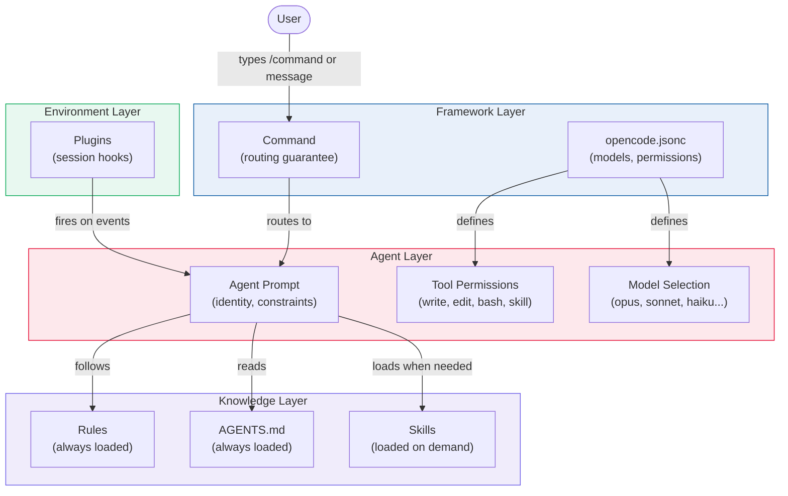
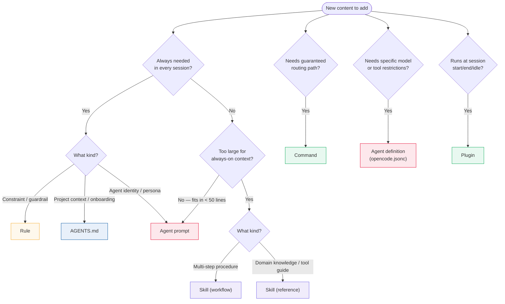
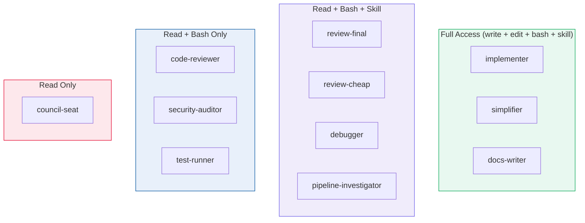
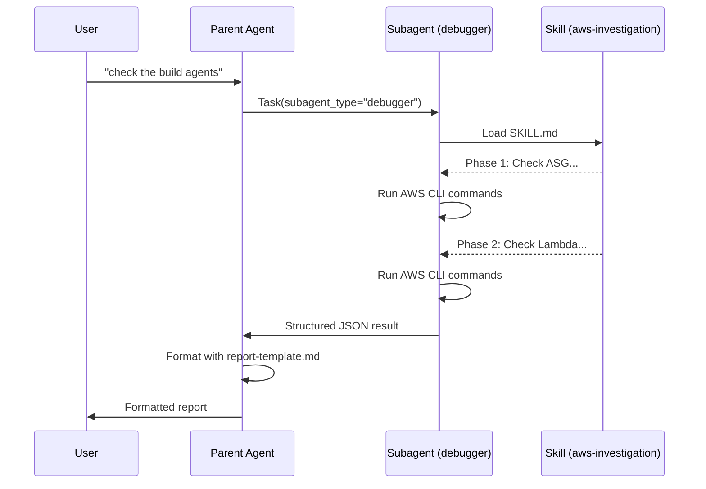
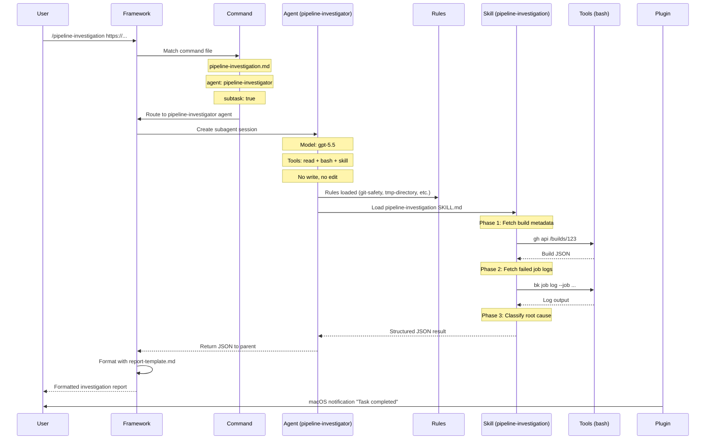

# The Anatomy of an OpenCode Configuration

A generic AI coding assistant knows how to read files, write code, and run commands. It does not know your project's module boundaries, build conventions, security policies, TLS renewal procedures, or infrastructure layout. The **configuration harness** is the layer that teaches it all of this. This document explains the building blocks of that harness, what each one controls, and when to use which.

The harness is code. It is versioned alongside the codebase it describes. Any engineer can improve it in a single commit.

This guide is generic — applicable to any project using opencode. It uses the [MockServer](https://github.com/mock-server/mockserver) project as a worked example throughout.

---

## The 9 Building Blocks

| # | Block | Location | Controls |
|---|-------|----------|----------|
| 1 | [Config](#1-config-opencodejsonc) | `opencode.jsonc` | Models, permissions, agent definitions, session behaviour |
| 2 | [Global instructions](#2-global-instructions-agentsmd) | `AGENTS.md` | Project context loaded into every session |
| 3 | [Agents](#3-agents) | `.opencode/agents/*.md` | Identity, model, tool permissions — the security boundary |
| 4 | [Rules](#4-rules) | `.opencode/rules/*.md` | Always-on mandatory constraints |
| 5 | [Skills](#5-skills) | `.opencode/skills/*/SKILL.md` | On-demand workflows and reference knowledge |
| 6 | [Commands](#6-commands) | `.opencode/commands/*.md` | Framework-level routing to agents |
| 7 | [Plugins](#7-plugins) | `.opencode/plugins/*.ts` | Session lifecycle hooks |
| 8 | [Tools](#8-tools) | `opencode.jsonc` (agent `tools` map) | What an agent can physically do |
| 9 | [References](#9-references) | `.opencode/reference/*` or inline in skills | Static domain knowledge |



---

## What Goes Where — The Decision Guide

This is the prescriptive heart of the document. When you have a piece of configuration, instruction, or workflow to add, use this flowchart to decide where it belongs.



### Quick Decision Table

| "I want to..." | Use a... | Because... |
|-----------------|----------|------------|
| Restrict an AI persona to read-only | Agent | Tool permissions are agent-level only |
| Run a 15-step investigation procedure | Skill (workflow) | Too large for always-on context, loaded on demand |
| Teach the agent how to use a browser tool | Skill (reference) | Domain knowledge, reusable across agents |
| Define review lenses for adversarial review | Rule or skill (reference) | If always loaded → rule. If only loaded for reviews → skill |
| Ensure no one force-pushes to main | Rule + config permission | Defence in depth: rule is soft (instruction), config is hard (framework block) |
| Give users a `/investigate` shortcut | Command | Framework-level routing, bypasses LLM decision-making |
| Check CI status when a session starts | Plugin | Session lifecycle hook, runs before user interaction |
| Use a premium model for implementation, a cheap model for tests | Separate agents | Model selection is per-agent |
| Document project structure and conventions | `AGENTS.md` | Loaded into every session as the AI's "onboarding doc" |

---

## 1. Config (`opencode.jsonc`)

The root configuration file. Every other building block is either defined here or discovered by convention from the `.opencode/` directory.

**What it controls:** Models, permissions, agent definitions, session behaviour (compaction, sharing), file watcher excludes.

**What it does NOT control:** Agent behaviour (that's in agent prompts), workflow steps (that's in skills), routing shortcuts (that's in commands).

### Key Fields

```jsonc
{
  // Session behaviour
  "compaction": { "auto": true, "prune": true },
  "default_agent": "plan",
  "small_model": "openai/gpt-4o-mini",

  // Global instructions — loaded into every session
  "instructions": ["AGENTS.md"],

  // File watcher — exclude build artifacts, dependencies, generated files
  "watcher": {
    "ignore": ["**/target/**", "**/node_modules/**", "**/_site/**"]
  },

  // Global permission deny-list — hard blocks at the framework level
  "permission": {
    "bash": {
      "*": "allow",
      "git push --force*": "deny",
      "git reset --hard*": "deny",
      "rm -rf /": "deny"
    }
  },

  // Agent definitions (see section 3)
  "agent": { /* ... */ }
}
```

### Design Decisions Worth Noting

| Setting | Rationale |
|---------|-----------|
| `default_agent: "plan"` | Start read-only. Prevents accidental modifications; forces deliberate switch to build mode. |
| `compaction.prune: true` | Long investigation sessions hit context limits. Auto-pruning old tool outputs keeps sessions viable. |
| `watcher.ignore` | Large codebases generate thousands of build artifacts. Excluding them saves tokens and avoids the AI indexing generated files. |
| Permission deny-list | Defence in depth. These are also covered by rules, but config-level denial is a harder guarantee — the framework blocks the command before the AI even sees it. |

---

## 2. Global Instructions (`AGENTS.md`)

A markdown file at the repo root, loaded into every session via the `instructions` array in `opencode.jsonc`. This is the AI's "onboarding document" — everything a new engineer (or AI) needs to know before touching the codebase.

**What it controls:** Project context, documentation index, team conventions, routing tables, tech stack summary.

**What it does NOT control:** Agent permissions (that's in `opencode.jsonc`), specific workflows (that's in skills), mandatory constraints (that's in rules).

### What Belongs in AGENTS.md

- Project overview and tech stack summary
- Documentation index ("consult X before modifying Y")
- Git policy (never commit without request, never amend pushed commits)
- Subagent routing table (which agent handles which task)
- Infrastructure overview (accounts, regions, key resources)
- Formatting conventions (Mermaid for diagrams, no ASCII art)

### What Does NOT Belong in AGENTS.md

- Multi-step workflows (too large — use skills)
- Guardrails that must be enforced as constraints (use rules)
- Agent-specific instructions (use agent prompts)

The test: if removing a section from `AGENTS.md` would break a *specific* workflow, it probably belongs in a skill. If it would break *every* session, it belongs in `AGENTS.md`.

---

## 3. Agents

An agent is a configured AI persona with a specific model, system prompt, and tool permissions. Agents are the **security boundary** of the system — they are the only mechanism that controls what model runs and what tools are available.

**What agents control:**
- **Model** — which LLM processes the request (the cognitive tier)
- **Identity** — the system prompt that defines behaviour, constraints, and output format
- **Tool permissions** — which tools the agent can physically call (write, edit, bash, skill)

**What agents do NOT control:**
- Workflow steps (that's skills)
- Routing from user input (that's commands)
- Cross-cutting constraints (that's rules)

### Anatomy of an Agent

An agent has two parts:

**1. The definition** in `opencode.jsonc`:

```jsonc
"code-reviewer": {
  "description": "Pre-commit code reviewer",
  "model": "openai/gpt-4o",
  "agent": ".opencode/agents/code-reviewer.md",
  "tools": {
    "write": false,
    "edit": false,
    "skill": false
  }
}
```

**2. The prompt file** at `.opencode/agents/code-reviewer.md`:

```markdown
---
mode: subagent
---
You are a code reviewer for the MockServer codebase...

## What You Do
1. Examine the git diff
2. Read surrounding context
3. Check for common issues
4. Report findings concisely

## Review Checklist
- Logic errors, null pointer dereferences
- Verify function names actually exist (LLM hallucination check)
- No secrets in logs or error messages
...
```

### The Principle: Least Privilege

Each agent has exactly the access it needs. This is enforced structurally — a read-only agent physically cannot call the write or edit tools, regardless of what instructions it receives.



Why this matters:
- A **code reviewer** cannot "fix" code instead of reporting issues — it has no write access.
- A **council seat** cannot take unilateral action — it has no bash, write, or skill access.
- A **test runner** runs `mvn test` and reports results, nothing more — it cannot modify code.
- A **debugger** can load investigation skills and run CLI commands but cannot modify the codebase.

### Model Strategy — Right Model for the Right Task

Different tasks have different cognitive demands. Using a premium model for test execution wastes money; using a cheap model for security auditing misses vulnerabilities.

| Tier | Model | Agents | Rationale |
|------|-------|--------|-----------|
| Premium | `opus-4.6` | implementer, simplifier | Highest quality for production code and complex refactoring |
| Standard | `sonnet-4.6` | code-reviewer, security-auditor, docs-writer | Strong analysis at moderate cost |
| Independent | `gpt-5.5` | review-final, debugger, pipeline-investigator | Different provider avoids "same model reviewing its own output" |
| Budget | `kimi-k2.6` | review-cheap | Non-authoritative intermediate review; cheap enough to iterate |
| Fast | `haiku-4.5` | test-runner, council-seat | Rote operations — speed over depth |

The `review-final` agent deliberately uses a different provider (OpenAI) than the implementation agents (Anthropic). This ensures the final quality gate has genuinely independent reasoning.

---

## 4. Rules

Rules are mandatory constraints loaded into every session. They encode what experienced engineers know but an AI does not. Rules are the "never do this" and "always do this" layer.

**What rules control:** Cross-cutting constraints that apply to all agents in all sessions.

**What rules do NOT control:** Workflow steps (use skills), agent identity (use agent prompts), routing (use commands).

### Rules vs Agent Prompts

| | Rule | Agent prompt |
|--|------|-------------|
| Loaded | Every session, every agent | Only when that specific agent runs |
| Scope | Cross-cutting (applies everywhere) | Agent-specific (one persona) |
| Content | Constraints and guardrails | Identity, behaviour, output format |
| Example | "Never force-push without confirmation" | "You are a code reviewer. Report findings in this format..." |

### Rules vs Skills

| | Rule | Skill |
|--|------|-------|
| Loaded | Always | On demand |
| Size | Small (< 100 lines typically) | Can be large (100-300+ lines) |
| Content | Constraints, policies, principles | Workflows, reference knowledge, tool guides |
| Example | "Use `.tmp/` not `/tmp/`" | "How to investigate a pipeline failure (15 steps)" |

### Example: `git-safety.md`

```markdown
# Git Safety — Destructive Command Protection

## NEVER Run Destructive Git Commands Without Explicit User Confirmation

| Command | Risk |
|---------|------|
| `git checkout -- .` | Reverts ALL uncommitted changes |
| `git reset --hard` | Destroys all uncommitted work |
| `git push --force` | Rewrites remote history |

### Before Running Any Destructive Command
1. Run `git status` and `git diff --stat`
2. Warn the user what will be lost
3. Suggest `git stash` as a safer alternative
4. Wait for explicit confirmation
```

This rule works at the instruction level. The config-level `permission.bash` deny-list provides a harder guarantee — even if the AI ignores the rule, the framework blocks the command. Defence in depth.

---

## 5. Skills

Skills are the **on-demand loading mechanism** for knowledge that is too large to always have in context but too important to leave to the LLM's training data.

**What skills control:** Domain-specific knowledge and procedures, loaded when a specific task is triggered.

**What skills do NOT control:** Agent identity (use agent prompts), tool permissions (use agent config), routing (use commands), always-on constraints (use rules).

### Two Subtypes of Skills

This is a critical distinction. Skills serve two very different purposes:

#### Workflow Skills

Multi-step runbooks with ordered phases, branching logic, error handling, and output templates. These describe **how to do** a complex task.

| Characteristic | Example |
|---------------|---------|
| Ordered phases | "Phase 1: Check ASG status. Phase 2: Check Lambda logs. Phase 3: ..." |
| Branching logic | "If the ASG has 0 instances, check the scaler Lambda. If the Lambda failed, check CloudWatch." |
| Error handling | "If `aws sso login` fails, prompt the user to authenticate." |
| Output templates | `report-template.md` alongside `SKILL.md` |

Examples from MockServer:
- `pipeline-investigation` — 10+ step Buildkite failure investigation
- `aws-investigation` — Phased AWS infrastructure diagnosis
- `build-monitor` — Polling loop with automated fix-push cycles
- `renew-test-certs` — Sequential certificate renewal procedure

#### Reference Skills

Domain knowledge, tool integration guides, review lenses, and factual reference material. These describe **what to know** rather than what to do.

| Characteristic | Example |
|---------------|---------|
| Factual reference | "Dependabot supports these commands: `@dependabot rebase`, `@dependabot merge`..." |
| Tool integration | "To use Chrome DevTools MCP: navigate with `navigate_page`, extract data with `evaluate_script`..." |
| Review lenses | "Check for: Java 11 compatibility, Netty ByteBuf leaks, ring buffer invariants..." |
| No strict ordering | Can be consulted in any order |

Examples from MockServer:
- `browser-auth` — How to use Chrome DevTools MCP for authenticated web UIs
- `dependabot-snyk-pr-management` — Dependabot commands, Java 11 checks, merge procedures
- `ideate` — Structured dialogue protocol for surfacing requirements

### When Should a Workflow Be a Skill vs Part of an Agent Prompt?

| Factor | → Agent prompt | → Skill |
|--------|---------------|---------|
| Size | < 50 lines | > 50 lines |
| Frequency | Needed every time the agent runs | Only needed for specific tasks |
| Reusability | Specific to one agent | Usable by multiple agents |
| Core identity | Defines what the agent *is* | Defines what the agent *does* in one scenario |

The `code-reviewer` agent's review checklist is in its agent prompt because it's needed every time the reviewer runs and is only ~40 lines. The `pipeline-investigation` workflow is a skill because it's 270 lines, only needed when investigating pipeline failures, and could theoretically be loaded by different agents.

### Skill Anatomy

```
.opencode/skills/<name>/
  SKILL.md              # Main workflow or reference content
  report-template.md    # Optional: output template for structured reports
  spec-template.md      # Optional: output template for specifications
```

The `SKILL.md` contains:
- **Trigger conditions** — when the skill should be loaded
- **Phases or sections** — the workflow steps or reference categories
- **Templates** — what "good output" looks like
- **Reference knowledge** — domain-specific facts inlined for the agent
- **Error handling** — what to do when steps fail

### Skills Inherit Agent Permissions

A skill has no permissions of its own. It inherits the permissions of whatever agent loads it. The same `browser-auth` skill behaves differently when loaded by:
- The **implementer** (full access — can write files based on what it finds in the browser)
- The **debugger** (read + bash + skill — can browse and run commands but cannot modify code)
- The **pipeline-investigator** (read + bash + skill — same as debugger)

This is why the security boundary is the **agent**, not the skill.

### Subagent-Routed Skills

Some skills are designed to run in a separate subagent session. Their description contains a routing marker:

> `MUST be launched as a Task subagent with subagent_type "debugger"`

This means: don't load the skill directly — launch a Task with the specified agent type, which will load the skill in a separate context. This keeps the parent agent's context clean and ensures the skill runs with the correct model and permissions.



---

## 6. Commands

Commands are slash shortcuts that map user-friendly invocations to specific agents. They enforce routing at the **framework level** — before the AI decides anything.

**What commands control:** Which agent handles a request. Deterministic routing.

**What commands do NOT control:** Agent behaviour (that's agent prompts), permissions (that's agent config), workflow steps (that's skills).

### Why Commands Exist

Without commands, the parent LLM decides which agent to route to. This works most of the time, but LLMs get routing wrong often enough to matter — especially when multiple agents have overlapping descriptions. Commands make routing deterministic: `/pipeline-investigation` always goes to the `pipeline-investigator` agent, every time.

Routing is enforced at three layers:

| Layer | Mechanism | Hardness |
|-------|-----------|----------|
| Convention | Skill descriptions contain routing markers (`MUST be launched as a Task subagent with subagent_type "debugger"`) | Soft — relies on LLM reading the marker |
| Framework | Command files hardcode the target agent in YAML frontmatter | Hard — framework routes before LLM decides |
| Permission | Agents can be skill-disabled by role (`"skill": false`) | Hard — agent physically cannot load skills |

### Command Anatomy

```yaml
---
description: Investigate Buildkite pipeline failures
agent: pipeline-investigator
subtask: true
---
Load the `pipeline-investigation` skill and execute it for:
$ARGUMENTS
```

- `agent` — the routing guarantee. The framework sends this to the specified agent directly.
- `subtask: true` — runs in a subagent session, keeping the parent context clean.
- `$ARGUMENTS` — replaced with whatever the user typed after the command name.

### Commands vs Skills

| | Command | Skill |
|--|---------|-------|
| Purpose | **Routing** — which agent handles this? | **Content** — what does the agent do? |
| Size | 3-8 lines (just frontmatter + a sentence) | 50-300+ lines (full workflow or reference) |
| Mechanism | YAML frontmatter parsed by the framework | Markdown loaded into agent context |
| User-facing | Yes — user types `/command-name` | No — loaded by the agent internally |

A command without a skill just routes to an agent (useful if the agent prompt is sufficient). A skill without a command can still be loaded — the LLM just has to decide to load it based on context (less reliable).

---

## 7. Plugins

Plugins are TypeScript files that hook into session lifecycle events. They run in the environment layer — they affect the session context but not the AI's reasoning directly.

**What plugins control:** Side-effects triggered by session events (session start, idle, error).

**What plugins do NOT control:** Agent behaviour, routing, permissions, or workflows.

### Plugin Anatomy

```typescript
import type { Plugin } from "@opencode-ai/plugin"

export const SessionNotification: Plugin = async ({ $ }) => {
  return {
    event: async ({ event }) => {
      if (event.type === "session.idle") {
        await $`osascript -e 'display notification "Task completed" with title "opencode"'`
      }
      if (event.type === "session.error") {
        await $`osascript -e 'display notification "Error occurred" with title "opencode" sound name "Basso"'`
      }
    },
  }
}
```

### When to Use Plugins

Plugins are for **environment-level concerns** that shouldn't be in the AI's instructions:
- Notifications (macOS, Slack, etc.)
- Status checks on session start (CI status, infrastructure health)
- Telemetry or logging
- File cleanup or setup

MockServer uses two plugins:
- `buildkite-status.ts` — checks CI status on session start, shows a toast if builds are failing
- `session-notification.ts` — sends macOS notifications when sessions complete or error

---

## 8. Tools

Tools are the capabilities an agent can physically invoke. The tool permission model is the hardest security boundary in the system — harder than rules (which rely on the LLM following instructions) and harder than config permissions (which only cover bash commands).

**What tools control:** What an agent can physically do — read files, write files, edit files, run bash commands, load skills.

### The 4 Controllable Tools

| Tool | Controls | Default |
|------|----------|---------|
| `write` | Creating new files | Allowed |
| `edit` | Modifying existing files | Allowed |
| `bash` | Running shell commands | Allowed |
| `skill` | Loading skill files | Allowed |

Read access (glob, grep, read) is always available and cannot be disabled. Every agent can read the codebase.

### How Tool Permissions Create Security Boundaries

```jsonc
// A reviewer that CANNOT modify code
"code-reviewer": {
  "tools": { "write": false, "edit": false, "skill": false }
}

// A council seat that can ONLY read
"council-seat": {
  "tools": { "write": false, "edit": false, "bash": false, "skill": false }
}

// An implementer with full access (default — all tools allowed)
"implementer": {}
```

This creates structural guarantees:
- A code reviewer reports issues. It cannot "fix" them — even if the prompt says "fix any issues you find", the tool restriction prevents it.
- A council seat emits a verdict. It cannot take action, spawn subagents, or run commands. Its only output is text.

### Tools vs Permissions

The config-level `permission.bash` deny-list and the agent-level `tools` map serve different purposes:

| | `permission.bash` | Agent `tools` map |
|--|-------------------|-------------------|
| Scope | All agents, all sessions | One specific agent |
| Granularity | Specific bash command patterns | Entire tool categories |
| Example | Block `git push --force*` | Block all file writes |
| Use case | "No agent should ever force-push" | "This agent should never write files" |

---

## 9. References

References are static knowledge files — documentation, API specs, architecture descriptions — that agents consult when they need domain context. Unlike skills, references don't contain workflows or instructions. They are pure knowledge.

**What references control:** Nothing directly. They provide context that informs the agent's decisions.

### Where References Live

References can live in several places:

| Location | When to use |
|----------|-------------|
| `.opencode/reference/` | Dedicated reference files for the harness |
| `docs/` | Project documentation that agents consult on demand |
| Inline in skills | Domain knowledge embedded directly in a skill's `SKILL.md` |
| Inline in agent prompts | Small reference tables in agent prompt files |

### References vs Rules vs Skills

| | Reference | Rule | Skill |
|--|-----------|------|-------|
| Purpose | Provide context | Enforce constraint | Provide workflow or instructions |
| Loaded | On demand (agent reads when needed) | Always | On demand (via skill tool) |
| Tone | Descriptive ("here's how X works") | Prescriptive ("you MUST do X") | Procedural ("step 1, step 2...") |
| Example | Architecture doc, API spec | "Never force-push" | "How to investigate a pipeline failure" |

In MockServer, the `docs/` directory serves as the primary reference. The `AGENTS.md` file includes a documentation index telling the agent which doc to read before modifying each area:

```markdown
| Document | When to consult |
|----------|----------------|
| docs/code/netty-pipeline.md | Before modifying Netty handlers or TLS |
| docs/code/request-processing.md | Before modifying mock matching or proxying |
| docs/operations/build-system.md | Before changing Maven config or plugins |
```

---

## How They All Fit Together — End-to-End Trace

To make the relationships concrete, let's trace a single user action through every building block.

**Scenario:** A user types `/pipeline-investigation https://buildkite.com/.../builds/123`



### What Each Block Did

| Block | Role in This Trace |
|-------|-------------------|
| **Command** (`pipeline-investigation.md`) | Guaranteed routing to `pipeline-investigator` agent. Without this, the parent LLM would have to decide which agent to use. |
| **Config** (`opencode.jsonc`) | Defined the agent's model (gpt-5.5) and tool permissions (no write/edit). Also blocked destructive bash commands globally. |
| **Agent prompt** (`pipeline-investigator.md`) | Defined the agent's identity, constraints, and output format. |
| **Rules** (`git-safety.md`, `tmp-directory.md`, etc.) | Cross-cutting constraints: don't force-push, use `.tmp/` for scratch files. |
| **Skill** (`pipeline-investigation/SKILL.md`) | The 10-step investigation workflow: what commands to run, what to look for, how to classify failures. |
| **Tools** | The agent used `bash` (to run `gh`, `bk`, `curl`) and `read` (to examine code). It could not use `write` or `edit`. |
| **Plugin** (`session-notification.ts`) | Fired a macOS notification when the session went idle. |
| **Reference** (`report-template.md`) | The parent agent used it to format the structured JSON into a readable report. |

---

## The Layered Security Model

Every constraint in the system is enforced at multiple layers. No single layer is sufficient on its own.

| Layer | Mechanism | Hardness | Example |
|-------|-----------|----------|---------|
| **Config permissions** | `permission.bash` deny-list in `opencode.jsonc` | Hard — framework blocks the command before the AI sees it | `"git push --force*": "deny"` |
| **Agent tool restrictions** | `tools: { write: false }` in agent config | Hard — agent physically cannot call the tool | Code reviewer cannot write files |
| **Rules** | `.opencode/rules/*.md` loaded as instructions | Soft — relies on LLM following instructions | "Run `git status` before any destructive command" |
| **Agent prompts** | Agent-specific constraints in prompt files | Soft — reinforces rules in the agent's persona | "You are a reviewer. Report findings. Do NOT fix code." |

Why all four? Defence in depth:
- The config blocks `git push --force` at the framework level (even if the AI tries).
- The rule explains *why* force-push is dangerous and provides safer alternatives.
- The agent prompt reinforces the constraint in the agent's identity.
- The tool restriction ensures a read-only agent cannot accidentally cause harm through write operations.

---

## Anti-Patterns

Common mistakes when setting up an opencode configuration.

| Anti-pattern | Why it fails | Fix |
|--------------|-------------|-----|
| Putting everything in `AGENTS.md` | Context window bloat — always-on content eats tokens every session | Move large workflows to skills, move constraints to rules |
| Making every agent full-access | No security boundary — a reviewer can "fix" code instead of reporting | Use `tools: { write: false }` for read-only agents |
| Skipping commands, relying on LLM routing | LLM picks the wrong agent in edge cases | Add commands for every common workflow |
| Putting tool integration guides in agent prompts | Duplicated across agents, bloats every session | Make it a reference skill, loaded on demand |
| One model for everything | Overspend on rote tasks, underspend on critical tasks | Tier models by cognitive demand |
| Workflows in rules | Rules are always loaded; a 200-line workflow wastes context in sessions that don't need it | Move workflows to skills (loaded on demand) |
| Reference knowledge in rules | Same problem — always loaded, rarely needed | Move to skills or the `docs/` directory |
| Giant skill files (500+ lines) | Eats a large chunk of the agent's context window when loaded | Split into phases or separate skills |
| Hard-coding infrastructure values in prompts | Values change; stale prompts cause wrong commands | Read from config files or Terraform state at runtime |

---

## Summary — The Orthogonal Concerns

Each building block controls exactly one concern. No block can substitute for another.

```
User input
  → Command (WHO handles this? — deterministic routing)
    → Agent (WITH WHAT? — model, tools, permissions)
      → Agent prompt (WHO AM I? — identity, constraints, output format)
      → Rules (WHAT MUST I NEVER DO? — cross-cutting guardrails)
      → Skill (HOW DO I DO THIS? — on-demand workflow or reference)
        → Tools (WHAT CAN I PHYSICALLY DO? — read, write, bash, skill)
          → References (WHAT DO I NEED TO KNOW? — domain context)

Plugins (WHAT HAPPENS AROUND THE SESSION? — lifecycle hooks)
Config (HOW IS EVERYTHING WIRED TOGETHER? — the root definition)
AGENTS.md (WHAT IS THIS PROJECT? — the onboarding doc)
```

| Concern | Block | Substitute? |
|---------|-------|-------------|
| Routing | Command | No — without commands, routing is probabilistic |
| Model selection | Agent (config) | No — only agents define which model runs |
| Tool permissions | Agent (config) | No — only agent tool maps restrict capabilities |
| Identity / persona | Agent (prompt) | No — skills and rules cannot define persona |
| Always-on constraints | Rules | No — skills are on-demand, agent prompts are per-agent |
| On-demand workflows | Skills (workflow) | Partially — could be a very long agent prompt, but wastes context |
| On-demand knowledge | Skills (reference) | Partially — could be in AGENTS.md, but wastes context if rarely needed |
| Lifecycle hooks | Plugins | No — no other block can run code at session start/end |
| Domain context | References | Partially — could be inlined in skills or prompts, but harder to maintain |
| Global wiring | Config | No — the root of everything |
