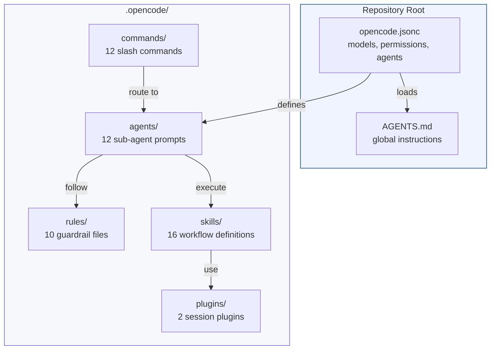
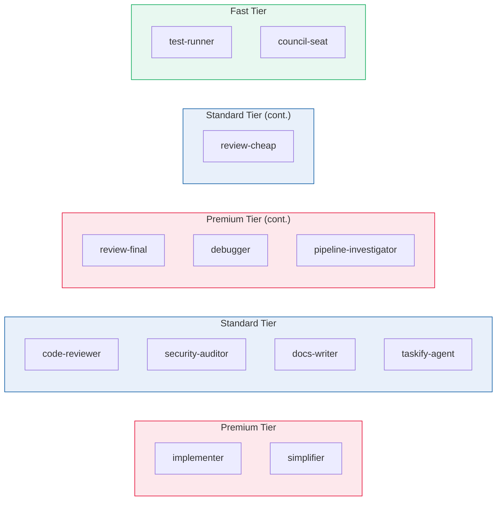
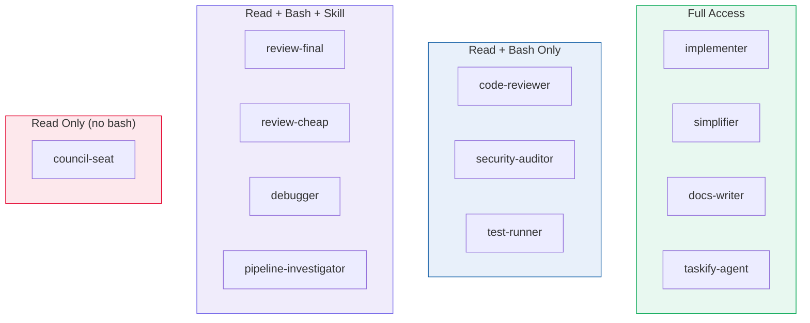
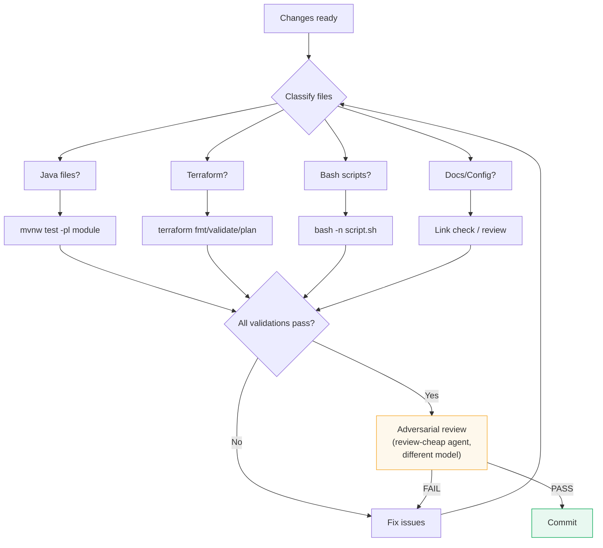
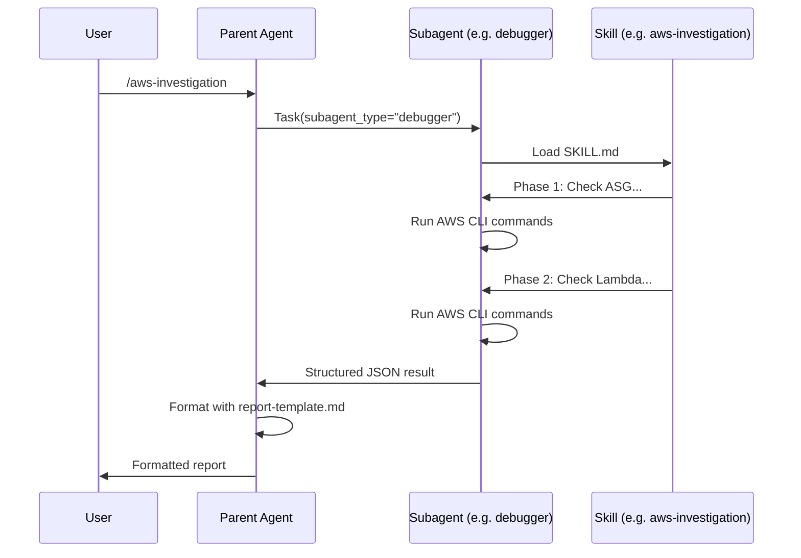
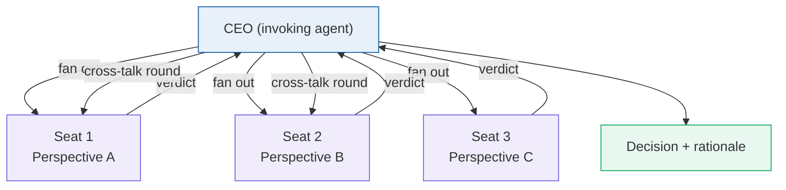
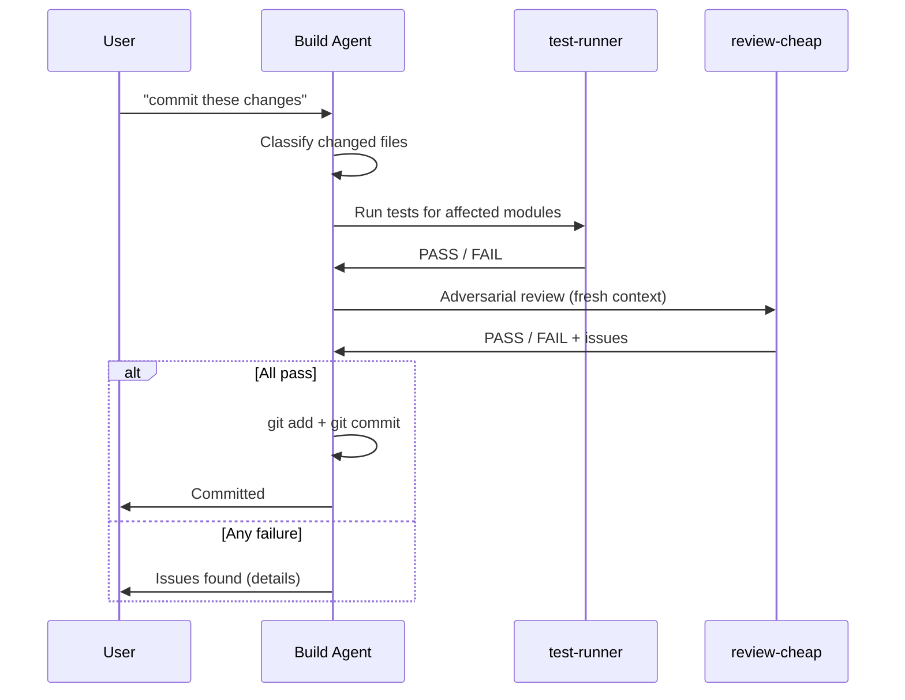

# OpenCode Configuration

How MockServer's AI-assisted engineering harness is configured, structured, and maintained. This document covers the full configuration surface: the root config file, model strategy, sub-agents, rules, skills, commands, plugins, and advanced orchestration patterns.

## Overview

A generic AI coding assistant knows how to read files, write code, and run commands. It does not know MockServer's module boundaries, Netty pipeline conventions, Maven build profiles, TLS certificate renewal procedures, or Buildkite infrastructure layout. The **harness** is the configuration layer that teaches it all of this.

The harness is code. It is versioned alongside the codebase it describes. Any engineer can improve it in a single commit.



### The 7 Building Blocks

| # | Block | Location | Purpose |
|---|-------|----------|---------|
| 1 | [Config](#building-block-1-config) | `opencode.jsonc` | Root configuration: models, permissions, agent definitions |
| 2 | [Model Strategy](#building-block-2-model-strategy) | `opencode.jsonc` (agent entries) | Right model for the right task |
| 3 | [Agents](#building-block-3-agents) | `.opencode/agents/*.md` | 12 specialist sub-agents with least-privilege access |
| 4 | [Rules](#building-block-4-rules) | `.opencode/rules/*.md` | 10 guardrails always enforced |
| 5 | [Skills](#building-block-5-skills) | `.opencode/skills/*/SKILL.md` | 16 reusable multi-step workflows |
| 6 | [Commands](#building-block-6-commands) | `.opencode/commands/*.md` | 12 slash shortcuts with guaranteed routing |
| 7 | [Plugins & Tools](#building-block-7-plugins--tools) | `.opencode/plugins/*.ts` | Session hooks and external integrations |

---

## Building Block 1: Config

The root configuration file `opencode.jsonc` controls the entire system. Every setting has a purpose.

### Annotated Config

```jsonc
{
  "$schema": "https://opencode.ai/config.json",

  // Auto-compact context in long sessions; prune old tool outputs
  "compaction": { "auto": true, "prune": true },

  // Enable /share command (manual only — no accidental sharing)
  "share": "manual",

  // Start sessions in plan mode (read-only); Tab switches to build mode
  "default_agent": "plan",

  // Cheap model for titles, summaries, and compaction
  "small_model": "openai/gpt-4o-mini",

  // Global instructions loaded into every session
  "instructions": ["AGENTS.md"],

  // File watcher excludes (saves tokens, avoids indexing build artifacts)
  "watcher": {
    "ignore": [
      "vendor/**", "**/node_modules/**", ".git/**", ".tmp/**",
      "**/target/**",     // Maven build output in all modules
      ".idea/**",         // IntelliJ project files
      "*.class", "*.jar", // Java bytecode and archives
      "**/_site/**",      // Jekyll generated site
      "**/.sass-cache/**",// Jekyll SCSS cache
      "terraform/**/.terraform/**",
      "build-*/**"        // Downloaded Buildkite logs
    ]
  },

  // Global permissions: allow bash, deny destructive git and rm
  "permission": {
    "bash": {
      "*": "allow",
      "git push --force*": "deny",
      "git reset --hard*": "deny",
      "git clean -fd*": "deny",
      "rm -rf .": "deny",
      "rm -rf ..": "deny",
      "rm -rf ~": "deny",
      "rm -rf /": "deny",
      "rm -rf /*": "deny"
    }
  },

  // 12 sub-agents defined (see Building Block 3)
  "agent": { /* ... */ }
}
```

### Key Design Decisions

| Setting | Value | Rationale |
|---------|-------|-----------|
| `default_agent: "plan"` | Start read-only | Prevents accidental modifications; forces deliberate switch to build mode |
| `compaction.prune: true` | Auto-prune old context | MockServer's codebase is large; long investigation sessions would otherwise hit context limits |
| `watcher.ignore` includes `**/target/**` | Skip Maven output | Module `target/` directories contain thousands of generated files |
| `watcher.ignore` includes `**/_site/**` | Skip Jekyll output | Generated HTML should never be edited directly |
| Permission deny-list | 8 destructive patterns | Defence in depth — these are also blocked by `git-safety.md` rules, but config-level denial is a harder guarantee |

### AGENTS.md — The Global Instruction File

`AGENTS.md` at the repo root is loaded into every session via the `instructions` array. It contains:

- Project overview and tech stack summary
- Documentation index (which doc to consult before modifying each area)
- AWS account IDs and prerequisites
- Buildkite agent infrastructure details
- Git policy (never commit without request, never amend pushed commits)
- Parallel session safety rules
- Pre-commit workflow summary
- Subagent routing table
- Diagrams and formatting conventions

This file acts as the agent's "onboarding document" — everything a new engineer (or AI) needs to know before touching the codebase.

---

## Building Block 2: Model Strategy

Different tasks have different cognitive demands. Using a premium model for test execution wastes money; using a cheap model for security auditing misses vulnerabilities. MockServer uses 5 model tiers:



| Tier | Model | Agents | Rationale |
|------|-------|--------|-----------|
| **Premium** | `openai/o3` | implementer, simplifier, review-final, debugger, pipeline-investigator | Highest capability for production code, complex refactoring, and authoritative review |
| **Standard** | `openai/gpt-4o` | code-reviewer, security-auditor, docs-writer, taskify-agent, review-cheap | Strong analysis and writing at moderate cost |
| **Fast** | `openai/gpt-4o-mini` | test-runner, council-seat | Rote operations (run tests, emit short verdicts) — speed over depth |

### Provider Strategy

opencode uses OpenAI models exclusively. Claude Code (`.claude/`) uses Anthropic models exclusively. Independence between the implementation and review agents is achieved at two levels:

1. **Model tier**: `review-cheap` (`gpt-4o`) and `review-final` (`o3`) run on different model tiers than `implementer` (`o3`), but more importantly they run with a **fresh context** — the reviewer never sees the implementing agent's reasoning, only the diff.
2. **Cross-tool independence**: When switching between tools, a Claude Code session reviews OpenAI-generated work and vice versa, providing genuine cross-provider independence at the workflow level.

---

## Building Block 3: Agents

Each sub-agent is a configured AI persona with a specific model, system prompt, allowed tools, and permissions. The principle is **least privilege** — each agent has exactly the access it needs.

### Agent Roster

| Agent | Model Tier | Role | Write | Edit | Bash | Skill |
|-------|-----------|------|:-----:|:----:|:----:|:-----:|
| **implementer** | Premium | Writes production code and tests | Y | Y | Y | Y |
| **simplifier** | Premium | Reduces code to smallest correct form | Y | Y | Y | Y |
| **docs-writer** | Standard | Architecture docs, ADRs, READMEs | Y | Y | Y | Y |
| **taskify-agent** | Standard | Breaks specs into structured task graphs | Y | Y | Y | Y |
| **code-reviewer** | Standard | Pre-commit correctness, security, conventions | - | - | Y | - |
| **security-auditor** | Standard | Security-focused Java/Netty audits | - | - | Y | - |
| **review-final** | Premium | Authoritative binding PASS/BLOCK verdict | - | - | Y | Y |
| **review-cheap** | Standard | Non-authoritative intermediate review | - | - | Y | Y |
| **debugger** | Premium | Investigates issues using logs, CI, AWS | - | - | Y | Y |
| **pipeline-investigator** | Premium | Buildkite pipeline failure analysis | - | - | Y | Y |
| **test-runner** | Fast | Runs Maven tests, reports results | - | - | Y | - |
| **council-seat** | Fast | Design council parallel debate seat | - | - | - | - |

### Tool Restrictions Explained



- **Code reviewers** cannot write or edit files — they can only read and report. This prevents a reviewer from "fixing" code instead of reporting issues.
- **The debugger** can load skills for structured investigations (for example `aws-investigation`) while still using bash for ad-hoc probing.
- **Council seats** have no bash, write, edit, or skill access — they can only read code and emit a verdict. This prevents a debate participant from taking unilateral action.
- **Test runner** cannot write files — it runs `mvn test` and reports results, nothing more.

### Agent Prompt Files

Each agent's behaviour is defined in a markdown file at `.opencode/agents/<name>.md`. These files contain:

- Role definition and boundaries
- Specific instructions for the agent's domain
- Output format requirements
- What the agent must never do

Example: the `code-reviewer.md` includes a checklist for LLM-specific issues (hallucinated method names, plausible-but-wrong logic, missing error handling, leaked secrets) that a human reviewer might miss.

---

## Building Block 4: Rules

Rules are mandatory constraints loaded into sessions. They encode what experienced engineers know but an AI does not.

### Rule Catalogue

| Rule | Lines | Always Loaded | Purpose |
|------|------:|:------------:|---------|
| `git-safety.md` | 56 | Yes | Blocks 11 destructive git commands without confirmation |
| `commit-workflow.md` | 202 | Yes | 4-step pre-commit workflow with adversarial review |
| `commit-locking.md` | 311 | Yes | Filesystem-based commit lock for parallel session safety |
| `testing-policy.md` | 69 | Yes | Maven module mapping, test commands, quality standards |
| `tmp-directory.md` | 134 | Yes | Use `.tmp/` at repo root, never `/tmp/` |
| `report-formatting.md` | 154 | Yes | Subagent JSON → report template formatting convention |
| `review-constitution.md` | 223 | Yes | 8-lens adversarial review with ~100 review principles |
| `mermaid-diagrams.md` | 86 | Yes | Mermaid diagram conventions and formatting rules |
| `coding-principles.md` | 29 | Yes | Think before coding, simplicity first, surgical changes |
| `aws-ids-file.md` | 31 | Yes | Require `~/mockserver-aws-ids.md` before AWS operations |

### git-safety.md — Banned Commands

Key commands blocked without explicit user confirmation:

| Banned Command | Safer Alternative |
|---------------|-------------------|
| `git checkout -- <file>` | `git stash` first |
| `git restore <file>` | `git stash` first |
| `git clean -fd` | `git clean -n` (dry run) |
| `git reset --hard` | `git reset --soft` or `git stash` |
| `git stash drop` / `git stash clear` | Keep stashes |
| `git branch -D` | `git branch -d` (safe delete) |
| `git push --force` | `git push --force-with-lease` |
| `git rebase` on shared branches | Merge instead |

These are enforced at two levels: the config file's `permission.bash` deny-list (hard block) and the rule file (instruction-level reinforcement).

### commit-workflow.md — The 4-Step Pre-Commit Process



The adversarial review (Step 3) is critical: the `review-cheap` agent (`gpt-4o`) runs with a fresh context, specifically scanning for LLM-generated issues — hallucinated names, plausible but wrong logic, missing error handling, and accidentally committed secrets. The `review-final` agent (`o3`) provides the binding verdict.

Skip conditions exist for speed: `"skip tests"` skips validation, `"skip review"` skips the adversarial review, `"just commit"` skips both. These are used when the user is confident in the change.

---

## Building Block 5: Skills

A skill is a self-contained multi-step workflow — a runbook the agent executes autonomously. Complex tasks like "investigate a pipeline failure" or "renew TLS certificates" involve 10-15 coordinated steps. Without a skill, the user would guide the agent manually every time.

### Skill Catalogue

| Skill | Files | Subagent-Routed | Trigger Examples |
|-------|------:|:---------------:|-----------------|
| `aws-investigation` | SKILL.md + report-template.md | Yes (`debugger`) | "build agents not running", "EC2 issues", "ASG scaling" |
| `pipeline-investigation` | SKILL.md + report-template.md | Yes (`pipeline-investigator`) | "pipeline failing", "build errors", Buildkite URLs |
| `ideate` | SKILL.md + spec-template.md | No | "I have an idea", "let's think through", "brainstorm" |
| `pr-review` | SKILL.md | No | "review PRs", "PR report", "open PRs" |
| `pr-monitor` | SKILL.md | No | "monitor PRs", "auto-merge PRs", "watch dependency PRs" |
| `renew-test-certs` | SKILL.md | No | "certificates expired", "TLS tests failing" |
| `review-code` | SKILL.md | No | "deep code review", "adversarial review", "quality audit" |
| `review-spec` | SKILL.md | No | "spec review", "design review", "review this plan" |
| `browser-auth` | SKILL.md | No | "navigate to buildkite", "extract token from browser" |
| `dependabot-snyk-pr-management` | SKILL.md | No | "dependabot PR", "snyk PR", "dependency upgrade" |
| `dockerhub-credentials` | SKILL.md | No | "docker hub token", "configure docker hub" |
| `terraform-tfvars` | SKILL.md | No | "create tfvars", "deploy buildkite agents" |
| `docker-build-push` | SKILL.md | No | "build docker image", "push maven image", "rebuild CI image" |
| `issue-review` | SKILL.md | No | "review issue", "triage issue", "is this a bug" |
| `build-monitor` | SKILL.md | No | "monitor builds", "watch pipeline", "continuous monitoring" |

### Skill Anatomy

Each skill directory contains:

```
.opencode/skills/<name>/
  SKILL.md              # Main workflow definition (phases, steps, examples)
  report-template.md    # Optional: output template for structured reports
  spec-template.md      # Optional: output template for specifications
```

The `SKILL.md` file contains:
- **Trigger conditions** — when the skill should be loaded
- **Phase definitions** — ordered steps the agent follows
- **Templates** — what "good output" looks like
- **Reference knowledge** — domain-specific facts inlined for the agent
- **Error handling** — what to do when steps fail

### Subagent Routing Convention

Subagent routing is defined outside skills. Skills are never responsible for declaring their own dispatch mechanism.

Use:
- command metadata (`agent` + `subtask: true`) for slash-command routing,
- `.opencode/rules/subagent-routing.md` for conversational routing,
- `opencode.jsonc` permissions to prevent invalid direct loads by restricted agents.



This separation ensures:
- The subagent runs with the correct model and tool permissions
- The parent agent's context stays clean (no AWS CLI output bloat)
- The report format is consistent (template-driven)

---

## Building Block 6: Commands

Commands are slash shortcuts that map user-friendly invocations to specific agents and, when needed, skills. They enforce routing at the **framework level** — before the AI makes a decision.

### Command Catalogue

| Command | Agent | Subtask | Purpose |
|---------|-------|:-------:|---------|
| `/aws-investigation` | `debugger` | Yes | Investigate AWS infrastructure issues |
| `/pipeline-investigation` | `pipeline-investigator` | Yes | Investigate Buildkite pipeline failures |
| `/review-code` | `review-final` | Yes | Deep code audit |
| `/review-spec` | `review-final` | Yes | Critical review of spec/design document |
| `/codebase-change-report` | `docs-writer` | Yes | Generate report of recent changes |
| `/update-architecture-docs` | `docs-writer` | Yes | Review and update architecture docs |
| `/design-council` | `general` | Yes | Convene parallel design council debate |
| `/excalidraw` | `general` | Yes | Generate .excalidraw architecture diagrams |
| `/codeql-scan` | `security-auditor` | Yes | Run CodeQL security scan on Java code |
| `/issue-review` | (default) | No | Review, classify, and resolve a GitHub issue |
| `/commit` | (default) | No | Commit changes following full pre-commit workflow |

### Command File Anatomy

Each command is a small markdown file with YAML frontmatter:

```yaml
---
description: Investigate Buildkite pipeline failures
agent: pipeline-investigator
subtask: true
---
Load the `pipeline-investigation` skill and execute it for:
$ARGUMENTS
```

The `agent` field is the routing guarantee. When a user types `/pipeline-investigation https://buildkite.com/.../builds/123`, the framework routes directly to the `pipeline-investigator` agent — the LLM never decides which agent handles the request.

The `subtask: true` field means the command runs in a subagent session, keeping the parent context clean.

### Why Framework-Level Routing Matters

Routing is the single biggest practical failure mode of multi-agent setups. MockServer uses three enforcement layers:

| Layer | Mechanism | Example |
|-------|-----------|---------|
| **Routing rule** | Conversational mapping in `.opencode/rules/subagent-routing.md` | `pipeline-investigation -> pipeline-investigator` |
| **Framework** | Command files hardcode the target agent | `agent: pipeline-investigator` in frontmatter |
| **Permission** | Read-only agents can be skill-disabled by role | `code-reviewer` has `"skill": false` in config |

---

## Building Block 7: Plugins & Tools

### Plugins

Plugins are TypeScript files that hook into session lifecycle events. MockServer has two:

| Plugin | Purpose |
|--------|---------|
| `buildkite-status.ts` | On session start, queries Buildkite API for the 5 most recent builds. Shows a toast warning if any are failing. Writes details to `.tmp/.buildkite-status`. Throttled to once per hour. |
| `session-notification.ts` | Sends macOS notifications via `osascript` when a session goes idle ("Task completed") or errors (with "Basso" sound). |

Plugins require the `@opencode-ai/plugin` npm package (defined in `.opencode/package.json`).

### Chrome DevTools MCP

The `browser-auth` skill documents how to use the Chrome DevTools MCP server to interact with authenticated web UIs (Buildkite, AWS Console, GitHub). This enables skills like `terraform-tfvars` to extract Buildkite agent tokens directly from the Buildkite UI.

### Custom Tools via Bash

Unlike TDP (which has 17 dedicated Python tool packages for Splunk, New Relic, Jira, etc.), MockServer's tools are simpler — the agent uses bash directly to run:
- `gh` (GitHub CLI) for PR management and issue queries
- `aws` CLI for infrastructure investigation
- `mvn` / `mvnw` for builds and tests
- `openssl` for certificate operations
- `docker` for container operations
- `helm` for Kubernetes deployment

This works well for MockServer's scope. The skills contain the domain knowledge (which commands to run, in what order, how to interpret output) while bash provides the execution.

---

## Advanced Patterns

### Design Council — Parallel Agent Debate

For non-trivial decisions that cross domains, the `/design-council` command convenes a panel of `council-seat` agents that debate in parallel. The invoking agent acts as CEO — convening, routing, and arbitrating.



Key properties:
- Each seat is a separate subagent with its own context (no shared priors, no groupthink)
- Seats emit structured verdicts: APPROVE, CONCERNS, or BLOCK with cited evidence (`file:line`)
- Council seats are read-only (no bash, write, edit, or skill) — they cannot take action
- The CEO can run up to 3 brokered rounds where dissent is routed between seats
- Output is a one-page decision log committed alongside code

### Subagent Report Pattern

Investigation skills (aws-investigation, pipeline-investigation) follow a structured pattern:

1. **Subagent investigates** — runs commands, gathers data, produces structured JSON
2. **Parent reads template** — loads `report-template.md` from the skill directory
3. **Parent formats** — maps JSON fields to the template, producing a readable report
4. **Parent presents** — shows the formatted report to the user

This separation means the investigation logic and the presentation logic are independently maintainable.

### Commit Workflow Orchestration

The pre-commit workflow (documented in `.opencode/rules/commit-workflow.md`) chains multiple agents:



---

## Directory Structure

```
mockserver/
├── opencode.jsonc                          # Root config (models, permissions, agents)
├── AGENTS.md                               # Global instructions (loaded every session)
└── .opencode/
    ├── .gitignore                           # Ignores node_modules, package.json, bun.lock
    ├── package.json                         # Plugin dependency (@opencode-ai/plugin)
    ├── IMPROVEMENTS.md                      # Applied and planned improvements
    ├── agents/                              # 12 sub-agent prompt files
    │   ├── code-reviewer.md
    │   ├── council-seat.md
    │   ├── debugger.md
    │   ├── docs-writer.md
    │   ├── implementer.md
    │   ├── pipeline-investigator.md
    │   ├── review-cheap.md
    │   ├── review-final.md
    │   ├── security-auditor.md
    │   ├── simplifier.md
    │   ├── taskify-agent.md
    │   └── test-runner.md
    ├── rules/                               # 10 guardrail files
    │   ├── aws-ids-file.md
    │   ├── coding-principles.md
    │   ├── commit-locking.md
    │   ├── commit-workflow.md
    │   ├── git-safety.md
    │   ├── mermaid-diagrams.md
    │   ├── report-formatting.md
    │   ├── review-constitution.md
    │   ├── testing-policy.md
    │   └── tmp-directory.md
    ├── skills/                              # 16 skill workflows
    │   ├── aws-investigation/
    │   │   ├── SKILL.md
    │   │   └── report-template.md
    │   ├── browser-auth/
    │   │   └── SKILL.md
    │   ├── build-monitor/
    │   │   └── SKILL.md
    │   ├── dependabot-snyk-pr-management/
    │   │   └── SKILL.md
    │   ├── docker-build-push/
    │   │   └── SKILL.md
    │   ├── dockerhub-credentials/
    │   │   └── SKILL.md
    │   ├── ideate/
    │   │   ├── SKILL.md
    │   │   └── spec-template.md
    │   ├── issue-review/
    │   │   └── SKILL.md
    │   ├── pipeline-investigation/
    │   │   ├── SKILL.md
    │   │   └── report-template.md
    │   ├── pr-monitor/
    │   │   └── SKILL.md
    │   ├── pr-review/
    │   │   └── SKILL.md
    │   ├── release-management/
    │   │   └── SKILL.md
    │   ├── renew-test-certs/
    │   │   └── SKILL.md
    │   ├── review-code/
    │   │   └── SKILL.md
    │   ├── review-spec/
    │   │   └── SKILL.md
    │   └── terraform-tfvars/
    │       └── SKILL.md
    ├── commands/                             # 12 slash commands
    │   ├── aws-investigation.md
    │   ├── codebase-change-report.md
    │   ├── codeql-scan.md
    │   ├── commit.md
    │   ├── design-council.md
    │   ├── excalidraw.md
    │   ├── issue-review.md
    │   ├── pipeline-investigation.md
    │   ├── prepare-release.md
    │   ├── review-code.md
    │   ├── review-spec.md
    │   └── update-architecture-docs.md
    ├── plugins/                             # 2 session plugins
    │   ├── buildkite-status.ts
    │   └── session-notification.ts
    └── plans/                               # Plan documents
        ├── ai-developer-experience-spec.md
        ├── fix-control-plane-tls-1766.md
        ├── fix-verify-false-positive-1757.md
        └── python-ruby-release-infrastructure.md
```

---

## Maintenance

When modifying the opencode configuration:

- **Adding an agent**: Add the entry to `opencode.jsonc`, create the prompt file in `.opencode/agents/`, update the routing table in `AGENTS.md`, and update this document.
- **Adding a skill**: Create the skill directory under `.opencode/skills/`, add a `SKILL.md`, optionally add templates. If the skill requires subagent routing, create a corresponding command file and add the conversational mapping in `.opencode/rules/subagent-routing.md`.
- **Adding a rule**: Create the rule file in `.opencode/rules/`. Rules are automatically loaded based on filename conventions.
- **Changing model assignments**: Update the `model` field in the agent's entry in `opencode.jsonc`. No other files need to change.
- **Adding a command**: Create a markdown file in `.opencode/commands/` with YAML frontmatter specifying the target agent.
- **Adding a plugin**: Create the TypeScript file in `.opencode/plugins/`. Ensure `@opencode-ai/plugin` is in `.opencode/package.json`.
- **Validation**: Run `./scripts/validate_opencode_config.sh` to catch broken command→skill references, command→agent mismatches, subagent-routing drift, and hardcoded infrastructure literals.
