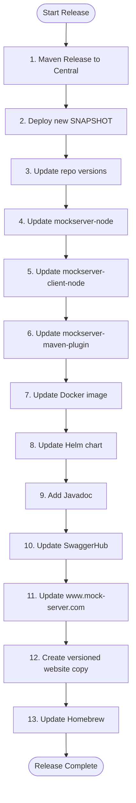
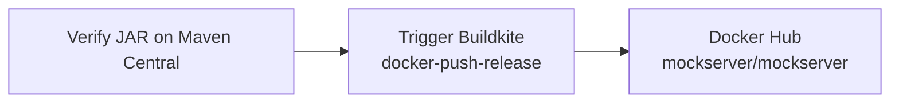
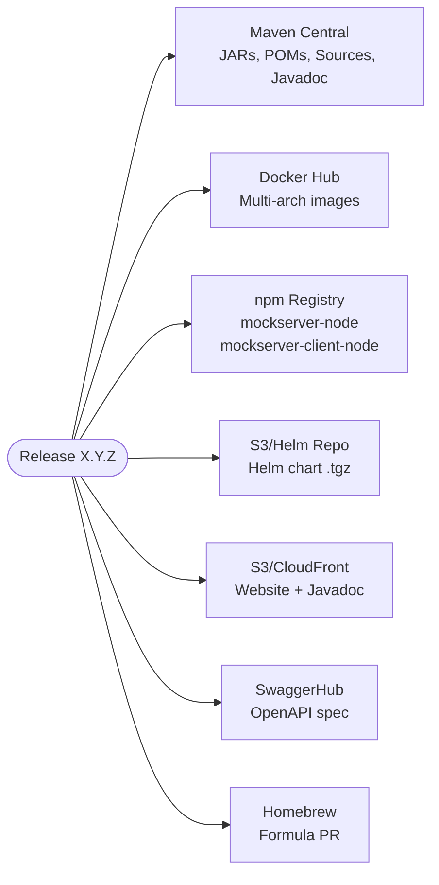

# Release Process

## Overview

MockServer releases are a manual 13-step process spanning multiple repositories, registries, and hosting platforms.



## Step Details

### 1. Publish Release to Maven Central

```bash
./scripts/local_release.sh
```

Then in the Sonatype UI:
1. Go to https://oss.sonatype.org/index.html#stagingRepositories
2. Find the staging repository
3. **Close** the repository (triggers validation)
4. **Release** the repository (auto-drops after sync to Central)

### 2. Publish New SNAPSHOT

```bash
./scripts/local_deploy_snapshot.sh
```

Deploys the next SNAPSHOT version to Sonatype snapshots repository.

### 3. Update Repository

1. Update `changelog.md`
2. Update `README.md`
3. Clean build artifacts: `./mvnw clean && rm -rf jekyll-www.mock-server.com/_site`
4. Update `jekyll-www.mock-server.com/_config.yml` with new version numbers
5. Find-and-replace version references across the codebase:
   - Release version (e.g., `5.15.0`)
   - API version (e.g., `5.15.x`)
   - SNAPSHOT version (e.g., `5.15.1-SNAPSHOT` → `5.16.1-SNAPSHOT`)
6. Commit and push

### 4. Update mockserver-node (Separate Repository)

```bash
git pull --rebase
rm -rf package-lock.json node_modules
# Update version references
nvm use v16.14.1
npm i && npm audit fix
grunt
git add -A && git commit -m "upgraded to MockServer X.Y.Z"
git push origin master && git tag mockserver-X.Y.Z && git push origin --tags
npm login
npm publish --access=public --otp=****
```

### 5. Update mockserver-client-node (Separate Repository)

Same process as step 4, without `npm audit fix`.

### 6. Update mockserver-maven-plugin (Separate Repository)

1. Update parent POM, jar-with-dependencies, and integration-testing versions from SNAPSHOT to RELEASE
2. Deploy snapshot: `./scripts/local_deploy_snapshot.sh`
3. Commit and push
4. Release: `./scripts/local_release.sh`
5. Close and release on Sonatype
6. Update versions back to new SNAPSHOT
7. Deploy new snapshot
8. Commit and push

### 7. Update Docker Image



1. Verify the release JAR is available:
   ```bash
   curl -v https://oss.sonatype.org/service/local/artifact/maven/redirect\?r\=releases\&g\=org.mock-server\&a\=mockserver-netty\&c\=shaded\&e\=jar\&v\=RELEASE
   ```
2. Trigger the Buildkite `docker-push-release` pipeline with `RELEASE_TAG=mockserver-X.Y.Z`

### 8. Update Helm Chart

```bash
# Update version in Chart.yaml
cd helm
helm package ./mockserver/
mv mockserver-X.Y.Z.tgz charts/
cd charts
helm repo index .
# Upload chart + index.yaml to S3 bucket
```

### 9. Add Javadoc

```bash
git checkout mockserver-X.Y.Z
export JAVA_HOME=$(/usr/libexec/java_home -v 1.8)
./mvnw javadoc:aggregate -P release \
  -DreportOutputDirectory='/path/to/javadoc/X.Y.Z'
# Upload to S3 bucket under /versions/X.Y.Z/
git checkout master
```

### 10. Update SwaggerHub

1. Update OpenAPI spec in `mockserver-core/src/main/resources/org/mockserver/openapi/mock-server-openapi-embedded-model.yaml`
2. Create new version on https://app.swaggerhub.com/apis/jamesdbloom/mock-server-openapi
3. Publish the version

### 11. Update www.mock-server.com

```bash
cd jekyll-www.mock-server.com
rm -rf _site
bundle exec jekyll build
# Upload _site/ to the main website S3 bucket (see ~/mockserver-aws-ids.md)
# Invalidate CloudFront cache for main distribution (see ~/mockserver-aws-ids.md, path /*)
```

### 12. Create Versioned Website Copy (Major/Minor Releases)

For significant releases, create a versioned copy of the documentation:

1. Create new S3 bucket with public access **blocked** (all 4 flags)
2. Enable server-side encryption (AES-256)
3. Upload built `_site/` to new bucket
4. Create CloudFront distribution with OAC (copy existing settings, set default root object to `index.html`)
5. Set bucket policy to allow only the new CloudFront distribution via `cloudfront.amazonaws.com` service principal
6. Create Route53 A record aliased to new CloudFront distribution

See `~/mockserver-aws-ids.md` for the OAC ID to attach to the new distribution.

### 13. Update Homebrew

```bash
brew doctor
# Fork/reset homebrew-core
brew update
HOMEBREW_GITHUB_API_TOKEN=<token> \
  brew bump-formula-pr --strict mockserver \
  --url="https://search.maven.org/remotecontent?filepath=org/mock-server/mockserver-netty/X.Y.Z/mockserver-netty-X.Y.Z-brew-tar.tar"
```

## Release Artifacts Summary



## Cleaning Up a Failed Release

If a release fails partway through:

```bash
# Revert git to pre-release state
git reset --hard <commit-hash>
git push --force

# Delete the release tag
git tag -d mockserver-X.Y.Z
git push origin :refs/tags/mockserver-X.Y.Z

# Drop staging repository on Sonatype
# https://oss.sonatype.org/#stagingRepositories
```

## GPG Signing Setup

Release signing requires GPG configuration. See `scripts/deploy.md` for:
- GPG key setup
- Sonatype `settings.xml` configuration
- Troubleshooting `gpg: signing failed: Inappropriate ioctl for device` (fix: `export GPG_TTY=$(tty)`)
