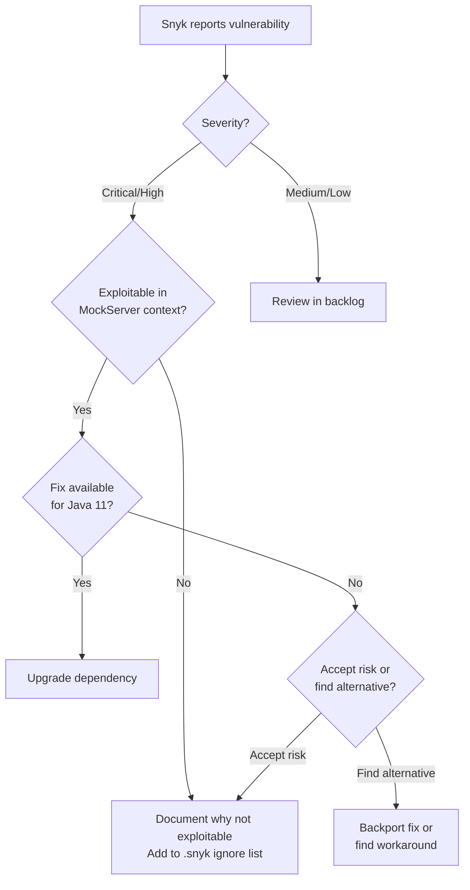

# Snyk Security Scanning

## Overview

MockServer uses [Snyk](https://snyk.io) for continuous security vulnerability scanning of Maven dependencies. Snyk automatically scans pull requests and reports vulnerabilities before they are merged.

## Integration Points

### PR Status Checks

Snyk runs automatically on all pull requests via two integrations:

1. **`security/snyk (mockserver)`** - Scans against the `mockserver` organization
2. **`security/snyk (jamesdbloom)`** - Scans against the personal organization

Both checks must pass for a PR to be merged. Results are visible in the PR status checks with links to detailed reports on app.snyk.io.

### Web Dashboard

**URL:** https://app.snyk.io/org/mockserver/projects

The Snyk dashboard provides:
- Real-time vulnerability monitoring across all Maven modules
- Severity ratings (Critical, High, Medium, Low)
- Remediation guidance
- License compliance information

## Snyk CLI

### Installation

The Snyk CLI is already installed via Homebrew:

```bash
snyk --version
```

### Authentication

Snyk CLI uses OAuth for authentication:

```bash
snyk auth
```

This opens a browser window for authentication. The CLI stores credentials securely in the system keychain.

### Running Scans Locally

#### Scan all Maven modules

```bash
snyk test --maven-aggregate-project
```

#### Scan main project only

```bash
snyk test --file=pom.xml --package-manager=maven
```

#### Generate JSON output for analysis

```bash
snyk test --maven-aggregate-project --json > snyk-report.json
```

#### Monitor project (upload to Snyk dashboard)

```bash
snyk monitor --maven-aggregate-project
```

### Common Commands

| Command | Description |
|---------|-------------|
| `snyk test` | Test for vulnerabilities |
| `snyk monitor` | Upload snapshot to Snyk for continuous monitoring |
| `snyk test --severity-threshold=high` | Only fail on high/critical severity |
| `snyk test -d` | Debug mode (verbose output) |
| `snyk ignore --id=SNYK-JAVA-...` | Ignore a specific vulnerability |

## Vulnerability Triage

### Compatibility Constraints

**Critical constraint:** MockServer targets Java 11 as the minimum supported version. This blocks many dependency upgrades:

- **Spring Framework 6.x** requires Java 17+ (current: 5.3.39 on Java 11)
- **Spring Boot 3.x** requires Java 17+ (current: 2.7.18 on Java 11)
- **Jetty 10+/12+** requires Java 17+ (current: 9.4.58 on Java 11)
- **Jakarta EE 9+** requires Java 17+ (current: Jakarta EE 8 equivalents)

### Vulnerability Categories

Snyk reports vulnerabilities in several categories. Prioritize based on:

1. **Severity** (Critical > High > Medium > Low)
2. **Exploitability** (Is the vulnerable code path actually used in MockServer?)
3. **Remediation path** (Can we upgrade within Java 11 constraints?)

### Decision Tree



### Current Status (as of May 2026)

**Modules with vulnerabilities:**
- `mockserver-spring-test-listener`: 8 issues (Spring Framework 5.3.39)
- `mockserver-examples`: 28 issues (Spring Boot 2.7.18, Jetty 9.4.58, OkHttp 4.12.0)

**All other modules:** ✅ No known vulnerabilities

**Blocked upgrades due to Java 11:**
- Spring Framework 5.3.39 → 6.x (requires Java 17)
- Spring Boot 2.7.18 → 3.x (requires Java 17)
- Jetty 9.4.58 → 10+/12+ (requires Java 17)

### Jetty Critical Vulnerability (HTTP Request Smuggling)

**Issue:** Jetty 9.4.58 has a critical HTTP Request Smuggling vulnerability (SNYK-JAVA-ORGECLIPSEJETTY-16061843)

**Status:** Jetty 9.4.x is end-of-life. The fix is only available in Jetty 12.x, which requires Java 17+.

**Impact in MockServer:** Jetty is only used in test dependencies (`mockserver-examples`), not in production runtime. The vulnerability does not affect MockServer's core functionality or production deployments.

**Mitigation:** The vulnerable Jetty dependency is isolated to the examples module which is not shipped in production artifacts. Users should not run the examples module in production environments.

## Snyk Configuration File

MockServer does not currently use a `.snyk` policy file. To ignore specific vulnerabilities:

```bash
# Ignore a specific vulnerability
snyk ignore --id=SNYK-JAVA-ORGSPRINGFRAMEWORK-12008931 --reason="Not exploitable in MockServer context"
```

This creates a `.snyk` file with ignore policies.

## Integration with Dependabot

Snyk and Dependabot work together:

1. **Dependabot** proposes dependency upgrades (automated PRs)
2. **Snyk** scans the PRs for new/resolved vulnerabilities
3. Both checks must pass before merge

For Java 11 incompatible upgrades, both Snyk and manual review will reject the PR.

## GitHub Actions Integration

Snyk checks run automatically via GitHub's built-in Snyk integration. No custom workflow is required. The integration is configured at the organization/repository level in GitHub settings.

## Next Steps

1. **Regular monitoring:** Review Snyk dashboard monthly for new vulnerabilities
2. **Java 17 migration:** Track when Java 11 usage drops enough to justify requiring Java 17 (enables Spring 6.x, Jetty 12, etc.)
3. **Backport evaluation:** For critical vulnerabilities, evaluate if backports or workarounds exist within Java 11 constraints

## References

- Snyk CLI documentation: https://docs.snyk.io/snyk-cli
- Snyk Maven documentation: https://docs.snyk.io/scan-using-snyk/supported-languages-and-frameworks/java-and-kotlin
- MockServer Java 11 policy: `AGENTS.md`
