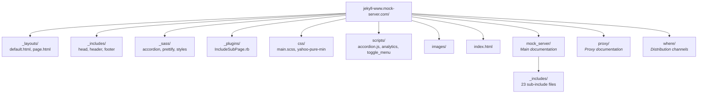

# Website

## Overview

The MockServer documentation website at `https://www.mock-server.com` is a Jekyll static site hosted on AWS S3 with CloudFront CDN.

**Source:** `jekyll-www.mock-server.com/`

## Site Configuration

**File:** `jekyll-www.mock-server.com/_config.yml`

| Setting | Value |
|---------|-------|
| URL | `https://www.mock-server.com` |
| Markdown engine | kramdown |
| Sass output | `:compressed` |
| `mockserver_version` | `5.15.0` |
| `mockserver_api_version` | `5.15.x` |
| `mockserver_snapshot_version` | `5.15.1-SNAPSHOT` |
| Google Analytics | `UA-32687194-4` (in `_includes/head.html`, not `_config.yml`) |
| Custom plugin | `jekyll-code-example-tag` |

## Site Structure



## Content Sections

### Mock Server (`mock_server/`)

| Page | Content |
|------|---------|
| `getting_started.html` | Quick start guide |
| `creating_expectations.html` | Expectation creation (request matchers + actions) |
| `running_mock_server.html` | Running MockServer (all deployment options) |
| `mockserver_clients.html` | Client libraries (Java, JavaScript, Ruby) |
| `verification.html` | Request verification |
| `configuration_properties.html` | Full configuration reference |
| `HTTPS_TLS.html` | TLS/SSL configuration and mTLS |
| `using_openapi.html` | OpenAPI specification support |
| `response_templates.html` | Velocity/Mustache/JS response templates |
| `debugging_issues.html` | Troubleshooting guide |
| `clearing_and_resetting.html` | State management |
| `initializing_expectations.html` | Expectation initialisation on startup |
| `persisting_expectations.html` | Persistent expectations across restarts |
| `running_tests_in_parallel.html` | Parallel test execution patterns |
| `isolating_single_service.html` | Single-service isolation testing |
| `control_plane_authorisation.html` | Control plane auth (JWT, mTLS) |
| `CORS_support.html` | CORS configuration |
| `performance.html` | Performance tuning |
| `mockserver_ui.html` | Dashboard UI |

### Sub-includes (`mock_server/_includes/`)

23 reusable content fragments for code examples and configuration blocks:

| Include | Content |
|---------|---------|
| `request_matcher_code_examples.html` | Request matching examples |
| `response_action_code_examples.html` | Response action examples |
| `forward_action_code_examples.html` | Forward action examples |
| `error_action_code_examples.html` | Error action examples |
| `openapi_request_matcher_code_examples.html` | OpenAPI matcher examples |
| `running_docker_container.html` | Docker usage instructions |
| `running_mock_server_detail.html` | Detailed server startup options |
| `running_mock_server_summary.html` | Server startup summary |
| `running_npm_module.html` | npm module usage |
| `helm_chart.html` | Helm chart usage |
| `tls_configuration.html` | TLS config reference |
| `logging_configuration.html` | Logging config reference |
| `performance_configuration.html` | Performance config reference |
| `cors_configuration.html` | CORS config reference |
| `clustering.html` | Clustering documentation |
| `control_plane_authentication_configuration.html` | Auth config |
| `control_plane_authentication_jwt_configuration.html` | JWT auth config |
| `control_plane_authentication_mtls_configuration.html` | mTLS auth config |
| `initializer_persistence_configuration.html` | Init/persistence config |
| `template_restriction_configuration.html` | Template security config |
| `creating_expectations.html` | Expectation creation details |
| `retrieve_code_example.html` | Retrieve API examples |
| `verification_summary.html` | Verification summary |

### Proxy (`proxy/`)

| Page | Content |
|------|---------|
| `getting_started.html` | Proxy quick start |
| `verification.html` | Proxy request verification |
| `record_and_replay.html` | Record & replay functionality |
| `configuring_sut.html` | Configuring system-under-test |

### Where (`where/`)

Distribution channel pages: `docker.html`, `downloads.html`, `github.html`, `kubernetes.html`, `maven_central.html`, `npm.html`, `slack.html`, `trello.html`

## Layouts

### `default.html`

Base HTML5 template:
- `` — meta tags, SEO (Open Graph, Schema.org), Google Fonts, CSS
- `` — navigation sidebar with section links
- `{{ content }}` — page content
- `` — copyright, JavaScript (toggle menu, prettify, accordion)

### `page.html`

Extends `default` — wraps content in a `<div class="post">` with `<h1>` title.

## Custom Plugins

### `IncludeSubPage.rb`

Provides two Liquid tags:

- `` — includes a file relative to the current page
- `` — includes a file from the site root

Both tags strip YAML front matter before rendering.

## Building the Website

```bash
# Local development server
cd jekyll-www.mock-server.com
bundle install
bundle exec jekyll serve

# Or use the script
scripts/jekyll_server.sh

# Production build
cd jekyll-www.mock-server.com
bundle exec jekyll build
# Output in _site/
```

## Deployment

1. Build: `bundle exec jekyll build`
2. Upload `_site/` contents to the main website S3 bucket (see `~/mockserver-aws-ids.md`)
3. Invalidate CloudFront cache (`/*` pattern) for the main distribution (see `~/mockserver-aws-ids.md`)

See [AWS Infrastructure](../infrastructure/aws-infrastructure.md) and [Release Process](release-process.md) for details.

## SEO & Metadata Files

| File | Purpose |
|------|---------|
| `sitemap.xml` | XML sitemap for search engines |
| `sitemap.html` | HTML sitemap for users |
| `robots.txt` | Search engine crawl directives |
| `feed.xml` | Atom/RSS feed |

## Proxy Sub-includes

`proxy/_includes/` contains reusable fragments for proxy documentation:

| Include | Content |
|---------|---------|
| `analysing_behaviour.html` | Proxy behaviour analysis examples |

## External References

The website navigation includes links to:

- **SwaggerHub API Reference:** https://app.swaggerhub.com/apis/jamesdbloom/mock-server-openapi
- **GitHub Examples:** https://github.com/mock-server/mockserver/tree/master/mockserver-examples
