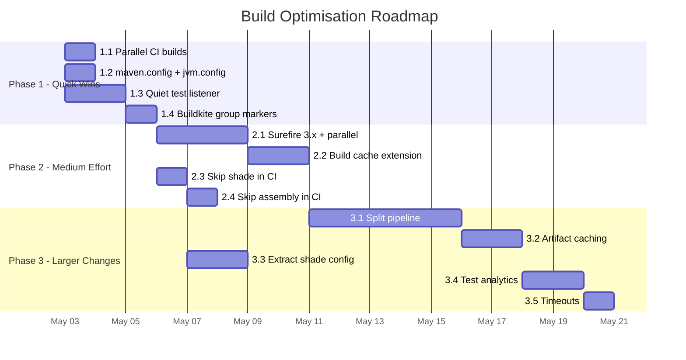

# Build Optimisation Plan

## Current State

| Metric | Local Build | Buildkite CI |
|--------|------------|--------------|
| Parallelism | `-T 3C` (3 threads/core) | None (single-threaded reactor) |
| Test parallelism | None (sequential within each fork) | None |
| Surefire/Failsafe version | 2.22.2 | 2.22.2 |
| Build caching | None | None (deps pre-warmed in Docker image) |
| JVM config | Per-script `MAVEN_OPTS` | Per-script `MAVEN_OPTS` |
| Maven version | 3.9.0 (wrapper) | 3.9.15 (Docker image) |
| Log output | Full (STARTED/FINISHED per test) | Full (STARTED/FINISHED per test) |
| Shade plugin | Runs on 6 modules (~230 lines duplicated config each) | Same |
| Assembly plugin | Fat JAR + brew tar on mockserver-netty | Same |
| Invoker plugin | 3 Maven sub-builds + Gradle tests | Same |

### Key Bottlenecks

1. **CI runs single-threaded** - all 11 modules build sequentially
2. **No test parallelism** - tests run sequentially within each forked JVM
3. **415 test files** (306 unit + 109 integration) all run sequentially
4. **Shade plugin runs 6 times** - each execution processes the entire dependency tree with ~35 relocations
5. **Invoker plugin** spawns 3 separate Maven builds + Gradle builds during `mockserver-netty` integration tests
6. **No build caching** - every build recompiles everything from scratch
7. **No `.mvn/maven.config` or `.mvn/jvm.config`** - JVM settings only applied when using specific scripts
8. **Test listener prints 2 lines per test** (STARTED + FINISHED) - for 415+ tests this produces enormous log volume in Buildkite

### Log Volume Problem

The `PrintOutCurrentTestRunListener` prints for every test:
```
STARTED: shouldReturnResponseByMatchingPath
FINISHED: shouldReturnResponseByMatchingPath duration: 234
```

With 415+ test files containing hundreds of test methods each (especially the deep integration test hierarchy where `ExtendedNettyMockingIntegrationTest` alone inherits ~200+ test methods), plus Maven's own module lifecycle output, the total log volume easily exceeds what Buildkite can render efficiently.

---

## Phase 1: Quick Wins (Estimated: 1-2 days)

### 1.1 Enable Parallel Module Builds in CI

**Change:** Add `-T 1C` to the CI Maven invocation.

**File:** `scripts/buildkite_quick_build.sh`

```bash
# Before
./mvnw clean install ${1:-} -Djava.security.egd=file:/dev/./urandom

# After
./mvnw -T 1C clean install ${1:-} -Djava.security.egd=file:/dev/./urandom
```

**Why `-T 1C` not `-T 3C`:** The CI agent is a `t3.large` (2 vCPUs, 8GB RAM). With `-T 1C` we get 2 parallel module builds, which matches the available cores. `-T 3C` would over-subscribe CPU. Local builds with more cores can continue using `-T 3C`.

**Expected impact:** ~30-40% faster overall build. Modules without inter-dependencies (e.g., `mockserver-war` + `mockserver-proxy-war`, `mockserver-junit-rule` + `mockserver-junit-jupiter` + `mockserver-spring-test-listener`) will build in parallel.

**Risk:** Low. The reactor already respects module dependency ordering. The main risk is memory pressure from concurrent shade plugin executions, but 8GB heap should accommodate this.

### 1.2 Create `.mvn/maven.config` and `.mvn/jvm.config`

Centralise Maven and JVM settings so that `./mvnw clean install` works correctly even without wrapper scripts.

**File:** `.mvn/maven.config`
```
-Djava.security.egd=file:/dev/./urandom
```

**File:** `.mvn/jvm.config`
```
-Xms2048m
-Xmx8192m
```

**Impact:** Consistent behaviour regardless of which script is used. Eliminates the need for `MAVEN_OPTS` in every script.

### 1.3 Replace Test Listener with Quiet/Verbose Modes

**Current:** `PrintOutCurrentTestRunListener` prints 2 lines per test (STARTED + FINISHED with duration) regardless of outcome.

**Proposed:** Create a new `BuildkiteTestRunListener` that:
- Prints a **single dot** (`.`) for each passing test (on the same line, wrapping at 80 chars)
- Prints **full details** (test name, duration, stack trace) only for **failures and errors**
- Prints a **summary line** at the end of each test class: `ClassName: 45 tests, 0 failures (2.3s)`
- Controlled by a system property `mockserver.testOutput` with values:
  - `verbose` (current behaviour - for local debugging)
  - `quiet` (dots + failure details - for CI)
  - `summary` (class summaries only - minimal output)

**Implementation:**

```java
package org.mockserver.test;

import org.junit.runner.Description;
import org.junit.runner.notification.Failure;
import org.junit.runner.notification.RunListener;

import java.util.ArrayList;
import java.util.List;
import java.util.Map;
import java.util.concurrent.ConcurrentHashMap;
import java.util.concurrent.atomic.AtomicInteger;

public class BuildkiteTestRunListener extends RunListener {

    private static final String MODE = System.getProperty("mockserver.testOutput", "verbose");
    private static final Map<String, Long> START_TIMES = new ConcurrentHashMap<>();
    private static final List<Failure> FAILURES = new ArrayList<>();
    private static final AtomicInteger PASS_COUNT = new AtomicInteger();
    private static final AtomicInteger FAIL_COUNT = new AtomicInteger();
    private static final AtomicInteger DOT_COUNT = new AtomicInteger();
    private static String currentClass = "";
    private static long classStartTime = 0;

    @Override
    public void testStarted(Description description) {
        String className = description.getClassName();
        if (!className.equals(currentClass)) {
            if (!currentClass.isEmpty()) {
                printClassSummary();
            }
            currentClass = className;
            classStartTime = System.currentTimeMillis();
            PASS_COUNT.set(0);
            FAIL_COUNT.set(0);
            DOT_COUNT.set(0);
            FAILURES.clear();
            if ("quiet".equals(MODE)) {
                System.out.print("\n" + simpleClassName(className) + ": ");
            }
        }
        START_TIMES.put(description.getMethodName(), System.currentTimeMillis());
        if ("verbose".equals(MODE)) {
            System.out.println("STARTED: " + description.getMethodName());
        }
    }

    @Override
    public void testFinished(Description description) {
        PASS_COUNT.incrementAndGet();
        if ("verbose".equals(MODE)) {
            Long startTime = START_TIMES.get(description.getMethodName());
            Long duration = startTime != null
                ? System.currentTimeMillis() - startTime : null;
            System.out.println("FINISHED: " + description.getMethodName()
                + (duration != null ? " duration: " + duration : ""));
        } else if ("quiet".equals(MODE)) {
            System.out.print(".");
            if (DOT_COUNT.incrementAndGet() % 80 == 0) {
                System.out.print("\n  ");
            }
        }
    }

    @Override
    public void testFailure(Failure failure) {
        FAIL_COUNT.incrementAndGet();
        FAILURES.add(failure);
        if ("quiet".equals(MODE)) {
            System.out.print("F");
        }
        // Always print failure details in quiet and summary modes
        if (!"verbose".equals(MODE)) {
            System.out.println("\n  FAILED: "
                + failure.getDescription().getMethodName());
            System.out.println("  " + failure.getMessage());
            System.out.println(indent(failure.getTrace(), "    "));
        } else {
            System.out.println("FAILED: "
                + failure.getDescription().getMethodName());
        }
    }

    // ...summary printing helpers
}
```

**Configuration change in `pom.xml`:**

```xml
<systemProperties>
    <mockserver.logLevel>ERROR</mockserver.logLevel>
    <mockserver.testOutput>${mockserver.testOutput}</mockserver.testOutput>
</systemProperties>
```

**CI invocation:**
```bash
./mvnw -T 1C clean install -Dmockserver.testOutput=quiet ...
```

**Expected impact:** ~90% reduction in test log output for passing builds. Failures will still show full details.

### 1.4 Add Buildkite Group Annotations

Use Buildkite's `---` group markers to collapse Maven module output into collapsible sections.

**Option A: Maven Event Spy**

Create a custom Maven `EventSpy` that emits Buildkite group markers:

```java
@Named("buildkite")
public class BuildkiteEventSpy extends AbstractEventSpy {
    @Override
    public void onEvent(Object event) {
        if (event instanceof ExecutionEvent) {
            ExecutionEvent ee = (ExecutionEvent) event;
            if (ee.getType() == ExecutionEvent.Type.ProjectStarted) {
                System.out.println("--- " + ee.getProject().getArtifactId());
            }
        }
    }
}
```

**Option B: Wrapper script with sed**

Post-process Maven output to inject Buildkite group markers before each `[INFO] Building mockserver-*` line. Simpler but less robust.

**Expected impact:** Buildkite UI will show collapsible groups per module, making it much easier to navigate to the failing module.

---

## Phase 2: Medium Effort (Estimated: 3-5 days)

### 2.1 Upgrade Surefire/Failsafe to 3.x and Enable Parallel Tests

**Current:** `maven-surefire-plugin` and `maven-failsafe-plugin` at version 2.22.2 (2018).

**Proposed:** Upgrade to `3.2.5` (latest stable) and enable parallel test execution for unit tests.

```xml
<plugin>
    <artifactId>maven-surefire-plugin</artifactId>
    <version>3.2.5</version>
    <configuration>
        <parallel>classes</parallel>
        <threadCount>4</threadCount>
        <perCoreThreadCount>false</perCoreThreadCount>
        <includes>
            <include>**/*Test.java</include>
        </includes>
        <excludes>
            <exclude>**/*IntegrationTest.java</exclude>
        </excludes>
        <!-- ... rest unchanged ... -->
    </configuration>
</plugin>
```

**Why `parallel=classes` not `parallel=methods`:** Many test classes in MockServer share static state or start embedded servers in `@BeforeClass`. Running methods from the same class in parallel would cause port conflicts and shared state corruption. Running entire classes in parallel is safer as each class gets its own server lifecycle.

**Why NOT for integration tests (failsafe):** Integration tests start MockServer instances on specific ports. Running multiple integration test classes in parallel would cause port conflicts. This should remain sequential unless port allocation is refactored.

**Expected impact:** 2-4x faster unit test execution (267 unit tests in `mockserver-core` alone). Integration tests remain sequential for safety.

**Risk:** Medium. Some unit tests may have hidden shared state. Will need a test run to verify no flaky failures are introduced.

### 2.2 Add Maven Build Caching

**Option A: Maven Build Cache Extension (Recommended)**

Create `.mvn/extensions.xml`:
```xml
<extensions>
    <extension>
        <groupId>org.apache.maven.extensions</groupId>
        <artifactId>maven-build-cache-extension</artifactId>
        <version>1.2.0</version>
    </extension>
</extensions>
```

Create `.mvn/maven-build-cache-config.xml`:
```xml
<cache xmlns="http://maven.apache.org/BUILD-CACHE-CONFIG/1.0.0">
    <configuration>
        <enabled>true</enabled>
        <hashAlgorithm>SHA-256</hashAlgorithm>
        <local>
            <maxBuildsCached>3</maxBuildsCached>
        </local>
    </configuration>
    <executionControl>
        <reconcile>
            <plugins>
                <plugin artifactId="maven-shade-plugin" goal="shade">
                    <reconciles>
                        <reconcile propertyName="shadedArtifactAttached"/>
                    </reconciles>
                </plugin>
            </plugins>
        </reconcile>
        <goalsToTrack>
            <goal>org.apache.maven.plugins:maven-surefire-plugin:test</goal>
            <goal>org.apache.maven.plugins:maven-failsafe-plugin:integration-test</goal>
        </goalsToTrack>
    </executionControl>
</cache>
```

**Impact:** Modules whose source hasn't changed will skip compilation, testing, and packaging entirely. Particularly valuable for:
- `mockserver-testing` (rarely changes)
- `mockserver-war` and `mockserver-proxy-war` (thin wrappers)
- `mockserver-examples` (documentation code)

**Limitation:** The cache is local to the machine/container. In CI, each build starts fresh in a new Docker container, so the cache won't persist between builds unless we also add a cache volume (see Phase 3).

**Risk:** Medium. Shade plugin and assembly plugin are complex goals that need cache reconciliation testing.

**Option B: Skip Unchanged Modules via `-pl` flag**

For CI, detect changed files and only build affected modules:

```bash
CHANGED_MODULES=$(git diff --name-only HEAD~1 | grep -oP 'mockserver-[^/]+' | sort -u | paste -sd, -)
./mvnw clean install -pl "$CHANGED_MODULES" -amd
```

**Risk:** Higher - misses transitive dependency changes. Better suited as a PR-only optimisation, not for master builds.

### 2.3 Skip Shade Plugin for Non-Release Builds

The shade plugin is the most expensive packaging step, running on 6 modules. For CI builds that only need to verify compilation and tests pass, shading is unnecessary.

**Approach:** Add a `skipShade` property:

```xml
<!-- In root pom.xml -->
<properties>
    <skipShade>false</skipShade>
</properties>

<!-- In each module's shade plugin config -->
<plugin>
    <groupId>org.apache.maven.plugins</groupId>
    <artifactId>maven-shade-plugin</artifactId>
    <configuration>
        <skip>${skipShade}</skip>
        <!-- ... existing config ... -->
    </configuration>
</plugin>
```

**CI invocation:**
```bash
./mvnw -T 1C clean install -DskipShade=true -Dmockserver.testOutput=quiet ...
```

**Expected impact:** Eliminates 6 shade plugin executions, each of which processes hundreds of dependency JARs with 35+ relocations. Estimated 2-5 minutes saved depending on I/O speed.

**Risk:** Low. The shade plugin produces secondary artifacts (`-shaded.jar`, `-no-dependencies.jar`) that are only needed for releases and downstream consumers. Tests run against the unshaded artifacts.

### 2.4 Skip Assembly Plugin in CI

Similarly, the assembly plugin in `mockserver-netty` creates a fat JAR and Homebrew tarball that aren't needed for CI verification.

**Already supported:** The `skipAssembly` property exists and is used by `local_single_module.sh`.

**CI invocation:**
```bash
./mvnw -T 1C clean install -DskipShade=true -DskipAssembly=true -Dmockserver.testOutput=quiet ...
```

**Expected impact:** Eliminates the jar-with-dependencies and brew-tar assembly steps.

---

## Phase 3: Larger Changes (Estimated: 1-2 weeks)

### 3.1 Split Buildkite Pipeline into Parallel Steps

**Current:** Single monolithic build step runs everything sequentially.

**Proposed:** Split into parallel steps with dependency caching:

```yaml
steps:
  - label: ":docker: Pull build image"
    command: "docker pull mockserver/mockserver:maven"

  - wait

  - label: ":maven: Compile & Unit Tests"
    command: "scripts/ci/compile-and-test.sh"
    artifact_paths:
      - ".m2-cache.tar.gz"
    timeout_in_minutes: 30

  - wait

  - group: ":test_tube: Integration Tests"
    steps:
      - label: ":java: mockserver-netty integration"
        command: "scripts/ci/integration-test-netty.sh"
        timeout_in_minutes: 30
      - label: ":java: mockserver-war integration"
        command: "scripts/ci/integration-test-war.sh"
        timeout_in_minutes: 15
      - label: ":java: mockserver-examples"
        command: "scripts/ci/integration-test-examples.sh"
        timeout_in_minutes: 15

  - wait

  - label: ":package: Package (shade + assembly)"
    command: "scripts/ci/package.sh"
    timeout_in_minutes: 20
```

**Benefits:**
- Integration tests for different modules run in parallel
- Compile-once, test-many pattern
- Timeouts prevent runaway builds
- Buildkite UI shows clear progress per stage
- Failing module is immediately visible

**Complexity:** Requires splitting the Maven build into phases and sharing compiled artifacts between steps (via Buildkite artifacts or a cache volume).

### 3.2 Buildkite Artifact Caching

Use the Buildkite cache plugin or S3-backed artifact sharing to persist the Maven local repository between builds:

```yaml
plugins:
  - cache#v1.2.0:
      backend: s3
      key: "maven-{{ checksum 'pom.xml' }}"
      paths:
        - "/root/.m2/repository"
      s3:
        bucket: "mockserver-buildkite-cache"
        region: "eu-west-2"
```

**Expected impact:** First build populates the cache; subsequent builds skip dependency resolution entirely (even if the Docker image's pre-warmed cache is stale).

### 3.3 Extract Shade Configuration to Parent POM

Move the ~230 lines of duplicated shade configuration into the parent POM's `<pluginManagement>` section. Child modules would then only need:

```xml
<plugin>
    <groupId>org.apache.maven.plugins</groupId>
    <artifactId>maven-shade-plugin</artifactId>
</plugin>
```

With `mockserver-netty` adding only its `ManifestResourceTransformer` override.

**Impact:** Reduces 1,400+ lines of duplicated XML to ~250 lines in one place. Not a speed improvement directly, but reduces maintenance burden and makes the skip property easier to manage.

### 3.4 Buildkite Test Analytics Integration

Re-enable JUnit XML report generation for CI builds and upload to Buildkite Test Analytics:

```xml
<!-- CI override -->
<disableXmlReport>${disableXmlReport}</disableXmlReport>
```

```bash
# In CI script
./mvnw ... -DdisableXmlReport=false

# After build
find . -name "TEST-*.xml" -path "*/surefire-reports/*" \
  | xargs buildkite-agent artifact upload
```

**Benefits:**
- Buildkite shows test results tab with pass/fail counts
- Historical test duration trends
- Automatic flaky test detection
- Per-test timing data for identifying slow tests

### 3.5 Add Timeouts to Pipeline and Tests

```yaml
# Pipeline level
steps:
  - label: "build"
    timeout_in_minutes: 45
    retry:
      automatic:
        - exit_status: -1  # Agent lost
          limit: 1
```

```xml
<!-- Surefire level -->
<forkedProcessTimeoutInSeconds>600</forkedProcessTimeoutInSeconds>
```

---

## Phase 4: Advanced (Estimated: 2-4 weeks)

### 4.1 Incremental Compilation

**Current:** `clean install` deletes all compiled classes and rebuilds from scratch.

**Proposed:** For CI builds on non-master branches, use `install` (without `clean`) combined with the build cache extension. The cache extension's hash-based invalidation handles staleness detection.

**For master:** Continue using `clean install` for guaranteed clean builds.

### 4.2 GraalVM Native Build Cache

For the shade plugin specifically, investigate using GraalVM's native-image as a faster alternative to the shade plugin's bytecode relocation. This is a longer-term investigation.

### 4.3 Upgrade Maven Wrapper

**Current:** Wrapper 0.5.6 with Maven 3.9.0.
**Proposed:** Upgrade to Maven Wrapper 3.x with Maven 3.9.x (matching the CI Docker image version).

```bash
./mvnw wrapper:wrapper -Dmaven=3.9.15
```

---

## Implementation Priority



## Expected Cumulative Impact

| Phase | Local Build Improvement | CI Build Improvement | Log Volume Reduction |
|-------|------------------------|---------------------|---------------------|
| Phase 1 | 10-15% | 30-40% | ~90% |
| Phase 2 | 30-50% | 50-60% | Same (already reduced) |
| Phase 3 | 50-60% (with caching) | 60-75% | Further reduction via grouping |
| Phase 4 | Incremental only | Incremental only | N/A |

## Summary of Changes by File

| File | Changes |
|------|---------|
| `scripts/buildkite_quick_build.sh` | Add `-T 1C`, `-DskipShade=true`, `-DskipAssembly=true`, `-Dmockserver.testOutput=quiet` |
| `.mvn/maven.config` | New file: common Maven flags |
| `.mvn/jvm.config` | New file: JVM memory settings |
| `.mvn/extensions.xml` | New file: build cache extension (Phase 2) |
| `.mvn/maven-build-cache-config.xml` | New file: cache configuration (Phase 2) |
| `pom.xml` | Upgrade surefire/failsafe to 3.2.5, add `skipShade` property, add parallel config, add `mockserver.testOutput` property |
| `mockserver-testing/.../BuildkiteTestRunListener.java` | New file: quiet test output listener |
| `mockserver-testing/.../PrintOutCurrentTestRunListener.java` | Keep as-is (used for `verbose` mode) |
| `mockserver-testing/.../BuildkiteEventSpy.java` | New file: Buildkite group markers (Phase 1.4) |
| `.buildkite/pipeline.yml` | Add timeouts (Phase 3), split steps (Phase 3) |
| `6x module pom.xml` (shade plugin) | Add `<skip>${skipShade}</skip>`, extract to parent pluginManagement (Phase 3) |
