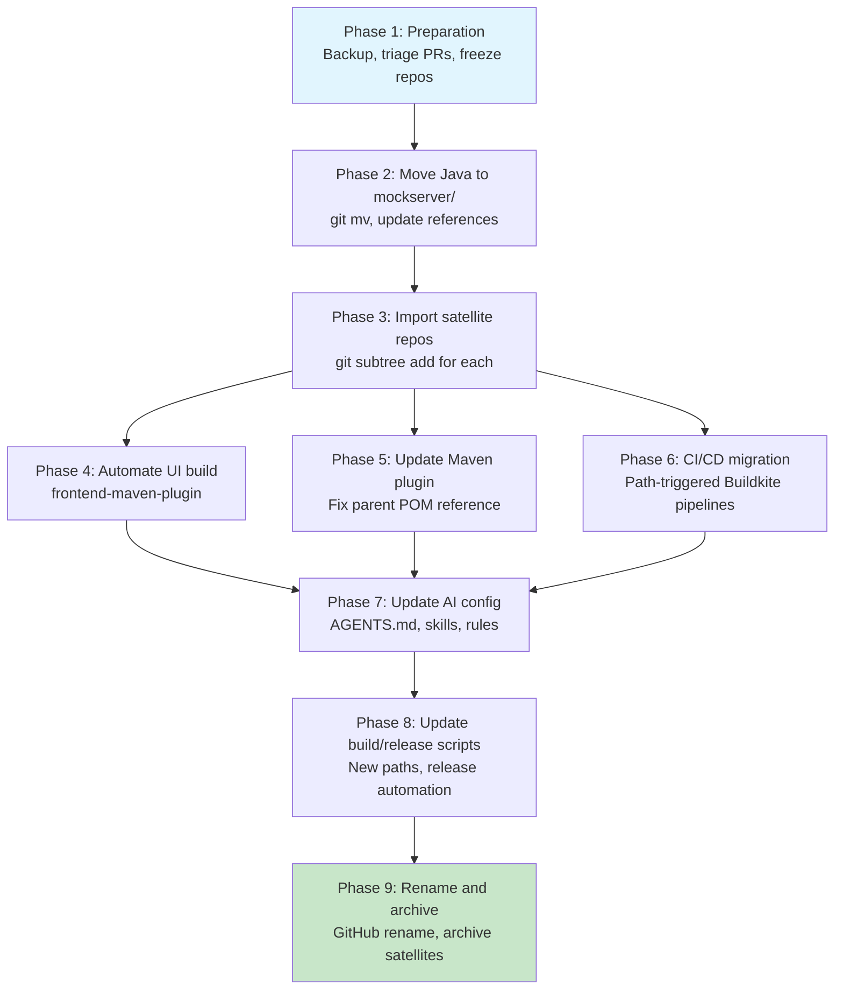

# MockServer Monorepo Migration Plan

## Goal

Consolidate all MockServer repositories into a single monorepo to:
- Share AI configuration (opencode agents, rules, skills, commands) across all projects
- Share CI/CD pipeline definitions and Buildkite infrastructure
- Automate the UI build as part of the server build (eliminating the current manual copy process)
- Simplify the release process (currently 13 manual steps spanning 8 repos)
- Centralise dependency management, security scanning, and documentation

## Current State

### Repositories to Consolidate

| Repository | Language | Build System | Last Active | Relationship to Main |
|------------|----------|-------------|-------------|---------------------|
| `mockserver` | Java | Maven | May 2026 | Main server (11 Maven modules) |
| `mockserver-ui` | JavaScript | npm/CRA | Jan 2026 | Dashboard SPA, compiled files manually copied into mockserver-netty |
| `mockserver-maven-plugin` | Java | Maven | Jul 2025 | Maven plugin, depends on `mockserver-netty` JAR |
| `mockserver-node` | JavaScript | npm/Grunt | Jun 2025 | Node.js launcher, downloads MockServer JAR at runtime |
| `mockserver-client-node` | JavaScript | npm/Grunt | Sep 2024 | JS/TS API client, HTTP-only dependency |
| `mockserver-client-python` | Python | pip | Jan 2026 | Auto-generated from OpenAPI spec (pinned to v5.3.0, stale) |
| `mockserver-client-ruby` | Ruby | Bundler | May 2022 | Auto-generated from OpenAPI spec (pinned to v5.3.0, stale) |
| `mockserver-performance-test` | Shell/Python | Scripts | Jul 2020 | Locust-based load tests against Docker images |

### Key Pain Points Being Solved

1. **Manual UI integration** — compiled React files are manually copied into `mockserver-netty/src/main/resources/` with no automation, version tracking, or CI verification
2. **13-step manual release process** spanning 8 repos with manual version bumps in each
3. **Duplicated CI/CD** — 5 repos have independent Buildkite pipelines competing for the same agent pool, each with separate GitHub Actions for CodeQL
4. **AI config fragmentation** — opencode configuration only exists in the main repo; satellite repos get no AI assistance
5. **Stale security PRs** — 60+ unmerged Snyk/Dependabot PRs across satellite repos
6. **No shared infrastructure** — each repo independently manages Docker auth, build secrets, and pipeline config

## Target State

### Directory Structure

```
mockserver-monorepo/                          # Renamed from mock-server/mockserver
├── AGENTS.md                                 # Shared AI agent instructions (updated for monorepo)
├── opencode.jsonc                            # Shared AI agent configuration
├── .opencode/                                # Shared AI rules, skills, commands
│   ├── rules/
│   ├── skills/
│   └── commands/
├── docs/                                     # Internal architecture & operations docs
├── terraform/                                # Infrastructure as code
│   ├── buildkite-agents/
│   └── buildkite-pipelines/                  # Now manages ALL pipelines
├── .buildkite/                               # Monorepo-aware pipeline definitions
│   ├── pipeline.yml                          # Main orchestrator (path-based triggers)
│   ├── pipeline-java.yml                     # Java build (path-triggered)
│   ├── pipeline-ui.yml                       # UI build (path-triggered)
│   ├── pipeline-node.yml                     # Node packages (path-triggered)
│   ├── pipeline-maven-plugin.yml             # Maven plugin (path-triggered)
│   ├── docker-push-maven.yml
│   ├── docker-push-release.yml
│   └── scripts/
├── .github/
│   ├── workflows/
│   │   ├── codeql-analysis.yml               # Unified CodeQL scanning all languages
│   │   └── dependabot-automerge.yml          # Optional: auto-merge minor/patch Dependabot PRs
│   ├── dependabot.yml                        # Single Dependabot config for all ecosystems
│   └── ISSUE_TEMPLATE/
├── scripts/                                  # Shared build/release/deploy scripts
├── docker/                                   # Release Docker images
├── docker_build/                             # CI Docker images
├── helm/                                     # Helm charts
├── jekyll-www.mock-server.com/               # Consumer documentation site
├── README.md
├── LICENSE.md
├── CONTRIBUTING.md
├── SECURITY.md
├── changelog.md
│
├── mockserver/                               # Main Java server (moved from root)
│   ├── pom.xml                               # Root Maven POM (multi-module aggregator)
│   ├── mvnw / mvnw.cmd / .mvn/
│   ├── checkstyle.xml
│   ├── mockserver-core/
│   ├── mockserver-netty/
│   ├── mockserver-client-java/
│   ├── mockserver-war/
│   ├── mockserver-proxy-war/
│   ├── mockserver-junit-rule/
│   ├── mockserver-junit-jupiter/
│   ├── mockserver-spring-test-listener/
│   ├── mockserver-integration-testing/
│   ├── mockserver-testing/
│   └── mockserver-examples/
│
├── mockserver-ui/                            # Imported from mock-server/mockserver-ui
│   ├── package.json
│   ├── src/
│   ├── public/
│   └── build/                                # Output copied to mockserver-netty during build
│
├── mockserver-maven-plugin/                  # Imported from mock-server/mockserver-maven-plugin
│   ├── pom.xml                               # Updated parent reference
│   └── src/
│
├── mockserver-node/                          # Imported from mock-server/mockserver-node
│   ├── package.json
│   └── src/
│
├── mockserver-client-node/                   # Imported from mock-server/mockserver-client-node
│   ├── package.json
│   └── src/
│
├── mockserver-client-python/                 # Imported from mock-server/mockserver-client-python
│   ├── setup.py
│   └── mockserver_client/
│
├── mockserver-client-ruby/                   # Imported from mock-server/mockserver-client-ruby
│   ├── Gemfile
│   └── lib/
│
└── mockserver-performance-test/              # Imported from mock-server/mockserver-performance-test
    ├── locustfile.py
    └── scripts/
```

### Key Design Decisions

1. **Main Java project moves to `mockserver/` subfolder** — frees the root for shared config, docs, terraform, and sibling projects. Maven builds run from `mockserver/` using `./mvnw` there.

2. **Each imported project retains its own build system** — no forced unification. Java projects use Maven, JS projects use npm, Python uses pip. They build independently but share CI infrastructure.

3. **UI build automated via `frontend-maven-plugin`** — the `mockserver-netty` module gains a Maven profile that runs `npm install` and `npm run build` in the `mockserver-ui/` directory and copies output to `src/main/resources/org/mockserver/dashboard/`.

4. **All git history preserved** — each satellite repo's full history is merged using `git subtree`, maintaining blame and bisect capability.

---

## Migration Steps

### Phase 1: Preparation (Before Any Changes)

#### 1.1 Fork/Backup All Repositories

```bash
# Create backup branches in each satellite repo
for repo in mockserver-ui mockserver-maven-plugin mockserver-node \
            mockserver-client-node mockserver-client-python \
            mockserver-client-ruby mockserver-performance-test; do
    gh repo clone mock-server/$repo /tmp/$repo
    cd /tmp/$repo
    git checkout -b pre-monorepo-backup
    git push origin pre-monorepo-backup
    cd -
done
```

#### 1.2 Close or Merge Outstanding PRs

Triage the ~60 open PRs across satellite repos:
- **Merge** legitimate security fixes before migration (avoids carrying known vulnerabilities)
- **Close** stale/duplicate Snyk PRs with a comment: "Will be addressed in monorepo migration"
- **Close** feature PRs with a note pointing to the monorepo

| Repo | Open PRs | Action |
|------|----------|--------|
| mockserver-ui | 15 | Close all (Snyk PRs for outdated CRA deps — UI needs full modernisation) |
| mockserver-maven-plugin | 23 | Merge 1 Guava fix, close remaining duplicates |
| mockserver-client-node | 9 | Review #173 (clearById fix) and #169 (forwardWithCallback), close Snyk PRs |
| mockserver-node | 10 | Review #108 (startup perf), close Snyk PRs |
| mockserver-client-python | 3 | Close all (stale urllib3/zipp bumps) |
| mockserver-client-ruby | 3 | Close all (repo effectively unmaintained) |

#### 1.3 Freeze Satellite Repos

After PR triage, set each satellite repo to read-only (temporarily) via branch protection rules to prevent concurrent changes during migration.

---

### Phase 2: Restructure the Main Repo

#### 2.1 Move Main Java Project into `mockserver/` Subfolder

This is the most delicate step — it must preserve all git history for the Java source files.

**Files/directories that MOVE into `mockserver/`:**

| Item | Reason |
|------|--------|
| `pom.xml` | Maven root POM |
| `mvnw`, `mvnw.cmd`, `.mvn/` | Maven wrapper |
| `checkstyle.xml` | Maven build config |
| `mockserver-core/` | Java module |
| `mockserver-netty/` | Java module |
| `mockserver-client-java/` | Java module |
| `mockserver-war/` | Java module |
| `mockserver-proxy-war/` | Java module |
| `mockserver-junit-rule/` | Java module |
| `mockserver-junit-jupiter/` | Java module |
| `mockserver-spring-test-listener/` | Java module |
| `mockserver-integration-testing/` | Java module |
| `mockserver-testing/` | Java module |
| `mockserver-examples/` | Java module |
| `mockserver.example.properties` | Java config example |
| `.run/` | IntelliJ run configs (reference module paths) |

**Files/directories that STAY at root:**

| Item | Reason |
|------|--------|
| `AGENTS.md`, `opencode.jsonc`, `.opencode/` | Shared AI config |
| `docs/` | Shared internal documentation |
| `terraform/` | Shared infrastructure |
| `.buildkite/` | Shared CI/CD |
| `.github/` | Shared GitHub config |
| `docker/`, `docker_build/` | Shared Docker config |
| `helm/` | Shared Helm charts |
| `scripts/` | Shared build/release scripts |
| `jekyll-www.mock-server.com/` | Shared documentation site |
| `README.md`, `LICENSE.md`, etc. | Repo-level metadata |
| `.editorconfig`, `.gitignore` | Repo-level config |
| `container_integration_tests/` | Shared test infrastructure |

**Approach: Use `git mv` to preserve history with rename detection:**

```bash
git checkout -b monorepo-migration

mkdir mockserver

git mv pom.xml mockserver/
git mv mvnw mvnw.cmd .mvn mockserver/
git mv checkstyle.xml mockserver/
git mv mockserver.example.properties mockserver/

for module in mockserver-core mockserver-netty mockserver-client-java \
              mockserver-war mockserver-proxy-war mockserver-junit-rule \
              mockserver-junit-jupiter mockserver-spring-test-listener \
              mockserver-integration-testing mockserver-testing mockserver-examples; do
    git mv $module mockserver/
done

git mv .run mockserver/

git commit -m "move main Java project into mockserver/ subfolder for monorepo structure"
```

> **Note:** `git mv` preserves history via rename detection. `git log --follow mockserver/mockserver-core/src/...` will trace back through the rename. This is simpler and safer than `git filter-repo` which rewrites all history.

#### 2.2 Update Internal References After Move

After moving files, update all references that assume Java modules are at the root:

| File | Change Needed |
|------|---------------|
| `scripts/buildkite_quick_build.sh` | Update `./mvnw` path to `cd mockserver && ./mvnw` |
| `scripts/local_*.sh` | Same — update Maven wrapper invocation paths |
| `scripts/stop_MockServer.sh` | Update if it references module paths |
| `.buildkite/pipeline.yml` | Update build command paths |
| `docker/Dockerfile` (all variants) | Update JAR copy paths if they reference local build output |
| `docker_build/maven/Dockerfile` | Update if it copies Maven wrapper or source |
| `.github/workflows/codeql-analysis.yml` | Update Java source paths |
| `docs/` (multiple files) | Update any relative paths to Java source |
| `.idea/` | Regenerate from `mockserver/pom.xml` |
| `mockserver/.run/` | Update relative paths in IntelliJ run configs |

#### 2.3 Verify the Move

```bash
# Verify Maven build still works from the subfolder
cd mockserver && ./mvnw clean verify -DskipTests && cd ..

# Verify build scripts still work
bash scripts/local_quick_build.sh

# Verify git history is intact
git log --follow --oneline mockserver/mockserver-core/src/main/java/org/mockserver/model/HttpRequest.java | head -20
```

---

### Phase 3: Import Satellite Repositories

Use `git subtree` to import each repo with full history. This merges each repo's history into the monorepo without rewriting existing commits.

#### 3.1 Import Each Repository

```bash
# mockserver-ui
git remote add ui-import https://github.com/mock-server/mockserver-ui.git
git fetch ui-import
git subtree add --prefix=mockserver-ui ui-import/master
git remote remove ui-import

# mockserver-maven-plugin
git remote add maven-plugin-import https://github.com/mock-server/mockserver-maven-plugin.git
git fetch maven-plugin-import
git subtree add --prefix=mockserver-maven-plugin maven-plugin-import/master
git remote remove maven-plugin-import

# mockserver-node
git remote add node-import https://github.com/mock-server/mockserver-node.git
git fetch node-import
git subtree add --prefix=mockserver-node node-import/master
git remote remove node-import

# mockserver-client-node
git remote add client-node-import https://github.com/mock-server/mockserver-client-node.git
git fetch client-node-import
git subtree add --prefix=mockserver-client-node client-node-import/master
git remote remove client-node-import

# mockserver-client-python
git remote add client-python-import https://github.com/mock-server/mockserver-client-python.git
git fetch client-python-import
git subtree add --prefix=mockserver-client-python client-python-import/master
git remote remove client-python-import

# mockserver-client-ruby
git remote add client-ruby-import https://github.com/mock-server/mockserver-client-ruby.git
git fetch client-ruby-import
git subtree add --prefix=mockserver-client-ruby client-ruby-import/master
git remote remove client-ruby-import

# mockserver-performance-test
git remote add perf-test-import https://github.com/mock-server/mockserver-performance-test.git
git fetch perf-test-import
git subtree add --prefix=mockserver-performance-test perf-test-import/master
git remote remove perf-test-import
```

#### 3.2 Handle Conflicts

Each `git subtree add` creates a merge commit. Since each repo goes into its own subdirectory, there should be no file conflicts. However, check for:
- `.gitignore` conflicts (each repo may have its own — the imported ones stay within their subdirectory)
- Any files at the root of imported repos that clash with monorepo root files (unlikely since they're namespaced by directory)

#### 3.3 Clean Up Imported Repos

After import, remove redundant per-repo CI/CD config (replaced by monorepo pipelines):

```bash
rm -f mockserver-ui/.buildkite/pipeline.yml
rm -rf mockserver-ui/.github/
rm -f mockserver-maven-plugin/.buildkite/pipeline.yml
rm -rf mockserver-maven-plugin/.github/
rm -f mockserver-node/.buildkite/pipeline.yml
rm -rf mockserver-node/.github/
rm -f mockserver-client-node/.buildkite/pipeline.yml
rm -rf mockserver-client-node/.github/
rm -f mockserver-performance-test/.buildkite/pipeline.yml

git add -A && git commit -m "remove per-repo CI/CD config replaced by monorepo pipelines"
```

---

### Phase 4: Automate UI Build Integration

#### 4.1 Add `frontend-maven-plugin` to `mockserver-netty`

Add the plugin to `mockserver/mockserver-netty/pom.xml` inside a profile so it doesn't break builds when the UI directory isn't present:

```xml
<profile>
    <id>build-ui</id>
    <activation>
        <file>
            <exists>${project.basedir}/../../mockserver-ui/package.json</exists>
        </file>
    </activation>
    <build>
        <plugins>
            <plugin>
                <groupId>com.github.eirslett</groupId>
                <artifactId>frontend-maven-plugin</artifactId>
                <version>1.15.1</version>
                <configuration>
                    <workingDirectory>${project.basedir}/../../mockserver-ui</workingDirectory>
                    <installDirectory>${project.build.directory}/node</installDirectory>
                </configuration>
                <executions>
                    <execution>
                        <id>install-node-and-npm</id>
                        <goals><goal>install-node-and-npm</goal></goals>
                        <configuration>
                            <nodeVersion>v18.19.0</nodeVersion>
                        </configuration>
                    </execution>
                    <execution>
                        <id>npm-install</id>
                        <goals><goal>npm</goal></goals>
                        <configuration>
                            <arguments>install</arguments>
                        </configuration>
                    </execution>
                    <execution>
                        <id>npm-build</id>
                        <goals><goal>npm</goal></goals>
                        <configuration>
                            <arguments>run build</arguments>
                        </configuration>
                    </execution>
                </executions>
            </plugin>
            <plugin>
                <groupId>org.apache.maven.plugins</groupId>
                <artifactId>maven-resources-plugin</artifactId>
                <executions>
                    <execution>
                        <id>copy-ui-build</id>
                        <phase>generate-resources</phase>
                        <goals><goal>copy-resources</goal></goals>
                        <configuration>
                            <outputDirectory>${project.basedir}/src/main/resources/org/mockserver/dashboard</outputDirectory>
                            <resources>
                                <resource>
                                    <directory>${project.basedir}/../../mockserver-ui/build</directory>
                                </resource>
                            </resources>
                        </configuration>
                    </execution>
                </executions>
            </plugin>
        </plugins>
    </build>
</profile>
```

#### 4.2 Remove Committed UI Build Artifacts

Once the automated build is working, remove the stale static files:

```bash
git rm -r mockserver/mockserver-netty/src/main/resources/org/mockserver/dashboard/
git commit -m "remove manually-committed UI build artifacts, now built from mockserver-ui/ source"
```

Add to `mockserver/mockserver-netty/.gitignore`:
```
src/main/resources/org/mockserver/dashboard/
```

#### 4.3 Verify Integration

The `DashboardHandler.java` loads from classpath and should continue to work unchanged — the Maven build places UI files in the same classpath location. Verify with:

```bash
cd mockserver && ./mvnw clean package -pl mockserver-netty -am
# Check the JAR contains dashboard files:
jar tf mockserver/mockserver-netty/target/mockserver-netty-*-shaded.jar | grep dashboard
```

---

### Phase 5: Update Maven Plugin References

#### 5.1 Update `mockserver-maven-plugin/pom.xml`

The maven plugin currently declares `org.mock-server:mockserver` as its parent POM. Update the relative path:

```xml
<parent>
    <groupId>org.mock-server</groupId>
    <artifactId>mockserver</artifactId>
    <version>5.15.1-SNAPSHOT</version>
    <relativePath>../mockserver/pom.xml</relativePath>
</parent>
```

#### 5.2 Verify

```bash
cd mockserver-maven-plugin && ../mockserver/mvnw clean verify && cd ..
```

---

### Phase 6: CI/CD Pipeline Migration

#### 6.1 Monorepo-Aware Buildkite Pipelines

Replace the single `pipeline.yml` with a path-triggered orchestrator. Create a script that checks which directories changed and uploads the relevant pipeline YAML:

**`.buildkite/scripts/generate-pipeline.sh`:**

```bash
#!/bin/bash
set -euo pipefail

MERGE_BASE=$(git merge-base HEAD origin/master 2>/dev/null || echo "HEAD~1")
CHANGED_FILES=$(git diff --name-only "$MERGE_BASE"..HEAD 2>/dev/null || git diff --name-only HEAD)

upload_if_changed() {
    local path_prefix="$1"
    local pipeline_file="$2"
    if echo "$CHANGED_FILES" | grep -q "^${path_prefix}"; then
        buildkite-agent pipeline upload "$pipeline_file"
    fi
}

upload_if_changed "mockserver/" ".buildkite/pipeline-java.yml"
upload_if_changed "mockserver-ui/" ".buildkite/pipeline-ui.yml"
upload_if_changed "mockserver-node/" ".buildkite/pipeline-node.yml"
upload_if_changed "mockserver-client-node/" ".buildkite/pipeline-node.yml"
upload_if_changed "mockserver-maven-plugin/" ".buildkite/pipeline-maven-plugin.yml"
upload_if_changed "mockserver-performance-test/" ".buildkite/pipeline-perf-test.yml"

# Always run infra checks for root-level changes
if echo "$CHANGED_FILES" | grep -qE "^(\.buildkite/|terraform/|docker/|scripts/|helm/)"; then
    buildkite-agent pipeline upload ".buildkite/pipeline-infra.yml"
fi
```

**`.buildkite/pipeline.yml`** (new orchestrator):

```yaml
steps:
  - label: ":pipeline: Detect changes and trigger builds"
    command: .buildkite/scripts/generate-pipeline.sh
```

#### 6.2 Individual Pipeline Definitions

**`.buildkite/pipeline-java.yml`:**
```yaml
steps:
  - label: ":java: Build & Test"
    command: "cd mockserver && ./mvnw clean verify"
    timeout_in_minutes: 60
    artifact_paths:
      - "mockserver/**/target/surefire-reports/*.xml"
      - "mockserver/**/target/failsafe-reports/*.xml"
    plugins:
      - junit-annotate#v2.4.1:
          artifacts: "mockserver/**/target/*-reports/*.xml"
          report-slowest: 5
```

**`.buildkite/pipeline-ui.yml`:**
```yaml
steps:
  - label: ":react: UI Build & Test"
    command: |
      cd mockserver-ui
      npm ci
      npm test -- --watchAll=false
      npm run build
    timeout_in_minutes: 15
```

**`.buildkite/pipeline-node.yml`:**
```yaml
steps:
  - label: ":nodejs: mockserver-node Tests"
    command: |
      cd mockserver-node
      npm ci
      npm test
    timeout_in_minutes: 10

  - label: ":nodejs: mockserver-client-node Tests"
    command: |
      cd mockserver-client-node
      npm ci
      npm test
    timeout_in_minutes: 10
```

**`.buildkite/pipeline-maven-plugin.yml`:**
```yaml
steps:
  - label: ":maven: Maven Plugin Build & Test"
    command: |
      cd mockserver && ./mvnw clean install -DskipTests && cd ..
      cd mockserver-maven-plugin && ../mockserver/mvnw clean verify
    timeout_in_minutes: 30
```

#### 6.3 Update Terraform Pipeline Definitions

Update `terraform/buildkite-pipelines/pipelines.tf` to point all pipelines to the monorepo:

```hcl
resource "buildkite_pipeline" "mockserver" {
  name       = "MockServer"
  repository = "https://github.com/mock-server/mockserver-monorepo.git"
  pipeline_file = ".buildkite/pipeline.yml"
  # ... existing config ...
}

# Remove separate pipeline resources for satellite repos
# They are now handled by path-based triggers in the monorepo orchestrator
```

#### 6.4 Unified GitHub Actions

**`.github/workflows/codeql-analysis.yml`** — extend to scan all languages:

```yaml
strategy:
  matrix:
    language: ['java', 'javascript', 'python', 'ruby']
```

**`.github/dependabot.yml`** — single config for all ecosystems:

```yaml
version: 2
updates:
  - package-ecosystem: "maven"
    directory: "/mockserver"
    schedule: { interval: "daily" }
  - package-ecosystem: "maven"
    directory: "/mockserver-maven-plugin"
    schedule: { interval: "daily" }
  - package-ecosystem: "npm"
    directory: "/mockserver-ui"
    schedule: { interval: "daily" }
  - package-ecosystem: "npm"
    directory: "/mockserver-node"
    schedule: { interval: "daily" }
  - package-ecosystem: "npm"
    directory: "/mockserver-client-node"
    schedule: { interval: "daily" }
  - package-ecosystem: "pip"
    directory: "/mockserver-client-python"
    schedule: { interval: "daily" }
  - package-ecosystem: "bundler"
    directory: "/mockserver-client-ruby"
    schedule: { interval: "daily" }
  - package-ecosystem: "github-actions"
    directory: "/"
    schedule: { interval: "weekly" }
  - package-ecosystem: "terraform"
    directory: "/terraform/buildkite-agents"
    schedule: { interval: "weekly" }
```

---

### Phase 7: Update AI Configuration

#### 7.1 Update `AGENTS.md`

Add monorepo-specific sections:

```markdown
## Monorepo Structure

This repository contains multiple projects:

| Directory | Language | Build System | Purpose |
|-----------|----------|-------------|---------|
| `mockserver/` | Java | Maven | Main server (11 modules) |
| `mockserver-ui/` | JavaScript | npm (CRA) | Dashboard React SPA |
| `mockserver-maven-plugin/` | Java | Maven | Maven plugin |
| `mockserver-node/` | JavaScript | npm/Grunt | Node.js launcher |
| `mockserver-client-node/` | JavaScript | npm/Grunt | JS/TS API client |
| `mockserver-client-python/` | Python | pip | Python API client |
| `mockserver-client-ruby/` | Ruby | Bundler | Ruby API client |
| `mockserver-performance-test/` | Shell/Python | Scripts | Performance tests |

When working on a specific project, run builds from that project's directory.
The main Java build runs from `mockserver/` using `./mvnw`.
```

#### 7.2 Update OpenCode Skills

Update skills that reference file paths to use the new monorepo paths. Key skills to update:
- `pipeline-investigation` — pipeline file paths
- `build-monitor` — build command paths
- `docker-build-push` — Dockerfile paths
- `renew-test-certs` — certificate paths within `mockserver/`

#### 7.3 Update Commit Workflow

Update `.opencode/rules/commit-workflow.md` to add file classification for the new project types (JavaScript, Python, Ruby) and their validation steps.

---

### Phase 8: Update Build and Release Scripts

#### 8.1 Update `scripts/` for New Paths

All scripts that run `./mvnw` need to reference `mockserver/mvnw`:

| Script | Change |
|--------|--------|
| `scripts/buildkite_quick_build.sh` | `cd mockserver && ./mvnw ...` |
| `scripts/buildkite_deploy_snapshot.sh` | Same |
| `scripts/local_quick_build.sh` | Same |
| `scripts/local_release.sh` | Same |
| `scripts/local_build_module_by_module.sh` | Same |
| `scripts/local_deploy_snapshot.sh` | Same |

#### 8.2 Simplify Release Process

The monorepo enables a streamlined release. The current 13-step process (`scripts/release_steps.md`) becomes:

| Step | Old (multi-repo) | New (monorepo) |
|------|------------------|----------------|
| 1. Release Java | `./mvnw` at root | `cd mockserver && ./mvnw` |
| 2. Deploy SNAPSHOT | Separate script | Same, new path |
| 3. Update repo | Manual find/replace | Same, but all version refs in one repo |
| 4. Update mockserver-node | Clone separate repo, update, push, npm publish | `cd mockserver-node`, update, npm publish |
| 5. Update client-node | Clone separate repo, update, push, npm publish | `cd mockserver-client-node`, update, npm publish |
| 6. Update maven-plugin | Clone separate repo, complex multi-step | `cd mockserver-maven-plugin`, update, release |
| 7-13 | Docker, Helm, Javadoc, SwaggerHub, website, Homebrew | Unchanged (already in this repo) |

Key simplification: steps 3-6 no longer require separate `git clone`, `git push`, or context switching. All version bumps happen in a single commit. A release script can orchestrate the entire process:

```bash
#!/bin/bash
# scripts/release.sh — monorepo release orchestrator
VERSION=$1

# 1. Release main Java artifacts
cd mockserver && ./mvnw clean deploy -P release && cd ..

# 2. Release maven plugin
cd mockserver-maven-plugin
sed -i "s/SNAPSHOT/$VERSION/" pom.xml
../mockserver/mvnw clean deploy -P release
cd ..

# 3. Publish Node packages
cd mockserver-node && npm version $VERSION && npm publish --access=public && cd ..
cd mockserver-client-node && npm version $VERSION && npm publish --access=public && cd ..

# 4. Single commit for all version bumps
git add -A && git commit -m "release MockServer $VERSION"
git tag "mockserver-$VERSION"
git push origin master --tags

# 5. Docker, Helm, website (trigger pipelines)
echo "Trigger docker-push-release pipeline with RELEASE_TAG=mockserver-$VERSION"
```

---

### Phase 9: Rename and Archive

#### 9.1 Rename the Main Repo

```bash
gh repo rename mockserver-monorepo --repo mock-server/mockserver
```

GitHub automatically creates a redirect from `mock-server/mockserver` to `mock-server/mockserver-monorepo`. This redirect persists indefinitely as long as no new repo named `mockserver` is created.

> **Warning:** Do NOT create a new repo named `mockserver` after renaming — it would break the redirect.

#### 9.2 Archive Satellite Repos

For each satellite repo, update the README and archive:

```bash
for repo in mockserver-ui mockserver-maven-plugin mockserver-node \
            mockserver-client-node mockserver-client-python \
            mockserver-client-ruby mockserver-performance-test; do

    gh repo clone mock-server/$repo /tmp/$repo-archive
    cd /tmp/$repo-archive

    # Add archive notice to README
    cat > README.md << EOF
# This repository has been archived

This project has been merged into the MockServer monorepo:
**https://github.com/mock-server/mockserver-monorepo**

The code now lives in the \`${repo}/\` subdirectory of the monorepo.

All new issues and pull requests should be filed against the monorepo.
EOF

    git add README.md
    git commit -m "archive: redirect to monorepo"
    git push origin master
    cd -

    gh repo archive mock-server/$repo --yes
done
```

#### 9.3 Update External References

| Location | Update Needed |
|----------|---------------|
| npm packages (`mockserver-node`, `mockserver-client`) | Update `repository` field in `package.json` to point to monorepo |
| Maven Central (POM metadata) | Update `<scm>` URLs in published POMs to monorepo |
| Docker Hub description | Update repo links |
| Homebrew formula | Update `homepage` and `url` if needed |
| mock-server.com website | Update GitHub links in Jekyll templates |
| SwaggerHub | Update source repo links |

#### 9.4 Migrate Open Issues

For satellite repos with meaningful open issues, migrate them to the monorepo before archiving:

| Repo | Issues to Migrate |
|------|------------------|
| mockserver-ui | #11 (WebSocket path) |
| mockserver-maven-plugin | #79 (glob support) |
| mockserver-node | #106, #86, #79, #43 |
| mockserver-client-node | #176, #174, #172, #162, #158, #160, #148 |
| mockserver-client-python | #1 (usability) |
| mockserver-client-ruby | #4, #2 |

Use `gh issue transfer` or manually recreate with a link back to the original.

---

## Risk Assessment

| Risk | Severity | Mitigation |
|------|----------|------------|
| Breaking existing `git clone` URLs | Medium | GitHub redirect handles this after rename |
| Maven builds fail after move | High | Test thoroughly on branch before merging; verify `relativePath` in all POMs |
| npm package `repository` URLs become stale | Low | Update `package.json` before next npm publish |
| Buildkite pipelines break during transition | Medium | Keep old pipelines running until new ones verified; roll out incrementally |
| `git subtree` merge conflicts | Low | Each repo goes into its own directory — no file overlap expected |
| Repo size increase | Low | Total across all repos is modest; main repo is already the largest |
| IntelliJ project files break | Medium | Regenerate `.idea/` from `mockserver/pom.xml` after migration |
| Dependabot PR volume increases | Low | Single repo means consolidated PRs — easier to manage than 8 repos |
| Loss of per-repo GitHub stars/issues | Medium | Archive notice directs users; migrate important issues before archiving |
| `frontend-maven-plugin` slows builds | Low | Profile-based activation; can skip with `-P !build-ui` for quick Java-only builds |

---

## Migration Order Summary



## Estimated Effort

| Phase | Effort | Dependencies |
|-------|--------|-------------|
| Phase 1: Preparation | 2-3 hours | None |
| Phase 2: Move Java to subfolder | 3-4 hours | Phase 1 |
| Phase 3: Import satellite repos | 2-3 hours | Phase 2 |
| Phase 4: Automate UI build | 4-6 hours | Phase 3 |
| Phase 5: Update Maven plugin | 1-2 hours | Phase 3 |
| Phase 6: CI/CD migration | 4-6 hours | Phase 3 |
| Phase 7: Update AI config | 1-2 hours | Phases 4-6 |
| Phase 8: Update build/release scripts | 2-3 hours | Phase 7 |
| Phase 9: Rename and archive | 1-2 hours | Phase 8 |
| **Total** | **~20-31 hours** | |

Phases 4, 5, and 6 can be worked in parallel after Phase 3 completes.

## Open Questions

1. **Should `mockserver-pipeline` repo (HCL, last pushed 2019) also be imported?** It appears to be a predecessor to the current `terraform/buildkite-pipelines/` and is likely obsolete.

2. **Should `slack-invite-automation` repo be included?** It's in the `mock-server` org but unrelated to MockServer itself.

3. **Should the stale OpenAPI-generated clients (Python, Ruby) be regenerated from the current v5.15.x spec as part of migration?** This would bring them up to date but is significant additional work.

4. **Should the UI be modernised (React 18, Material UI 5+) during migration or in a follow-up?** The current UI uses React 16, Material-UI 0.20, and Create React App 2.

5. **Should the monorepo use a tool like Nx or Turborepo for cross-project build orchestration?** This would add complexity but could optimise builds by only rebuilding changed projects.
