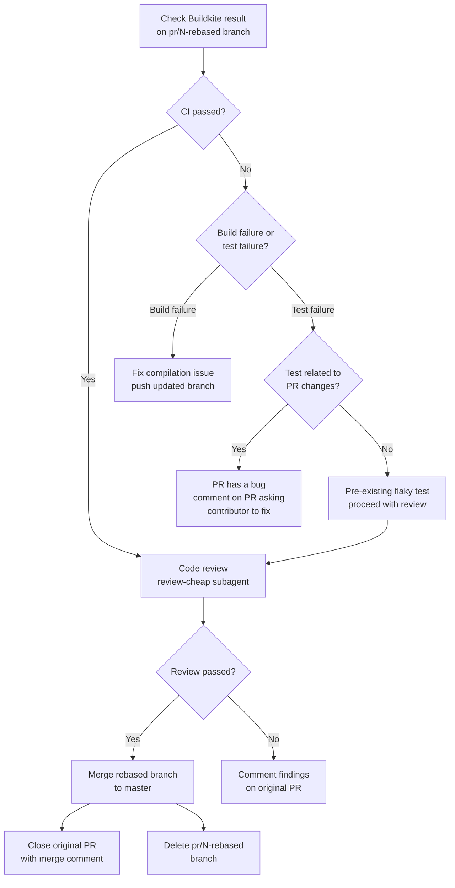

# PR Resolution Plan

## Overview

As of May 2026, MockServer had accumulated 136 open PRs — mostly automated Snyk/Dependabot dependency bumps with some community contributions. This plan documents the systematic triage, validation, and resolution of all open PRs.

## Completed Work

### Phase 1: Duplicate Cleanup (done)

Closed 33 duplicate PRs across 11 dependency groups where multiple Snyk/Dependabot PRs targeted the same dependency at different versions:

- spring-boot-starter-webflux (13 duplicates)
- netty-codec-http2 (2), netty-codec-http (1)
- bcprov-jdk18on (2), bcpkix-jdk18on (1)
- okhttp (2), spring-web (2), spring-webmvc (1)
- swagger-parser (1), google-http-client (2), ubuntu (1)

### Phase 2: Docs/Helm PRs Merged (done)

Merged 4 low-risk single-file PRs directly via `gh pr merge`:

| PR | Description |
|----|-------------|
| #1845 | Javadoc fix |
| #1846 | Javadoc consistency |
| #1877 | README links |
| #1918 | Helm kubectl quote fix |

### Phase 3: Dependency Version Bumps Applied Directly (done)

Instead of merging individual Snyk/Dependabot PRs (which were based on stale pom.xml), applied all 12 version bumps directly to master in commit `840397b56`, with compatibility fixes:

| Dependency | Old | New | PRs Closed |
|-----------|-----|-----|------------|
| netty | 4.1.89.Final | 4.1.132.Final | #1983, #1986 |
| netty-tcnative | 2.0.56.Final | 2.0.75.Final | (aligned with netty) |
| bouncycastle | 1.72 | 1.84 | #1984 |
| tomcat-embed-core | 9.0.71 | 9.0.117 | #1985 |
| swagger-parser | 2.1.12 | 2.1.22 | #1917, #1749 |
| json-path | 2.7.0 | 2.9.0 | #1832 |
| rhino | 1.7.14 | 1.7.14.1 | #1987 |
| commons-lang3 | 3.12.0 | 3.18.0 | #1944 |
| commons-io | 2.11.0 | 2.14.0 | #1913 |
| jetty-server | 9.4.50 | 9.4.57 | #1939 |
| okhttp | 4.10.0 | 4.12.0 | #1807 |
| google-http-client | 1.42.3 | 1.45.0 | #1901 |

**Compatibility fixes included in the same commit:**
- `JsonPathMatcher.java` — replaced `net.minidev.json.JSONArray` with `java.util.Collection` (json-path 2.9.0 changed json-smart scope to runtime)
- `pom.xml` — pinned `jackson-datatype-jsr310` to `${jackson.version}` in `dependencyManagement` (swagger-parser 2.1.22 pulls 2.16.2, incompatible with Jackson 2.14.2)
- `mockserver-examples/pom.xml` — updated kotlin-stdlib versions to 1.9.10, added `kotlin-stdlib-jdk8` and `grpc-context` to `dependencyManagement`

### Phase 4: Superseded/Stale/Invalid/Duplicate PRs Closed (done)

Closed 61 PRs in bulk:

| Category | Count | Reason |
|----------|-------|--------|
| Superseded | 39 | Dependency versions already bumped higher on master |
| Stale/Obsolete | 6 | 2+ years old, changes no longer applicable |
| Invalid (EOL) | 5 | Ubuntu Kinetic (22.10) reached EOL July 2023 |
| Duplicate | 11 | Same change as newer PR (e.g., multiple Spring 6 PRs) |

### Phase 5: Java 17+ PRs Rejected (done)

Closed 3 PRs that require Java 17+ or Jakarta namespace migration, which violates the project's Java 11 minimum compatibility policy:

| PR | Description | Reason |
|----|-------------|--------|
| #1962 | Spring 6.2.11 + WebFlux 3.4.10 | Requires Java 17+, Jakarta EE 9+ |
| #1916 | Jetty 12.0.12 | Requires Jakarta namespace |
| #1722 | Jetty 10.0.14 | Requires Java 11+ but uses Jakarta |

### Phase 6: Rebase Validation Branches (done)

For all 21 remaining community/feature PRs, created rebased test branches on origin to trigger Buildkite CI:

**Successfully rebased (19 PRs):**

| PR | Branch | Author | Description | Category |
|----|--------|--------|-------------|----------|
| #1975 | `pr/1975-rebased` | DarioViva42 | Fix notted strings in SubSetMatcher | Bug fix |
| #1869 | `pr/1869-rebased` | jamesdbloom | xmlunit 2.9.1 → 2.10.0 | Dep bump |
| #1854 | `pr/1854-rebased` | sullis | maven-surefire-plugin 3.2.5 | Dep bump |
| #1841 | `pr/1841-rebased` | asolntsev | LRUCache allCaches default off | Perf fix |
| #1824 | `pr/1824-rebased` | jonasfugedi | IPv6 address support | Feature |
| #1820 | `pr/1820-rebased` | RugvedB | LinkedHashMap for deterministic order (dashboard) | Bug fix |
| #1818 | `pr/1818-rebased` | RugvedB | LinkedHashMap for deterministic headers | Bug fix |
| #1817 | `pr/1817-rebased` | RugvedB | Fix non-deterministic style map order | Bug fix |
| #1810 | `pr/1810-rebased` | oxeye-mher | Helm: JVM_OPTIONS → JAVA_TOOL_OPTIONS | Bug fix |
| #1791 | `pr/1791-rebased` | szada92 | Path parameter pattern fix (#1524, #1505) | Bug fix |
| #1774 | `pr/1774-rebased` | dom54 | Velocity template engine thread safety | Bug fix |
| #1755 | `pr/1755-rebased` | Arkinator | Preserve exact bytes when encoding off | Bug fix |
| #1737 | `pr/1737-rebased` | GerMoranBYON | Multi-arch docker + GH Actions caching | Infra |
| #1729 | `pr/1729-rebased` | DenilssonMontoya | TLS docs fix | Docs |
| #1712 | `pr/1712-rebased` | tototoshi | Remove SLF4J bindings from shaded JARs | Bug fix |
| #1682 | `pr/1682-rebased` | coubanodo | Helm: imagePullSecret support | Feature |
| #1665 | `pr/1665-rebased` | bbednarek | Multi-arch docker (ARM support) | Feature |
| #1651 | `pr/1651-rebased` | ilam-natarajan | Log proxy responses | Feature |
| #1649 | `pr/1649-rebased` | tisoft | Bill of Materials (BOM) module | Feature |

**Rebase conflicts resolved manually (2 PRs):**

| PR | Branch | Conflict | Resolution |
|----|--------|----------|------------|
| #1747 | `pr/1747-rebased` | `NettySslContextFactory.java` — logging block changed | Accepted PR's null-safe `logUsedCertificateData()` method + operator precedence parens |
| #1689 | `pr/1689-rebased` | `mockserver-examples/README.md` — adjacent lines | Kept both lines (docker-compose + PHP behat) |

**Rebase conflict — PR closed as superseded (1 PR):**

| PR | Reason |
|----|--------|
| #1967 | jersey 3.0.17 — master already has jersey 3.1.1 (higher) |

Each rebased branch has a comment on the original PR linking to the branch and explaining the process.

## Remaining Work

### New Dependabot PRs (appeared after master push)

These 4 PRs were auto-created by Dependabot after our dependency bumps were pushed to master. They target dependencies we have NOT yet bumped:

| PR | Dependency | Old | New | Risk | Action |
|----|-----------|-----|-----|------|--------|
| #1988 | jackson-core | 2.14.2 | 2.18.6 | **HIGH** | Review carefully. Jackson 2.15+ adds `JsonFormat.Feature.READ_DATE_TIMESTAMPS_AS_NANOSECONDS` which we've already seen break tests. Major version jump (2.14 → 2.18) across 4 minor versions. Need to verify all Jackson modules align and no API breakages. Consider bumping to 2.15.x first as incremental step. |
| #1989 | xmlunit-core | 2.9.1 | 2.10.0 | **LOW** | Safe minor bump. Duplicates #1869 (Snyk PR for same bump). If `pr/1869-rebased` CI passes, apply from there and close both #1989 and #1869. |
| #1990 | nimbus-jose-jwt | 9.31 | 9.37.4 | **MEDIUM** | Minor version bump within 9.x. JWT handling is security-critical — run full test suite. Check for API changes in `RemoteJWKSet` (already deprecated in our code). |
| #1991 | commons-beanutils | 1.9.4 | 1.11.0 | **MEDIUM** | Minor-to-major jump. Used transitively by velocity-tools. Verify no breaking API changes. Check if new version is still Java 11 compatible. |

**Recommended approach:** Apply these as a second batch of version bumps directly to master (same as Phase 3), test locally, then close the Dependabot PRs. Do NOT merge the Dependabot PRs directly — they don't include necessary convergence fixes.

### Community PRs Awaiting CI Results

Once Buildkite completes on the `pr/*-rebased` branches, resolve each PR based on results:

#### Bug Fixes (high priority — merge if CI passes)

| PR | Branch | Description | Merge Strategy |
|----|--------|-------------|----------------|
| #1975 | `pr/1975-rebased` | Fix notted strings in SubSetMatcher | Review code, merge rebased branch if tests pass |
| #1791 | `pr/1791-rebased` | Path parameter pattern fix (#1524, #1505) | Review code, includes tests — merge if passes |
| #1774 | `pr/1774-rebased` | Velocity template thread safety | Review code, includes test — merge if passes |
| #1747 | `pr/1747-rebased` | NPE fix in NettySslContextFactory logging | Simple null guard, merge if passes |
| #1755 | `pr/1755-rebased` | Preserve exact bytes when encoding off | Review code, includes test — merge if passes |
| #1817 | `pr/1817-rebased` | Fix non-deterministic style map order | HashMap → LinkedHashMap, merge if passes |
| #1818 | `pr/1818-rebased` | LinkedHashMap for deterministic headers | Same pattern as #1817, merge if passes |
| #1820 | `pr/1820-rebased` | LinkedHashMap for deterministic dashboard order | Same pattern as #1817/#1818, merge if passes |
| #1841 | `pr/1841-rebased` | LRUCache allCaches default off | Performance fix by Selenide maintainer, includes tests — merge if passes |

#### Dependency Bumps (medium priority — apply if safe)

| PR | Branch | Description | Merge Strategy |
|----|--------|-------------|----------------|
| #1869 | `pr/1869-rebased` | xmlunit 2.9.1 → 2.10.0 | If CI passes, apply to master and close both #1869 and #1989 |
| #1854 | `pr/1854-rebased` | maven-surefire-plugin 2.22.2 → 3.2.5 | If CI passes, apply. Major surefire upgrade — verify test execution behavior unchanged |

#### Features (lower priority — review carefully)

| PR | Branch | Description | Merge Strategy |
|----|--------|-------------|----------------|
| #1824 | `pr/1824-rebased` | IPv6 address support | Review scope and test coverage. Feature addition — merge if tests pass and code quality is acceptable |
| #1651 | `pr/1651-rebased` | Log proxy responses | Review logging impact and configurability. Feature addition |
| #1649 | `pr/1649-rebased` | BOM module | Review pom.xml structure. Useful for downstream consumers |

#### Helm Chart Changes

| PR | Branch | Description | Merge Strategy |
|----|--------|-------------|----------------|
| #1810 | `pr/1810-rebased` | JVM_OPTIONS → JAVA_TOOL_OPTIONS | Simple env var fix. Merge if Helm template renders correctly |
| #1682 | `pr/1682-rebased` | imagePullSecret support | Review Helm template changes. Standard K8s feature |

#### Infrastructure / Docker

| PR | Branch | Description | Merge Strategy |
|----|--------|-------------|----------------|
| #1665 | `pr/1665-rebased` | Multi-arch docker (ARM support) | Review Dockerfile changes. #1737 may supersede this |
| #1737 | `pr/1737-rebased` | Multi-arch docker + GH Actions caching | Review against #1665. If both similar, merge the more complete one and close the other |

#### Documentation

| PR | Branch | Description | Merge Strategy |
|----|--------|-------------|----------------|
| #1729 | `pr/1729-rebased` | TLS docs fix | Verify the example is correct for current API. Merge if accurate |
| #1689 | `pr/1689-rebased` | PHP client and Behat docs | Verify links work. Merge if content is accurate |

#### SLF4J Shading Fix

| PR | Branch | Description | Merge Strategy |
|----|--------|-------------|----------------|
| #1712 | `pr/1712-rebased` | Remove jdk14 SLF4J bindings from shaded JARs | Review shade plugin config changes carefully. This affects the published artifact |

### Resolution Workflow

For each PR, once Buildkite results are available:



### Cleanup

After all PRs are resolved:

1. Delete all `pr/*-rebased` branches from origin:
   ```bash
   git push origin --delete pr/1975-rebased pr/1869-rebased ...
   ```
2. Delete local branches:
   ```bash
   git branch -D pr/1975-rebased pr/1869-rebased ...
   ```
3. Verify open PR count is zero (or only contains new incoming PRs)
4. Consider disabling Snyk integration to reduce PR noise (Dependabot alone is sufficient)

## PR Count Summary

| Phase | PRs Closed | Method |
|-------|-----------|--------|
| Phase 1: Duplicate cleanup | 33 | Closed as duplicates |
| Phase 2: Docs/Helm merged | 4 | Merged via `gh pr merge` |
| Phase 3: Dep bumps applied | 12 | Applied to master, PRs closed |
| Phase 4: Superseded/stale/invalid | 61 | Closed with explanation |
| Phase 5: Java 17+ rejected | 3 | Closed — violates Java 11 policy |
| Phase 6: Conflict — superseded | 1 | #1967 jersey (already higher on master) |
| **Total closed so far** | **114** | |
| **Remaining (rebased, awaiting CI)** | **21** | Rebased branches pushed |
| **New Dependabot PRs** | **4** | #1988-#1991, evaluate separately |
| **Grand total** | **139** | Started at 136 + 4 new + 1 closed conflict |
