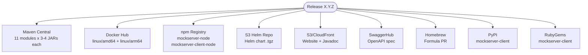
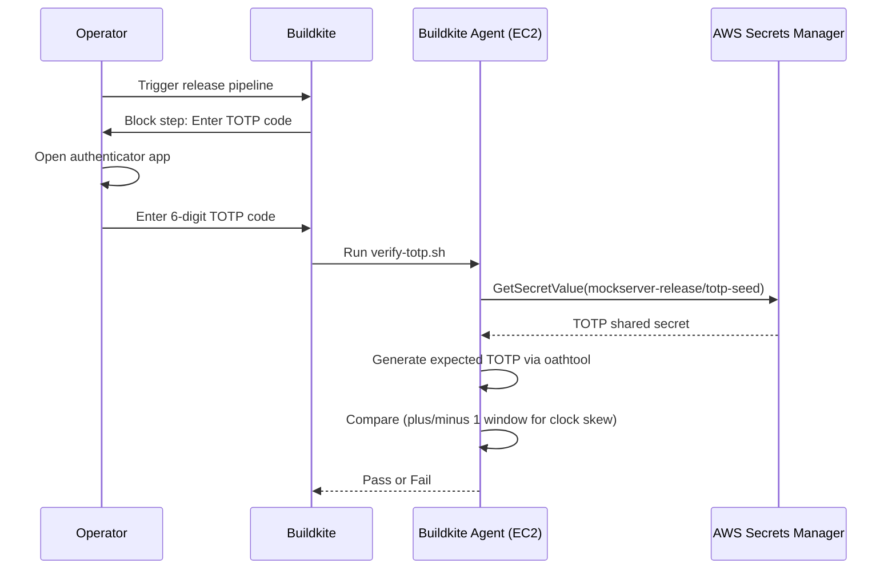
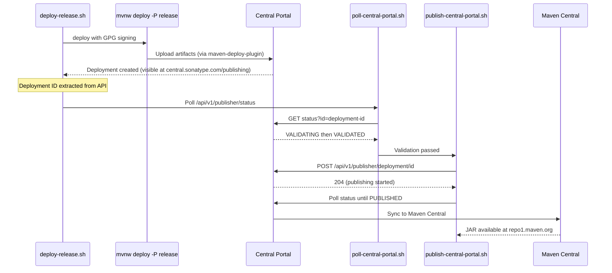
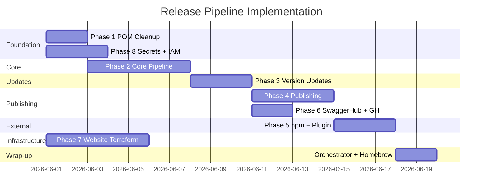

# Release Pipeline Plan

## Decision: Option A — Buildkite Release Pipeline

After evaluating four options (Buildkite pipeline, GitHub Actions, Hybrid, OpenCode skill), **Option A (Buildkite Release Pipeline)** was selected. The rejected options are preserved in [Appendix A](#appendix-a-rejected-options) for reference.

**Key reasons:**
1. Existing Buildkite infrastructure (build agents, Docker image, AWS integration)
2. AWS Secrets Manager already integrated with the Buildkite stack (5 secrets already provisioned)
3. `block` steps with `allowed_teams` for access control
4. TOTP verification gate against AWS for defense-in-depth security

**Design decisions:**
- **Replace maven-release-plugin** with explicit `mvn versions:set` + `git tag` for full transparency
- **Use Central Portal Publisher API** for automated Maven Central publishing (not legacy OSSRH Nexus Staging API)
- **Shared scripts** — every step is a standalone script callable from both Buildkite and locally
- **Local orchestrator** — `scripts/release.sh` runs the same scripts as the pipeline
- **Terraform for website** — all website infrastructure managed as IaC, with cross-account IAM role assumption
- **In-monorepo subprojects** — `mockserver-maven-plugin/`, `mockserver-node/`, `mockserver-client-node/` are all in the monorepo; scripts work in-tree, no external cloning
- **Resumable pipeline** — parallel publish steps can be re-run independently without rolling back Maven Central

---

## Adversarial Review of Previous Plan (v1)

The previous plan (preserved in git history) had 15 issues identified during adversarial review. All have been addressed in this version:

### Critical Issues (v1 Plan-Breaking)

| # | Issue | Resolution |
|---|-------|-----------|
| 1 | `release-central.sh` used dead OSSRH Nexus Staging API (`/service/local/staging/...`) | Replaced with Central Portal Publisher API (`/api/v1/publisher/upload`, `/status`, `/deployment`) |
| 2 | 6 submodule POMs use `repositoryId=ossrh` — credential mismatch with CI settings (`central-portal`) | POM cleanup task: migrate all 6 submodules to `repositoryId=central-portal` |
| 3 | `deploy.plugin.repository.url` defaults to old OSSRH URL | POM cleanup task: update property to Central Portal releases URL |
| 4 | Docker builds use OSSRH redirect API for JAR download | Docker image now uses CI-built JAR via `--build-arg source=copy`, not Maven Central download |

### Significant Issues

| # | Issue | Resolution |
|---|-------|-----------|
| 5 | SCM URL listed as prerequisite — already fixed | Removed from prerequisites |
| 6 | Plan assumed cloning external repos for maven-plugin, node, client-node | All scripts work in-tree (monorepo paths) |
| 7 | maven-release-plugin version stated as 2.5.3 — actually 3.3.1 | Corrected in pain points |
| 8 | Node packages at 5.15.0 vs Java at 5.16.0-SNAPSHOT | Version sync handled in `update-versions.sh` including `package.json` file references |
| 9 | IAM policy referenced undefined `dockerhub` resource | References existing resource from `build-secrets.tf` |
| 10 | Docker tagging convention didn't match existing practice | Tags now follow existing convention: `mockserver-X.Y.Z` + `X.Y.Z` + `latest` |

### Design Improvements

| # | Issue | Resolution |
|---|-------|-----------|
| 11 | No idempotency/resumability | Parallel publish group can be retried; Maven Central step is atomic (deploy then publish) |
| 12 | TOTP seed readable by agent | Accepted risk — defense-in-depth still valuable against Buildkite UI compromise |
| 13 | Cross-account website access via static credentials | Changed to cross-account IAM role assumption |
| 14 | `update-versions.sh` has no validation | Added `git diff --stat` review gate and dry-run mode |
| 15 | 23-32 day estimate inflated | Reduced to 16-22 days given existing infrastructure |

---

## Current State

The release process is a **manual 15-step process** executed entirely from a developer's Mac, spanning 9 artifact registries. Every step requires human intervention. There is no CI/CD pipeline for releases.

### What Already Exists (Available Infrastructure)

| Asset | Status | Notes |
|-------|--------|-------|
| Buildkite CI with path-based orchestrator | Working | 13 pipelines, EC2 Spot agents, Lambda scaler |
| CI snapshot deployment to Central Portal | Working | `.buildkite/scripts/steps/java-deploy-snapshot.sh` |
| Docker release image pipeline | Working | `.buildkite/docker-push-release.yml` (manual trigger) |
| Docker latest image pipeline | Working | Auto-push on master merge |
| Python release script | Working | `scripts/release_python.sh` (dual-mode credentials) |
| Ruby release script | Working | `scripts/release_ruby.sh` (dual-mode credentials) |
| 5 secrets in AWS SM | Provisioned | `dockerhub`, `buildkite-api-token`, `sonatype`, `pypi`, `rubygems` |
| Buildkite agent IAM policy | Configured | Read access to all 5 secrets |
| SCM URL in pom.xml | Fixed | Already points to `mock-server/mockserver-monorepo` |
| All subprojects in monorepo | Done | `mockserver-maven-plugin/`, `mockserver-node/`, `mockserver-client-node/` |

### Current Pain Points

| Problem | Impact |
|---------|--------|
| 15 manual steps across 9 platforms | Error-prone, takes hours, requires tribal knowledge |
| Hardcoded JDK 1.8 path in `local_release.sh` | Only works on one developer's machine |
| Tests skipped during release (`-DskipTests`) | Releases trust the last manual build passed |
| GPG key on a single laptop | Bus-factor = 1 |
| Docker image timing dependency on Maven Central sync | May fail and need manual retry hours later |
| `repositoryId=ossrh` in 6 submodule POMs | Credential mismatch with new Central Portal |
| `deploy.plugin.repository.url` points to dead OSSRH | Shaded JAR deploy would fail |
| No rollback automation | Failed releases require manual `git reset --hard` + force push |
| No GitHub Releases created | No release notes on GitHub |
| Website infrastructure not in Terraform | Manual AWS Console work for versioned sites |
| `mockserver-node` hardcodes `oss.sonatype.org` in `index.js` | Download URL wrong for new Sonatype |

### Release Artifacts



### Required Credentials

| Credential | Current Location | Target Location |
|------------|-----------------|-----------------|
| Sonatype Central Portal token | AWS SM `mockserver-build/sonatype` | Same (already provisioned) |
| GPG private key + passphrase | Developer's local keyring | AWS SM `mockserver-release/gpg-key` (new) |
| Docker Hub token | AWS SM `mockserver-build/dockerhub` | Same (already provisioned) |
| GitHub PAT | Developer's env var | AWS SM `mockserver-release/github-token` (new) |
| npm token | Developer's npm session | AWS SM `mockserver-release/npm-token` (new) |
| AWS website cross-account role | Not configured | IAM role in website account (new) |
| SwaggerHub API key | Developer's browser session | AWS SM `mockserver-release/swaggerhub` (new) |
| PyPI API token | AWS SM `mockserver-build/pypi` | Same (already provisioned) |
| RubyGems API key | AWS SM `mockserver-build/rubygems` | Same (already provisioned) |
| TOTP seed | Not configured | AWS SM `mockserver-release/totp-seed` (new) |

---

## Design Principles

1. **Shared scripts** — every automatable step is a standalone script in `scripts/ci/release/`. Both the Buildkite pipeline and the local orchestrator call the same scripts.
2. **Dual-mode credentials** — scripts detect CI vs. local and load secrets from AWS Secrets Manager accordingly (IAM role in CI, SSO profile locally).
3. **TOTP gate** — the operator enters a 6-digit code; the pipeline verifies it against a seed stored in AWS Secrets Manager. Even a compromised Buildkite UI cannot silently publish.
4. **Replace maven-release-plugin** — use `mvn versions:set` + explicit `git tag` + `git commit` + `git push` for full transparency and control.
5. **Central Portal Publisher API** — upload a deployment bundle, verify status, and publish via the new API at `central.sonatype.com/api/v1/publisher/`.
6. **Cross-account IAM role** — Buildkite agents assume a role in the website account for S3/CloudFront operations. No static credentials.
7. **In-tree operations** — all subprojects are in the monorepo; scripts operate on local directories, not external clones.
8. **Resumable** — the parallel publish group (Docker, Helm, Javadoc, SwaggerHub, Website, GitHub Release) can be individually retried without rolling back earlier steps.

---

## Architecture Overview

```mermaid
flowchart TD
    subgraph Orchestration
        BK["Buildkite Pipeline
.buildkite/release-pipeline.yml
TOTP block step + approval gates"]
        LOCAL["Local Script
scripts/release.sh
interactive prompts"]
    end

    subgraph Scripts["Shared Scripts — scripts/ci/release/*.sh"]
        COMMON[common.sh]
        TOTP[verify-totp.sh]
        VAL[validate.sh]
        SETVER[set-release-version.sh]
        BUILD[build-and-test.sh]
        DEPLOY_REL[deploy-release.sh]
        POLL[poll-central-portal.sh]
        PUBLISH_CP[publish-central-portal.sh]
        WAIT[wait-for-central.sh]
        SNAP[deploy-snapshot.sh]
        UPDVER[update-versions.sh]
        NODE[publish-npm.sh]
        MVNPLUGIN[release-maven-plugin.sh]
        DOCKER[publish-docker.sh]
        HELM[publish-helm.sh]
        JAVADOC[publish-javadoc.sh]
        SWAGGER[update-swaggerhub.sh]
        WEBSITE[publish-website.sh]
        VSITE[create-versioned-site.sh]
        BREW[update-homebrew.sh]
        PYPI[publish-pypi.sh]
        GEMS[publish-rubygems.sh]
        GHREL[github-release.sh]
        CLEANUP[cleanup-failed-release.sh]
        NOTIFY[notify.sh]
    end

    subgraph Credentials["AWS Secrets Manager — build account"]
        S_EXIST["Already exist:
mockserver-build/sonatype
mockserver-build/dockerhub
mockserver-build/pypi
mockserver-build/rubygems
mockserver-build/buildkite-api-token"]
        S_NEW["New:
mockserver-release/gpg-key
mockserver-release/github-token
mockserver-release/totp-seed
mockserver-release/npm-token
mockserver-release/swaggerhub
mockserver-release/website-role"]
    end

    subgraph Infra["Infrastructure — Terraform"]
        TF_BK["terraform/buildkite-agents/
Build agents, IAM, secrets"]
        TF_WEB["terraform/website/
S3, CloudFront, Route53, ACM
Cross-account IAM role"]
    end

    BK --> Scripts
    LOCAL --> Scripts
    Scripts --> S_EXIST
    Scripts --> S_NEW
    VSITE --> TF_WEB
```



---

## Step-by-Step Mapping

| # | Release Step | Script | CI? | Local? | Notes |
|---|---|---|---|---|---|
| — | TOTP Authorization | `verify-totp.sh` | Yes (block) | Yes | |
| — | Validate inputs | `validate.sh` | Yes | Yes | |
| 1a | Set release version | `set-release-version.sh` | Yes | Yes | Replaces maven-release-plugin |
| 1b | Build & test | `build-and-test.sh` | Yes | Yes | Full test suite, unlike current `-DskipTests` |
| 1c | Deploy to Central Portal | `deploy-release.sh` | Yes | Yes | `mvn deploy -P release` with GPG signing |
| 1d | Poll deployment status | `poll-central-portal.sh` | Yes | Yes | Central Portal Publisher API status polling |
| 1e | Publish on Central Portal | `publish-central-portal.sh` | Yes | Yes | POST to `/api/v1/publisher/deployment/<id>` |
| 1f | Wait for Maven Central sync | `wait-for-central.sh` | Yes | Yes | Poll `repo1.maven.org` |
| 2 | Deploy SNAPSHOT | `deploy-snapshot.sh` | Yes | Yes | |
| 3 | Update repo versions | `update-versions.sh` | Yes | Yes | Includes Node package.json, Ruby version.rb, Python pyproject.toml |
| 4 | Publish mockserver-node to npm | `publish-npm.sh mockserver-node` | Local-only | Yes | npm OTP required interactively |
| 5 | Publish mockserver-client-node to npm | `publish-npm.sh mockserver-client-node` | Local-only | Yes | npm OTP required interactively |
| 6 | Release mockserver-maven-plugin | `release-maven-plugin.sh` | Yes | Yes | In-tree release cycle |
| 7 | Docker image | `publish-docker.sh` | Yes | Yes | Uses CI-built JAR, not Maven Central download |
| 8 | Helm chart | `publish-helm.sh` | Yes | Yes | Cross-account IAM role |
| 9 | Javadoc | `publish-javadoc.sh` | Yes | Yes | Cross-account IAM role |
| 10 | SwaggerHub | `update-swaggerhub.sh` | Yes | Yes | SwaggerHub REST API |
| 11 | Website | `publish-website.sh` | Yes | Yes | Cross-account IAM role |
| 12 | Versioned website | `create-versioned-site.sh` | Yes (optional) | Yes | Terraform apply |
| 13 | Homebrew | `update-homebrew.sh` | Local-only | Yes | Requires local `brew` |
| 14 | Python client to PyPI | `publish-pypi.sh` | Yes | Yes | Reuses existing `release_python.sh` pattern |
| 15 | Ruby client to RubyGems | `publish-rubygems.sh` | Yes | Yes | Reuses existing `release_ruby.sh` pattern |
| — | GitHub Release | `github-release.sh` | Yes | Yes | |
| — | Cleanup failed release | `cleanup-failed-release.sh` | Local-only | Yes | |
| — | Notify | `notify.sh` | Yes | Yes | |

---

## File Structure

```
scripts/
├── release.sh                          # Local orchestrator
├── ci/
│   └── release/
│       ├── common.sh                   # Shared: env detection, credential loading, logging
│       ├── verify-totp.sh              # TOTP verification against AWS seed
│       ├── validate.sh                 # Version format, branch, dirty-tree checks
│       ├── set-release-version.sh      # mvn versions:set + git tag + commit
│       ├── build-and-test.sh           # ./mvnw clean install (WITH tests)
│       ├── deploy-release.sh           # GPG import + ./mvnw deploy -P release
│       ├── poll-central-portal.sh      # Poll Central Portal Publisher API for VALIDATED status
│       ├── publish-central-portal.sh   # POST to /api/v1/publisher/deployment/<id> to publish
│       ├── wait-for-central.sh         # Poll repo1.maven.org until JAR available
│       ├── deploy-snapshot.sh          # mvn versions:set to SNAPSHOT + deploy
│       ├── update-versions.sh          # Version find-and-replace + validation
│       ├── publish-npm.sh              # In-tree npm build + publish (interactive OTP)
│       ├── release-maven-plugin.sh     # In-tree maven-plugin release cycle
│       ├── publish-docker.sh           # Docker buildx multi-arch + push
│       ├── publish-helm.sh             # Helm package + S3 sync (cross-account role)
│       ├── publish-javadoc.sh          # Javadoc generation + S3 upload (cross-account role)
│       ├── update-swaggerhub.sh        # SwaggerHub REST API
│       ├── publish-website.sh          # Jekyll build + S3 sync + CF invalidation (cross-account role)
│       ├── create-versioned-site.sh    # Terraform apply for new versioned site
│       ├── update-homebrew.sh          # brew bump-formula-pr (local-only)
│       ├── publish-pypi.sh             # Build + twine upload (reuses existing pattern)
│       ├── publish-rubygems.sh         # gem build + gem push (reuses existing pattern)
│       ├── github-release.sh           # gh release create with changelog extract
│       ├── cleanup-failed-release.sh   # Revert git, delete tag, drop Central Portal deployment
│       └── notify.sh                   # Success/failure notification

.buildkite/
├── pipeline.yml                        # Existing CI pipeline (unchanged)
└── release-pipeline.yml                # New: release pipeline

terraform/
├── buildkite-agents/                   # Existing: build agent infra
│   └── build-secrets.tf                # Modified: add release secrets + IAM policy
├── buildkite-pipelines/
│   └── pipelines.tf                    # Modified: add release pipeline entry
└── website/                            # NEW: website infra (website account)
    ├── main.tf
    ├── variables.tf
    ├── versions.tf
    ├── backend.tf
    ├── dns.tf
    ├── acm.tf
    ├── main-site.tf
    ├── versioned-sites.tf
    ├── helm-repo.tf
    ├── outputs.tf
    ├── cross-account-role.tf           # IAM role for build account to assume
    ├── import.tf
    └── terraform.tfvars.example
```

---

## Shared Script Foundation: `common.sh`

All release scripts source `common.sh` which provides:

### Environment Detection

```bash
is_ci() { [[ -n "${BUILDKITE:-}" ]]; }
```

### Dual-Mode Credential Loading

```bash
load_secret() {
  local secret_id="$1" key="$2"
  local xtrace_state
  xtrace_state=$(shopt -po xtrace 2>/dev/null || true)
  set +x
  local json
  if is_ci; then
    json=$(aws secretsmanager get-secret-value \
      --secret-id "$secret_id" \
      --region eu-west-2 \
      --query SecretString --output text)
  else
    json=$(aws secretsmanager get-secret-value \
      --secret-id "$secret_id" \
      --region eu-west-2 \
      --profile "${AWS_PROFILE:-mockserver-build}" \
      --query SecretString --output text)
  fi
  echo "$json" | jq -r ".$key"
  eval "$xtrace_state"
}
```

This pattern already exists in `scripts/release_python.sh` and `scripts/release_ruby.sh` — `common.sh` centralises it.

### Cross-Account Website Access

```bash
assume_website_role() {
  local role_arn
  role_arn=$(load_secret "mockserver-release/website-role" "role_arn")
  local creds
  creds=$(aws sts assume-role \
    --role-arn "$role_arn" \
    --role-session-name "mockserver-release-${RELEASE_VERSION}" \
    --duration-seconds 3600 \
    --output json)
  export AWS_ACCESS_KEY_ID=$(echo "$creds" | jq -r '.Credentials.AccessKeyId')
  export AWS_SECRET_ACCESS_KEY=$(echo "$creds" | jq -r '.Credentials.SecretAccessKey')
  export AWS_SESSION_TOKEN=$(echo "$creds" | jq -r '.Credentials.SessionToken')
}
```

### Central Portal Authentication

```bash
central_portal_auth_header() {
  local username password
  username=$(load_secret "mockserver-build/sonatype" "username")
  password=$(load_secret "mockserver-build/sonatype" "password")
  printf "%s:%s" "$username" "$password" | base64
}
```

### Version Variables

```bash
if is_ci; then
  RELEASE_VERSION=$(buildkite-agent meta-data get release-version)
  NEXT_VERSION=$(buildkite-agent meta-data get next-version)
  OLD_VERSION=$(buildkite-agent meta-data get old-version)
else
  : "${RELEASE_VERSION:?}" "${NEXT_VERSION:?}" "${OLD_VERSION:?}"
fi
export RELEASE_VERSION NEXT_VERSION OLD_VERSION
```

### Utility Functions

- `log_info`, `log_error`, `log_step` — structured logging
- `require_cmd <command>` — fail fast if missing
- `require_env <var>` — fail fast if unset
- `confirm <prompt>` — interactive confirmation (skipped in CI)

---

## Security Model

### TOTP Verification Against AWS



#### Known Limitation

A compromised Buildkite agent EC2 instance could read the TOTP seed from Secrets Manager via its IAM role. This is accepted as a residual risk because:
- The TOTP gate still prevents attacks via Buildkite UI compromise (most likely vector)
- The agent IAM role requires EC2 instance identity — cannot be assumed from outside AWS
- Combined with `block` step `allowed_teams`, this is defense-in-depth

#### One-Time Setup

1. Generate seed: `python3 -c "import pyotp; print(pyotp.random_base32())"`
2. Store in AWS SM: `mockserver-release/totp-seed` with JSON `{"seed": "<base32-seed>"}`
3. Register in authenticator app (1Password, Google Authenticator, etc.)

#### `verify-totp.sh` Logic

```bash
TOTP_CODE="${TOTP_CODE:-$(buildkite-agent meta-data get totp-code 2>/dev/null || echo '')}"

if [[ -z "$TOTP_CODE" ]]; then
  read -rp "Enter TOTP code: " TOTP_CODE
fi

TOTP_SEED=$(load_secret "mockserver-release/totp-seed" "seed")

EXPECTED=$(oathtool --totp -b "$TOTP_SEED")
EXPECTED_PREV=$(oathtool --totp -b -N "now - 30 seconds" "$TOTP_SEED")
EXPECTED_NEXT=$(oathtool --totp -b -N "now + 30 seconds" "$TOTP_SEED")

if [[ "$TOTP_CODE" == "$EXPECTED" || "$TOTP_CODE" == "$EXPECTED_PREV" || "$TOTP_CODE" == "$EXPECTED_NEXT" ]]; then
  echo "TOTP verified successfully"
else
  echo "TOTP verification FAILED" >&2; exit 1
fi
```

### Access Control Layers

| Layer | Control | What It Prevents |
|---|---|---|
| Pipeline visibility | Private pipeline | Unauthorized trigger |
| Block step unblock | `allowed_teams: ["release-managers"]` | Unauthorized approval |
| TOTP verification | Code verified against AWS seed | Buildkite UI compromise |
| Secrets isolation | All secrets in AWS SM, not Buildkite | Buildkite data breach |
| Agent IAM scoping | Only `secretsmanager:GetSecretValue` | Agent cannot modify secrets |
| Cross-account role | Explicit `sts:AssumeRole` trust policy | Limits website access |

### Threat Model

| Threat | Mitigation |
|---|---|
| Buildkite account compromise | TOTP verified against AWS — attacker cannot generate valid code without authenticator app |
| Buildkite pipeline modification | `allowed_teams` on block steps restricts who can approve; pipeline changes visible in git history |
| Agent compromise (code execution on EC2) | Agent can read secrets via IAM but cannot unblock `block` steps or provide TOTP input |
| Supply chain (malicious PR triggers release) | Release pipeline is separate from CI, manually triggered only |
| AWS account compromise | Out of scope — mitigate with AWS SSO MFA on the account itself |

---

## Maven Central Publishing: Central Portal Publisher API

### Why Central Portal API (Not Legacy OSSRH)

The project's `distributionManagement` has been migrated to `central.sonatype.com`. The CI snapshot deployment already uses the Central Portal successfully. The old OSSRH system at `oss.sonatype.org` is deprecated.

Sonatype provides an [OSSRH Staging API compatibility layer](https://central.sonatype.org/publish/publish-portal-ossrh-staging-api/) at `ossrh-staging-api.central.sonatype.com`, but the native Central Portal Publisher API is simpler and better documented.

### Publishing Flow



### Two Publishing Options

The Central Portal supports two `publishingType` values when using `maven-deploy-plugin`:

| Mode | Behaviour | Use Case |
|------|-----------|----------|
| `AUTOMATIC` | Validates and publishes automatically | Fast, no manual review |
| `USER_MANAGED` (default) | Validates, waits for manual publish | Allows review before publish |

The pipeline uses `USER_MANAGED` mode with an automated publish step after a review gate, giving both safety and automation:
1. `mvn deploy` uploads artifacts — deployment enters `VALIDATING`
2. Central Portal validates (GPG, POM, sources, javadoc) — `VALIDATED`
3. Buildkite `block` step: operator reviews deployment at `central.sonatype.com/publishing`
4. `publish-central-portal.sh` calls the publish API — `PUBLISHING` then `PUBLISHED`

### Deployment State Machine

The Central Portal deployment states are:

| State | Meaning |
|-------|---------|
| `PENDING` | Uploaded, waiting for processing |
| `VALIDATING` | Being processed by validation service |
| `VALIDATED` | Passed validation, waiting for manual publish (USER_MANAGED) |
| `PUBLISHING` | Being uploaded to Maven Central |
| `PUBLISHED` | Successfully available on Maven Central |
| `FAILED` | Error encountered (details in `errors` field) |

### Fallback: OSSRH Staging API Compatibility

If the native Publisher API proves problematic, the OSSRH Staging API compatibility layer at `ossrh-staging-api.central.sonatype.com` supports the `maven-deploy-plugin` with URL-only changes:
- Replace `oss.sonatype.org` with `ossrh-staging-api.central.sonatype.com`
- Use Central Portal user tokens (not legacy OSSRH tokens)
- After deploy, call `POST /manual/upload/defaultRepository/<namespace>` to transfer to Central Portal

---

## POM Changes Required (Pre-Implementation)

These changes must be made before the release pipeline scripts can work:

| # | Change | File(s) | Detail |
|---|--------|---------|--------|
| 1 | Update `deploy.plugin.repository.url` | `mockserver/pom.xml` line 80 | `https://oss.sonatype.org/content/repositories/snapshots/` to `https://central.sonatype.com/repository/maven-releases/` |
| 2 | Update `repositoryId` in 6 submodule release profiles | `mockserver-netty/pom.xml`, `mockserver-client-java/pom.xml`, `mockserver-junit-rule/pom.xml`, `mockserver-junit-jupiter/pom.xml`, `mockserver-spring-test-listener/pom.xml`, `mockserver-integration-testing/pom.xml` | `<repositoryId>ossrh</repositoryId>` to `<repositoryId>central-portal</repositoryId>` |
| 3 | Update shaded JAR deploy URL in 6 submodule release profiles | Same 6 files | `<url>${deploy.plugin.repository.url}</url>` to Central Portal releases URL |
| 4 | Remove maven-release-plugin from release profile | `mockserver/pom.xml` | No longer needed — replaced by `versions:set` + explicit git operations. Retain rest of `release` profile for GPG, source, javadoc |
| 5 | Update `mockserver-maven-plugin` OSSRH references | `mockserver-maven-plugin/pom.xml` lines 39, 53 | Replace OSSRH snapshot URLs with Central Portal |
| 6 | Update Docker REPOSITORY_URL | `docker/Dockerfile`, `docker/root/Dockerfile`, `docker/snapshot/Dockerfile`, `docker/root-snapshot/Dockerfile` | Use `repo1.maven.org` for releases, or `--build-arg source=copy` pattern |
| 7 | Update `mockserver-node` artifact host | `mockserver-node/index.js` line 13, `Gruntfile.js` line 73 | `oss.sonatype.org` to Maven Central download URL |
| 8 | Update settings files | `docker_build/maven/settings.xml`, integration test `settings.xml` (4 files) | Replace OSSRH snapshot URLs with Central Portal |

---

## Buildkite Pipeline: `.buildkite/release-pipeline.yml`

```yaml
steps:
  - input: "Release Parameters"
    fields:
      - text: "Release Version"
        key: "release-version"
        hint: "e.g., 5.16.0"
        required: true
        format: "[0-9]+\\.[0-9]+\\.[0-9]+"
      - text: "Next SNAPSHOT Version"
        key: "next-version"
        hint: "e.g., 5.16.1-SNAPSHOT"
        required: true
      - text: "Previous Version"
        key: "old-version"
        hint: "e.g., 5.15.0 (for find-and-replace)"
        required: true
      - select: "Release Type"
        key: "release-type"
        default: "full"
        options:
          - label: "Full Release (all steps)"
            value: "full"
          - label: "Maven Central Only"
            value: "maven-only"
          - label: "Docker Image Only (re-publish)"
            value: "docker-only"
      - select: "Create Versioned Site?"
        key: "create-versioned-site"
        default: "no"
        options:
          - label: "No"
            value: "no"
          - label: "Yes (major/minor release)"
            value: "yes"

  - block: ":lock: TOTP Authorization"
    prompt: "Enter your TOTP code to authorize this release"
    allowed_teams: ["release-managers"]
    fields:
      - text: "TOTP Code"
        key: "totp-code"
        hint: "6-digit code from your authenticator app"
        required: true
        format: "[0-9]{6}"

  - label: ":shield: Verify TOTP"
    command: "scripts/ci/release/verify-totp.sh"

  - label: ":white_check_mark: Validate"
    command: "scripts/ci/release/validate.sh"

  - label: ":git: Set Release Version"
    command: "scripts/ci/release/set-release-version.sh"

  - label: ":maven: Build & Test"
    command: "scripts/ci/release/build-and-test.sh"
    timeout_in_minutes: 60
    artifact_paths:
      - "mockserver/mockserver-netty/target/mockserver-netty-*-shaded.jar"

  - block: ":eyes: Review Build Results"
    prompt: "Build and tests passed. Approve to deploy to Central Portal."
    allowed_teams: ["release-managers"]

  - label: ":lock: Deploy Release to Central Portal"
    command: "scripts/ci/release/deploy-release.sh"
    timeout_in_minutes: 30

  - label: ":hourglass: Poll Central Portal Validation"
    command: "scripts/ci/release/poll-central-portal.sh"
    timeout_in_minutes: 30

  - block: ":rocket: Approve Maven Central Publication"
    prompt: |
      Artifacts validated on Central Portal.
      Review at https://central.sonatype.com/publishing/deployments
      Approve to publish to Maven Central.
    allowed_teams: ["release-managers"]

  - label: ":java: Publish on Central Portal"
    command: "scripts/ci/release/publish-central-portal.sh"
    timeout_in_minutes: 30

  - label: ":hourglass: Wait for Maven Central Sync"
    command: "scripts/ci/release/wait-for-central.sh"
    timeout_in_minutes: 120

  - label: ":arrows_counterclockwise: Deploy Next SNAPSHOT"
    command: "scripts/ci/release/deploy-snapshot.sh"
    timeout_in_minutes: 30

  - label: ":pencil: Update Versions"
    command: "scripts/ci/release/update-versions.sh"
    timeout_in_minutes: 15

  - wait

  - group: ":package: Publish & Update"
    steps:
      - label: ":java: Release Maven Plugin (Step 6)"
        command: "scripts/ci/release/release-maven-plugin.sh"
        timeout_in_minutes: 60

      - label: ":docker: Docker Image (Step 7)"
        command: "scripts/ci/release/publish-docker.sh"
        timeout_in_minutes: 45

      - label: ":helm: Helm Chart (Step 8)"
        command: "scripts/ci/release/publish-helm.sh"
        timeout_in_minutes: 15

      - label: ":book: Javadoc (Step 9)"
        command: "scripts/ci/release/publish-javadoc.sh"
        timeout_in_minutes: 15

      - label: ":swagger: SwaggerHub (Step 10)"
        command: "scripts/ci/release/update-swaggerhub.sh"
        timeout_in_minutes: 10

      - label: ":globe_with_meridians: Website (Step 11)"
        command: "scripts/ci/release/publish-website.sh"
        timeout_in_minutes: 15

      - label: ":python: PyPI (Step 14)"
        command: "scripts/ci/release/publish-pypi.sh"
        timeout_in_minutes: 10

      - label: ":gem: RubyGems (Step 15)"
        command: "scripts/ci/release/publish-rubygems.sh"
        timeout_in_minutes: 10

      - label: ":github: GitHub Release"
        command: "scripts/ci/release/github-release.sh"
        timeout_in_minutes: 10

  - wait

  - label: ":globe_with_meridians: Create Versioned Site (Step 12)"
    command: "scripts/ci/release/create-versioned-site.sh"
    if: "build.meta_data('create-versioned-site') == 'yes'"
    timeout_in_minutes: 15

  - wait

  - label: ":bell: Notify"
    command: "scripts/ci/release/notify.sh"
```

**Steps 4 & 5** (npm with OTP) and **Step 13** (Homebrew with local `brew`) are local-only.

---

## Local Orchestrator: `scripts/release.sh`

```bash
#!/usr/bin/env bash
set -euo pipefail
SCRIPT_DIR="$(cd "$(dirname "${BASH_SOURCE[0]}")/ci/release" && pwd)"

RELEASE_VERSION="${1:?Usage: $0 <release-version> <next-snapshot> <old-version>}"
NEXT_VERSION="${2:?Usage: $0 <release-version> <next-snapshot> <old-version>}"
OLD_VERSION="${3:?Usage: $0 <release-version> <next-snapshot> <old-version>}"
export RELEASE_VERSION NEXT_VERSION OLD_VERSION

echo "=== MockServer Release $RELEASE_VERSION ==="
echo "Next SNAPSHOT: $NEXT_VERSION"
echo "Old version:   $OLD_VERSION"
echo

"$SCRIPT_DIR/verify-totp.sh"
"$SCRIPT_DIR/validate.sh"

"$SCRIPT_DIR/set-release-version.sh"
"$SCRIPT_DIR/build-and-test.sh"
read -rp "Build passed. Deploy to Central Portal? [y/N] " c; [[ "$c" == [yY] ]] || exit 1
"$SCRIPT_DIR/deploy-release.sh"
"$SCRIPT_DIR/poll-central-portal.sh"
read -rp "Validated. Review at https://central.sonatype.com/publishing — Publish? [y/N] " c; [[ "$c" == [yY] ]] || exit 1
"$SCRIPT_DIR/publish-central-portal.sh"
"$SCRIPT_DIR/wait-for-central.sh"

"$SCRIPT_DIR/deploy-snapshot.sh"
"$SCRIPT_DIR/update-versions.sh"

"$SCRIPT_DIR/publish-npm.sh" mockserver-node
"$SCRIPT_DIR/publish-npm.sh" mockserver-client-node

"$SCRIPT_DIR/release-maven-plugin.sh"

"$SCRIPT_DIR/publish-docker.sh" &
"$SCRIPT_DIR/publish-helm.sh" &
"$SCRIPT_DIR/publish-javadoc.sh" &
"$SCRIPT_DIR/update-swaggerhub.sh" &
"$SCRIPT_DIR/publish-website.sh" &
"$SCRIPT_DIR/publish-pypi.sh" &
"$SCRIPT_DIR/publish-rubygems.sh" &
"$SCRIPT_DIR/github-release.sh" &
wait

read -rp "Create versioned site? [y/N] " c
[[ "$c" == [yY] ]] && "$SCRIPT_DIR/create-versioned-site.sh"

read -rp "Update Homebrew? [y/N] " c
[[ "$c" == [yY] ]] && "$SCRIPT_DIR/update-homebrew.sh"

echo "=== Release $RELEASE_VERSION complete ==="
```

---

## Script Details — All Steps

### Step 1a: Set Release Version — `set-release-version.sh`

Replaces `maven-release-plugin` with transparent, scriptable operations:

1. `cd mockserver && ./mvnw versions:set -DnewVersion=$RELEASE_VERSION && ./mvnw versions:commit`
2. `git add -A && git commit -m "release: set version $RELEASE_VERSION"`
3. `git tag mockserver-$RELEASE_VERSION`
4. `git push origin master && git push origin mockserver-$RELEASE_VERSION`

The tag format `mockserver-X.Y.Z` matches the existing convention (e.g., `mockserver-5.15.0`).

### Step 1b: Build & Test — `build-and-test.sh`

```bash
cd mockserver && ./mvnw -T 1C clean install \
  -Djava.security.egd=file:/dev/./urandom
```

Unlike the current `local_release.sh` which skips tests, this runs the full test suite before any artifacts are published.

### Step 1c: Deploy Release — `deploy-release.sh`

1. Fetch GPG key from Secrets Manager and import into ephemeral keyring:
   ```bash
   GPG_KEY_B64=$(load_secret "mockserver-release/gpg-key" "key")
   GPG_PASSPHRASE=$(load_secret "mockserver-release/gpg-key" "passphrase")
   echo "$GPG_KEY_B64" | base64 -d | gpg --batch --import
   echo "allow-loopback-pinentry" >> ~/.gnupg/gpg-agent.conf
   gpgconf --reload gpg-agent
   ```
2. Generate `settings.xml` with Sonatype credentials:
   ```bash
   SONATYPE_USERNAME=$(load_secret "mockserver-build/sonatype" "username")
   SONATYPE_PASSWORD=$(load_secret "mockserver-build/sonatype" "password")
   ```
3. Deploy with GPG signing:
   ```bash
   cd mockserver && ./mvnw deploy -P release -DskipTests \
     -Dgpg.passphrase="$GPG_PASSPHRASE" \
     -Dgpg.useagent=false \
     --settings /tmp/release-settings.xml
   ```
4. Clean up GPG key and settings file

### Step 1d: Poll Central Portal — `poll-central-portal.sh`

```bash
AUTH=$(central_portal_auth_header)
DEPLOYMENT_ID=$(buildkite-agent meta-data get deployment-id)

MAX_ATTEMPTS=60
ATTEMPT=0
while [ $ATTEMPT -lt $MAX_ATTEMPTS ]; do
  STATUS=$(curl -s -X POST \
    -H "Authorization: Bearer $AUTH" \
    "https://central.sonatype.com/api/v1/publisher/status?id=$DEPLOYMENT_ID" \
    | jq -r '.deploymentState')

  case "$STATUS" in
    VALIDATED) echo "Deployment validated"; exit 0 ;;
    FAILED) echo "Validation FAILED" >&2; exit 1 ;;
    PENDING|VALIDATING) sleep 30 ;;
    *) echo "Unexpected state: $STATUS" >&2; exit 1 ;;
  esac
  ATTEMPT=$((ATTEMPT + 1))
done
echo "Timed out waiting for validation" >&2; exit 1
```

**Note on deployment ID capture:** When using `maven-deploy-plugin` with `USER_MANAGED` publishing type, the deployment appears at `central.sonatype.com/publishing/deployments`. The ID can be found via the OSSRH Staging API compatibility layer's search endpoint (`GET /manual/search/repositories`) or by querying the Central Portal deployments list. An alternative approach is to use the Central Portal Publisher API's bundle upload endpoint directly (bypassing `maven-deploy-plugin`), which returns the deployment ID in the response body.

### Step 1e: Publish on Central Portal — `publish-central-portal.sh`

```bash
AUTH=$(central_portal_auth_header)
DEPLOYMENT_ID=$(buildkite-agent meta-data get deployment-id)

curl -s -X POST \
  -H "Authorization: Bearer $AUTH" \
  "https://central.sonatype.com/api/v1/publisher/deployment/$DEPLOYMENT_ID"

MAX_ATTEMPTS=60
ATTEMPT=0
while [ $ATTEMPT -lt $MAX_ATTEMPTS ]; do
  STATUS=$(curl -s -X POST \
    -H "Authorization: Bearer $AUTH" \
    "https://central.sonatype.com/api/v1/publisher/status?id=$DEPLOYMENT_ID" \
    | jq -r '.deploymentState')
  case "$STATUS" in
    PUBLISHED) echo "Published to Maven Central"; exit 0 ;;
    PUBLISHING) sleep 30 ;;
    FAILED) echo "Publishing FAILED" >&2; exit 1 ;;
    *) echo "Unexpected state: $STATUS" >&2; exit 1 ;;
  esac
  ATTEMPT=$((ATTEMPT + 1))
done
echo "Timed out waiting for publish" >&2; exit 1
```

### Step 1f: Wait for Central Sync — `wait-for-central.sh`

```bash
ARTIFACT_URL="https://repo1.maven.org/maven2/org/mock-server/mockserver-netty/$RELEASE_VERSION/mockserver-netty-$RELEASE_VERSION.jar"
MAX_ATTEMPTS=120
ATTEMPT=0

while [ $ATTEMPT -lt $MAX_ATTEMPTS ]; do
  HTTP_CODE=$(curl -s -o /dev/null -w "%{http_code}" "$ARTIFACT_URL")
  if [ "$HTTP_CODE" = "200" ]; then
    echo "Release $RELEASE_VERSION available on Maven Central"
    exit 0
  fi
  sleep 60
  ATTEMPT=$((ATTEMPT + 1))
done
echo "Timed out waiting for Central sync" >&2; exit 1
```

### Step 2: Deploy SNAPSHOT — `deploy-snapshot.sh`

1. `cd mockserver && ./mvnw versions:set -DnewVersion=$NEXT_VERSION && ./mvnw versions:commit`
2. `./mvnw -T 1C clean deploy -DskipTests --settings .buildkite-settings.xml`
3. `git add -A && git commit -m "release: set next development version $NEXT_VERSION" && git push origin master`

### Step 3: Update Versions — `update-versions.sh`

Automates the manual find-and-replace, with a validation step:

**Operations:**

1. **Changelog** — rename `## [Unreleased]` to `## [$RELEASE_VERSION] - $(date +%Y-%m-%d)`, insert new empty `## [Unreleased]` section
2. **Jekyll config** — update `jekyll-www.mock-server.com/_config.yml`:
   - `mockserver_version: $RELEASE_VERSION`
   - `mockserver_api_version: $MAJOR.$MINOR.x`
   - `mockserver_snapshot_version: $NEXT_VERSION`
3. **OpenAPI spec** — update version in `mockserver-core/src/main/resources/org/mockserver/openapi/mock-server-openapi-embedded-model.yaml`
4. **Node packages** — update `mockserver-node/package.json` version field and `files` array (JAR filename with embedded version), `mockserver-client-node/package.json` version and `mockserver-node` dependency
5. **Python package** — update `mockserver-client-python/pyproject.toml` version
6. **Ruby package** — update `mockserver-client-ruby/lib/mockserver/version.rb` and `README.md`
7. **General find-and-replace** across `*.html`, `*.md`, `*.yaml`, `*.yml`, `*.json`:
   - `$OLD_VERSION` to `$RELEASE_VERSION` (e.g., `5.15.0` to `5.16.0`)
   - Old API version to new API version (e.g., `5.15.x` to `5.16.x`)
   - Old SNAPSHOT to new SNAPSHOT (e.g., `5.15.1-SNAPSHOT` to `5.16.1-SNAPSHOT`)
   - Excludes: `changelog.md`, `node_modules/`, `.git/`, `target/`, `helm/charts/`
8. **Validation gate**: `git diff --stat` output displayed for review; in CI this is annotated in Buildkite, locally it's an interactive prompt
9. `./mvnw clean && rm -rf jekyll-www.mock-server.com/_site`
10. `git add -A && git commit -m "release: update version references to $RELEASE_VERSION" && git push origin master`

### Steps 4 & 5: Publish npm Packages — `publish-npm.sh`

Takes a directory name as argument: `mockserver-node` or `mockserver-client-node`. Operates **in-tree** (no external cloning).

1. `cd <dir> && rm -rf package-lock.json node_modules`
2. `nvm use v16.14.1 && npm i`
3. If `mockserver-node`: also run `npm audit fix` and `grunt`
4. If `mockserver-client-node`: run `grunt`
5. `git add -A && git commit -m "release: publish $DIR $RELEASE_VERSION" && git push origin master`
6. `git tag ${DIR}-$RELEASE_VERSION && git push origin --tags`
7. **Interactive OTP prompt**: `read -rp "Enter npm OTP: " OTP`
8. `npm publish --access=public --otp=$OTP`

**Local-only** because npm publish requires an interactive OTP code.

### Step 6: Release Maven Plugin — `release-maven-plugin.sh`

Operates in-tree on `mockserver-maven-plugin/`:

1. Update 3 version references from SNAPSHOT to RELEASE:
   - Parent POM version
   - `jar-with-dependencies` dependency version
   - `integration-testing` dependency version
2. `cd mockserver && ./mvnw clean install -DskipTests` (build core first)
3. `cd ../mockserver-maven-plugin && ./mvnw clean verify`
4. `git add -A && git commit -m "release: maven-plugin $RELEASE_VERSION"`
5. Set version: `./mvnw versions:set -DnewVersion=$RELEASE_VERSION && ./mvnw versions:commit`
6. `git add -A && git commit -m "release: set maven-plugin version $RELEASE_VERSION"`
7. `git tag maven-plugin-$RELEASE_VERSION && git push origin master --tags`
8. Deploy release: `./mvnw deploy -P release -DskipTests --settings ../mockserver/.buildkite-settings.xml`
9. Update versions back to next SNAPSHOT, deploy SNAPSHOT
10. `git add -A && git commit -m "release: set maven-plugin next version" && git push origin master`

### Step 7: Docker Image — `publish-docker.sh`

Uses the CI-built JAR from the build step (not Maven Central download), matching the existing `java-docker-push-latest.sh` pattern:

```bash
if is_ci; then
  buildkite-agent artifact download "mockserver/mockserver-netty/target/mockserver-netty-*-shaded.jar" .
  SHADED_JAR=$(ls mockserver/mockserver-netty/target/mockserver-netty-*-shaded.jar | head -1)
  cp "$SHADED_JAR" docker/local/mockserver-netty-jar-with-dependencies.jar
fi

.buildkite/scripts/docker-login.sh

docker buildx create --use --name multiarch 2>/dev/null || docker buildx use multiarch
docker buildx build \
  --platform linux/amd64,linux/arm64 \
  --push \
  --tag "mockserver/mockserver:mockserver-$RELEASE_VERSION" \
  --tag "mockserver/mockserver:$RELEASE_VERSION" \
  --tag "mockserver/mockserver:latest" \
  docker/local
```

Three tags match the existing convention: full tag (`mockserver-X.Y.Z`), short tag (`X.Y.Z`), and `latest`.

### Step 8: Helm Chart — `publish-helm.sh`

1. Update `helm/mockserver/Chart.yaml` (version + appVersion)
2. `helm package ./helm/mockserver/`
3. `mv mockserver-$RELEASE_VERSION.tgz helm/charts/`
4. `helm repo index helm/charts/`
5. Assume website role and sync to S3:
   ```bash
   assume_website_role
   aws s3 cp "helm/charts/mockserver-$RELEASE_VERSION.tgz" "s3://${WEBSITE_BUCKET}/"
   aws s3 cp "helm/charts/index.yaml" "s3://${WEBSITE_BUCKET}/"
   ```
6. `git add -A && git commit -m "release: add Helm chart $RELEASE_VERSION" && git push origin master`

### Step 9: Javadoc — `publish-javadoc.sh`

1. `git checkout mockserver-$RELEASE_VERSION`
2. `cd mockserver && ./mvnw javadoc:aggregate -P release -DreportOutputDirectory=../.tmp/javadoc/$RELEASE_VERSION`
3. Assume website role and upload:
   ```bash
   assume_website_role
   aws s3 sync ".tmp/javadoc/$RELEASE_VERSION" "s3://${WEBSITE_BUCKET}/versions/$RELEASE_VERSION/"
   ```
4. `git checkout master`

### Step 10: SwaggerHub — `update-swaggerhub.sh`

```bash
SWAGGERHUB_KEY=$(load_secret "mockserver-release/swaggerhub" "api_key")
SPEC_FILE="mockserver/mockserver-core/src/main/resources/org/mockserver/openapi/mock-server-openapi-embedded-model.yaml"
API_VERSION="${RELEASE_VERSION%.*}.x"

curl -X POST \
  "https://api.swaggerhub.com/apis/jamesdbloom/mock-server-openapi?version=$API_VERSION" \
  -H "Authorization: $SWAGGERHUB_KEY" \
  -H "Content-Type: application/yaml" \
  --data-binary "@$SPEC_FILE"

curl -X PUT \
  "https://api.swaggerhub.com/apis/jamesdbloom/mock-server-openapi/$API_VERSION/settings/lifecycle" \
  -H "Authorization: $SWAGGERHUB_KEY" \
  -H "Content-Type: application/json" \
  -d '{"published": true}'
```

### Step 11: Website — `publish-website.sh`

1. `cd jekyll-www.mock-server.com && rm -rf _site && bundle exec jekyll build`
2. Copy legacy URL pages (matching `local_generate_web_site.sh` behavior):
   ```bash
   cp _site/mock_server/mockserver_clients.html _site/
   cp _site/mock_server/running_mock_server.html _site/
   cp _site/mock_server/debugging_issues.html _site/
   cp _site/mock_server/creating_expectations.html _site/
   ```
3. Assume website role and sync + invalidate:
   ```bash
   assume_website_role
   aws s3 sync _site/ "s3://${WEBSITE_BUCKET}/" --delete
   aws cloudfront create-invalidation --distribution-id "$DISTRIBUTION_ID" --paths "/*"
   ```

### Step 12: Versioned Website — `create-versioned-site.sh`

Instead of manually creating AWS resources via the Console, this uses Terraform:

1. Derive the version subdomain: `SUBDOMAIN="${MAJOR}-${MINOR}"` (e.g., `5-16`)
2. Add the new version to `terraform/website/terraform.tfvars`
3. `terraform -chdir=terraform/website plan`
4. Confirm (locally: interactive prompt; CI: controlled by pipeline flow)
5. `terraform -chdir=terraform/website apply`
6. Build Jekyll site and sync to new bucket
7. Update README.md version table
8. `git add -A && git commit -m "release: add versioned site ${SUBDOMAIN}.mock-server.com" && git push origin master`

### Step 13: Homebrew — `update-homebrew.sh` (Local-Only)

```bash
GITHUB_TOKEN=$(load_secret "mockserver-release/github-token" "token")
brew doctor
brew update
HOMEBREW_GITHUB_API_TOKEN="$GITHUB_TOKEN" \
  brew bump-formula-pr --strict mockserver \
  --url="https://search.maven.org/remotecontent?filepath=org/mock-server/mockserver-netty/$RELEASE_VERSION/mockserver-netty-$RELEASE_VERSION-brew-tar.tar"
```

### Steps 14 & 15: PyPI and RubyGems

These reuse the existing patterns from `scripts/release_python.sh` and `scripts/release_ruby.sh`, centralised into `publish-pypi.sh` and `publish-rubygems.sh` that source `common.sh`.

### GitHub Release — `github-release.sh`

```bash
GITHUB_TOKEN=$(load_secret "mockserver-release/github-token" "token")
CHANGELOG_EXTRACT=$(sed -n "/## \[$RELEASE_VERSION\]/,/## \[/p" changelog.md | head -n -1)
echo "$CHANGELOG_EXTRACT" > /tmp/changelog-extract.md

GITHUB_TOKEN="$GITHUB_TOKEN" gh release create "mockserver-$RELEASE_VERSION" \
  --title "MockServer $RELEASE_VERSION" \
  --notes-file /tmp/changelog-extract.md \
  --latest
```

### Cleanup — `cleanup-failed-release.sh`

For rolling back a failed release:

```bash
AUTH=$(central_portal_auth_header)
DEPLOYMENT_ID="${1:-$(buildkite-agent meta-data get deployment-id 2>/dev/null || echo '')}"

if [[ -n "$DEPLOYMENT_ID" ]]; then
  curl -s -X DELETE \
    -H "Authorization: Bearer $AUTH" \
    "https://central.sonatype.com/api/v1/publisher/deployment/$DEPLOYMENT_ID"
  echo "Dropped Central Portal deployment $DEPLOYMENT_ID"
fi

git reset --hard "${PRE_RELEASE_COMMIT}"
git push --force
git tag -d "mockserver-$RELEASE_VERSION" 2>/dev/null || true
git push origin ":refs/tags/mockserver-$RELEASE_VERSION" 2>/dev/null || true
```

---

## Secret Management

| Secret Name | Contents | Status | Used By |
|---|---|---|---|
| `mockserver-build/sonatype` | `{"username": "...", "password": "..."}` | **Exists** | deploy-release, deploy-snapshot, Central Portal API auth |
| `mockserver-build/dockerhub` | `{"username": "...", "token": "..."}` | **Exists** | publish-docker |
| `mockserver-build/pypi` | `{"token": "pypi-..."}` | **Exists** | publish-pypi |
| `mockserver-build/rubygems` | `{"api_key": "..."}` | **Exists** | publish-rubygems |
| `mockserver-build/buildkite-api-token` | `{"token": "..."}` | **Exists** | Pipeline management |
| `mockserver-release/gpg-key` | `{"key": "<base64>", "passphrase": "..."}` | **New** | deploy-release, release-maven-plugin |
| `mockserver-release/github-token` | `{"token": "ghp_..."}` | **New** | github-release, update-homebrew |
| `mockserver-release/totp-seed` | `{"seed": "<base32>"}` | **New** | verify-totp |
| `mockserver-release/npm-token` | `{"token": "..."}` | **New** | publish-npm |
| `mockserver-release/swaggerhub` | `{"api_key": "..."}` | **New** | update-swaggerhub |
| `mockserver-release/website-role` | `{"role_arn": "arn:aws:iam::role/..."}` | **New** | All website/S3/CloudFront operations |

---

## Terraform Changes

### Build Secrets (`terraform/buildkite-agents/build-secrets.tf`)

Add new secrets and extend the IAM policy:

```hcl
resource "aws_secretsmanager_secret" "gpg_key" {
  name        = "mockserver-release/gpg-key"
  description = "GPG private key and passphrase for Maven Central artifact signing"
}

resource "aws_secretsmanager_secret" "github_token" {
  name        = "mockserver-release/github-token"
  description = "GitHub PAT for creating releases and Homebrew PRs"
}

resource "aws_secretsmanager_secret" "totp_seed" {
  name        = "mockserver-release/totp-seed"
  description = "TOTP shared secret for release authorization"
}

resource "aws_secretsmanager_secret" "npm_token" {
  name        = "mockserver-release/npm-token"
  description = "npm automation token for publishing packages"
}

resource "aws_secretsmanager_secret" "swaggerhub" {
  name        = "mockserver-release/swaggerhub"
  description = "SwaggerHub API key for publishing OpenAPI spec"
}

resource "aws_secretsmanager_secret" "website_role" {
  name        = "mockserver-release/website-role"
  description = "IAM role ARN for cross-account website access"
}
```

A separate `read_release_secrets` IAM policy grants access to release secrets and cross-account role assumption. This policy is attached **only** to the dedicated release agent stack (see below), not to the default build agents.

```hcl
resource "aws_iam_policy" "read_release_secrets" {
  name = "buildkite-read-release-secrets"
  policy = jsonencode({
    Version = "2012-10-17"
    Statement = [
      {
        Effect = "Allow"
        Action = "secretsmanager:GetSecretValue"
        Resource = [
          aws_secretsmanager_secret.gpg_key.arn,
          aws_secretsmanager_secret.github_token.arn,
          aws_secretsmanager_secret.totp_seed.arn,
          aws_secretsmanager_secret.npm_token.arn,
          aws_secretsmanager_secret.swaggerhub.arn,
          aws_secretsmanager_secret.website_role.arn,
        ]
      },
      {
        Effect   = "Allow"
        Action   = "sts:AssumeRole"
        Resource = "arn:aws:iam::*:role/mockserver-release-website"
      }
    ]
  })
}
```

### Dedicated Release Agent Stack (`terraform/buildkite-agents/main.tf`)

A separate Buildkite elastic CI stack runs on the `release` queue, with both build and release IAM policies. This isolates release secrets (GPG keys, GitHub PATs, TOTP seeds) from regular CI builds:

```hcl
module "buildkite_release_stack" {
  source  = "buildkite/elastic-ci-stack-for-aws/buildkite"
  version = "~> 0.7.0"

  stack_name            = "buildkite-mockserver-release"
  buildkite_agent_token = var.buildkite_agent_token
  buildkite_queue       = "release"

  instance_types          = var.instance_types
  min_size                = var.release_min_size
  max_size                = var.release_max_size
  on_demand_percentage    = 100
  on_demand_base_capacity = 1

  agents_per_instance         = 1
  associate_public_ip_address = true
  managed_policy_arns         = [
    aws_iam_policy.read_build_secrets.arn,
    aws_iam_policy.read_release_secrets.arn
  ]
}
```

Pipeline steps that access `mockserver-release/*` secrets specify `agents: { queue: "release" }` to run on this stack. Steps that only use build secrets (or no secrets) run on the default queue.

### Release Pipeline (`terraform/buildkite-pipelines/pipelines.tf`)

Add entry for the release pipeline:

```hcl
"release" = {
  name        = "MockServer Release"
  description = "Automated release pipeline for MockServer"
  file        = ".buildkite/release-pipeline.yml"
  trigger     = "none"
  visibility  = "private"
}
```

### Website Infrastructure (`terraform/website/`)

New Terraform module for all website resources, using cross-account IAM role:

#### `cross-account-role.tf`

```hcl
resource "aws_iam_role" "release_website" {
  name = "mockserver-release-website"
  assume_role_policy = jsonencode({
    Version = "2012-10-17"
    Statement = [{
      Effect    = "Allow"
      Principal = { AWS = var.build_account_agent_role_arn }
      Action    = "sts:AssumeRole"
    }]
  })
}

resource "aws_iam_role_policy" "release_website" {
  name = "website-access"
  role = aws_iam_role.release_website.id
  policy = jsonencode({
    Version = "2012-10-17"
    Statement = [
      {
        Effect   = "Allow"
        Action   = ["s3:PutObject", "s3:GetObject", "s3:DeleteObject", "s3:ListBucket"]
        Resource = concat(
          [for b in values(aws_s3_bucket.versioned) : b.arn],
          [for b in values(aws_s3_bucket.versioned) : "${b.arn}/*"],
          [aws_s3_bucket.main.arn, "${aws_s3_bucket.main.arn}/*"]
        )
      },
      {
        Effect   = "Allow"
        Action   = "cloudfront:CreateInvalidation"
        Resource = concat(
          [for d in values(aws_cloudfront_distribution.versioned) : d.arn],
          [aws_cloudfront_distribution.main.arn]
        )
      }
    ]
  })
}
```

#### `versioned-sites.tf` Pattern

```hcl
variable "versioned_sites" {
  type = map(object({
    bucket_name = string
    region      = string
  }))
}

resource "aws_s3_bucket" "versioned" {
  for_each = var.versioned_sites
  bucket   = each.value.bucket_name
}

resource "aws_cloudfront_distribution" "versioned" {
  for_each = var.versioned_sites
  origin {
    domain_name = aws_s3_bucket.versioned[each.key].bucket_regional_domain_name
    origin_id   = "S3-${each.value.bucket_name}"
  }
  default_root_object = "index.html"
  aliases             = ["${each.key}.mock-server.com"]
}

resource "aws_route53_record" "versioned" {
  for_each = var.versioned_sites
  zone_id  = aws_route53_zone.mock_server.zone_id
  name     = "${each.key}.mock-server.com"
  type     = "A"
  alias {
    name                   = aws_cloudfront_distribution.versioned[each.key].domain_name
    zone_id                = aws_cloudfront_distribution.versioned[each.key].hosted_zone_id
    evaluate_target_health = false
  }
}
```

#### Import Strategy

All 17+ existing versioned sites have inconsistent bucket naming. Import blocks map each to the correct Terraform resource:

```hcl
import {
  to = aws_s3_bucket.versioned["5-13"]
  id = "<bucket-name>"
}
```

Bucket names and IDs are in `~/mockserver-aws-ids.md`. The existing version-to-domain mapping is in `scripts/s3_buckets.md`.

---

## Docker CI Image Changes

The `mockserver/mockserver:maven` image (`docker_build/maven/Dockerfile`) needs additional tools:

| Tool | Purpose | Install Method |
|---|---|---|
| `oathtool` | TOTP verification | `apt-get install oathtool` |
| `jq` | JSON parsing for Secrets Manager responses | `apt-get install jq` (verify if already present) |
| AWS CLI v2 | Secrets Manager access, S3 sync, STS assume-role, CloudFront invalidation | Official installer |
| Docker Buildx + QEMU | Multi-arch Docker image builds | Docker official packages |
| Helm | Helm chart packaging | Helm install script |
| `gh` (GitHub CLI) | GitHub Release creation | GitHub official deb package |
| Ruby + Bundler + Jekyll | Website build | `apt-get install ruby-dev` + `gem install bundler jekyll` |

---

## Phased Implementation

| Phase | Steps | Deliverables | Effort |
|---|---|---|---|
| **Phase 1: POM Cleanup** | Pre-req | Fix `deploy.plugin.repository.url`, `repositoryId=ossrh` in 6 submodules, Docker REPOSITORY_URL, settings.xml files, mockserver-node host | 1-2 days |
| **Phase 2: Core Pipeline** | 1, 2, TOTP, validate | `common.sh`, `verify-totp.sh`, `validate.sh`, `set-release-version.sh`, `build-and-test.sh`, `deploy-release.sh`, `poll-central-portal.sh`, `publish-central-portal.sh`, `wait-for-central.sh`, `deploy-snapshot.sh` | 4-5 days |
| **Phase 3: Version Updates** | 3 | `update-versions.sh` with validation gate | 2-3 days |
| **Phase 4: Publishing** | 7, 8, 9, 11, 14, 15 | `publish-docker.sh`, `publish-helm.sh`, `publish-javadoc.sh`, `publish-website.sh`, `publish-pypi.sh`, `publish-rubygems.sh`, Docker CI image updates | 3-4 days |
| **Phase 5: External Repos & Plugin** | 4, 5, 6 | `publish-npm.sh`, `release-maven-plugin.sh` | 2-3 days |
| **Phase 6: SwaggerHub + GitHub Release** | 10, GH Release | `update-swaggerhub.sh`, `github-release.sh` | 1-2 days |
| **Phase 7: Website Terraform** | 12 | `terraform/website/` module, import existing sites, `create-versioned-site.sh`, cross-account IAM role | 4-5 days |
| **Phase 8: Secrets + Orchestrator** | Infrastructure | Store new secrets, TOTP seed setup, `release-managers` team, `scripts/release.sh`, `update-homebrew.sh`, `cleanup-failed-release.sh`, `notify.sh` | 2-3 days |

**Total estimated effort: 16-22 days** (reduced from 23-32 in v1 due to existing infrastructure)

### Critical Path



Phase 7 (website Terraform) and Phase 8 (secrets) can proceed in parallel with all other phases.

---

## Prerequisites Checklist

| # | Task | When | Status |
|---|---|---|---|
| 1 | Fix `deploy.plugin.repository.url` in pom.xml | Phase 1 | **Done** |
| 2 | Migrate `repositoryId=ossrh` to `central-portal` in 6 submodule POMs | Phase 1 | **Done** |
| 3 | Update Docker REPOSITORY_URL in 4 Dockerfiles | Phase 1 | **Done** |
| 4 | Update `mockserver-node` artifact download host | Phase 1 | **Done** |
| 5 | Update settings.xml files (Docker, integration tests) | Phase 1 | **Done** |
| 6 | Generate TOTP seed, store in AWS SM, register in app | Phase 2 | **DEFERRED** (secrets) |
| 7 | Export GPG key, base64 encode, store in AWS SM | Phase 2 | **DEFERRED** (secrets) |
| 8 | Create `release-managers` team in Buildkite | Phase 2 | **DEFERRED** (secrets) |
| 9 | Create release pipeline in Buildkite (private) | Phase 2 | **Done** (Terraform + YAML) |
| 10 | Install `oathtool` in Maven CI Docker image | Phase 2 | **Done** |
| 11 | Create GitHub PAT (`contents:write`), store in AWS SM | Phase 4 | **DEFERRED** (secrets) |
| 12 | Install Helm, `gh`, Ruby+Jekyll in CI image | Phase 4 | **Done** |
| 13 | Create SwaggerHub API key, store in AWS SM | Phase 6 | **DEFERRED** (secrets) |
| 14 | Create npm automation token, store in AWS SM | Phase 5 | **DEFERRED** (secrets) |
| 15 | Configure SSO access to website account | Phase 7 | **DEFERRED** (secrets) |
| 16 | Inventory existing CloudFront distribution IDs | Phase 7 | Pending (need `~/mockserver-aws-ids.md`) |
| 17 | Create cross-account IAM role in website account | Phase 7 | **Done** (Terraform) |
| 18 | Store website role ARN in AWS SM | Phase 7 | **DEFERRED** (secrets) |

**Already done:** SCM URL in pom.xml (already points to monorepo).

**DEFERRED items** require manual credential/secret creation and storage. These should be completed before the first release run.

---

## Risks and Mitigations

| Risk | Likelihood | Impact | Mitigation |
|---|---|---|---|
| Central Portal Publisher API returns unexpected errors | Medium | Blocks Phase 2 | Test API early with a test namespace; fallback to OSSRH Staging API compatibility layer at `ossrh-staging-api.central.sonatype.com` |
| Deployment ID capture from `mvn deploy` output is fragile | Medium | Cannot poll/publish programmatically | Use OSSRH Staging API compatibility `/manual/search/repositories` endpoint as alternative; or switch to bundle upload via Publisher API |
| Website account SSO access not available | Medium | Blocks Phase 7 | Phase 7 can proceed last; website publishing can remain manual initially |
| npm automation token may not bypass OTP | Medium | Steps 4/5 remain interactive | Investigate `npm token create --cidr`; fallback is local-only (current design) |
| SwaggerHub API restrictions | Low | Step 10 remains manual | Test API access early |
| Docker CI image rebuild breaks CI | Medium | CI downtime | Test on branch, tag separately |
| Cross-account IAM role trust policy misconfiguration | Low | Website access fails | Test with `aws sts assume-role` before pipeline deployment |
| GPG key import fails in CI Docker container | Medium | Cannot sign artifacts | Test GPG import in Maven CI image; ensure `gpg-agent` is available |

---

## Appendix A: Rejected Options

### Option B: GitHub Actions Release Pipeline

**Advantages:**
- Docker Hub credentials already configured as GitHub secrets
- `actions/setup-java` has built-in Maven Central publishing support
- Native `gh release create` integration
- Free for public repos

**Disadvantages:**
- No existing build infrastructure (no pre-warmed Maven cache)
- GitHub Actions runners have less memory than the Buildkite EC2 instances
- Would need to duplicate CI configuration between Buildkite and GitHub Actions
- `block` steps (human approval) not natively supported — needs `environment` protection rules
- Harder to integrate with AWS Secrets Manager (would need OIDC federation)
- No TOTP verification mechanism comparable to Buildkite `block` step + AWS verification

### Option C: Hybrid — Buildkite Build + GitHub Actions Publish

Use Buildkite for the Maven build and GitHub Actions for publishing.

**Rejected because:** Adds complexity of cross-platform coordination without clear benefit. Buildkite can handle all steps directly.

### Option D: OpenCode Release Skill

An interactive skill that walks the operator through each release step in the terminal.

**Rejected because:**
- Still runs on a developer's machine (bus-factor = 1)
- No audit trail beyond terminal history
- Credentials still local
- Cannot run unattended
- Does not address the TOTP/MFA security requirement
