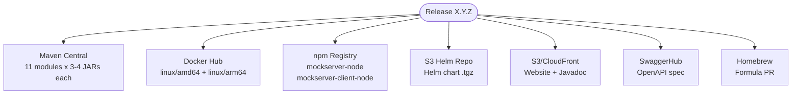
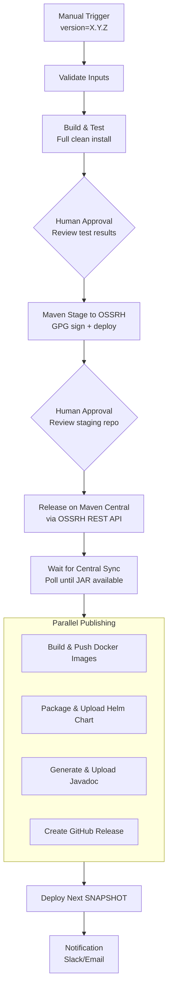
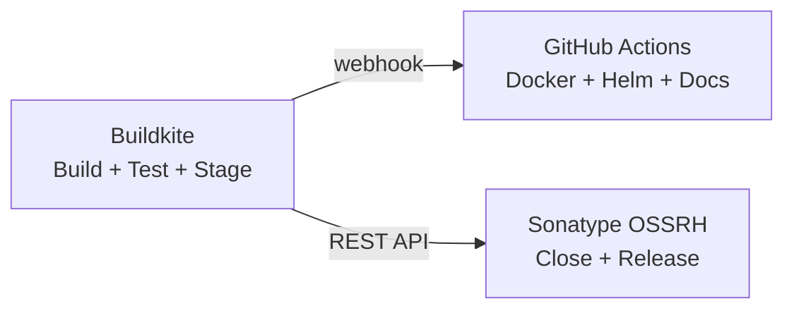

# Release Pipeline Plan

## Current State

The release process is a **manual 13-step process** executed entirely from a developer's Mac, spanning 7 artifact registries and 3+ Git repositories. Every step requires human intervention. There is no CI/CD pipeline for releases.

### Current Pain Points

| Problem | Impact |
|---------|--------|
| 13 manual steps across 7 platforms | Error-prone, takes hours, requires deep tribal knowledge |
| Hardcoded JDK path in `local_release.sh` | Only works on one specific developer's machine |
| SCM URL mismatch (`jamesdbloom/mockservice` vs `mock-server/mockserver`) | Fragile Git tag/push during release |
| Tests skipped during release (`-DskipTests`) | Releases trust that the last manual build passed |
| GPG key managed on a single laptop | Bus-factor = 1, key rotation is manual |
| Docker image timing dependency on Maven Central sync | Release step 7 may fail and need manual retry hours later |
| `settings.xml` server ID mismatch | Documentation inconsistency causes credential confusion |
| No rollback automation | Failed releases require manual `git reset --hard` + force push |
| Maven release plugin 2.5.3 (from 2015) | Missing 8 years of bug fixes and improvements |
| No GitHub Releases created | No release notes visible on GitHub |
| Versioned website requires AWS console work | Creating S3 buckets, CloudFront distributions, Route53 records manually |

### Release Artifacts



### Required Credentials

| Credential | Current Location | Used By |
|------------|-----------------|---------|
| Sonatype OSSRH username/password | Developer's `~/.m2/settings.xml` | Maven deploy |
| GPG private key + passphrase | Developer's local GPG keyring | Artifact signing |
| Docker Hub token | GitHub repo secrets | Docker image push |
| GitHub SSH key | Developer's `~/.ssh/` | Git tag push by maven-release-plugin |
| npm credentials + TOTP | Developer's npm session | npm publish |
| AWS credentials | Developer's `~/.aws/` | S3 uploads (website, Helm, Javadoc) |
| GitHub PAT | Developer's env var | Homebrew formula PR |
| SwaggerHub account | Developer's browser session | OpenAPI spec publish |

---

## Option Comparison

### Option A: Buildkite Release Pipeline (Recommended)

Automate the release through a dedicated Buildkite pipeline triggered manually with parameters. The pipeline handles Maven Central, Docker Hub, Helm chart, and GitHub Releases. npm and SwaggerHub remain manual (separate repos, 2FA requirements).

### Option B: GitHub Actions Release Pipeline

Use GitHub Actions with a `workflow_dispatch` trigger. Leverages existing Docker Hub integration (already in GitHub Actions). Requires storing Sonatype and GPG credentials as GitHub secrets.

### Option C: Hybrid - Buildkite Build + GitHub Actions Publish

Buildkite handles the Maven build and test verification, then triggers GitHub Actions for publishing (Maven Central, Docker Hub, Helm). Splits responsibilities by platform strength.

### Option D: OpenCode Release Skill

Create an interactive skill that guides the operator through each release step, automating what it can and prompting for manual actions. Lowest infrastructure change but still heavily manual.

---

## Option A: Buildkite Release Pipeline (Recommended)

### Why Buildkite

1. **Existing infrastructure** - build agents already provisioned and working
2. **Secret management** - AWS Secrets Manager is already integrated with the Buildkite stack
3. **Docker-based builds** - consistent environment, same as current CI
4. **Manual trigger with parameters** - Buildkite supports pipeline triggers with input fields
5. **Audit trail** - every release build is logged and visible to the team
6. **Approval gates** - Buildkite `block` steps allow human review between stages

### Architecture



### Pipeline Definition

**File:** `.buildkite/release-pipeline.yml`

```yaml
steps:
  - input: "Release Parameters"
    fields:
      - text: "Release Version"
        key: "release-version"
        hint: "e.g., 5.16.0"
        required: true
      - text: "Next SNAPSHOT Version"  
        key: "next-version"
        hint: "e.g., 5.16.1-SNAPSHOT"
        required: true
      - select: "Release Type"
        key: "release-type"
        options:
          - label: "Full Release (Maven Central + Docker + Helm + Docs)"
            value: "full"
          - label: "Maven Central Only"
            value: "maven-only"
          - label: "Docker Image Only (re-publish)"
            value: "docker-only"

  - label: ":white_check_mark: Validate & Build"
    command: "scripts/ci/release/validate-and-build.sh"
    timeout_in_minutes: 60
    env:
      RELEASE_VERSION: "${release-version}"
      NEXT_VERSION: "${next-version}"

  - block: ":eyes: Review Build Results"
    prompt: "Build and tests passed. Review the output and approve to proceed with staging."

  - label: ":lock: Stage to Maven Central"
    command: "scripts/ci/release/stage-to-central.sh"
    timeout_in_minutes: 30
    env:
      RELEASE_VERSION: "${release-version}"

  - block: ":rocket: Approve Release"
    prompt: |
      Artifacts staged to Sonatype OSSRH.
      Review at https://oss.sonatype.org/#stagingRepositories
      Approve to close, release, and publish everywhere.

  - label: ":java: Release on Maven Central"
    command: "scripts/ci/release/release-central.sh"
    timeout_in_minutes: 30
    env:
      RELEASE_VERSION: "${release-version}"

  - label: ":hourglass: Wait for Central Sync"
    command: "scripts/ci/release/wait-for-central.sh"
    timeout_in_minutes: 120
    env:
      RELEASE_VERSION: "${release-version}"

  - wait

  - group: ":package: Publish Artifacts"
    steps:
      - label: ":docker: Docker Image"
        command: "scripts/ci/release/publish-docker.sh"
        timeout_in_minutes: 45
        env:
          RELEASE_VERSION: "${release-version}"
      - label: ":helm: Helm Chart"
        command: "scripts/ci/release/publish-helm.sh"
        timeout_in_minutes: 15
        env:
          RELEASE_VERSION: "${release-version}"
      - label: ":book: Javadoc"
        command: "scripts/ci/release/publish-javadoc.sh"
        timeout_in_minutes: 15
        env:
          RELEASE_VERSION: "${release-version}"
      - label: ":github: GitHub Release"
        command: "scripts/ci/release/create-github-release.sh"
        timeout_in_minutes: 10
        env:
          RELEASE_VERSION: "${release-version}"

  - wait

  - label: ":arrows_counterclockwise: Deploy Next SNAPSHOT"
    command: "scripts/ci/release/deploy-snapshot.sh"
    timeout_in_minutes: 30
    env:
      NEXT_VERSION: "${next-version}"

  - label: ":bell: Notify"
    command: "scripts/ci/release/notify.sh"
    env:
      RELEASE_VERSION: "${release-version}"
```

### Secret Management

Store all release credentials in AWS Secrets Manager (same account as build agents: `814548061024`):

| Secret Name | Contents |
|-------------|----------|
| `mockserver-release/sonatype` | `{"username": "...", "password": "..."}` |
| `mockserver-release/gpg-key` | Base64-encoded GPG private key + passphrase |
| `mockserver-release/github-token` | GitHub PAT with `contents:write` for creating releases |
| `mockserver-build/dockerhub` | Already exists: `{"username": "...", "password": "..."}` |
| `mockserver-release/aws-website` | AWS access key for S3/CloudFront (website account `014848309742`) |

The release scripts would fetch these at runtime:

```bash
SONATYPE_CREDS=$(aws secretsmanager get-secret-value \
  --secret-id mockserver-release/sonatype \
  --query SecretString --output text)
SONATYPE_USERNAME=$(echo "$SONATYPE_CREDS" | jq -r .username)
SONATYPE_PASSWORD=$(echo "$SONATYPE_CREDS" | jq -r .password)
```

### GPG Key in CI

Rather than keeping the GPG key on a single laptop, import it into the CI container at build time:

```bash
GPG_KEY_B64=$(aws secretsmanager get-secret-value \
  --secret-id mockserver-release/gpg-key \
  --query SecretString --output text | jq -r .key)
GPG_PASSPHRASE=$(aws secretsmanager get-secret-value \
  --secret-id mockserver-release/gpg-key \
  --query SecretString --output text | jq -r .passphrase)

echo "$GPG_KEY_B64" | base64 -d | gpg --batch --import
echo "allow-loopback-pinentry" >> ~/.gnupg/gpg-agent.conf
gpgconf --reload gpg-agent
```

Then pass to Maven:
```bash
./mvnw deploy -P release \
  -Dgpg.passphrase="$GPG_PASSPHRASE" \
  -Dgpg.useagent=false
```

### Sonatype OSSRH REST API for Automated Close/Release

Instead of manual Sonatype UI clicks, use the Nexus Staging REST API:

```bash
# Find staging repo ID
STAGING_REPO=$(curl -s -u "$USER:$PASS" \
  "https://oss.sonatype.org/service/local/staging/profile_repositories" \
  | xmllint --xpath "//stagingProfileRepository[type='open']/repositoryId/text()" -)

# Close (triggers validation)
curl -X POST -u "$USER:$PASS" \
  -H "Content-Type: application/json" \
  -d "{\"data\":{\"stagedRepositoryId\":\"$STAGING_REPO\",\"description\":\"Release $VERSION\"}}" \
  "https://oss.sonatype.org/service/local/staging/bulk/close"

# Poll until closed
while [ "$(curl -s -u "$USER:$PASS" \
  "https://oss.sonatype.org/service/local/staging/repository/$STAGING_REPO" \
  | xmllint --xpath '//type/text()' -)" != "closed" ]; do
  sleep 10
done

# Release (promote to Central)
curl -X POST -u "$USER:$PASS" \
  -H "Content-Type: application/json" \
  -d "{\"data\":{\"stagedRepositoryId\":\"$STAGING_REPO\",\"description\":\"Release $VERSION\",\"autoDropAfterRelease\":true}}" \
  "https://oss.sonatype.org/service/local/staging/bulk/promote"
```

### Wait for Central Sync

Poll Maven Central until the release JAR is available:

```bash
ARTIFACT_URL="https://repo1.maven.org/maven2/org/mock-server/mockserver-netty/$VERSION/mockserver-netty-$VERSION.jar"
MAX_ATTEMPTS=120  # 2 hours at 60s intervals
ATTEMPT=0

while [ $ATTEMPT -lt $MAX_ATTEMPTS ]; do
  HTTP_CODE=$(curl -s -o /dev/null -w "%{http_code}" "$ARTIFACT_URL")
  if [ "$HTTP_CODE" = "200" ]; then
    echo "Release $VERSION available on Maven Central"
    exit 0
  fi
  ATTEMPT=$((ATTEMPT + 1))
  echo "Waiting for Central sync... attempt $ATTEMPT/$MAX_ATTEMPTS"
  sleep 60
done
echo "Timed out waiting for Central sync"
exit 1
```

### Docker Image Build (In-Pipeline)

Instead of relying on GitHub Actions triggered by tags, build Docker images directly in the Buildkite pipeline:

```bash
docker buildx build \
  --platform linux/amd64,linux/arm64 \
  --build-arg VERSION="$RELEASE_VERSION" \
  --tag "mockserver/mockserver:$RELEASE_VERSION" \
  --tag "mockserver/mockserver:latest" \
  --push \
  docker/
```

This eliminates the timing dependency on Maven Central sync (the pipeline already waits for it).

### GitHub Release Creation

```bash
gh release create "mockserver-$RELEASE_VERSION" \
  --title "MockServer $RELEASE_VERSION" \
  --notes-file changelog-extract.md \
  --latest
```

The `changelog-extract.md` is generated by extracting the relevant section from `changelog.md`.

### What Remains Manual

| Step | Why |
|------|-----|
| npm publish (mockserver-node, mockserver-client-node) | Separate repos, npm 2FA/OTP required |
| SwaggerHub update | No API for automated publishing |
| Homebrew formula PR | Requires fork management, `brew` CLI |
| Versioned website copy | Requires new AWS resources (S3 bucket, CloudFront, Route53) |

These could be added incrementally. The npm publish could potentially be automated with `npm token create --cidr` and storing the token in Secrets Manager.

### Implementation Steps

1. **Create release scripts** in `scripts/ci/release/`:
   - `validate-and-build.sh` - version validation, clean build with tests
   - `stage-to-central.sh` - GPG import, Maven deploy to staging
   - `release-central.sh` - OSSRH REST API close + release
   - `wait-for-central.sh` - poll Maven Central
   - `publish-docker.sh` - Docker buildx multi-arch push
   - `publish-helm.sh` - Helm package + S3 upload
   - `publish-javadoc.sh` - Javadoc generation + S3 upload
   - `create-github-release.sh` - gh release create
   - `deploy-snapshot.sh` - version bump + deploy SNAPSHOT
   - `notify.sh` - success/failure notification

2. **Store secrets** in AWS Secrets Manager

3. **Create the pipeline** in Buildkite (either via API or UI)

4. **Fix SCM URL** in `pom.xml` - update from `jamesdbloom/mockservice` to `mock-server/mockserver`

5. **Upgrade maven-release-plugin** from 2.5.3 to 3.x

6. **Test** with a dry-run release (deploy to Sonatype staging, close, then drop without releasing)

### Security Considerations

- **Human approval gates** at two points: after build/test, and after staging
- **Secrets never logged** - all scripts use `set +x` around credential handling
- **IAM scoping** - Buildkite agent role gets only the Secrets Manager permissions needed
- **GPG key rotation** - centralised in Secrets Manager, not dependent on one person's laptop
- **Audit trail** - every release is a Buildkite build with full logs

---

## Option B: GitHub Actions Release Pipeline

### Advantages over Buildkite

- Docker Hub credentials already configured as GitHub secrets
- `actions/setup-java` has built-in Maven Central publishing support
- Native `gh release create` integration
- Free for public repos

### Disadvantages

- No existing build infrastructure (no pre-warmed Maven cache)
- GitHub Actions runners have less memory than the Buildkite `t3.large` instances
- Would need to duplicate all CI configuration between Buildkite and GitHub Actions
- `block` steps (human approval) are not natively supported - would need `environment` protection rules
- Harder to integrate with AWS Secrets Manager (would need OIDC federation, which exists but scoped to the other account)

### Pipeline Structure

```yaml
name: Release
on:
  workflow_dispatch:
    inputs:
      release-version:
        description: 'Release version (e.g., 5.16.0)'
        required: true
      next-version:
        description: 'Next SNAPSHOT version (e.g., 5.16.1-SNAPSHOT)'
        required: true

jobs:
  build-and-test:
    runs-on: ubuntu-latest
    steps:
      - uses: actions/checkout@v4
      - uses: actions/setup-java@v4
        with:
          java-version: '21'
          distribution: 'temurin'
          cache: 'maven'
      - run: ./mvnw clean install

  stage:
    needs: build-and-test
    environment: release  # Requires manual approval
    runs-on: ubuntu-latest
    steps:
      - uses: actions/checkout@v4
      - uses: actions/setup-java@v4
        with:
          java-version: '21'
          distribution: 'temurin'
          server-id: ossrh
          server-username: MAVEN_USERNAME
          server-password: MAVEN_PASSWORD
          gpg-private-key: ${{ secrets.GPG_PRIVATE_KEY }}
          gpg-passphrase: MAVEN_GPG_PASSPHRASE
      - run: ./mvnw deploy -P release -DskipTests
        env:
          MAVEN_USERNAME: ${{ secrets.OSSRH_USERNAME }}
          MAVEN_PASSWORD: ${{ secrets.OSSRH_TOKEN }}
          MAVEN_GPG_PASSPHRASE: ${{ secrets.GPG_PASSPHRASE }}

  # ... remaining jobs
```

---

## Option C: Hybrid Approach

### Architecture



Use Buildkite for the Maven build (leveraging existing infrastructure and pre-warmed Docker image) and GitHub Actions for publishing (leveraging existing Docker Hub integration).

### When to Choose This

- If you want to keep the existing Buildkite CI build unchanged
- If GitHub Actions is preferred for public-facing publishing
- Adds complexity of cross-platform coordination

---

## Option D: OpenCode Release Skill

### Concept

An interactive skill that walks the operator through each release step:

```
> /release 5.16.0

Release 5.16.0 - Step 1/13: Build & Test
Running: ./mvnw clean install
[============================] 100% - BUILD SUCCESS

Step 2/13: Stage to Maven Central
Running: ./mvnw deploy -P release
[============================] 100% - Staged to repository orgmockserver-1234

Step 3/13: Close Staging Repository
Closing repository orgmockserver-1234...
Validation passed. Ready to release.

> Proceed with release? [y/N]
```

### Advantages

- Lowest infrastructure change
- Operator stays in control
- Can handle edge cases interactively

### Disadvantages

- Still runs on a developer's machine
- No audit trail beyond terminal history
- Credentials still local
- Can't run unattended
- Bus-factor remains 1

---

## Recommendation

**Option A (Buildkite Release Pipeline)** is recommended because:

1. **Leverages existing infrastructure** - no new CI platform needed
2. **Centralises credentials** - moves from one person's laptop to Secrets Manager
3. **Provides audit trail** - every release is a visible, logged build
4. **Human approval gates** - maintains human oversight at critical points
5. **Eliminates bus-factor** - anyone with Buildkite access can trigger a release
6. **Incremental adoption** - start with Maven Central only, add Docker/Helm/Docs over time
7. **Consistent environment** - same Docker image as CI builds

### Incremental Rollout

| Phase | Scope | Effort |
|-------|-------|--------|
| **Phase 1** | Maven Central only (build, stage, close, release) | 3-5 days |
| **Phase 2** | Add Docker Hub + Helm chart publishing | 2-3 days |
| **Phase 3** | Add Javadoc + GitHub Release | 1-2 days |
| **Phase 4** | Add website deployment + CloudFront invalidation | 2-3 days |
| **Phase 5** | Add npm automation (if feasible with CI tokens) | 2-3 days |

### Prerequisites

1. Store Sonatype credentials in AWS Secrets Manager
2. Export and store GPG private key in AWS Secrets Manager
3. Fix SCM URL in `pom.xml`
4. Create the release pipeline in Buildkite
5. Grant Buildkite agent IAM role access to the new secrets
6. Grant Buildkite agent cross-account access to website S3 bucket (account `014848309742`)
7. Install `docker buildx` and QEMU in the Maven CI Docker image (for multi-arch builds)
