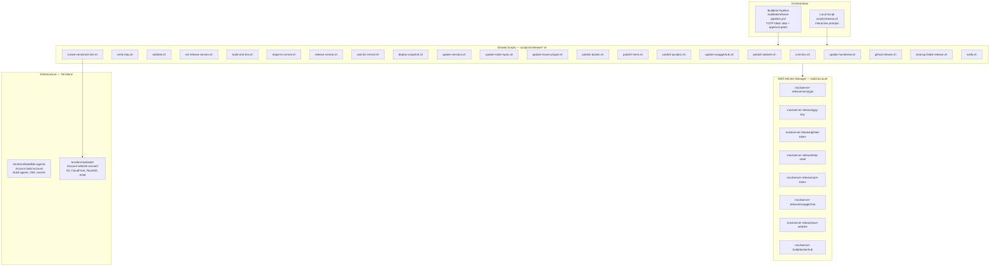
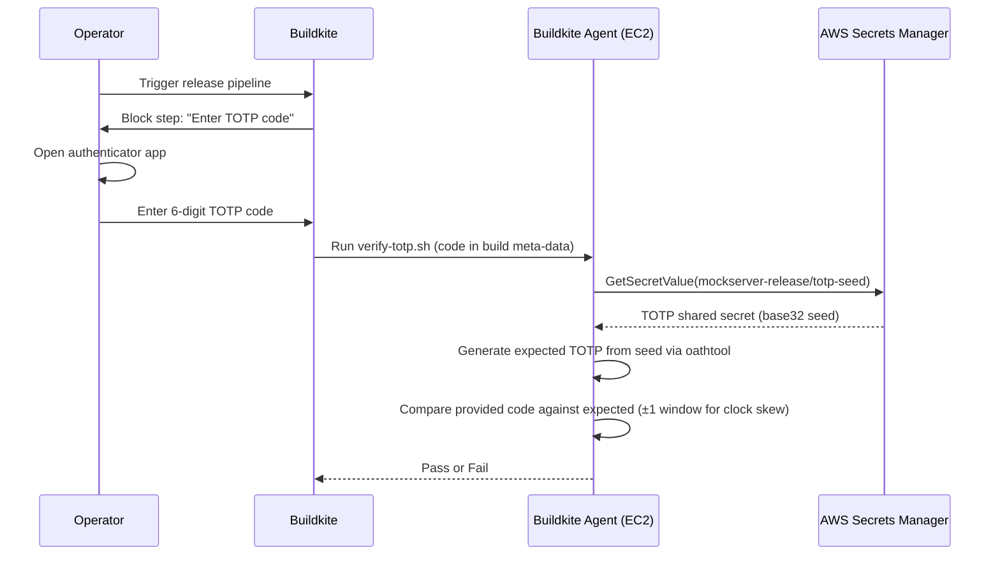
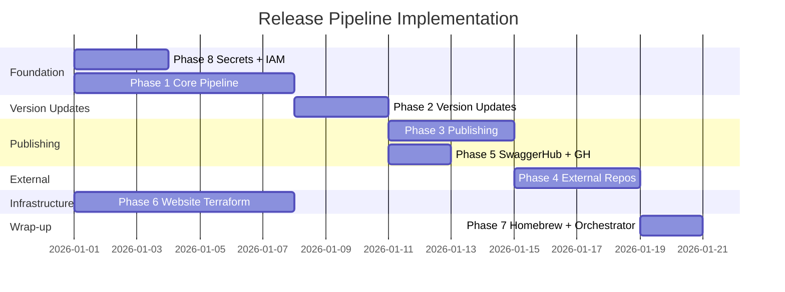
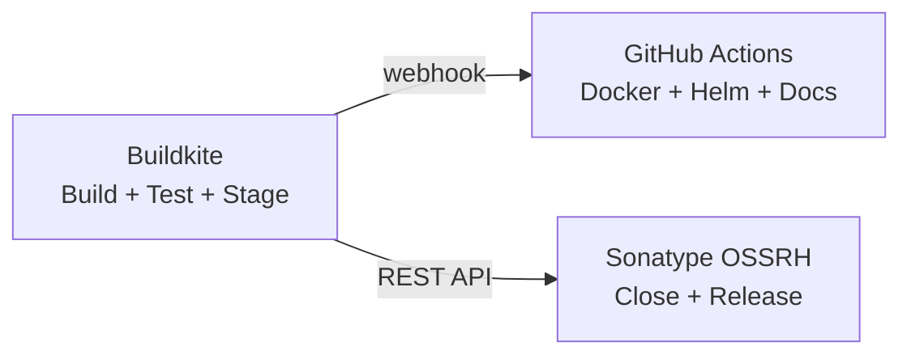

# Release Pipeline Plan

## Decision: Option A — Buildkite Release Pipeline

After evaluating four options (Buildkite pipeline, GitHub Actions, Hybrid, OpenCode skill), **Option A (Buildkite Release Pipeline)** was selected. The rejected options are preserved in [Appendix A](#appendix-a-rejected-options) for reference.

**Key reasons:**
1. Existing Buildkite infrastructure (build agents, Docker image, AWS integration)
2. AWS Secrets Manager already integrated with the Buildkite stack
3. `block` steps with `allowed_teams` for access control
4. TOTP verification gate against AWS for defense-in-depth security

**Additional design decisions:**
- **Replace maven-release-plugin** with explicit `mvn versions:set` + `git tag` for full transparency
- **Shared scripts** — every step is a standalone script callable from both Buildkite and locally
- **Local orchestrator** — `scripts/release.sh` runs the same scripts as the pipeline, enabling full local releases
- **Terraform for website** — all website infrastructure (S3, CloudFront, Route53) managed as IaC, including import of existing versioned sites
- **Automate SwaggerHub** — use the SwaggerHub REST API instead of manual browser-based publishing
- **Automate npm repos** — clone, build, tag, push via script (with interactive OTP prompt)

---

## Current State

The release process is a **manual 15-step process** executed entirely from a developer's Mac, spanning 9 artifact registries and 3+ Git repositories. Every step requires human intervention. There is no CI/CD pipeline for releases.

### Current Pain Points

| Problem | Impact |
|---------|--------|
| 13 manual steps across 7 platforms | Error-prone, takes hours, requires deep tribal knowledge |
| Hardcoded JDK path in `local_release.sh` | Only works on one specific developer's machine |
| SCM URL mismatch (`jamesdbloom/mockservice` vs `mock-server/mockserver-monorepo`) | Fragile Git tag/push during release |
| Tests skipped during release (`-DskipTests`) | Releases trust that the last manual build passed |
| GPG key managed on a single laptop | Bus-factor = 1, key rotation is manual |
| Docker image timing dependency on Maven Central sync | Release step 7 may fail and need manual retry hours later |
| `settings.xml` server ID mismatch | Documentation inconsistency causes credential confusion |
| No rollback automation | Failed releases require manual `git reset --hard` + force push |
| Maven release plugin 2.5.3 (from 2015) | Missing 8 years of bug fixes and improvements |
| No GitHub Releases created | No release notes visible on GitHub |
| Versioned website requires AWS console work | Creating S3 buckets, CloudFront distributions, Route53 records manually |
| Website infrastructure not in Terraform | 17 versioned sites + main site all manually provisioned |
| Cross-account access not configured | Buildkite agents cannot access website account (`website account`) |

### Release Artifacts


### Required Credentials

| Credential | Current Location | Used By |
|------------|-----------------|---------|
| Sonatype OSSRH username/password | Developer's `~/.m2/settings.xml` | Maven deploy |
| GPG private key + passphrase | Developer's local GPG keyring | Artifact signing |
| Docker Hub token | GitHub repo secrets | Docker image push |
| GitHub SSH key | Developer's `~/.ssh/` | Git tag push by maven-release-plugin |
| npm credentials + TOTP | Developer's npm session | npm publish |
| AWS credentials | Developer's `~/.aws/` | S3 uploads (website, Helm, Javadoc) |
| GitHub PAT | Developer's env var | Homebrew formula PR |
| SwaggerHub API key | Developer's browser session | OpenAPI spec publish |
| PyPI API token | AWS Secrets Manager (`mockserver-build/pypi`) | Python package publish |
| RubyGems API key | AWS Secrets Manager (`mockserver-build/rubygems`) | Ruby gem publish |

---

## Design Principles

1. **Shared scripts** — every automatable step is a standalone script in `scripts/ci/release/`. Both the Buildkite pipeline and the local orchestrator call the same scripts.
2. **Dual-mode credentials** — scripts detect CI vs. local and load secrets from AWS Secrets Manager accordingly (IAM role in CI, SSO profile locally).
3. **TOTP gate** — the operator enters a 6-digit code; the pipeline verifies it against a seed stored in AWS Secrets Manager. Even a compromised Buildkite cannot silently publish.
4. **Replace maven-release-plugin** — use `mvn versions:set` + explicit `git tag` + `git commit` + `git push` for full transparency and control. No SCM URL dependency, no plugin magic.
5. **Terraform for website** — all website infrastructure (S3, CloudFront, Route53, ACM) managed as IaC in `terraform/website/`, including import of all existing versioned sites.
6. **All 13 steps covered** — every step from `scripts/release_steps.md` has a corresponding script, even if some steps are local-only.

---

## Architecture Overview



---

## Step-by-Step Mapping

Every step from `scripts/release_steps.md` maps to a script. The table shows where each step runs.

| # | Release Step | Script | CI Pipeline? | Local? | Notes |
|---|---|---|---|---|---|
| — | TOTP Authorization | `verify-totp.sh` | Yes (block step) | Yes (interactive) | |
| — | Validate inputs | `validate.sh` | Yes | Yes | |
| 1 | Maven Central release | `set-release-version.sh` → `build-and-test.sh` → `stage-to-central.sh` → `release-central.sh` → `wait-for-central.sh` | Yes | Yes | |
| 2 | Deploy SNAPSHOT | `deploy-snapshot.sh` | Yes | Yes | |
| 3 | Update repo versions | `update-versions.sh` | Yes | Yes | Changelog, README, _config.yml, find-and-replace |
| 4 | Update mockserver-node | `update-node-repos.sh mockserver-node` | Local-only | Yes | npm OTP required interactively |
| 5 | Update mockserver-client-node | `update-node-repos.sh mockserver-client-node` | Local-only | Yes | npm OTP required interactively |
| 6 | Update mockserver-maven-plugin | `update-maven-plugin.sh` | Yes | Yes | Full release cycle on monorepo subdir |
| 7 | Docker image | `publish-docker.sh` | Yes | Yes | |
| 8 | Helm chart | `publish-helm.sh` | Yes | Yes | |
| 9 | Javadoc | `publish-javadoc.sh` | Yes | Yes | |
| 10 | SwaggerHub | `update-swaggerhub.sh` | Yes | Yes | Uses SwaggerHub REST API |
| 11 | Website | `publish-website.sh` | Yes | Yes | Jekyll build + S3 sync + CF invalidation |
| 12 | Versioned website | `create-versioned-site.sh` | Yes (optional) | Yes | Terraform apply for new S3/CF/Route53 |
| 13 | Homebrew | `update-homebrew.sh` | Local-only | Yes | Requires local `brew` installation |
| 14 | Python client to PyPI | `publish-pypi.sh` | Yes | Yes | Fetches token from AWS Secrets Manager |
| 15 | Ruby client to RubyGems | `publish-rubygems.sh` | Yes | Yes | Fetches API key from AWS Secrets Manager |
| — | GitHub Release | `github-release.sh` | Yes | Yes | |
| — | Cleanup failed release | `cleanup-failed-release.sh` | Local-only | Yes | |
| — | Notify | `notify.sh` | Yes | Yes | |

---

## File Structure

```
scripts/
├── release.sh                          # Local orchestrator — runs all 15 steps sequentially
├── ci/
│   └── release/
│       ├── common.sh                   # Shared: env detection, credential loading, logging
│       ├── verify-totp.sh              # TOTP verification against AWS seed
│       ├── validate.sh                 # Version format, branch, dirty-tree checks
│       ├── set-release-version.sh      # mvn versions:set + git tag + commit (replaces maven-release-plugin)
│       ├── build-and-test.sh           # ./mvnw clean install (WITH tests)
│       ├── stage-to-central.sh         # GPG import + ./mvnw deploy -P release to OSSRH staging
│       ├── release-central.sh          # OSSRH REST API: close staging repo + release/promote
│       ├── wait-for-central.sh         # Poll repo1.maven.org until JAR available
│       ├── deploy-snapshot.sh          # mvn versions:set to next SNAPSHOT + deploy
│       ├── update-versions.sh          # Find-and-replace versions across repo, update changelog, commit+push
│       ├── update-node-repos.sh        # Clone mockserver-node / mockserver-client-node, version bump, build, tag, npm publish
│       ├── update-maven-plugin.sh      # Clone mockserver-maven-plugin, version bump, release cycle, re-SNAPSHOT
│       ├── publish-docker.sh           # Docker buildx multi-arch build + push to Docker Hub
│       ├── publish-helm.sh             # Helm package + update index + S3 sync
│       ├── publish-javadoc.sh          # Javadoc generation from release tag + S3 upload
│       ├── update-swaggerhub.sh        # SwaggerHub REST API: create version + publish
│       ├── publish-website.sh          # Jekyll build + S3 sync + CloudFront invalidation
│       ├── create-versioned-site.sh    # Terraform apply for new versioned site (S3 + CF + Route53)
│       ├── update-homebrew.sh          # brew bump-formula-pr (local-only)
│       ├── publish-pypi.sh             # Build + twine upload to PyPI (token from AWS SM)
│       ├── publish-rubygems.sh         # gem build + gem push to RubyGems (key from AWS SM)
│       ├── github-release.sh           # gh release create with changelog extract
│       ├── cleanup-failed-release.sh   # Revert git, delete tag, drop staging repo
│       └── notify.sh                   # Success/failure notification

.buildkite/
├── pipeline.yml                        # Existing CI pipeline (unchanged)
└── release-pipeline.yml                # New: release pipeline

terraform/
├── buildkite-agents/                   # Existing: build agent infra (build account)
│   └── build-secrets.tf                # Modified: add release secrets + IAM policy
└── website/                            # NEW: website infra (website account)
    ├── main.tf                         # AWS provider, module config
    ├── variables.tf                    # Domain, version list, etc.
    ├── versions.tf                     # Terraform + provider version constraints
    ├── backend.tf                      # S3 remote state
    ├── dns.tf                          # Route53 hosted zone + records
    ├── acm.tf                          # ACM certificate (*.mock-server.com)
    ├── main-site.tf                    # Main site: S3 bucket + CloudFront + Route53 A record
    ├── versioned-sites.tf              # for_each over version list: S3 + CF + Route53 per version
    ├── helm-repo.tf                    # Helm chart hosting configuration
    ├── outputs.tf                      # CloudFront distribution IDs, bucket names
    ├── import.tf                       # Import blocks for existing 17 versioned sites + main site
    └── terraform.tfvars.example        # Example variables
```

---

## Shared Script Foundation: `common.sh`

All release scripts source `common.sh` which provides:

### Environment Detection

```bash
is_ci() { [[ -n "${BUILDKITE:-}" ]]; }
```

### Dual-Mode Credential Loading

```bash
load_secret() {
  local secret_id="$1" key="$2"
  set +x
  local json
  if is_ci; then
    json=$(aws secretsmanager get-secret-value \
      --secret-id "$secret_id" \
      --query SecretString --output text)
  else
    json=$(aws secretsmanager get-secret-value \
      --secret-id "$secret_id" \
      --profile "${AWS_PROFILE:-mockserver-build}" \
      --query SecretString --output text)
  fi
  echo "$json" | jq -r ".$key"
  set -x
}
```

In CI: the agent IAM role provides Secrets Manager access (no `--profile` needed).
Locally: uses the operator's AWS SSO session (`aws sso login --profile mockserver-build`).

### Version Variables

```bash
if is_ci; then
  RELEASE_VERSION=$(buildkite-agent meta-data get release-version)
  NEXT_VERSION=$(buildkite-agent meta-data get next-version)
  OLD_VERSION=$(buildkite-agent meta-data get old-version)
else
  : "${RELEASE_VERSION:?}" "${NEXT_VERSION:?}" "${OLD_VERSION:?}"
fi
export RELEASE_VERSION NEXT_VERSION OLD_VERSION
```

### Utility Functions

- `log_info`, `log_error`, `log_step` — structured logging
- `require_cmd <command>` — fail fast if a required tool is missing
- `require_env <var>` — fail fast if a required env var is unset
- `confirm <prompt>` — interactive confirmation (skipped in CI)

---

## Security Model

### TOTP Verification Against AWS



#### One-Time Setup

1. Generate a TOTP seed: `python3 -c "import pyotp; print(pyotp.random_base32())"`
2. Store in AWS Secrets Manager: `mockserver-release/totp-seed` with JSON `{"seed": "<base32-seed>"}`
3. Register the same seed in an authenticator app (Google Authenticator, 1Password, etc.)

#### `verify-totp.sh` Logic

```bash
TOTP_CODE="${TOTP_CODE:-$(buildkite-agent meta-data get totp-code 2>/dev/null || echo '')}"

if [[ -z "$TOTP_CODE" ]]; then
  read -rp "Enter TOTP code: " TOTP_CODE
fi

TOTP_SEED=$(load_secret "mockserver-release/totp-seed" "seed")

EXPECTED=$(oathtool --totp -b "$TOTP_SEED")
EXPECTED_PREV=$(oathtool --totp -b -N "now - 30 seconds" "$TOTP_SEED")
EXPECTED_NEXT=$(oathtool --totp -b -N "now + 30 seconds" "$TOTP_SEED")

if [[ "$TOTP_CODE" == "$EXPECTED" || "$TOTP_CODE" == "$EXPECTED_PREV" || "$TOTP_CODE" == "$EXPECTED_NEXT" ]]; then
  echo "TOTP verified successfully"
else
  echo "TOTP verification FAILED" >&2; exit 1
fi
```

### Access Control Layers

| Layer | Control | What It Prevents |
|---|---|---|
| Pipeline visibility | Private pipeline in Buildkite | Unauthorized users cannot see or trigger the pipeline |
| Build trigger | Only org members can trigger builds | Only the org admin can start a release |
| Block step unblock | `allowed_teams: ["release-managers"]` | Only members of that team can approve release gates |
| TOTP verification | Code verified against AWS Secrets Manager seed | Even if Buildkite is compromised, attacker cannot generate a valid TOTP code |
| Secrets isolation | Release secrets in AWS, not Buildkite | Buildkite compromise does not expose credentials |
| Agent IAM scoping | Agent role has only `secretsmanager:GetSecretValue` for release secrets | Agent cannot modify secrets or access unrelated resources |

### Threat Model

| Threat | Mitigation |
|---|---|
| Buildkite account compromise | TOTP verified against AWS — attacker cannot generate valid code without authenticator app |
| Buildkite pipeline modification | `allowed_teams` on block steps restricts who can approve; pipeline changes visible in git history |
| Agent compromise (code execution on EC2) | Agent can read secrets via IAM but cannot unblock `block` steps or provide TOTP input |
| Supply chain (malicious PR triggers release) | Release pipeline is separate from CI, manually triggered only |
| AWS account compromise | Out of scope — mitigate with AWS SSO MFA on the account itself |

---

## Buildkite Pipeline: `.buildkite/release-pipeline.yml`

```yaml
steps:
  # ─── Input & Authorization ─────────────────────────────────
  - input: "Release Parameters"
    fields:
      - text: "Release Version"
        key: "release-version"
        hint: "e.g., 5.16.0"
        required: true
        format: "[0-9]+\\.[0-9]+\\.[0-9]+"
      - text: "Next SNAPSHOT Version"
        key: "next-version"
        hint: "e.g., 5.16.1-SNAPSHOT"
        required: true
      - text: "Previous Version"
        key: "old-version"
        hint: "e.g., 5.15.0 (for find-and-replace)"
        required: true
      - select: "Release Type"
        key: "release-type"
        default: "full"
        options:
          - label: "Full Release (all steps)"
            value: "full"
          - label: "Maven Central Only"
            value: "maven-only"
          - label: "Docker Image Only (re-publish)"
            value: "docker-only"
      - select: "Create Versioned Site?"
        key: "create-versioned-site"
        default: "no"
        options:
          - label: "No"
            value: "no"
          - label: "Yes (major/minor release)"
            value: "yes"

  - block: ":lock: TOTP Authorization"
    prompt: "Enter your TOTP code to authorize this release"
    allowed_teams: ["release-managers"]
    fields:
      - text: "TOTP Code"
        key: "totp-code"
        hint: "6-digit code from your authenticator app"
        required: true
        format: "[0-9]{6}"

  - label: ":shield: Verify TOTP"
    command: "scripts/ci/release/verify-totp.sh"

  # ─── Step 1a: Set Version + Build & Test ───────────────────
  - label: ":white_check_mark: Validate"
    command: "scripts/ci/release/validate.sh"

  - label: ":git: Set Release Version"
    command: "scripts/ci/release/set-release-version.sh"

  - label: ":maven: Build & Test"
    command: "scripts/ci/release/build-and-test.sh"
    timeout_in_minutes: 60

  # ─── Gate: Review test results ─────────────────────────────
  - block: ":eyes: Review Build Results"
    prompt: "Build and tests passed. Approve to stage to Maven Central."
    allowed_teams: ["release-managers"]

  # ─── Step 1b: Stage + Release on Maven Central ────────────
  - label: ":lock: Stage to Maven Central"
    command: "scripts/ci/release/stage-to-central.sh"
    timeout_in_minutes: 30

  - block: ":rocket: Approve Maven Central Release"
    prompt: |
      Artifacts staged to Sonatype OSSRH.
      Review at https://oss.sonatype.org/#stagingRepositories
      Approve to close, release, and publish.
    allowed_teams: ["release-managers"]

  - label: ":java: Release on Maven Central"
    command: "scripts/ci/release/release-central.sh"
    timeout_in_minutes: 30

  - label: ":hourglass: Wait for Central Sync"
    command: "scripts/ci/release/wait-for-central.sh"
    timeout_in_minutes: 120

  # ─── Step 2: Deploy SNAPSHOT ───────────────────────────────
  - label: ":arrows_counterclockwise: Deploy Next SNAPSHOT"
    command: "scripts/ci/release/deploy-snapshot.sh"
    timeout_in_minutes: 30

  # ─── Step 3: Update Repo Versions ─────────────────────────
  - label: ":pencil: Update Versions"
    command: "scripts/ci/release/update-versions.sh"
    timeout_in_minutes: 15

  - wait

  # ─── Steps 6-11 + GitHub Release: Parallel Publishing ─────
  - group: ":package: Publish & Update"
    steps:
      - label: ":java: Update Maven Plugin (Step 6)"
        command: "scripts/ci/release/update-maven-plugin.sh"
        timeout_in_minutes: 60

      - label: ":docker: Docker Image (Step 7)"
        command: "scripts/ci/release/publish-docker.sh"
        timeout_in_minutes: 45

      - label: ":helm: Helm Chart (Step 8)"
        command: "scripts/ci/release/publish-helm.sh"
        timeout_in_minutes: 15

      - label: ":book: Javadoc (Step 9)"
        command: "scripts/ci/release/publish-javadoc.sh"
        timeout_in_minutes: 15

      - label: ":swagger: SwaggerHub (Step 10)"
        command: "scripts/ci/release/update-swaggerhub.sh"
        timeout_in_minutes: 10

      - label: ":globe_with_meridians: Website (Step 11)"
        command: "scripts/ci/release/publish-website.sh"
        timeout_in_minutes: 15

      - label: ":github: GitHub Release"
        command: "scripts/ci/release/github-release.sh"
        timeout_in_minutes: 10

  - wait

  # ─── Step 12: Versioned Site (Optional) ───────────────────
  - label: ":globe_with_meridians: Create Versioned Site (Step 12)"
    command: "scripts/ci/release/create-versioned-site.sh"
    if: "build.meta_data('create-versioned-site') == 'yes'"
    timeout_in_minutes: 15

  # ─── Notify ───────────────────────────────────────────────
  - wait

  - label: ":bell: Notify"
    command: "scripts/ci/release/notify.sh"
```

**Steps 4 & 5** (npm repos with OTP) and **Step 13** (Homebrew with local `brew`) are local-only — they do not appear in the Buildkite pipeline.

---

## Local Orchestrator: `scripts/release.sh`

The local script runs ALL 13 steps, calling the same shared scripts as the pipeline. Interactive prompts replace Buildkite `block` steps.

```bash
#!/usr/bin/env bash
set -euo pipefail
SCRIPT_DIR="$(cd "$(dirname "${BASH_SOURCE[0]}")/ci/release" && pwd)"

RELEASE_VERSION="${1:?Usage: $0 <release-version> <next-snapshot> <old-version>}"
NEXT_VERSION="${2:?Usage: $0 <release-version> <next-snapshot> <old-version>}"
OLD_VERSION="${3:?Usage: $0 <release-version> <next-snapshot> <old-version>}"
export RELEASE_VERSION NEXT_VERSION OLD_VERSION

echo "=== MockServer Release $RELEASE_VERSION ==="
echo "Next SNAPSHOT: $NEXT_VERSION"
echo "Old version:   $OLD_VERSION"
echo

# ── Authorization ──
"$SCRIPT_DIR/verify-totp.sh"
"$SCRIPT_DIR/validate.sh"

# ── Step 1: Maven Central ──
"$SCRIPT_DIR/set-release-version.sh"
"$SCRIPT_DIR/build-and-test.sh"
read -rp "Build passed. Stage to Maven Central? [y/N] " c; [[ "$c" == [yY] ]] || exit 1
"$SCRIPT_DIR/stage-to-central.sh"
read -rp "Staged. Review at https://oss.sonatype.org/#stagingRepositories — Release? [y/N] " c; [[ "$c" == [yY] ]] || exit 1
"$SCRIPT_DIR/release-central.sh"
"$SCRIPT_DIR/wait-for-central.sh"

# ── Step 2: Deploy SNAPSHOT ──
"$SCRIPT_DIR/deploy-snapshot.sh"

# ── Step 3: Update repo versions ──
"$SCRIPT_DIR/update-versions.sh"

# ── Steps 4 & 5: npm repos (interactive — OTP required) ──
"$SCRIPT_DIR/update-node-repos.sh" mockserver-node
"$SCRIPT_DIR/update-node-repos.sh" mockserver-client-node

# ── Step 6: Maven plugin ──
"$SCRIPT_DIR/update-maven-plugin.sh"

# ── Steps 7-11 + GitHub Release: Parallel ──
"$SCRIPT_DIR/publish-docker.sh" &
"$SCRIPT_DIR/publish-helm.sh" &
"$SCRIPT_DIR/publish-javadoc.sh" &
"$SCRIPT_DIR/update-swaggerhub.sh" &
"$SCRIPT_DIR/publish-website.sh" &
"$SCRIPT_DIR/github-release.sh" &
wait

# ── Step 12: Versioned site (optional) ──
read -rp "Create versioned site? [y/N] " c
[[ "$c" == [yY] ]] && "$SCRIPT_DIR/create-versioned-site.sh"

# ── Step 13: Homebrew (local-only) ──
read -rp "Update Homebrew? [y/N] " c
[[ "$c" == [yY] ]] && "$SCRIPT_DIR/update-homebrew.sh"

echo "=== Release $RELEASE_VERSION complete ==="
```

---

## Script Details — All 13 Steps

### Step 1: Publish Release to Maven Central

This step replaces the current `local_release.sh` (which uses `maven-release-plugin`) with explicit version management.

#### `set-release-version.sh`

Replaces `mvn release:prepare` with transparent, scriptable operations:

1. `./mvnw versions:set -DnewVersion=$RELEASE_VERSION`
2. `./mvnw versions:commit` (removes backup POMs)
3. `git add -A && git commit -m "release: set version $RELEASE_VERSION"`
4. `git tag mockserver-$RELEASE_VERSION`
5. `git push origin master && git push origin mockserver-$RELEASE_VERSION`

The tag format `mockserver-X.Y.Z` matches the existing convention (e.g., `mockserver-5.15.0`).

#### `build-and-test.sh`

```bash
./mvnw -T 1C clean install \
  -Djava.security.egd=file:/dev/./urandom
```

Unlike the current `local_release.sh` which skips tests, this runs the full test suite before any artifacts are published.

#### `stage-to-central.sh`

1. Fetch GPG key and passphrase from Secrets Manager
2. Import GPG key into ephemeral keyring:
   ```bash
   GPG_KEY_B64=$(load_secret "mockserver-release/gpg-key" "key")
   GPG_PASSPHRASE=$(load_secret "mockserver-release/gpg-key" "passphrase")
   echo "$GPG_KEY_B64" | base64 -d | gpg --batch --import
   echo "allow-loopback-pinentry" >> ~/.gnupg/gpg-agent.conf
   gpgconf --reload gpg-agent
   ```
3. Generate `settings.xml` with Sonatype credentials from Secrets Manager:
   ```bash
   SONATYPE_USERNAME=$(load_secret "mockserver-release/sonatype" "username")
   SONATYPE_PASSWORD=$(load_secret "mockserver-release/sonatype" "password")
   ```
4. Deploy to OSSRH staging:
   ```bash
   ./mvnw deploy -P release -DskipTests \
     -Dgpg.passphrase="$GPG_PASSPHRASE" \
     -Dgpg.useagent=false \
     --settings /tmp/release-settings.xml
   ```
5. Clean up GPG key and settings file

#### `release-central.sh`

Automates the Sonatype OSSRH UI steps (close + release) via the Nexus Staging REST API:

```bash
# Find staging repo ID
STAGING_REPO=$(curl -s -u "$USER:$PASS" \
  "https://oss.sonatype.org/service/local/staging/profile_repositories" \
  | xmllint --xpath "//stagingProfileRepository[type='open']/repositoryId/text()" -)

# Close (triggers validation rules)
curl -X POST -u "$USER:$PASS" \
  -H "Content-Type: application/json" \
  -d "{\"data\":{\"stagedRepositoryId\":\"$STAGING_REPO\",\"description\":\"Release $VERSION\"}}" \
  "https://oss.sonatype.org/service/local/staging/bulk/close"

# Poll until closed
while [ "$(curl -s -u "$USER:$PASS" \
  "https://oss.sonatype.org/service/local/staging/repository/$STAGING_REPO" \
  | xmllint --xpath '//type/text()' -)" != "closed" ]; do
  sleep 10
done

# Release (promote to Maven Central)
curl -X POST -u "$USER:$PASS" \
  -H "Content-Type: application/json" \
  -d "{\"data\":{\"stagedRepositoryId\":\"$STAGING_REPO\",\"description\":\"Release $VERSION\",\"autoDropAfterRelease\":true}}" \
  "https://oss.sonatype.org/service/local/staging/bulk/promote"
```

#### `wait-for-central.sh`

Polls Maven Central until the release JAR is available:

```bash
ARTIFACT_URL="https://repo1.maven.org/maven2/org/mock-server/mockserver-netty/$VERSION/mockserver-netty-$VERSION.jar"
MAX_ATTEMPTS=120  # 2 hours at 60s intervals

while [ $ATTEMPT -lt $MAX_ATTEMPTS ]; do
  HTTP_CODE=$(curl -s -o /dev/null -w "%{http_code}" "$ARTIFACT_URL")
  if [ "$HTTP_CODE" = "200" ]; then
    echo "Release $VERSION available on Maven Central"
    exit 0
  fi
  sleep 60
done
echo "Timed out waiting for Central sync" >&2; exit 1
```

### Step 2: Deploy SNAPSHOT — `deploy-snapshot.sh`

1. `./mvnw versions:set -DnewVersion=$NEXT_VERSION`
2. `./mvnw versions:commit`
3. `./mvnw -T 1C clean deploy -DskipTests` (to Sonatype snapshots repo)
4. `git add -A && git commit -m "release: set next development version $NEXT_VERSION"`
5. `git push origin master`

### Step 3: Update Repo Versions — `update-versions.sh`

This is the most complex script. It automates the manual find-and-replace process from `release_steps.md` step 3.

**Operations:**

1. **Changelog** — rename `## [Unreleased]` → `## [$RELEASE_VERSION] - $(date +%Y-%m-%d)`, insert new empty `## [Unreleased]` section above with standard subsections (Added, Changed, Fixed)
2. **Jekyll config** — update `jekyll-www.mock-server.com/_config.yml`:
   - `mockserver_version: $RELEASE_VERSION`
   - `mockserver_api_version: $MAJOR.$MINOR.x` (derived from `$RELEASE_VERSION`)
   - `mockserver_snapshot_version: $NEXT_VERSION`
3. **OpenAPI spec** — update version in `mockserver-core/src/main/resources/org/mockserver/openapi/mock-server-openapi-embedded-model.yaml`
4. **Java configuration classes** — update hardcoded SwaggerHub version in:
   - `mockserver-core/src/main/java/org/mockserver/configuration/Configuration.java`
   - `mockserver-core/src/main/java/org/mockserver/configuration/ConfigurationProperties.java`
5. **README.md** — add new row to the Previous Versions table, add Helm chart version to the chart list
6. **Node examples** — update `package.json` version references in `mockserver-examples/node_examples/*/package.json`
7. **General find-and-replace** across `*.html`, `*.md`, `*.yaml`, `*.yml`, `*.json`:
   - `$OLD_VERSION` → `$RELEASE_VERSION` (e.g., `5.15.0` → `5.16.0`)
   - Old API version → new API version (e.g., `5.15.x` → `5.16.x`)
   - Old SNAPSHOT → new SNAPSHOT (e.g., `5.15.1-SNAPSHOT` → `5.16.1-SNAPSHOT`)
   - Excludes: `changelog.md` (already handled), `node_modules/`, `.git/`, `target/`
8. `./mvnw clean && rm -rf jekyll-www.mock-server.com/_site`
9. `git add -A && git commit -m "release: update version references to $RELEASE_VERSION" && git push origin master`

### Steps 4 & 5: Update npm Repos — `update-node-repos.sh`

Takes a repo name as argument: `mockserver-node` or `mockserver-client-node`.

1. Clone repo to `.tmp/release/<repo-name>`
2. Find-and-replace version references (both `X.Y.Z` and `X.Y.x` patterns)
3. `rm -rf package-lock.json node_modules`
4. `nvm use v16.14.1 && npm i`
5. If `mockserver-node`: also run `npm audit fix`
6. `grunt`
7. `git add -A && git commit -m "upgraded to MockServer $RELEASE_VERSION"`
8. `git push origin master && git tag mockserver-$RELEASE_VERSION && git push origin --tags`
9. **Interactive OTP prompt**: `read -rp "Enter npm OTP: " OTP`
10. `npm publish --access=public --otp=$OTP`

These steps are **local-only** because npm publish requires an interactive OTP code.

### Step 6: Update mockserver-maven-plugin — `update-maven-plugin.sh`

This performs a full release cycle on the separate `mockserver-maven-plugin` repository:

1. Build from the monorepo's `mockserver-maven-plugin/` directory
2. Update 3 version references from SNAPSHOT to RELEASE:
   - Parent POM version
   - `jar-with-dependencies` dependency version
   - `integration-testing` dependency version
3. `./mvnw deploy -DskipTests` (deploy intermediate snapshot)
4. `git add -A && git commit -m "upgraded to MockServer $RELEASE_VERSION" && git push origin master`
5. Set release version: `./mvnw versions:set -DnewVersion=$RELEASE_VERSION`
6. `git add -A && git commit -m "release: set version $RELEASE_VERSION" && git tag mockserver-$RELEASE_VERSION`
7. `git push origin master && git push origin --tags`
8. Stage and release on Maven Central (reuses `stage-to-central.sh` and `release-central.sh` logic, adapted for the plugin repo's working directory)
9. Update versions back to new SNAPSHOT
10. `./mvnw deploy -DskipTests` (deploy new SNAPSHOT)
11. `git add -A && git commit -m "release: set next development version" && git push origin master`

### Step 7: Docker Image — `publish-docker.sh`

```bash
DOCKER_USER=$(load_secret "mockserver-build/dockerhub" "username")
DOCKER_PASS=$(load_secret "mockserver-build/dockerhub" "password")
echo "$DOCKER_PASS" | docker login -u "$DOCKER_USER" --password-stdin

docker buildx build \
  --platform linux/amd64,linux/arm64 \
  --build-arg VERSION="$RELEASE_VERSION" \
  --tag "mockserver/mockserver:$RELEASE_VERSION" \
  --tag "mockserver/mockserver:latest" \
  --push \
  docker/
```

Depends on Maven Central sync completing (runs after `wait-for-central.sh`) because the Dockerfile downloads the shaded JAR from Maven Central.

### Step 8: Helm Chart — `publish-helm.sh`

1. Update version in `helm/mockserver/Chart.yaml` (both `version` and `appVersion`)
2. `helm package ./helm/mockserver/`
3. `mv mockserver-$RELEASE_VERSION.tgz helm/charts/`
4. `helm repo index helm/charts/`
5. Upload chart and index to S3:
   ```bash
   aws s3 cp "helm/charts/mockserver-$RELEASE_VERSION.tgz" \
     "s3://${WEBSITE_BUCKET}/" --profile mockserver-website
   aws s3 cp "helm/charts/index.yaml" \
     "s3://${WEBSITE_BUCKET}/" --profile mockserver-website
   ```
6. `git add -A && git commit -m "release: add Helm chart $RELEASE_VERSION" && git push origin master`

### Step 9: Javadoc — `publish-javadoc.sh`

1. `git checkout mockserver-$RELEASE_VERSION` (checkout the release tag)
2. `./mvnw javadoc:aggregate -P release -DreportOutputDirectory=.tmp/javadoc/$RELEASE_VERSION`
3. Upload to S3:
   ```bash
   aws s3 sync ".tmp/javadoc/$RELEASE_VERSION" \
     "s3://${WEBSITE_BUCKET}/versions/$RELEASE_VERSION/" \
     --profile mockserver-website
   ```
4. `git checkout master`

### Step 10: SwaggerHub — `update-swaggerhub.sh`

Uses the SwaggerHub Registry REST API (previously documented as "no API available" — this was incorrect, the API exists):

1. Load API key from Secrets Manager: `SWAGGERHUB_KEY=$(load_secret "mockserver-release/swaggerhub" "api_key")`
2. Read the OpenAPI spec:
   ```bash
   SPEC_FILE="mockserver-core/src/main/resources/org/mockserver/openapi/mock-server-openapi-embedded-model.yaml"
   ```
3. Create new version on SwaggerHub:
   ```bash
   API_VERSION="${RELEASE_VERSION%.*}.x"  # e.g., 5.16.0 → 5.16.x
   curl -X POST \
     "https://api.swaggerhub.com/apis/jamesdbloom/mock-server-openapi?version=$API_VERSION" \
     -H "Authorization: $SWAGGERHUB_KEY" \
     -H "Content-Type: application/yaml" \
     --data-binary "@$SPEC_FILE"
   ```
4. Publish the version:
   ```bash
   curl -X PUT \
     "https://api.swaggerhub.com/apis/jamesdbloom/mock-server-openapi/$API_VERSION/settings/lifecycle" \
     -H "Authorization: $SWAGGERHUB_KEY" \
     -H "Content-Type: application/json" \
     -d '{"published": true}'
   ```

### Step 11: Website — `publish-website.sh`

1. `cd jekyll-www.mock-server.com && rm -rf _site`
2. `bundle exec jekyll build`
3. Copy legacy URL pages (matching `local_generate_web_site.sh` behavior):
   ```bash
   cp _site/mock_server/mockserver_clients.html _site/
   cp _site/mock_server/running_mock_server.html _site/
   cp _site/mock_server/debugging_issues.html _site/
   cp _site/mock_server/creating_expectations.html _site/
   ```
4. Sync to S3:
   ```bash
   aws s3 sync _site/ s3://${WEBSITE_BUCKET}/ \
     --delete --profile mockserver-website
   ```
5. Invalidate CloudFront cache:
   ```bash
   aws cloudfront create-invalidation \
     --distribution-id "$DISTRIBUTION_ID" \
     --paths "/*" --profile mockserver-website
   ```

### Step 12: Versioned Website — `create-versioned-site.sh`

Instead of manually creating AWS resources via the Console, this uses Terraform.

1. Derive the version subdomain: `SUBDOMAIN="${MAJOR}-${MINOR}"` (e.g., `5-16`)
2. Add the new version to `terraform/website/terraform.tfvars`:
   ```hcl
   versioned_sites = {
     # ... existing entries ...
      "5-16" = { bucket_name = "<bucket-name>", region = "eu-west-2" }
   }
   ```
3. `terraform -chdir=terraform/website plan` — show what will be created (new S3 bucket, CloudFront distribution, Route53 A record)
4. Prompt for confirmation (locally) or controlled by Buildkite `block` step (CI)
5. `terraform -chdir=terraform/website apply`
6. Build the Jekyll site and sync to the new bucket:
   ```bash
    aws s3 sync jekyll-www.mock-server.com/_site/ \
      "s3://<bucket-name>/" --profile mockserver-website
   ```
7. Update `scripts/s3_buckets.md` with the new bucket entry
8. Update `README.md` version table with the new documentation link
9. `git add -A && git commit -m "release: add versioned site ${SUBDOMAIN}.mock-server.com" && git push origin master`

### Step 13: Homebrew — `update-homebrew.sh` (Local-Only)

This step requires a local Homebrew installation and cannot run in the CI Docker container.

1. `brew doctor`
2. Delete and reset Homebrew fork:
   ```bash
   # Fork management
   gh repo delete jamesdbloom/homebrew-core --yes 2>/dev/null || true
   ```
3. `brew update`
4. Create the PR:
   ```bash
   GITHUB_TOKEN=$(load_secret "mockserver-release/github-token" "token")
   HOMEBREW_GITHUB_API_TOKEN="$GITHUB_TOKEN" \
     brew bump-formula-pr --strict mockserver \
     --url="https://search.maven.org/remotecontent?filepath=org/mock-server/mockserver-netty/$RELEASE_VERSION/mockserver-netty-$RELEASE_VERSION-brew-tar.tar"
   ```

### GitHub Release — `github-release.sh`

1. Extract the `## [$RELEASE_VERSION]` section from `changelog.md` into a temp file
2. Create the release:
   ```bash
   GITHUB_TOKEN=$(load_secret "mockserver-release/github-token" "token")
   gh release create "mockserver-$RELEASE_VERSION" \
     --title "MockServer $RELEASE_VERSION" \
     --notes-file /tmp/changelog-extract.md \
     --latest
   ```

### Cleanup Failed Release — `cleanup-failed-release.sh`

For rolling back a failed release:

1. `git reset --hard $PRE_RELEASE_COMMIT`
2. `git push --force`
3. `git tag -d mockserver-$RELEASE_VERSION && git push origin :refs/tags/mockserver-$RELEASE_VERSION`
4. Drop Sonatype staging repository via REST API:
   ```bash
   curl -X POST -u "$USER:$PASS" \
     -H "Content-Type: application/json" \
     -d "{\"data\":{\"stagedRepositoryId\":\"$STAGING_REPO\",\"description\":\"Drop failed release\"}}" \
     "https://oss.sonatype.org/service/local/staging/bulk/drop"
   ```

---

## Secret Management

All release credentials are stored in AWS Secrets Manager in the build agent account (`build account`).

| Secret Name | Contents | Used By |
|---|---|---|
| `mockserver-release/sonatype` | `{"username": "...", "password": "..."}` | stage-to-central, release-central, update-maven-plugin |
| `mockserver-release/gpg-key` | `{"key": "<base64-encoded-private-key>", "passphrase": "..."}` | stage-to-central, update-maven-plugin |
| `mockserver-release/github-token` | `{"token": "ghp_..."}` | github-release, update-homebrew |
| `mockserver-release/totp-seed` | `{"seed": "<base32-seed>"}` | verify-totp |
| `mockserver-release/npm-token` | `{"token": "..."}` | update-node-repos |
| `mockserver-release/swaggerhub` | `{"api_key": "..."}` | update-swaggerhub |
| `mockserver-release/aws-website` | `{"access_key_id": "...", "secret_access_key": "..."}` | publish-website, publish-javadoc, publish-helm, create-versioned-site |
| `mockserver-build/dockerhub` | `{"username": "...", "password": "..."}` | publish-docker (already exists) |
| `mockserver-build/pypi` | `{"token": "pypi-..."}` | publish-pypi |
| `mockserver-build/rubygems` | `{"api_key": "..."}` | publish-rubygems |

---

## POM Changes Required

| Change | File | Detail |
|---|---|---|
| Fix SCM URL | `pom.xml` | `jamesdbloom/mockservice` → `mock-server/mockserver-monorepo` |
| Remove maven-release-plugin | `pom.xml` | No longer needed — replaced by `versions:set` + explicit git operations |
| Retain `release` profile | `pom.xml` | GPG signing (`maven-gpg-plugin`), source JAR, Javadoc JAR generation still needed |
| Retain `versions-maven-plugin` | `pom.xml` | Already available transitively; may need explicit declaration for `versions:set` |

---

## Terraform: Website Infrastructure

### Overview

A new Terraform module at `terraform/website/` manages all website infrastructure in account `website account`. This replaces manual AWS Console work for:
- The main website (S3 bucket, CloudFront distribution, Route53 record)
- All versioned documentation sites (17 existing + new ones)
- ACM certificates
- Helm chart hosting

### Approach

- **Separate state** from `terraform/buildkite-agents/` (different account, different concerns)
- **Import all existing resources** — 17 versioned sites + main site + CloudFront distributions + Route53 records
- **`for_each` pattern** for versioned sites — adding a new version is adding a string to a map variable

### `versioned-sites.tf` Pattern

```hcl
variable "versioned_sites" {
  type = map(object({
    bucket_name = string
    region      = string
  }))
}

resource "aws_s3_bucket" "versioned" {
  for_each = var.versioned_sites
  bucket   = each.value.bucket_name
}

resource "aws_cloudfront_distribution" "versioned" {
  for_each = var.versioned_sites
  origin {
    domain_name = aws_s3_bucket.versioned[each.key].bucket_regional_domain_name
    origin_id   = "S3-${each.value.bucket_name}"
  }
  default_root_object = "index.html"
  aliases             = ["${each.key}.mock-server.com"]
  # ... standard CloudFront config matching existing distributions
}

resource "aws_route53_record" "versioned" {
  for_each = var.versioned_sites
  zone_id  = aws_route53_zone.mock_server.zone_id
  name     = "${each.key}.mock-server.com"
  type     = "A"
  alias {
    name                   = aws_cloudfront_distribution.versioned[each.key].domain_name
    zone_id                = aws_cloudfront_distribution.versioned[each.key].hosted_zone_id
    evaluate_target_health = false
  }
}
```

### Import Strategy

All 17 existing versioned sites have inconsistent bucket naming (random suffixes for older sites, predictable names for newer ones). Import blocks map each to the correct Terraform resource:

```hcl
import {
  to = aws_s3_bucket.versioned["5-13"]
  id = "<bucket-name>"  # See ~/mockserver-aws-ids.md for bucket names
}
# ... all 17 versioned sites
```

The existing version-to-domain mapping is in `scripts/s3_buckets.md`. Bucket names and regions are in `~/mockserver-aws-ids.md`.

### Adding a New Versioned Site at Release Time

Adding a new versioned site is a two-step process:

1. Add the new entry to the `versioned_sites` variable in `terraform.tfvars`
2. Run `terraform apply` — Terraform creates the S3 bucket, CloudFront distribution, and Route53 record

New versions follow the naming convention documented in `~/mockserver-aws-ids.md`, all in `eu-west-2`.

### Prerequisites for Website Terraform

| # | Prerequisite | Notes |
|---|---|---|
| 1 | SSO access to account `website account` | Currently not configured — needs SSO portal setup |
| 2 | S3 backend for Terraform state | Create in `website account` (or use `build account` with cross-account) |
| 3 | Inventory of existing CloudFront distribution IDs | Run `aws cloudfront list-distributions` in `website account` |
| 4 | ACM certificate ID | Discover for import — likely a wildcard cert `*.mock-server.com` |
| 5 | Route53 hosted zone ID | Run `aws route53 list-hosted-zones` in `website account` |

---

## Terraform: Build Secrets IAM Changes

Add to `terraform/buildkite-agents/build-secrets.tf` to grant the Buildkite agent IAM role access to release secrets:

```hcl
resource "aws_secretsmanager_secret" "sonatype" {
  name        = "mockserver-release/sonatype"
  description = "Sonatype OSSRH credentials for Maven Central publishing"
}

resource "aws_secretsmanager_secret" "gpg_key" {
  name        = "mockserver-release/gpg-key"
  description = "GPG private key and passphrase for artifact signing"
}

resource "aws_secretsmanager_secret" "github_token" {
  name        = "mockserver-release/github-token"
  description = "GitHub PAT for creating releases and Homebrew PRs"
}

resource "aws_secretsmanager_secret" "totp_seed" {
  name        = "mockserver-release/totp-seed"
  description = "TOTP shared secret for release authorization"
}

resource "aws_secretsmanager_secret" "npm_token" {
  name        = "mockserver-release/npm-token"
  description = "npm automation token for publishing packages"
}

resource "aws_secretsmanager_secret" "swaggerhub" {
  name        = "mockserver-release/swaggerhub"
  description = "SwaggerHub API key for publishing OpenAPI spec"
}

resource "aws_secretsmanager_secret" "aws_website" {
  name        = "mockserver-release/aws-website"
  description = "AWS credentials for website account (website account) S3/CloudFront"
}

resource "aws_secretsmanager_secret" "pypi" {
  name        = "mockserver-build/pypi"
  description = "PyPI API token for publishing mockserver-client Python package"
}

resource "aws_secretsmanager_secret" "rubygems" {
  name        = "mockserver-build/rubygems"
  description = "RubyGems API key for publishing mockserver-client Ruby gem"
}

resource "aws_iam_policy" "release_secrets" {
  name = "buildkite-release-secrets"
  policy = jsonencode({
    Version = "2012-10-17"
    Statement = [{
      Effect = "Allow"
      Action = "secretsmanager:GetSecretValue"
      Resource = [
        aws_secretsmanager_secret.sonatype.arn,
        aws_secretsmanager_secret.gpg_key.arn,
        aws_secretsmanager_secret.github_token.arn,
        aws_secretsmanager_secret.totp_seed.arn,
        aws_secretsmanager_secret.npm_token.arn,
        aws_secretsmanager_secret.swaggerhub.arn,
        aws_secretsmanager_secret.aws_website.arn,
        aws_secretsmanager_secret.dockerhub.arn,
        aws_secretsmanager_secret.pypi.arn,
        aws_secretsmanager_secret.rubygems.arn,
      ]
    }]
  })
}

# Attach to the Buildkite agent instance role
# (The Elastic CI Stack module exposes the role via outputs)
```

---

## Docker CI Image Changes

The `mockserver/mockserver:maven` image (`docker_build/maven/Dockerfile`) needs additional tools for the release pipeline:

| Tool | Purpose | Install Method |
|---|---|---|
| `oathtool` | TOTP verification | `apt-get install oathtool` |
| `jq` | JSON parsing for Secrets Manager responses | `apt-get install jq` |
| AWS CLI v2 | Secrets Manager access, S3 sync, CloudFront invalidation | Official installer |
| Docker Buildx + QEMU | Multi-arch Docker image builds | Docker official packages |
| Helm | Helm chart packaging | Helm install script |
| `gh` (GitHub CLI) | GitHub Release creation | GitHub official deb package |
| Ruby + Bundler + Jekyll | Website build | `apt-get install ruby-dev` + `gem install bundler jekyll` |
| `xmllint` | OSSRH REST API XML parsing | `apt-get install libxml2-utils` |

---

## Phased Implementation

| Phase | Steps Covered | Deliverables | Effort |
|---|---|---|---|
| **Phase 1: Core Pipeline** | 1, 2, TOTP, validate | `common.sh`, `verify-totp.sh`, `validate.sh`, `set-release-version.sh`, `build-and-test.sh`, `stage-to-central.sh`, `release-central.sh`, `wait-for-central.sh`, `deploy-snapshot.sh`, pipeline YAML (core steps), POM fixes (SCM URL, remove maven-release-plugin) | 5-7 days |
| **Phase 2: Version Updates** | 3 | `update-versions.sh` (find-and-replace logic for changelog, README, _config.yml, OpenAPI spec, Java classes, examples) | 2-3 days |
| **Phase 3: Publishing** | 7, 8, 9, 11 | `publish-docker.sh`, `publish-helm.sh`, `publish-javadoc.sh`, `publish-website.sh`, Docker CI image updates | 3-4 days |
| **Phase 4: External Repos** | 4, 5, 6 | `update-node-repos.sh`, `update-maven-plugin.sh` | 3-4 days |
| **Phase 5: SwaggerHub + GitHub Release** | 10, GH Release | `update-swaggerhub.sh`, `github-release.sh` | 1-2 days |
| **Phase 6: Website Terraform** | 12 | `terraform/website/` module, import all existing sites, `create-versioned-site.sh` | 5-7 days |
| **Phase 7: Homebrew + Cleanup + Orchestrator** | 13, cleanup, notify | `update-homebrew.sh`, `cleanup-failed-release.sh`, `notify.sh`, local orchestrator `scripts/release.sh` | 1-2 days |
| **Phase 8: Secrets + IAM** | Infrastructure | Store all secrets in AWS SM, update agent IAM policy (Terraform), TOTP seed setup, `release-managers` team in Buildkite | 2-3 days |

**Total estimated effort: 23-32 days**

### Suggested Order

Phase 8 (secrets/IAM) and Phase 6 (website Terraform) can proceed in parallel with Phase 1. The recommended critical path is:



---

## Prerequisites Checklist

| # | Task | When Needed | Notes |
|---|---|---|---|
| 1 | Generate TOTP seed, store in AWS SM, register in authenticator app | Phase 1 | `python3 -c "import pyotp; print(pyotp.random_base32())"` |
| 2 | Store Sonatype OSSRH credentials in AWS SM | Phase 1 | From `~/.m2/settings.xml` |
| 3 | Export GPG key, base64 encode, store in AWS SM | Phase 1 | `gpg --export-secret-keys --armor KEY_ID \| base64` |
| 4 | Create `release-managers` team in Buildkite with only you | Phase 1 | Buildkite UI → Organization → Teams |
| 5 | Create `release` pipeline in Buildkite (private) | Phase 1 | Points to `.buildkite/release-pipeline.yml` |
| 6 | Fix SCM URL in `pom.xml` | Phase 1 | `jamesdbloom/mockservice` → `mock-server/mockserver-monorepo` |
| 7 | Apply Terraform to create secrets + grant agent IAM access | Phase 1 | `terraform/buildkite-agents/build-secrets.tf` |
| 8 | Install `oathtool`, `jq`, `xmllint` in Maven CI Docker image | Phase 1 | `docker_build/maven/Dockerfile` |
| 9 | Create GitHub PAT (`contents:write`), store in AWS SM | Phase 3 | For `gh release create` |
| 10 | Store Docker Hub credentials in AWS SM (already exists) | Phase 3 | Verify `mockserver-build/dockerhub` has correct values |
| 11 | Install AWS CLI v2, `helm`, `gh`, Docker Buildx/QEMU in CI image | Phase 3 | `docker_build/maven/Dockerfile` |
| 12 | Install Ruby, Bundler, Jekyll in CI image | Phase 3 | For website build in pipeline |
| 13 | Create SwaggerHub API key, store in AWS SM | Phase 5 | SwaggerHub account settings |
| 14 | Create npm automation token, store in AWS SM | Phase 4 | `npm token create` |
| 15 | Configure SSO access to website account (`website account`) | Phase 6 | AWS SSO portal |
| 16 | Inventory existing CloudFront distribution IDs | Phase 6 | `aws cloudfront list-distributions` in `website account` |
| 17 | Discover ACM certificate ID and Route53 hosted zone ID | Phase 6 | For Terraform import |
| 18 | Create AWS credentials for website account, store in AWS SM | Phase 3 | For cross-account S3/CF access from CI |

---

## Risks and Mitigations

| Risk | Likelihood | Impact | Mitigation |
|---|---|---|---|
| Website account SSO access not available | Medium | Blocks Phase 6 | Configure SSO access early; Phase 6 can proceed last |
| Existing CloudFront distribution IDs unknown | Medium | Blocks Phase 6 import | Run discovery commands before starting Phase 6 |
| npm automation token may not bypass OTP | Medium | Steps 4/5 remain fully interactive | Investigate `npm token create --cidr`; fallback is local-only |
| SwaggerHub API may have restrictions for this account | Low | Step 10 remains manual | Test API access early; fallback is manual browser publishing |
| `mockserver-maven-plugin` repo structure may differ | Low | Step 6 script needs adjustment | Clone and inspect repo structure before Phase 4 |
| Agent IAM role attachment requires module output access | Low | Blocks Phase 8 | Check Elastic CI Stack module outputs for role ARN/name |
| Docker CI image rebuild may break existing CI builds | Medium | CI downtime | Test image changes on a branch first; tag with separate label |
| Cross-account S3 access from CI agents | Medium | Blocks Steps 8, 9, 11 | Use static credentials in Secrets Manager (planned); or set up cross-account IAM role |

---

## Appendix A: Rejected Options

### Option B: GitHub Actions Release Pipeline

**Advantages:**
- Docker Hub credentials already configured as GitHub secrets
- `actions/setup-java` has built-in Maven Central publishing support
- Native `gh release create` integration
- Free for public repos

**Disadvantages:**
- No existing build infrastructure (no pre-warmed Maven cache)
- GitHub Actions runners have less memory than the Buildkite `t3.large` instances
- Would need to duplicate all CI configuration between Buildkite and GitHub Actions
- `block` steps (human approval) are not natively supported — would need `environment` protection rules
- Harder to integrate with AWS Secrets Manager (would need OIDC federation, which exists but scoped to the other account)
- No TOTP verification mechanism comparable to Buildkite `block` step + AWS verification

### Option C: Hybrid — Buildkite Build + GitHub Actions Publish



Use Buildkite for the Maven build and GitHub Actions for publishing.

**Rejected because:** Adds complexity of cross-platform coordination without clear benefit. Buildkite can handle all steps directly.

### Option D: OpenCode Release Skill

An interactive skill that walks the operator through each release step in the terminal.

**Rejected because:**
- Still runs on a developer's machine (bus-factor = 1)
- No audit trail beyond terminal history
- Credentials still local
- Cannot run unattended
- Does not address the TOTP/MFA security requirement
