# Testing Improvements Plan

**Status:** Active

Maximise test coverage within reason, without excessive complexity or build delay.

See [docs/testing.md](../testing.md) for comprehensive documentation of the current testing approach.

## Phase 1: Measure (Foundation) — ~1 day

| # | Task | Impact | Effort | Details |
|---|------|--------|--------|---------|
| 1.1 | Add JaCoCo coverage plugin to root `pom.xml` | Enables coverage measurement across all modules | Low | Add `jacoco-maven-plugin` with `prepare-agent` and `report` goals. Bind to `test` and `verify` phases. Aggregate report in a new `report-aggregate` profile. |
| 1.2 | Enable XML test reports | Enables CI test result dashboards | Trivial | Remove `<disableXmlReport>true</disableXmlReport>` from both Surefire and Failsafe configurations in root `pom.xml` |
| 1.3 | Add Buildkite Test Analytics or JUnit XML artifact collection | Test result visibility, failure trends, flaky test detection | Low | Collect `**/target/surefire-reports/*.xml` and `**/target/failsafe-reports/*.xml` as Buildkite artifacts, or configure Buildkite Test Analytics |

**Build time impact:** +5-10% (JaCoCo instrumentation overhead)

## Phase 2: Quick Coverage Wins — ~2-3 days

Genuinely untested classes with zero direct or meaningful transitive coverage.

| # | Task | Coverage Impact | Effort | Details |
|---|------|----------------|--------|---------|
| 2.1 | Add unit tests for `serialization/serializers/schema/` | Medium — 18 classes, 0 tests, 0 transitive coverage | Medium | JSON schema serializers for all model types. No test file imports any of these classes. Test serialization round-trips for each schema type. |
| 2.2 | Add unit tests for `ClientConfiguration` | Medium — 243 lines, 0 tests | Low | Test property reading, default values, builder pattern. Similar to `ConfigurationTest` but for the client-side configuration. |
| 2.3 | Add unit tests for `WebSocketClient` | Medium — 254 lines, only mocked in tests, never actually tested | Medium | Core callback feature. Currently only referenced as `@Mock` in `ForwardChainExpectationTest`. Need to test connection lifecycle, message handling, reconnection. |
| 2.4 | Add unit tests for `WebSocketClientRegistry` | Medium — 244 lines, only mocked in tests | Medium | Core callback feature. Referenced in 11 test files but mocked in 9 of them. Need to test client registration, message routing, cleanup. |

**Build time impact:** +1-2%

## Phase 3: Structural Improvements — ~2-3 days

| # | Task | Benefit | Effort | Details |
|---|------|---------|--------|---------|
| 3.1 | Add Surefire `parallel=classes` + `threadCount=4` | 30-50% faster unit test phase | Low | Add to Surefire config. Requires verifying no shared mutable state between test classes. Start with `mockserver-core`. |
| 3.2 | Add test categories | Fast feedback loops locally | Medium | Introduce `@Category(SlowTest.class)` for tests >5s. Configure a Maven profile `fast-tests` that excludes slow tests. |
| 3.3 | Split mega-test methods | Better failure diagnostics | Medium | Break down the 6 methods >200 lines. Priority targets: `shouldHandleInvalidOpenAPIJsonRequest()` (1994 lines in `HttpStateTest`), `shouldVerifyNotEnoughRequestsReceived()` (1706 lines), `shouldRetrieveRecordedLogMessages()` (1391 lines). |
| 3.4 | Reduce excessive mocking | Better test reliability | Medium | `MockServerClientTest` (130 mocks) and `HttpActionHandlerTest` (109 mocks). Extract collaborator interfaces or use real lightweight implementations where feasible. |
| 3.5 | Re-enable 3 `@Ignore`d tests | Small coverage gain | Low | Replace network-dependent external URL tests with local resource equivalents. For the HTTP/2 test, either implement or remove. |

**Build time impact:** -20-30% (parallelism gains)

## Phase 4: Coverage Expansion — ~5-8 days

Remaining gaps in critical modules, ordered by risk.

| # | Target Package | Gap | Priority | Rationale |
|---|---------------|-----|----------|-----------|
| 4.1 | `socket/tls/` | ~6/9 classes lack isolated unit tests | High | `NettySslContextFactory` and `KeyStoreFactory` have partial transitive coverage but lack error path tests. `PEMToFile`, `SniHandler`, `ForwardProxyTLSX509CertificatesTrustManager` have no coverage. |
| 4.2 | `validator/jsonschema/` | 9/10 | Medium | Input validation — malformed requests could bypass matching |
| 4.3 | `mappers/` | 6/7 | Medium | WAR deployment — request/response mapping between Servlet and MockServer models |
| 4.4 | `mock/listeners/` | 4/4 | Medium | Event listeners for mock lifecycle |
| 4.5 | `authentication/jwt/` | 2/6 (exception classes only) | Low | `JWTAuthenticationHandler` has a direct test. `JWKGenerator`, `JWTGenerator`, `JWTValidator` tested transitively. Only exception classes lack tests (low risk). |
| 4.6 | `file/` | 3/3 | Low | File-based persistence utilities |

**Explicitly out of scope** (not worth the complexity):
- `openapi/examples/models/` — 12 simple model classes, tested transitively through `ExampleBuilder`
- `memory/` and `metrics/` — 6 low-risk utility classes
- `mockserver-examples/` — 48 example classes, not production code
- `mockserver-integration-testing/` — 12 classes that ARE the test infrastructure
- `echo/http/` — 6 test infrastructure classes (EchoServer)

**Build time impact:** +5-8%

## Phase 5: Container and Helm Test Coverage — ~3-5 days

The 14 existing container integration tests (10 Docker Compose + 4 Helm/Kind) are **local-only** and cover only basic functionality. This phase brings them into CI and expands coverage of Docker images, Helm chart features, and Kubernetes-specific behaviour.

### 5a. Bring Existing Tests into CI — ~1 day

| # | Task | Impact | Effort | Details |
|---|------|--------|--------|---------|
| 5a.1 | Add Docker Compose tests to Buildkite pipeline | 10 existing tests run on every build | Low | Add a new pipeline step after the Maven build that runs `SKIP_JAVA_BUILD=true SKIP_HELM_TESTS=true container_integration_tests/integration_tests.sh`. Only requires Docker + Docker Compose (already available on CI agents). ~3 min runtime. |
| 5a.2 | Add `helm lint` and `helm template` to CI | Catches chart syntax errors | Trivial | Add `helm lint helm/mockserver/` and `helm lint helm/mockserver-config/` to CI. Can run without a cluster. |
| 5a.3 | Invoke `helm test` in existing Helm tests | The chart defines a test pod (`service-test.yaml`) that is never executed | Trivial | Add `helm test <release>` after each `helm upgrade --install --wait` in the Helm integration test scripts. |

**Build time impact:** +3-5 minutes

### 5b. Replace Kind with K3d — ~1 day

| # | Task | Impact | Effort | Details |
|---|------|--------|--------|---------|
| 5b.1 | Migrate `helm-deploy.sh` from Kind to K3d | Faster cluster startup (10-20s vs 30-60s), built-in Traefik ingress controller and ServiceLB | Medium | Replace `kind create cluster` with `k3d cluster create`, `kind load docker-image` with `k3d image import`, `kind delete cluster` with `k3d cluster delete`. K3d wraps K3s in Docker containers, same as Kind but lighter. |
| 5b.2 | Add K3d to CI Docker image or install step | K3d available for Helm tests in CI | Low | Either add K3d to the `mockserver/mockserver:maven` Docker image, or install it as a CI step (`curl -s https://raw.githubusercontent.com/k3d-io/k3d/main/install.sh \| bash`). |
| 5b.3 | Add Helm tests to CI pipeline | 4 existing + new tests run on every build | Low | Add a pipeline step that runs K3d-based Helm tests after Docker Compose tests. ~5 min runtime. |

**Build time impact:** +5-7 minutes (but faster per-test than Kind)

### 5c. Expand Docker Test Coverage — ~1-2 days

| # | Task | Impact | Effort | Details |
|---|------|--------|--------|---------|
| 5c.1 | Test graceful shutdown | Verifies connections drain and expectations persist on `docker stop` | Medium | Create test: start container with persisted expectations, create expectations, send `docker stop`, verify expectations file was written before container exited. |
| 5c.2 | Test `JVM_OPTIONS` env var | Verifies custom JVM flags are passed through | Low | Create Docker Compose test with `JVM_OPTIONS=-Xmx256m` and verify the container starts successfully and responds. |
| 5c.3 | Test `/libs/*` classpath extension | Verifies custom JARs are loaded | Medium | Create test that mounts a custom JAR into `/libs/` containing an expectation initialiser class, then verify the initialiser ran. |
| 5c.4 | Test additional Docker image variants | Verifies root, snapshot, and local variants work | Low | Extend `integration_tests.sh` to optionally build and smoke-test the `root` and `snapshot` Dockerfiles. Not all 5 variants need full test suites — a basic startup + HTTP response test per variant is sufficient. |

### 5d. Expand Helm Test Coverage (Leveraging K3d) — ~1-2 days

K3d ships with Traefik (ingress controller) and ServiceLB (LoadBalancer implementation), enabling tests that are impractical with Kind.

| # | Task | Impact | Effort | Details |
|---|------|--------|--------|---------|
| 5d.1 | Test ingress template | Validates the 52-line `ingress.yaml` template with TLS and path routing | Medium | Deploy with `--set ingress.enabled=true --set ingress.hosts[0].host=mockserver.local --set ingress.hosts[0].paths[0].path=/`. K3d's Traefik ingress processes the resource. Verify access via the ingress hostname. |
| 5d.2 | Test ConfigMap injection | Validates `app.config.enabled=true` with properties and initialiser JSON | Low | Deploy with `--set app.config.enabled=true` + properties content. Verify config is applied. |
| 5d.3 | Test LoadBalancer service type | Validates `service.type: LoadBalancer` | Low | Deploy with `--set service.type=LoadBalancer`. K3d's ServiceLB assigns an external IP. Verify access via the LoadBalancer IP. |
| 5d.4 | Test `mockserver-config` chart | The entire config chart has zero tests | Low | Deploy `mockserver-config` chart with custom values, then deploy `mockserver` chart referencing it. Verify config is loaded. |
| 5d.5 | Test multi-replica deployment | Validates `replicaCount > 1` | Low | Deploy with `--set replicaCount=2 --wait`. Verify both pods are running and the service load-balances between them. |

### Phase 5 Summary

| Sub-phase | Effort | New Tests | CI Time Added |
|-----------|--------|-----------|---------------|
| 5a. Existing tests in CI | ~1 day | 0 (14 existing) | +3-5 min |
| 5b. Kind → K3d migration | ~1 day | 0 (migration) | +5-7 min |
| 5c. Docker coverage expansion | ~1-2 days | 4 new | +2-3 min |
| 5d. Helm coverage expansion | ~1-2 days | 5 new | +3-5 min |
| **Total** | **~3-5 days** | **9 new tests** | **+13-20 min** |

## Cost/Complexity Budget

| Phase | Build Time Impact | Coverage Improvement | Complexity | Timeline |
|-------|------------------|---------------------|------------|----------|
| Phase 1: Measure | +5-10% | Measurement only | Trivial | ~1 day |
| Phase 2: Quick Wins | +1-2% | +5-8% estimated | Medium | ~2-3 days |
| Phase 3: Structural | -20-30% | Neutral (structural) | Medium | ~2-3 days |
| Phase 4: Expansion | +5-8% | +15-20% estimated | Medium | ~5-8 days |
| Phase 5: Container/Helm | +13-20 min | Docker + Helm coverage | Medium | ~3-5 days |
| **Net** | **~-10% faster + 15 min** | **+20-28% Java + Docker/Helm** | **Moderate** | **~13-20 days** |

Phase 3's parallelism savings more than offset the additional Java test execution time from Phases 2 and 4. Phase 5 adds ~15 minutes for container/Helm tests but these run in a separate CI step after the Maven build.

## Execution Order

```mermaid
gantt
    title Testing Improvement Phases
    dateFormat  X
    axisFormat %s days

    section Phase 1
    Add JaCoCo           :p1a, 0, 1
    Enable XML reports   :p1b, 0, 1
    CI test analytics    :p1c, 0, 1

    section Phase 2
    Schema serializer tests      :p2a, 1, 3
    ClientConfiguration tests    :p2b, 1, 2
    WebSocketClient tests        :p2c, 2, 4
    WebSocketClientRegistry tests:p2d, 3, 4

    section Phase 3
    Surefire parallel    :p3a, 4, 5
    Test categories      :p3b, 4, 6
    Split mega-methods   :p3c, 5, 7
    Reduce mocking       :p3d, 6, 7

    section Phase 4
    TLS tests            :p4a, 7, 9
    Validator tests      :p4b, 7, 8
    Mapper tests         :p4c, 8, 10
    Listener tests       :p4d, 9, 10
    Remaining packages   :p4e, 10, 15

    section Phase 5
    Docker Compose tests in CI   :p5a, 7, 8
    helm lint in CI              :p5b, 7, 8
    Kind to K3d migration        :p5c, 8, 9
    Helm tests in CI             :p5d, 9, 10
    Docker coverage expansion    :p5e, 10, 12
    Helm coverage expansion      :p5f, 10, 12
```

## Success Criteria

1. **JaCoCo coverage report** shows >=60% line coverage on `mockserver-core` and >=50% on `mockserver-netty`
2. **No test method exceeds 200 lines**
3. **CI build time stays under 60 minutes** (current timeout) for Java tests; container/Helm tests run as a separate step
4. **XML test reports and coverage reports** are published as CI artifacts
5. **Test categories** enable running `./mvnw test -Pfast-tests` in <5 minutes locally
6. **Container integration tests run in CI** — all 14 existing + new tests execute on every build
7. **`helm lint`** runs in CI for both charts (`mockserver` and `mockserver-config`)
8. **Helm ingress, ConfigMap, and LoadBalancer** templates are validated by K3d-based tests
