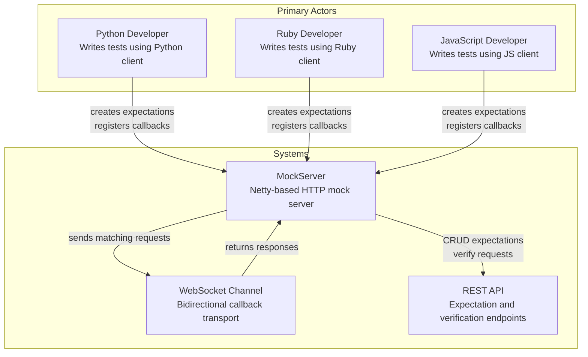
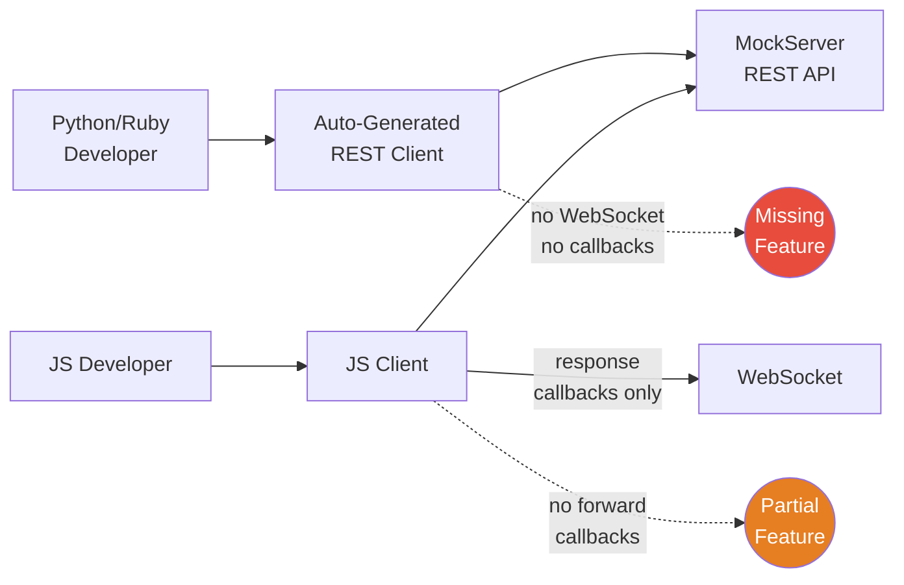
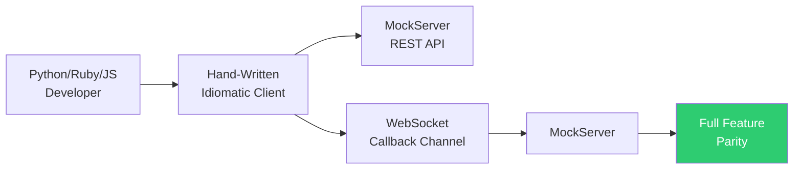

# Specification: Hand-Written MockServer Client Libraries with WebSocket Callback Support

**Created**: 2026-05-05
**Status**: Implemented
**Author**: User with AI-assisted ideation

---

## Executive Summary

MockServer's Python and Ruby clients are stale, auto-generated REST-only wrappers that lack the WebSocket-based callback feature available in Java and JavaScript. The JavaScript client only supports response callbacks, missing forward and forward+response callbacks. This spec defines fully hand-written, idiomatic client libraries for Python (3.9+), Ruby (3.0+), and an upgraded JavaScript client — all supporting the full callback feature set (response, forward, forward+response) with both a fluent API and shorthand methods. The clients will use hand-written domain models (no code generation dependency) and share a consistent public API surface across all three languages.

---

## Problem Statement

Developers using Python, Ruby, or JavaScript to test with MockServer currently lack feature parity with the Java client. The Python and Ruby clients are stale auto-generated REST wrappers (v5.3.0 vs current v5.15.x) with no WebSocket callback support, and the JavaScript client only supports response callbacks (not forward or forward+response). This forces polyglot teams to either use the Java client directly or lose the ability to dynamically generate responses and modify forwarded requests at test time — one of MockServer's most powerful features.

The desired outcome is fully hand-written, idiomatic client libraries for Python, Ruby, and JavaScript that support all three callback types (response, forward, forward+response) with a fluent API plus shorthand methods, matching the Java client's feature set.

---

## Background & Context

MockServer is an HTTP(S) mock server and proxy. Its most advanced feature is **object callbacks**: a client registers a closure (function/lambda) that executes on the client side when a matching request arrives at the server. The server communicates with the client over a WebSocket connection using a JSON envelope protocol (`WebSocketMessageDTO`) with correlation IDs to match requests to responses.

The Java client (`mockserver/mockserver-client-java/`) implements this fully: response callbacks, forward callbacks, and forward+response callbacks. The JavaScript client (`mockserver-client-node/`) implements only response callbacks via `mockWithCallback()`. The Python (`mockserver-client-python/`) and Ruby (`mockserver-client-ruby/`) clients have no WebSocket support at all.

All four clients currently share the same REST API surface (expectations, verification, clear, reset, retrieve), but the callback mechanism is an out-of-band WebSocket protocol not documented in the OpenAPI spec. This means auto-generated clients can never support callbacks — the feature requires hand-written code.

### Key Server-Side Components

| Component | Path |
|-----------|------|
| WebSocket endpoint | `/_mockserver_callback_websocket` |
| Server handler | `mockserver-netty/.../CallbackWebSocketServerHandler.java` |
| Client registry | `mockserver-core/.../WebSocketClientRegistry.java` |
| Response action handler | `mockserver-core/.../HttpResponseObjectCallbackActionHandler.java` |
| Forward action handler | `mockserver-core/.../HttpForwardObjectCallbackActionHandler.java` |
| Message serializer | `mockserver-core/.../WebSocketMessageSerializer.java` |

### WebSocket Protocol Summary

- **Endpoint**: `ws(s)://<host>:<port>/<contextPath>/_mockserver_callback_websocket`
- **Registration**: Client sends `X-CLIENT-REGISTRATION-ID: <uuid>` header during WebSocket upgrade
- **Message envelope**: `{ "type": "<java-class-name>", "value": "<json-string>" }`
- **Correlation**: Server injects `WebSocketCorrelationId` header into requests; client must echo it back in responses
- **Message types**: `HttpRequest`, `HttpResponse`, `HttpRequestAndHttpResponse`, `WebSocketClientIdDTO`, `WebSocketErrorDTO`

---

## Actors

| Actor | Type | Role |
|-------|------|------|
| Python developer | Primary | Creates expectations with callbacks, verifies requests |
| Ruby developer | Primary | Creates expectations with callbacks, verifies requests |
| JavaScript developer | Primary | Creates expectations with callbacks, verifies requests |
| MockServer | System | Receives HTTP requests, matches expectations, dispatches callbacks |
| WebSocket channel | System | Bidirectional transport for callback requests/responses |
| REST API | System | CRUD for expectations, verification, control |

---

## Current Behaviour

| Client | REST API | Response Callback | Forward Callback | Forward+Response Callback |
|--------|----------|-------------------|-----------------|--------------------------|
| Java | Full | Yes | Yes | Yes |
| JavaScript | Full | Yes | No | No |
| Python | Full (v6.0.0, hand-written, dataclasses, 438 tests) | Yes | Yes | Yes |
| Ruby | Full (v2.0.0, hand-written, 312 unit + 21 integration tests) | Yes | Yes | Yes |

---

## Desired Behaviour

| Client | REST API | Response Callback | Forward Callback | Forward+Response Callback |
|--------|----------|-------------------|-----------------|--------------------------|
| Java | Full | Yes | Yes | Yes |
| JavaScript | Full | Yes | Yes | Yes |
| Python | Full (v5.15.x) | Yes | Yes | Yes |
| Ruby | Full (v5.15.x) | Yes | Yes | Yes |

---

## Scope

| In Scope | Out of Scope |
|----------|-------------|
| Hand-written Python client library (3.9+) with full API | Server-side changes to MockServer |
| Hand-written Ruby client library (3.0+) with full API | Class callbacks (server-side JVM — not applicable to non-JVM clients) |
| Upgrade JavaScript client with forward + forward+response callbacks | Template callbacks (Velocity/Mustache — server-side rendering) |
| Hand-written domain models (no code generation) | Publishing to PyPI/RubyGems/npm (follow-up) |
| WebSocket callback support (all three types) | Integration test suite against running MockServer (follow-up) |
| Fluent API + shorthand methods | MockServer Proxy-specific features |
| TLS support for WebSocket connections | Local callback registry (same-JVM optimization — Java only) |
| Reconnection on WebSocket disconnect | Changes to the OpenAPI spec |
| Documentation (README + code examples) | WAR deployment support for callbacks (Netty only) |

---

## Functional Requirements

### Domain Models

| ID | Requirement | Priority |
|----|-------------|----------|
| FR-01 | Each client MUST provide hand-written domain model classes for: `HttpRequest`, `HttpResponse`, `HttpForward`, `HttpOverrideForwardedRequest`, `HttpError`, `HttpTemplate`, `HttpClassCallback`, `HttpObjectCallback`, `Expectation`, `Times`, `TimeToLive`, `Delay`, `Verification`, `VerificationTimes`, `VerificationSequence`, `Ports`, `KeyToMultiValue`, `Body`, `ConnectionOptions`, `ExpectationId`, `OpenAPIExpectation`, `OpenAPIDefinition`, `RequestDefinition`, `SocketAddress`. Note: `KeyToValue` and `BodyWithContentType` from the Java API are not needed — `KeyToMultiValue` covers both single and multi-value headers/params, and `Body` handles content types directly. | MUST |
| FR-02 | Domain models MUST support serialization to JSON matching the MockServer REST API format (camelCase keys, same field names as the OpenAPI spec) | MUST |
| FR-03 | Domain models MUST support deserialization from JSON responses | MUST |
| FR-04 | Python models MUST use `dataclasses` or `attrs` with type hints | MUST |
| FR-05 | Ruby models MUST use plain classes with `attr_accessor` and keyword-argument constructors to support mutable builder patterns (e.g., `with_header`, `with_body` returning `self`) | MUST |
| FR-06 | Domain models MUST provide static factory methods matching the Java API naming where idiomatic (e.g., `HttpRequest.request()`, `HttpResponse.response()`, `HttpResponse.not_found_response()`) | MUST |

### Client API — Expectations

| ID | Requirement | Priority |
|----|-------------|----------|
| FR-10 | Each client MUST provide a `when(request_definition)` method that returns a chainable object | MUST |
| FR-11 | The chainable object MUST provide `.respond(response)` for static response expectations | MUST |
| FR-12 | The chainable object MUST provide `.respond(callback_function)` for response object callbacks | MUST |
| FR-13 | The chainable object MUST provide `.forward(forward)` for static forward expectations | MUST |
| FR-14 | The chainable object MUST provide `.forward(callback_function)` for forward object callbacks | MUST |
| FR-15 | The chainable object MUST provide `.forward(forward_callback, response_callback)` for forward+response object callbacks | MUST |
| FR-16 | The chainable object MUST provide `.error(error)` for error expectations | MUST |
| FR-17 | The chainable object SHOULD provide `.with_id(id)` and `.with_priority(priority)` for metadata | SHOULD |
| FR-18 | Each client MUST provide a shorthand `mock_with_callback(request_matcher, response_handler)` for the common response callback case | MUST |
| FR-19 | Each client MUST provide `upsert(expectation)` for direct expectation creation from full objects | MUST |
| FR-20 | Each client MUST provide `open_api_expectation(spec)` for OpenAPI-based expectations | SHOULD |

### Client API — Verification

| ID | Requirement | Priority |
|----|-------------|----------|
| FR-21 | Each client MUST provide `verify(request_definition, times)` for count-based verification | MUST |
| FR-22 | Each client MUST provide `verify_sequence(request1, request2, ...)` for ordered verification | MUST |
| FR-23 | Each client MUST provide `verify_zero_interactions()` | SHOULD |
| FR-24 | Verification failure MUST raise an exception/error containing the server's failure description | MUST |

### Client API — Control

| ID | Requirement | Priority |
|----|-------------|----------|
| FR-30 | Each client MUST provide `clear(request_definition, type=None)` | MUST |
| FR-31 | Each client MUST provide `reset()` | MUST |
| FR-32 | Each client MUST provide `retrieve_recorded_requests(request_definition)` | MUST |
| FR-33 | Each client MUST provide `retrieve_active_expectations(request_definition)` | MUST |
| FR-34 | Each client SHOULD provide `retrieve_recorded_expectations(request_definition)` | SHOULD |
| FR-35 | Each client SHOULD provide `retrieve_recorded_requests_and_responses(request_definition)` | SHOULD |
| FR-36 | Each client SHOULD provide `retrieve_log_messages(request_definition)` | SHOULD |
| FR-37 | Each client MUST provide `bind(ports)` | SHOULD |
| FR-38 | Each client SHOULD provide `stop()` | SHOULD |
| FR-39 | Each client MUST provide `has_started()` / `is_running()` status check | MUST |

### WebSocket Callback Protocol

| ID | Requirement | Priority |
|----|-------------|----------|
| FR-40 | When a callback function is registered, the client MUST open a WebSocket connection to `/_mockserver_callback_websocket` with header `X-CLIENT-REGISTRATION-ID: <uuid>` | MUST |
| FR-41 | The client MUST wait for a `WebSocketClientIdDTO` message from the server confirming registration before creating the expectation | MUST |
| FR-42 | When the server sends an `HttpRequest` message, the client MUST invoke the registered callback function and return the result as an `HttpResponse` message (for response callbacks) or `HttpRequest` message (for forward callbacks) | MUST |
| FR-43 | The client MUST preserve the `WebSocketCorrelationId` header from the inbound request in the outbound response | MUST |
| FR-44 | When the server sends an `HttpRequestAndHttpResponse` message (for forward+response callbacks), the client MUST invoke the response callback with both the request and response, and return the modified `HttpResponse` | MUST |
| FR-45 | If a callback function throws an exception, the client MUST send a `WebSocketErrorDTO` message to the server with the error details | MUST |
| FR-46 | All WebSocket messages MUST use the `WebSocketMessageDTO` envelope format: `{"type": "<java-class-fqn>", "value": "<json>"}` | MUST |
| FR-47 | The client MUST support TLS WebSocket connections (`wss://`) with configurable CA certificates | MUST |

### Python-Specific

| ID | Requirement | Priority |
|----|-------------|----------|
| FR-50 | The Python client MUST provide an `async` API using `asyncio` and the `websockets` library for WebSocket communication | MUST |
| FR-51 | The Python client MUST provide a synchronous wrapper that manages its own event loop for non-async users | MUST |
| FR-52 | The synchronous wrapper MUST work correctly when called from a thread that does not have a running event loop | MUST |
| FR-53 | The Python client MUST be packaged with `pyproject.toml` (setuptools backend) | MUST |
| FR-54 | The Python package name MUST be `mockserver-client` and the import name MUST be `mockserver` | MUST |

### Ruby-Specific

| ID | Requirement | Priority |
|----|-------------|----------|
| FR-60 | The Ruby client MUST use a threaded WebSocket listener (e.g., `websocket-client-simple` or `faye-websocket`) | MUST |
| FR-61 | The Ruby client MUST be packaged as a gem named `mockserver-client` | MUST |
| FR-62 | The Ruby gem MUST use `typhoeus` or `net/http` for REST API calls (no heavy framework dependencies) | MUST |

### JavaScript-Specific

| ID | Requirement | Priority |
|----|-------------|----------|
| FR-70 | The JavaScript client MUST add `mockWithForwardCallback(requestMatcher, forwardHandler)` for forward object callbacks | MUST |
| FR-71 | The JavaScript client MUST add `mockWithForwardAndResponseCallback(requestMatcher, forwardHandler, responseHandler)` for forward+response object callbacks | MUST |
| FR-72 | Existing JavaScript API methods (`mockAnyResponse`, `mockWithCallback`, `verify`, `clear`, `reset`, etc.) MUST remain backwards-compatible — same method names, same parameter signatures, same return types | MUST |
| FR-73 | The JavaScript client MUST continue to support both Node.js and browser environments for WebSocket | MUST |
| FR-74 | TypeScript type definitions MUST be updated to include the new callback methods while preserving all existing type signatures | MUST |
| FR-75 | The JavaScript client's public API surface (method names, parameter order, return types, Promise behaviour) MUST NOT change for existing methods — internals MAY be fully rewritten | MUST |
| FR-76 | The JavaScript client MUST preserve the existing `mockServerClient(host, port, contextPath, tls, caCertPemFilePath)` factory function signature | MUST |
| FR-77 | The JavaScript client MUST preserve the existing domain model object shapes (e.g., `{ path: '/foo', method: 'GET' }` for requests, `{ statusCode: 200, body: '...' }` for responses) used in all public methods | MUST |

---

## Non-Functional Requirements

| ID | Requirement | Rationale |
|----|-------------|-----------|
| NFR-01 | Python client MUST support Python 3.9+ | Aligns with current pyproject.toml; 3.9 is still widely supported |
| NFR-02 | Ruby client MUST support Ruby 3.0+ | Ruby 2.7 is EOL; 3.0 is minimum maintained version |
| NFR-03 | JavaScript client MUST support Node.js 18+ | Node 18 is the current LTS minimum |
| NFR-04 | All clients MUST have zero dependency on code generation tools at runtime | Hand-written code must be self-contained |
| NFR-05 | Python and Ruby clients SHOULD have minimal dependencies (HTTP client + WebSocket + JSON — no frameworks) | Reduces installation friction and version conflicts |
| NFR-06 | WebSocket reconnection MUST be attempted up to 3 times with exponential backoff on unexpected disconnect | Matches Java client behaviour |
| NFR-07 | All clients MUST handle concurrent callback invocations safely (multiple requests arriving on the WebSocket simultaneously) | MockServer may dispatch multiple callback requests to the same client |
| NFR-08 | API naming MUST follow language conventions: `snake_case` for Python/Ruby methods, `camelCase` for JavaScript | Idiomatic for each language |
| NFR-09 | All clients MUST include a comprehensive README with usage examples for all three callback types | Critical for adoption |

---

## Edge Cases & Error Handling

| Scenario | Expected Behaviour |
|----------|-------------------|
| MockServer is not running when client connects | Client MUST raise a clear connection error with host/port in the message |
| WebSocket connection drops during active callback | Client MUST attempt reconnection (up to 3 times); if reconnection fails, MUST raise an error |
| Callback function raises an exception | Client MUST send `WebSocketErrorDTO` to server and log the error locally; MUST NOT crash the WebSocket listener |
| Server sends unknown message type on WebSocket | Client MUST log a warning and ignore the message |
| `when().respond(callback)` called but MockServer is deployed as WAR (no WebSocket support) | Server returns HTTP 501; client MUST raise a clear error explaining callbacks require Netty deployment |
| Multiple callbacks registered for different expectations | Each callback MUST have its own `clientId` and MAY share the same WebSocket connection or use separate connections |
| Client `reset()` called while callbacks are active | Client MUST close all WebSocket connections and clear registered callbacks |
| Client `close()` / `stop()` called | Client MUST gracefully close all WebSocket connections |
| SSL/TLS connection with self-signed MockServer certificate | Client MUST accept custom CA certificates via configuration |
| Large response body returned by callback | Client MUST handle responses of at least 10MB without truncation |
| Callback function takes a long time (>30s) | Client MUST NOT timeout the callback; the server controls timeout behaviour |

---

## Success Criteria

| ID | Criterion | How to Verify |
|----|-----------|--------------|
| SC-01 | Python client can create a response callback expectation and receive/respond to a request via WebSocket | Automated test: start MockServer, register callback, send HTTP request, verify response matches callback output |
| SC-02 | Python client can create a forward callback expectation and modify the forwarded request | Automated test: register forward callback, send request, verify the forwarded request has modifications |
| SC-03 | Python client can create a forward+response callback and modify both request and response | Automated test: register both callbacks, verify request modification and response modification |
| SC-04 | Ruby client passes the same three callback tests as Python (SC-01, SC-02, SC-03) | Automated tests |
| SC-05 | JavaScript client passes forward and forward+response callback tests (new methods) | Automated tests |
| SC-06 | JavaScript `mockWithCallback` (existing response callback) continues to work unchanged | Existing tests still pass |
| SC-07 | All clients can create static expectations (response, forward, error, template) without WebSocket | Automated tests against REST API |
| SC-08 | All clients can verify requests (count and sequence) | Automated tests |
| SC-09 | All clients can clear, reset, and retrieve data | Automated tests |
| SC-10 | Python sync wrapper works correctly in a standard synchronous test (e.g., pytest without async) | Automated test using sync API |
| SC-11 | Python async API works correctly with `asyncio.run()` and `pytest-asyncio` | Automated test using async API |
| SC-12 | All three callback types work over TLS (`wss://`) with custom CA certificate | Automated tests with TLS-enabled MockServer |

---

## Open Questions

- [ ] **Shared WebSocket connection vs per-callback**: Should multiple callbacks share a single WebSocket connection (like the Java client) or use one connection per callback (simpler but more resource-intensive)? — Impact: connection management complexity, resource usage
- [ ] **Python dependency choice**: Should the Python client use `websockets` (asyncio-native, well-maintained) or `websocket-client` (synchronous, simpler)? Both are recommended above, with `websockets` as the async core and sync wrapper on top. — Impact: package dependencies, API design
- [ ] **Ruby WebSocket library**: Should the Ruby client use `websocket-client-simple`, `faye-websocket`, or `async-websocket`? — Impact: threading model, dependencies, Ruby version support
- [ ] **Backwards compatibility for Python/Ruby package names**: The current PyPI package is `mockserver-client` and the RubyGem is `mockserver-client`. Should the hand-written clients keep these names (major version bump) or use new names? — Impact: upgrade path for existing users
- [x] **JavaScript: new methods vs enhanced `mockWithCallback`**: ~~Should the JS client add separate methods or extend `mockWithCallback`?~~ **Resolved**: Add separate `mockWithForwardCallback` and `mockWithForwardAndResponseCallback` methods. Existing `mockWithCallback` is unchanged. Public API surface is frozen — internals may be rewritten.

---

## Key Decisions

### Decision 1: Fully hand-written clients (no code generation)
- **Decision**: All three clients will be hand-written with idiomatic domain models. No dependency on OpenAPI Generator at runtime or build time.
- **Context**: The generated code is unidiomatic (e.g., pydantic v2 with `BodyAnyOf1` through `BodyAnyOf9`), cannot support the WebSocket protocol, and requires post-generation fixups. Hand-written code can provide a clean, idiomatic API.
- **Alternatives considered**: (1) Keep generated REST code + add WebSocket layer — rejected because generated models are bloated and unidiomatic; (2) Generate then customize — rejected because manual maintenance of generated code is fragile.

### Decision 2: All three callback types supported
- **Decision**: Response callbacks, forward callbacks, and forward+response callbacks will all be supported in Python, Ruby, and JavaScript.
- **Context**: The Java client supports all three, and forward+response is particularly valuable for proxy testing scenarios. The developer should be able to choose one, the other, or both.
- **Alternatives considered**: Response-only (like current JS) — rejected because forward callbacks are a key differentiator.

### Decision 3: Fluent API + shorthand methods
- **Decision**: Clients will provide both a fluent builder API (`client.when(request).respond(callback)`) and shorthand methods (`client.mock_with_callback(matcher, handler)`) for common cases.
- **Context**: The fluent API matches Java for discoverability; shorthand methods reduce ceremony for simple cases.
- **Alternatives considered**: Fluent-only or shorthand-only — rejected; both serve different user preferences.

### Decision 4: Python async + sync wrapper
- **Decision**: The Python client will use `asyncio` with the `websockets` library as the core, with a synchronous wrapper that manages its own event loop for non-async users.
- **Context**: Modern Python favours async, but many test frameworks (pytest without asyncio) are synchronous. Both must work.
- **Alternatives considered**: Threading-only — rejected because asyncio is the modern Python standard for I/O-bound code.

### Decision 5: Language versions
- **Decision**: Python 3.9+, Ruby 3.0+, JavaScript/Node.js 18+.
- **Context**: These are the minimum currently-maintained versions for each language.

### Decision 6: JavaScript client — stable public API, rewritable internals
- **Decision**: The existing `mockserver-client-node` public API (method names, signatures, return types, domain object shapes) MUST be preserved exactly. Internals (implementation, file structure, WebSocket handling) MAY be fully rewritten. New methods are added for forward callbacks.
- **Context**: Existing users upgrading should see zero breaking changes. The current `mockWithCallback` continues to work identically. New `mockWithForwardCallback` and `mockWithForwardAndResponseCallback` methods are purely additive.
- **Alternatives considered**: Full public API redesign — rejected to minimise upgrade friction for existing users.

---

## Ideation Log

### 2026-05-05

- Q: What callback types to support? -> A: All three (response, forward, forward+response), developer chooses which to use
- Q: JavaScript upgrade approach? -> A: Upgrade existing JS client after Python and Ruby are done
- Q: Code architecture — how to coexist with generated code? -> A: Fully hand-written clients, no code generation dependency
- Q: API style? -> A: Both fluent API and shorthand methods
- Q: Python concurrency model? -> A: asyncio primary with sync wrapper
- Q: Language versions? -> A: Python 3.9+, Ruby 3.0+
- Q: Delivery approach? -> A: Spec first, then implement language by language
- Q: Domain model approach? -> A: Hand-written idiomatic models (dataclasses for Python, plain classes with attr_accessor for Ruby — Struct/Data rejected because models need mutable builder pattern)
- Q: JavaScript upgrade approach — how much can change? -> A: Public API surface (method names, signatures, return types, domain object shapes) must be preserved exactly. Internals can be fully rewritten. New forward callback methods are additive only.
