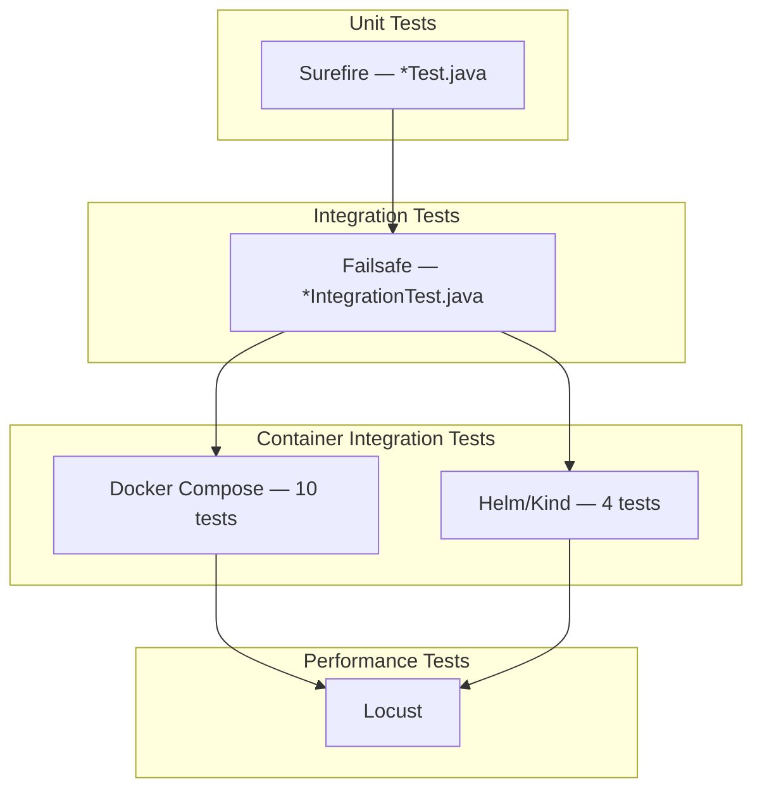
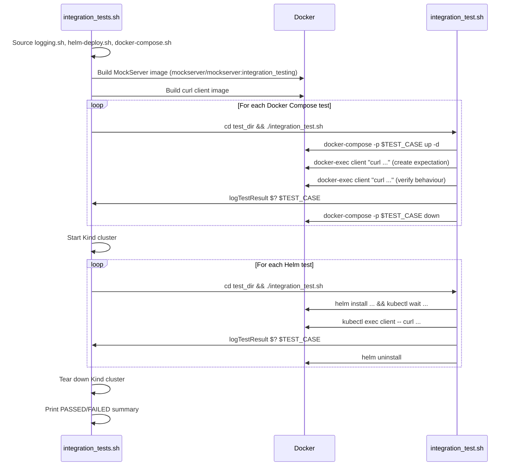

# Testing

## Test Categories

MockServer uses a multi-layered testing strategy:



## Unit Tests

Unit tests use JUnit 4 and run via the Maven Surefire plugin during the `test` phase.

| Property | Value |
|----------|-------|
| Naming convention | `*Test.java` |
| Excludes | `*IntegrationTest.java` |
| Maven phase | `test` |
| Plugin | `maven-surefire-plugin` 2.22.2 |
| Log level | `mockserver.logLevel=ERROR` |
| Locale | `en-GB` (`-Duser.language=en -Duser.country=GB`) |
| Test listener | `org.mockserver.test.PrintOutCurrentTestRunListener` |

### Running Unit Tests

```bash
./mvnw test

./mvnw test -pl mockserver-core

./mvnw test -pl mockserver-netty -Dtest=MockServerRuleTest
```

## Integration Tests

Integration tests also use JUnit 4 and run via the Maven Failsafe plugin during the `integration-test` and `verify` phases.

| Property | Value |
|----------|-------|
| Naming convention | `*IntegrationTest.java` |
| Maven phase | `integration-test` / `verify` |
| Plugin | `maven-failsafe-plugin` 2.22.2 |
| Includes | `**/*IntegrationTest.java` |

### Running Integration Tests

```bash
./mvnw verify

./mvnw verify -pl mockserver-netty
```

### Integration Test Infrastructure

The `mockserver-integration-testing` module provides shared abstract test base classes:

| Class | Purpose |
|-------|---------|
| `AbstractBasicMockingIntegrationTest` | Basic mocking test cases |
| `AbstractExtendedMockingIntegrationTest` | Extended mocking with all action types |
| `AbstractExtendedSameJVMMockingIntegrationTest` | Same-JVM callback testing |
| `AbstractMockingIntegrationTestBase` | Base class with common setup/teardown |
| `AbstractProxyIntegrationTest` | Proxy mode integration tests |

The module also provides precanned callback implementations in `org.mockserver.testing.integration.callback` used across test modules.

### Shaded JAR Integration Tests

`mockserver-netty/src/integration-tests/` contains Maven Invoker and Gradle-based tests that verify the shaded JARs work correctly as dependencies:

| Directory | Purpose |
|-----------|---------|
| `maven-netty-jar-with-dependencies-dependency/` | Tests fat JAR as Maven dependency |
| `maven-netty-no-dependencies-dependency/` | Tests standard JAR as Maven dependency |
| `maven-netty-shaded-dependency/` | Tests shaded JAR as Maven dependency |
| `gradle/` | Tests Gradle dependency resolution |

## Container Integration Tests

Located in `container_integration_tests/`, these tests verify MockServer behaviour when running as a Docker container or Kubernetes pod.

### Running Container Integration Tests

```bash
container_integration_tests/integration_tests.sh

SKIP_HELM_TESTS=true container_integration_tests/integration_tests.sh

SKIP_JAVA_BUILD=true SKIP_DOCKER_BUILD_MOCKSERVER=true container_integration_tests/integration_tests.sh
```

### Environment Variable Controls

| Variable | Default | Purpose |
|----------|---------|---------|
| `SKIP_JAVA_BUILD` | unset | Skip `mvnw package` step |
| `SKIP_DOCKER_BUILD_MOCKSERVER` | unset | Skip building MockServer Docker image |
| `SKIP_DOCKER_REBUILD_CLIENT` | unset | Skip rebuilding the curl client image |
| `SKIP_ALL_TESTS` | unset | Skip all tests (build only) |
| `SKIP_DOCKER_TESTS` | unset | Skip Docker Compose tests |
| `SKIP_HELM_TESTS` | unset | Skip Helm/Kind tests |

### Docker Compose Tests (10)

Each test has its own directory containing a `docker-compose.yml` and `integration_test.sh`:

| Test | Validates |
|------|-----------|
| `docker_compose_forward_with_override` | Forward with request/response override |
| `docker_compose_remote_host_and_port_by_environment_variable` | Remote host/port via `MOCKSERVER_PROXY_REMOTE_HOST`/`PORT` |
| `docker_compose_server_port_by_command` | Server port via command-line argument |
| `docker_compose_server_port_by_environment_variable_long_name` | Server port via `MOCKSERVER_SERVER_PORT` |
| `docker_compose_server_port_by_environment_variable_short_name` | Server port via `SERVER_PORT` |
| `docker_compose_without_server_port` | Default port (1080) |
| `docker_compose_with_expectation_initialiser` | Expectation initialiser class |
| `docker_compose_with_persisted_expectations` | Persisted expectations file |
| `docker_compose_with_server_port_from_default_properties_file` | Port from `mockserver.properties` |
| `docker_compose_with_server_port_from_custom_properties_file` | Port from custom properties file |

### Helm Tests (4)

Helm tests use KinD (Kubernetes in Docker) to create a local cluster:

| Test | Validates |
|------|-----------|
| `helm_default_config` | Default Helm chart values |
| `helm_local_docker_container` | Local Docker image loaded into Kind |
| `helm_custom_server_port` | Custom server port via Helm values |
| `helm_remote_host_and_port` | Remote host/port via Helm values |

### Helper Scripts

| Script | Purpose |
|--------|---------|
| `integration_tests.sh` | Main orchestrator: builds Docker image, runs all tests, prints summary |
| `docker-compose.sh` | Docker Compose helper functions (`start-up`, `tear-down`, `docker-exec`, `container-logs`) |
| `helm-deploy.sh` | Kind cluster lifecycle (`start-up-k8s`, `tear-down-k8s`), Helm install/uninstall |
| `logging.sh` | Coloured terminal output, `runCommand`, `retryCommand`, `logTestResult` |

### Test Flow



## Performance Tests

The `docker_build/performance/Dockerfile` provides a Locust-based performance testing image built on `locustio/locust` with `curl` installed.

## Test Utilities

### mockserver-testing Module

Shared test utilities available to all modules:

| Class | Purpose |
|-------|---------|
| `PrintOutCurrentTestRunListener` | JUnit `RunListener` that prints STARTED/FINISHED/FAILED/IGNORED with timing |
| `Assert` | Custom assertion helpers |
| `Retries` | Retry logic for flaky operations |
| `TempFileWriter` | Temporary file creation for tests |
| `IsDebug` | Detects if running under a debugger |

### PrintOutCurrentTestRunListener

Configured via Surefire/Failsafe in the root `pom.xml`:

```xml
<properties>
    <listener>org.mockserver.test.PrintOutCurrentTestRunListener</listener>
</properties>
```

Prints test lifecycle events to stdout:
```
STARTED: testMethodName
FINISHED: testMethodName duration: 123
FAILED: testMethodName
IGNORED: testMethodName
```

## CI Test Execution

### Buildkite

The `scripts/buildkite_quick_build.sh` script runs `./mvnw clean install` with 8GB heap allocation (`-Xms2048m -Xmx8192m`), executing both unit and integration tests.

### Local Development

The `scripts/local_quick_build.sh` script:
1. Sets 8GB heap allocation
2. Uses Java 17 (`/usr/libexec/java_home -v 17`)
3. Runs parallel Maven build (`-T 3C`)
4. Runs container integration tests with `SKIP_JAVA_BUILD=true`

```bash
./scripts/local_quick_build.sh

./scripts/local_single_test.sh

./scripts/local_single_module.sh
```
