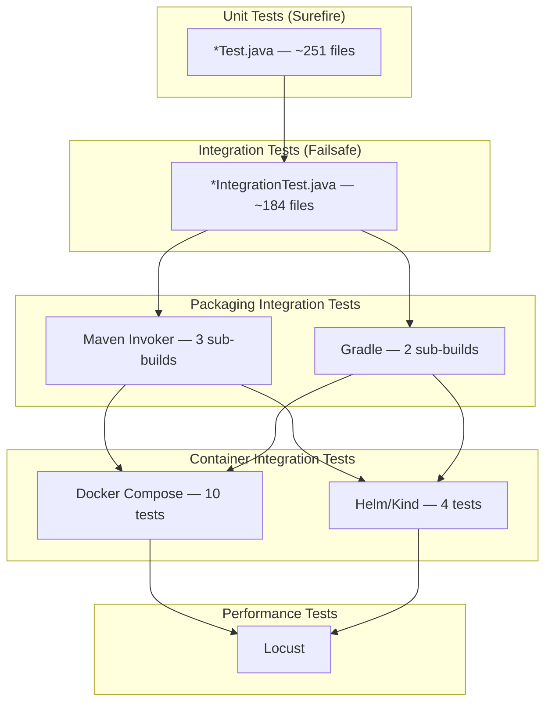
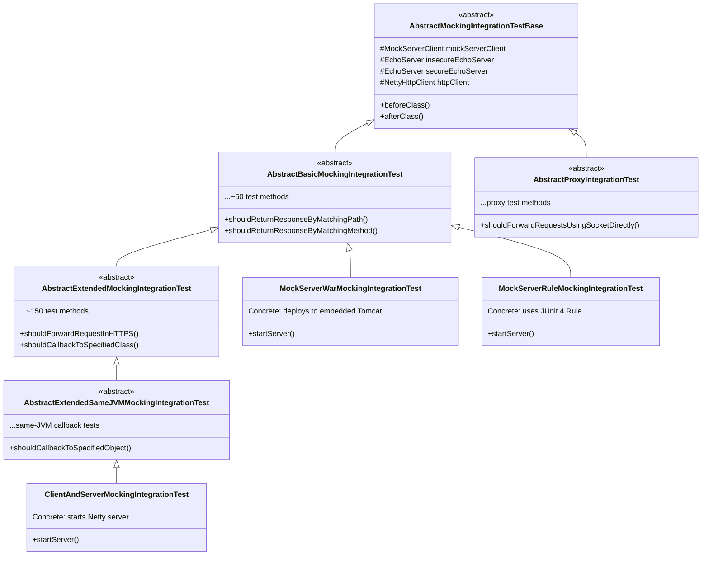
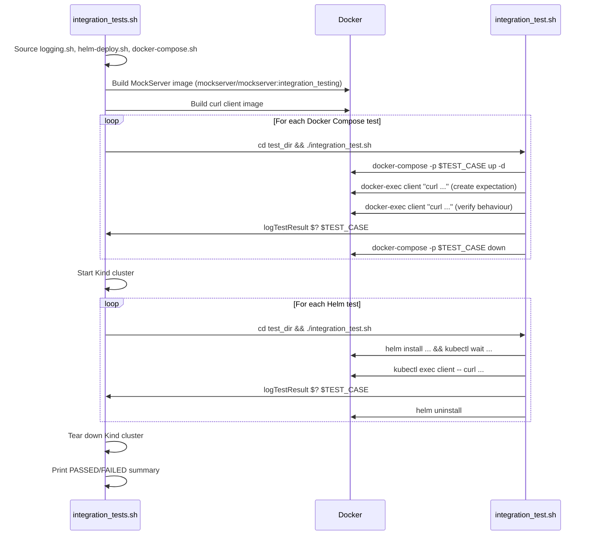

# Testing

## Overview

MockServer uses a multi-layered testing strategy spanning unit tests, integration tests, packaging verification tests, container integration tests, and performance tests. Tests are predominantly written in **JUnit 4** with a small number of **JUnit 5** tests in the `mockserver-junit-jupiter` module.



## Test Frameworks and Dependencies

| Framework | Version | Usage |
|-----------|---------|-------|
| JUnit 4 | 4.13.2 | Primary test framework across almost all modules |
| JUnit Jupiter (JUnit 5) | 5.9.2 | Used exclusively in `mockserver-junit-jupiter` |
| Mockito Core | 4.11.0 | Mocking framework used in most modules |
| Mockito JUnit Jupiter | 4.11.0 | JUnit 5 Mockito integration (`mockserver-junit-jupiter` only) |
| Hamcrest | 2.2 | Assertion matchers used across all modules |
| JSONAssert | 1.5.1 | JSON assertion library (`mockserver-core`) |
| Spring Test | 5.3.26 | `mockserver-core`, `mockserver-war`, `mockserver-proxy-war`, `mockserver-spring-test-listener`, `mockserver-examples` |
| XMLUnit | 2.9.1 | XML comparison (production dependency, also supports test assertions) |

No TestNG is used anywhere in the project.

## Test Inventory by Module

| Module | Unit Tests | Integration Tests | Total Test Files | Description |
|--------|-----------|-------------------|-----------------|-------------|
| `mockserver-core` | ~220 | ~62 | ~282 | Largest suite: matchers, serialization, validators, actions, collections, auth, logging |
| `mockserver-netty` | ~13 | ~64 | ~77 | Server lifecycle, TLS, proxy, CORS, authenticated control plane |
| `mockserver-examples` | 0 | ~25 | ~25 | End-to-end examples with various HTTP clients |
| `mockserver-junit-jupiter` | ~6 | ~12 | ~18 | JUnit 5 extension tests (injection, parallel safety, settings) |
| `mockserver-junit-rule` | ~4 | ~4 | ~8 | JUnit 4 Rule/ClassRule tests |
| `mockserver-war` | 0 | ~8 | ~8 | WAR deployment integration tests (embedded Tomcat) |
| `mockserver-client-java` | ~5 | ~2 | ~7 | Client API unit tests, event bus, serialization |
| `mockserver-spring-test-listener` | ~2 | ~4 | ~6 | Spring TestExecutionListener tests |
| `mockserver-proxy-war` | 0 | ~3 | ~3 | Proxy WAR integration tests (embedded Tomcat) |
| `mockserver-testing` | 1 | 0 | 1 | Self-test for the `Assert` utility class |
| `mockserver-integration-testing` | 0 | 0 | 0 | No tests of its own — it IS the shared test infrastructure |
| **Total** | **~251** | **~184** | **~435** | |

## Test Architecture

### Naming Convention

Test filtering is done entirely by naming convention — no `@Category` or `@Tag` annotations are used:

| Pattern | Runner | Maven Phase | Plugin |
|---------|--------|-------------|--------|
| `**/*Test.java` | Surefire | `test` | `maven-surefire-plugin` 3.2.5 |
| `**/*IntegrationTest.java` | Failsafe | `integration-test` / `verify` | `maven-failsafe-plugin` 3.2.5 |

### Abstract Base Class Hierarchy

The project uses a **template method pattern** for integration tests. Abstract base classes in `mockserver-integration-testing` define hundreds of test cases, and concrete classes in each module provide the server wiring.



This architecture means a single abstract test class change can affect tests across multiple modules. The `mockserver-integration-testing` module has no tests of its own — it exists solely to provide these shared base classes.

### Assertion Patterns

Many tests use **private helper methods** or **abstract base classes** for assertions. Assertions are present but not always visible in the `@Test` method body. For example:

- `AuthenticatedControlPlaneUsing*IntegrationTest` classes delegate assertions to `clientOperationIsAuthenticated()` (uses `assertThrows` + `assertThat`) and `httpAPIOperationIsAuthenticated()` (asserts HTTP 401 + error message)
- `ConcurrencyBasicResponseMockingIntegrationTest` runs assertions inside scheduled tasks via `sendRequestAndVerifyResponse()` which calls `Assert.assertEquals`
- `NettyHttpProxySOCKSIntegrationTest` delegates to helpers like `proxyRequestsUsingSocketViaSOCKS5()` containing multiple assertions

### Precanned Callbacks

The `mockserver-integration-testing` module provides precanned callback implementations in `org.mockserver.testing.integration.callback`:

| Class | Purpose |
|-------|---------|
| `PrecannedTestExpectationForwardCallbackRequest` | Forward callback with request override |
| `PrecannedTestExpectationForwardCallbackRequestAndResponse` | Forward callback with request and response override |
| `PrecannedTestExpectationResponseCallback` | Response callback returning precanned response |

## Unit Tests

Unit tests use JUnit 4 (or JUnit 5 in `mockserver-junit-jupiter`) and run via the Maven Surefire plugin during the `test` phase.

| Property | Value |
|----------|-------|
| Naming convention | `*Test.java` |
| Excludes | `*IntegrationTest.java` |
| Maven phase | `test` |
| Plugin | `maven-surefire-plugin` 3.2.5 |
| Log level | `mockserver.logLevel=ERROR` |
| Locale | `en-GB` (`-Duser.language=en -Duser.country=GB`) |
| Test listener | `org.mockserver.test.PrintOutCurrentTestRunListener` |
| XML reports | Disabled (`<disableXmlReport>true</disableXmlReport>`) |
| Fork count | Default (1 fork per module; `forkCount=0` commented out for debugging) |

### Running Unit Tests

```bash
./mvnw test

./mvnw test -pl mockserver-core

./mvnw test -pl mockserver-netty -Dtest=MockServerRuleTest
```

## Integration Tests

Integration tests use JUnit 4 and run via the Maven Failsafe plugin during the `integration-test` and `verify` phases. They start real servers (Netty, embedded Tomcat) and exercise full request/response flows.

| Property | Value |
|----------|-------|
| Naming convention | `*IntegrationTest.java` |
| Maven phase | `integration-test` / `verify` |
| Plugin | `maven-failsafe-plugin` 3.2.5 |
| Log level | `mockserver.logLevel=ERROR` |
| Extra system properties | `project.version`, `project.basedir` |
| Locale | `en-GB` |
| Test listener | `org.mockserver.test.PrintOutCurrentTestRunListener` |
| XML reports | Disabled |

### Running Integration Tests

```bash
./mvnw verify

./mvnw verify -pl mockserver-netty
```

### Integration Test Infrastructure

The `mockserver-integration-testing` module provides shared abstract test base classes:

| Class | Purpose |
|-------|---------|
| `AbstractMockingIntegrationTestBase` | Base class with common setup/teardown (MockServerClient, EchoServer, NettyHttpClient) |
| `AbstractBasicMockingIntegrationTest` | Basic mocking test cases (~50 methods) |
| `AbstractExtendedMockingIntegrationTest` | Extended mocking with all action types (~150 methods) |
| `AbstractExtendedSameJVMMockingIntegrationTest` | Same-JVM callback testing |
| `AbstractBasicMockingSameJVMIntegrationTest` | Basic tests for same-JVM scenarios |
| `AbstractProxyIntegrationTest` | Proxy mode integration tests |

### Embedded Server Infrastructure

Integration tests use real embedded servers rather than mocks:

| Server | Module | Purpose |
|--------|--------|---------|
| `EchoServer` (Netty) | `mockserver-integration-testing` | Returns request details as response body (secure + insecure instances) |
| Embedded Tomcat 9.0.x | `mockserver-war`, `mockserver-proxy-war` | WAR deployment testing |
| MockServer (Netty) | `mockserver-netty` | Full server lifecycle testing |

### Shaded JAR Integration Tests

`mockserver-netty/src/integration-tests/` contains Maven Invoker and Gradle-based tests that verify the shaded JARs work correctly as dependencies:

| Directory | Purpose |
|-----------|---------|
| `maven-netty-jar-with-dependencies-dependency/` | Tests fat JAR as Maven dependency |
| `maven-netty-no-dependencies-dependency/` | Tests standard JAR as Maven dependency |
| `maven-netty-shaded-dependency/` | Tests shaded JAR as Maven dependency |
| `gradle-netty-shaded-dependencies/` | Tests Gradle dependency resolution (shaded) |
| `gradle-netty-no-dependencies-dependencies/` | Tests Gradle dependency resolution (no-deps) |

These are run by `maven-invoker-plugin` 3.5.1 (Maven variants, `parallelThreads=2`) and `exec-maven-plugin` calling `gradle_integration_tests.sh` (Gradle variants) during the `integration-test`/`install` phases.

## Container Integration Tests

Located in `container_integration_tests/`, these tests verify MockServer behaviour when running as a Docker container or Kubernetes pod. **These are NOT run in CI** — they are only invoked by `local_quick_build.sh` and `local_online_build.sh`. Estimated runtime is ~5-10 minutes (with pre-built JAR).

### Running Container Integration Tests

```bash
container_integration_tests/integration_tests.sh

SKIP_HELM_TESTS=true container_integration_tests/integration_tests.sh

SKIP_JAVA_BUILD=true SKIP_DOCKER_BUILD_MOCKSERVER=true container_integration_tests/integration_tests.sh
```

### Environment Variable Controls

| Variable | Default | Purpose |
|----------|---------|---------|
| `SKIP_JAVA_BUILD` | unset | Skip `mvnw package` step |
| `SKIP_DOCKER_BUILD_MOCKSERVER` | unset | Skip building MockServer Docker image |
| `SKIP_DOCKER_REBUILD_CLIENT` | unset | Skip rebuilding the curl client image |
| `SKIP_ALL_TESTS` | unset | Skip all tests (build only) |
| `SKIP_DOCKER_TESTS` | unset | Skip Docker Compose tests |
| `SKIP_HELM_TESTS` | unset | Skip Helm/Kind tests |

### Docker Compose Tests (10)

Each test has its own directory containing a `docker-compose.yml` and `integration_test.sh`:

| Test | Validates |
|------|-----------|
| `docker_compose_forward_with_override` | Forward with request/response override |
| `docker_compose_remote_host_and_port_by_environment_variable` | Remote host/port via `MOCKSERVER_PROXY_REMOTE_HOST`/`PORT` |
| `docker_compose_server_port_by_command` | Server port via command-line argument |
| `docker_compose_server_port_by_environment_variable_long_name` | Server port via `MOCKSERVER_SERVER_PORT` |
| `docker_compose_server_port_by_environment_variable_short_name` | Server port via `SERVER_PORT` |
| `docker_compose_without_server_port` | Default port (1080) |
| `docker_compose_with_expectation_initialiser` | Expectation initialiser class |
| `docker_compose_with_persisted_expectations` | Persisted expectations file |
| `docker_compose_with_server_port_from_default_properties_file` | Port from `mockserver.properties` |
| `docker_compose_with_server_port_from_custom_properties_file` | Port from custom properties file |

### Helm Tests (4)

Helm tests use KinD (Kubernetes in Docker) to create a local cluster:

| Test | Validates |
|------|-----------|
| `helm_default_config` | Default Helm chart values |
| `helm_local_docker_container` | Local Docker image loaded into Kind |
| `helm_custom_server_port` | Custom server port via Helm values |
| `helm_remote_host_and_port` | Remote host/port via Helm values |

### Helper Scripts

| Script | Purpose |
|--------|---------|
| `integration_tests.sh` | Main orchestrator: builds Docker image, runs all tests, prints summary |
| `docker-compose.sh` | Docker Compose helper functions (`start-up`, `tear-down`, `docker-exec`, `container-logs`) |
| `helm-deploy.sh` | Kind cluster lifecycle (`start-up-k8s`, `tear-down-k8s`), Helm install/uninstall |
| `logging.sh` | Coloured terminal output, `runCommand`, `retryCommand`, `logTestResult` |

### Test Flow



### Docker Image Variant Coverage

There are 5 production Docker image variants. Only the main nonroot variant is tested:

| Variant | Dockerfile | Base Image | Tested? |
|---------|-----------|------------|---------|
| Main (nonroot) | `docker/Dockerfile` | `distroless/java17:nonroot` | YES (built as `integration_testing` image) |
| Root | `docker/root/Dockerfile` | `distroless/java17` | NO |
| Snapshot (debug) | `docker/snapshot/Dockerfile` | `distroless/java17:debug-nonroot` | NO |
| Root Snapshot | `docker/root-snapshot/Dockerfile` | `distroless/java17` | NO |
| Local build | `docker/local/Dockerfile` | `distroless/java17:nonroot` | NO |

The integration tests always build with `--build-arg source=copy` (local JAR). The default `source=download` mode (downloads from Sonatype) used by real users is never tested.

### What Docker Features Are Tested

- Basic container startup and HTTP API responsiveness
- Environment variable handling (`MOCKSERVER_SERVER_PORT`, `SERVER_PORT`, `PROXY_REMOTE_HOST`, `PROXY_REMOTE_PORT`, `MOCKSERVER_LOG_LEVEL`, `MOCKSERVER_INITIALIZATION_JSON_PATH`, `MOCKSERVER_PROPERTY_FILE`, `MOCKSERVER_PERSIST_EXPECTATIONS`, `MOCKSERVER_PERSISTED_EXPECTATIONS_PATH`)
- Volume mounts for configuration files and persisted state
- Command-line argument passing (`-serverPort`)
- Multi-container networking (bridge network between client and server)
- HTTP/2 support (via `nghttp` in the forward-with-override test)

### What Docker Features Are NOT Tested

| Feature | Status |
|---------|--------|
| Health checks | No `HEALTHCHECK` instruction in any Dockerfile. `MOCKSERVER_LIVENESS_HTTP_GET_PATH` exists but is disabled by default. |
| Graceful shutdown (signal handling) | No test verifies `docker stop` drains connections or persists state. |
| Multi-arch (ARM64) | CI builds `linux/amd64,linux/arm64` but integration tests only run on native arch. |
| JVM options (`JVM_OPTIONS` env var) | Supported by Helm chart but never tested via Docker Compose. |
| `/libs/*` classpath extension | Entrypoint includes `/libs/*` on classpath for custom JARs but no test mounts into `/libs/`. |
| Custom TLS certificates | Forward-with-override uses HTTPS via `nghttp` but no test exercises custom certs or mTLS. |
| Resource limits / memory constraints | No test verifies behaviour under memory pressure. |

### What Helm Features Are Tested

The 4 Helm tests cover basic deployment, custom image tags, custom server port, and inter-service proxy forwarding. All use the same validation pattern: create expectation via PUT, verify response via GET.

### What Helm Features Are NOT Tested

| Feature | In Chart? | Tested? |
|---------|-----------|---------|
| Ingress (`ingress.yaml`, 52 lines) | YES | NO |
| Service types (ClusterIP, LoadBalancer) | YES | NO (only NodePort) |
| Resource limits | YES | NO |
| ConfigMap (`app.config.enabled`) | YES | NO |
| Probes (readiness/liveness) | YES (hardcoded) | Implicit only (via `--wait`) |
| Affinity / tolerations / node selectors | YES | NO |
| Pod annotations / security context | YES | NO |
| Replica count >1 | YES | NO |
| `helm test` hook (`service-test.yaml`) | YES | NO (never invoked) |
| `helm lint` / `helm template` | N/A | NO (not run anywhere) |
| `mockserver-config` chart | YES (separate chart) | NO (zero tests) |
| `mountedLibsConfigMapName` | YES | NO |

## Performance Tests

The `docker_build/performance/Dockerfile` provides a Locust-based performance testing image built on `locustio/locust` with `curl` installed.

## Test Utilities

### mockserver-testing Module

Shared test utilities available to all modules:

| Class | Purpose |
|-------|---------|
| `PrintOutCurrentTestRunListener` | JUnit `RunListener` that prints STARTED/FINISHED/FAILED/IGNORED with timing |
| `Assert` | Custom assertion helpers: `assertContains`, `assertDoesNotContain`, `assertSameEntries` |
| `Retries` | Retry logic for flaky/async operations: `tryWaitForSuccess(runnable, maxAttempts, interval)` |
| `TempFileWriter` | Temporary file creation for tests |
| `IsDebug` | Detects if running under a debugger; adjusts timeout units (seconds vs. minutes) |

### PrintOutCurrentTestRunListener

Configured globally via Surefire/Failsafe in the root `pom.xml`:

```xml
<properties>
    <listener>org.mockserver.test.PrintOutCurrentTestRunListener</listener>
</properties>
```

Supports three output modes controlled by `-Dmockserver.testOutput`:

| Mode | Default | Behaviour |
|------|---------|-----------|
| `verbose` | Yes (local) | Prints `STARTED:` and `FINISHED:` with duration for every test |
| `quiet` | CI | Prints dots (`.`) for pass, `F` for failures, `S` for skipped, with per-class summaries |
| `summary` | No | Prints per-class pass/fail counts with failure details only |

## Test Configuration

### Surefire Configuration (Root `pom.xml`)

```xml
<plugin>
    <artifactId>maven-surefire-plugin</artifactId>
    <version>3.2.5</version>
    <configuration>
        <includes>
            <include>**/*Test.java</include>
        </includes>
        <excludes>
            <exclude>**/*IntegrationTest.java</exclude>
        </excludes>
        <systemPropertyVariables>
            <mockserver.logLevel>ERROR</mockserver.logLevel>
        </systemPropertyVariables>
        <argLine>-Duser.language=en -Duser.country=GB
                 -Dmockserver.testOutput=${mockserver.testOutput}</argLine>
        <disableXmlReport>true</disableXmlReport>
    </configuration>
</plugin>
```

### Failsafe Configuration (Root `pom.xml`)

```xml
<plugin>
    <artifactId>maven-failsafe-plugin</artifactId>
    <version>3.2.5</version>
    <configuration>
        <includes>
            <include>**/*IntegrationTest.java</include>
        </includes>
        <systemPropertyVariables>
            <mockserver.logLevel>ERROR</mockserver.logLevel>
            <project.version>${project.version}</project.version>
            <project.basedir>${project.basedir}</project.basedir>
        </systemPropertyVariables>
        <argLine>-Duser.language=en -Duser.country=GB
                 -Dmockserver.testOutput=${mockserver.testOutput}</argLine>
        <disableXmlReport>true</disableXmlReport>
    </configuration>
    <executions>
        <execution>
            <goals>
                <goal>integration-test</goal>
                <goal>verify</goal>
            </goals>
        </execution>
    </executions>
</plugin>
```

### Parallelization

| Level | Mechanism | CI | Local |
|-------|-----------|-----|-------|
| Module-level | Maven `-T` flag | `-T 1C` (1 thread/core) | `-T 3C` (3 threads/core) |
| Maven Invoker tests | `<parallelThreads>` | 2 threads | 2 threads |
| Intra-module test parallelism | None | None | None |
| Fork count | Default (1 fork/module) | Default | Default |

There is **no intra-module test parallelisation** — no `parallel`, `threadCount`, or `useUnlimitedThreads` settings in Surefire/Failsafe.

### Maven Profiles (Test-Related)

| Profile | Activation | Purpose |
|---------|-----------|---------|
| `kill_mockserver_instances` | Auto on Unix (`/usr/bin/env` exists) | Kills stray MockServer processes during `clean` phase via `scripts/stop_MockServer.sh` |

### Test Skip Flags

| Flag | Where Used | Effect |
|------|-----------|--------|
| `-DskipTests` | Various scripts | Skips Surefire + Failsafe + Invoker + Gradle tests |
| `-Dmaven.test.skip=true` | `local_release.sh` | Skips test compilation and execution |
| `${skipTests}` | `mockserver-netty/pom.xml` | Controls Invoker (`<skipInvocation>`) and Gradle tests (`<skip>`) |

## Test Data and Fixtures

Test resources are located in `src/test/resources/` across modules:

| Module | Resource Types |
|--------|---------------|
| `mockserver-core` | OpenAPI specs (YAML/JSON), JSON schemas, XML schemas, TLS certificates/keys, initializer JSON files, binary files (PNG) |
| `mockserver-netty` | TLS certificates and keys (RSA and EC), CSR configs, initializer JSON |
| `mockserver-war` | XML schema, Tomcat `catalina.properties` |
| `mockserver-proxy-war` | Tomcat `catalina.properties` |
| `mockserver-junit-jupiter` | Mockito `mock-maker-inline` config |
| `mockserver-integration-testing` | XML schema |

## Test Coverage Tooling

**No test coverage tooling is configured.** There is no JaCoCo, Cobertura, Clover, or any other coverage plugin in any `pom.xml` file. Coverage is unmeasured.

## Known Issues

### Disabled Tests

Three tests are `@Ignore`d:

| File | Test | Reason |
|------|------|--------|
| `ExpectationSerializerIntegrationTest.java:78` | `shouldAllowSingleOpenAPIObjectForArray()` | Uses external URL (network-dependent) |
| `ExpectationSerializerIntegrationTest.java:135` | `shouldAllowMixedExpectationTypesForArray()` | Uses external URL (network-dependent) |
| `AbstractForwardViaHttpsProxyMockingIntegrationTest.java:433` | `shouldForwardOverriddenRequestToHTTP2()` | HTTP/2 forwarding not yet implemented |

### Test Anti-Patterns

| Pattern | Count | Details |
|---------|-------|---------|
| Mega-test methods (>200 lines) | 6 | Largest: `shouldHandleInvalidOpenAPIJsonRequest()` at 1994 lines in `HttpStateTest` |
| Excessive mocking (>100 mocks) | 2 | `MockServerClientTest` (130), `HttpActionHandlerTest` (109) |
| TODO comments about missing coverage | 4 | `NottableStringMultiMapContainAllTest`, `HttpRequestsPropertiesMatcherTest` |

## CI Test Execution

### Buildkite

The `scripts/buildkite_quick_build.sh` script runs the full build inside a `mockserver/mockserver:maven` Docker container:

```bash
./mvnw -T 1C clean install -Djava.security.egd=file:/dev/./urandom \
  -Dmockserver.testOutput=quiet -DskipShade=true \
  -Dshade.install.phase=none -DskipAssembly=true
```

| Property | Value |
|----------|-------|
| JVM heap | `-Xms2048m -Xmx8192m` |
| Maven parallelism | `-T 1C` (1 thread per CPU core) |
| Test output | `quiet` (dots + failure details) |
| Shading | Skipped (`-DskipShade=true`) |
| Assembly | Skipped (`-DskipAssembly=true`) |
| Timeout | 60 minutes |
| Build artefacts | `**/*.log` files collected |

All tests (unit + integration + Maven Invoker + Gradle integration) run in a **single monolithic Buildkite step**. There is no separation into different CI jobs for different test types.

### Local Development

The `scripts/local_quick_build.sh` script:
1. Sets 8GB heap allocation
2. Uses Java 17 (`/usr/libexec/java_home -v 17`)
3. Runs parallel Maven build (`-T 3C`)
4. Runs container integration tests with `SKIP_JAVA_BUILD=true`

```bash
./scripts/local_quick_build.sh

./scripts/local_single_test.sh

./scripts/local_single_module.sh
```
