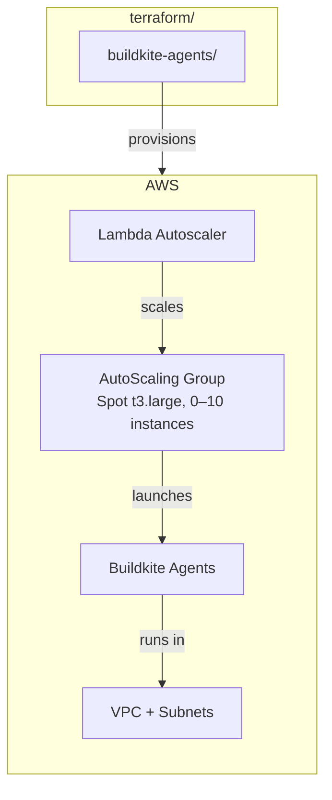

# Terraform Infrastructure

This directory contains all Terraform-managed infrastructure for MockServer.

## Modules

| Directory | Purpose | Region |
|-----------|---------|--------|
| [`buildkite-agents/`](buildkite-agents/) | Buildkite CI build agent cluster | `eu-west-2` |

## Prerequisites

- [Terraform](https://www.terraform.io/downloads) >= 1.5
- [AWS CLI](https://aws.amazon.com/cli/) with SSO profile `mockserver-build`
- AWS build agent account (see `~/mockserver-aws-ids.md`)

## Quick Start

Each module has a `run.sh` wrapper that handles AWS authentication and runs Terraform. See the individual module READMEs for details.

## State Management

All modules store state remotely in S3 with native file locking:

| Resource | Region |
|----------|--------|
| S3 Bucket (see `~/mockserver-aws-ids.md`) | `eu-west-2` |

The state backend is bootstrapped via `buildkite-agents/bootstrap/`. See the [bootstrap README](buildkite-agents/bootstrap/) for details.
