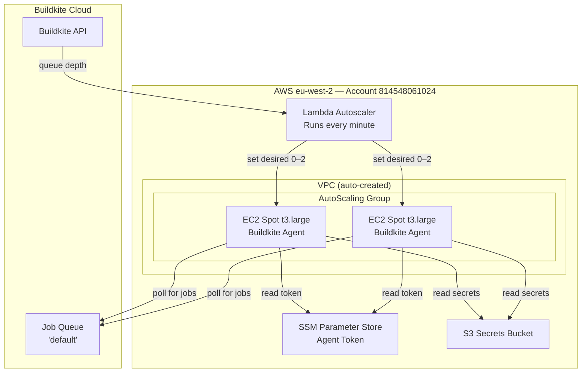
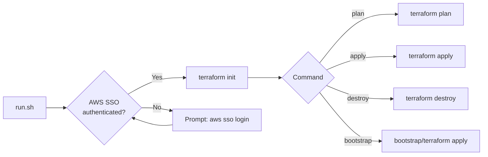

# Buildkite Agents

Terraform configuration for MockServer's Buildkite CI build agent infrastructure, using the official [Buildkite Elastic CI Stack for AWS](https://github.com/buildkite/terraform-buildkite-elastic-ci-stack-for-aws) module.

## Architecture



## How It Works


## Directory Structure

```
buildkite-agents/
├── bootstrap/           # One-time state backend setup
│   ├── main.tf          #   S3 bucket + DynamoDB table
│   └── README.md        #   Bootstrap instructions
├── main.tf              # Elastic CI Stack module
├── backend.tf           # S3 remote state configuration
├── variables.tf         # Input variables
├── outputs.tf           # Outputs (ASG name, VPC ID)
├── versions.tf          # Terraform + provider versions
├── terraform.tfvars.example  # Example variable values
├── run.sh               # Wrapper script (auth + plan/apply)
└── README.md            # This file
```

## Prerequisites

1. **Terraform** >= 1.5 — `brew install terraform`
2. **AWS CLI** — `brew install awscli`
3. **AWS SSO profile** `mockserver-build` configured:
   ```bash
   aws configure sso --profile mockserver-build
    # SSO region: eu-west-2
   # Default region: eu-west-2
   ```
4. **Buildkite agent token** — from https://buildkite.com/organizations/mockserver/agents

## Getting Started

### 1. Bootstrap the State Backend (first time only)

```bash
./run.sh bootstrap
```

This creates the S3 bucket and DynamoDB table used for remote state. Uses `import` blocks so it's safe to re-run against existing resources. See [bootstrap/README.md](bootstrap/) for details.

### 2. Configure Variables

```bash
cp terraform.tfvars.example terraform.tfvars
```

Edit `terraform.tfvars` and set your Buildkite agent token:

```hcl
buildkite_agent_token = "your-token-here"
```

> **terraform.tfvars is gitignored** — it contains secrets and must never be committed.

### 3. Preview Changes

```bash
./run.sh plan
```

### 4. Apply

```bash
./run.sh apply
```

## run.sh Reference

The `run.sh` wrapper handles AWS SSO authentication, environment workarounds (corporate TLS proxy, macOS pyexpat), and runs Terraform commands.

```
Usage: run.sh [command]

Commands:
  plan       Run terraform plan (default)
  apply      Run terraform apply
  destroy    Run terraform destroy
  bootstrap  Initialise the S3 state bucket and DynamoDB lock table
  init       Run terraform init
```



## Variables

| Variable | Type | Default | Description |
|----------|------|---------|-------------|
| `buildkite_agent_token` | `string` | *(required)* | Buildkite agent registration token |
| `region` | `string` | `eu-west-2` | AWS region |
| `instance_types` | `string` | `t3.large` | EC2 instance types (comma-separated) |
| `min_size` | `number` | `0` | Minimum instances (0 = scale to zero) |
| `max_size` | `number` | `2` | Maximum instances |
| `on_demand_percentage` | `number` | `0` | % on-demand vs spot (0 = all spot) |

## Outputs

| Output | Description |
|--------|-------------|
| `auto_scaling_group_name` | Name of the agent AutoScaling Group |
| `vpc_id` | VPC ID where agents run |

## Cost

With `min_size = 0` and `on_demand_percentage = 0` (100% spot):
- **Idle cost:** $0 (scales to zero when no builds queued)
- **Build cost:** ~$0.02/hr per agent (spot t3.large)
- Agents take 2–3 minutes to launch from cold start
