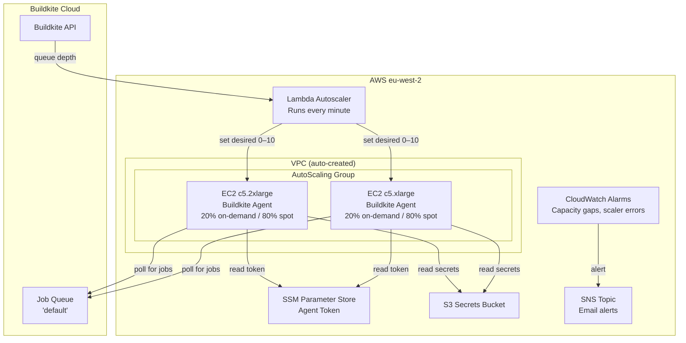
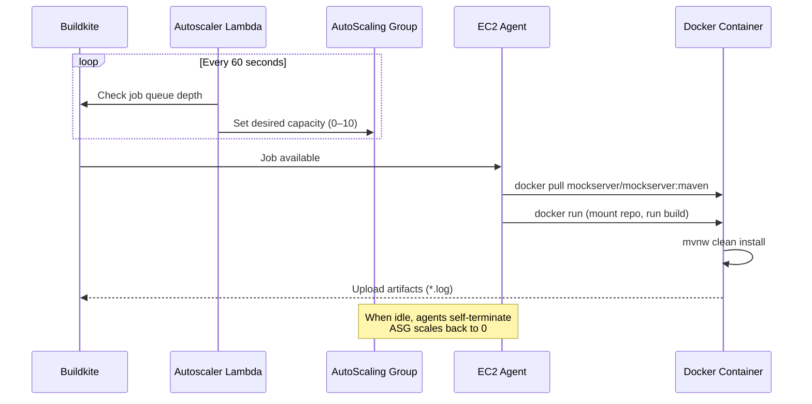
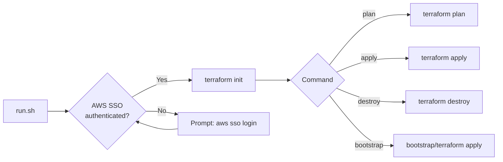

# Buildkite Agents

Terraform configuration for MockServer's Buildkite CI build agent infrastructure, using the official [Buildkite Elastic CI Stack for AWS](https://github.com/buildkite/terraform-buildkite-elastic-ci-stack-for-aws) module.

## Architecture



## How It Works



## Directory Structure

```
buildkite-agents/
├── bootstrap/               # One-time state backend setup
│   ├── main.tf              #   S3 bucket
│   └── README.md            #   Bootstrap instructions
├── main.tf                  # Elastic CI Stack module
├── monitoring.tf            # CloudWatch alarms, SNS notifications, dashboard
├── backend.tf               # S3 remote state configuration
├── build-secrets.tf         # Docker Hub secret + Buildkite agent IAM policy
├── variables.tf             # Input variables
├── outputs.tf               # Outputs (ASG name, VPC ID, dashboard URL)
├── versions.tf              # Terraform + provider versions
├── terraform.tfvars.example # Example variable values
├── run.sh                   # Wrapper script (auth + plan/apply)
└── README.md                # This file
```

## Prerequisites

1. **Terraform** >= 1.5 — `brew install terraform`
2. **AWS CLI** — `brew install awscli`
3. **AWS SSO profile** `mockserver-build` configured:
   ```bash
   aws configure sso --profile mockserver-build
    # SSO region: eu-west-2
   # Default region: eu-west-2
   ```
4. **Buildkite agent token** — from https://buildkite.com/organizations/mockserver/agents

## Getting Started

### 1. Bootstrap the State Backend (first time only)

```bash
./run.sh bootstrap
```

This creates the S3 bucket used for remote state. Uses `import` blocks so it's safe to re-run against existing resources. See [bootstrap/README.md](bootstrap/) for details.

### 2. Configure Variables

```bash
cp terraform.tfvars.example terraform.tfvars
```

Edit `terraform.tfvars` and set your Buildkite agent token:

```hcl
buildkite_agent_token = "your-token-here"
```

> **terraform.tfvars is gitignored** — it contains secrets and must never be committed.

### 3. Preview Changes

```bash
./run.sh plan
```

### 4. Apply

```bash
./run.sh apply
```

## run.sh Reference

The `run.sh` wrapper handles AWS SSO authentication, environment workarounds (corporate TLS proxy, macOS pyexpat), and runs Terraform commands.

```
Usage: run.sh [command]

Commands:
  plan       Run terraform plan (default)
  apply      Run terraform apply
  destroy    Run terraform destroy
  bootstrap  Initialise the S3 state bucket
  init       Run terraform init
```



## Variables

| Variable | Type | Default | Description |
|----------|------|---------|-------------|
| `buildkite_agent_token` | `string` | *(required)* | Buildkite agent registration token |
| `region` | `string` | `eu-west-2` | AWS region |
| `instance_types` | `string` | `c5.2xlarge,c5.xlarge,...` | EC2 instance types (diversified for reliability) |
| `min_size` | `number` | `0` | Minimum instances (0 = scale to zero) |
| `max_size` | `number` | `10` | Maximum instances |
| `on_demand_percentage` | `number` | `20` | % on-demand vs spot (20 = 20% on-demand fallback) |
| `alert_email` | `string` | `""` | Email address for infrastructure alerts |

## Outputs

| Output | Description |
|--------|-------------|
| `auto_scaling_group_name` | Name of the agent AutoScaling Group |
| `vpc_id` | VPC ID where agents run |
| `lambda_scaler_arn` | ARN of the Lambda autoscaler function |
| `dashboard_url` | CloudWatch Dashboard URL for agent monitoring |
| `sns_topic_arn` | SNS topic ARN for infrastructure alerts |

## Monitoring and Alerts

The infrastructure includes CloudWatch alarms and SNS email notifications for:

- **ASG capacity gap**: Desired capacity not met for 5+ minutes (EC2 launch failures or Spot unavailability)
- **Lambda scaler errors**: Autoscaler function errors
- **Lambda scaler not invoked**: EventBridge schedule broken
- **ASG launch failures**: EventBridge rule captures failed EC2 launches

**CloudWatch Dashboard**: View real-time agent capacity, scaler health, and recent logs via the dashboard URL output.

**Email Alerts**: Set `alert_email` in `terraform.tfvars` to receive SNS notifications. You'll need to confirm the subscription via email after first apply.

## Cost

Current configuration (`min_size = 0`, `on_demand_percentage = 20`, diversified instance types):
- **Idle cost:** ~$0 (scales to zero when no builds queued) + minimal CloudWatch alarm costs
- **Build cost:** ~$0.03–0.10/hr per agent (20% on-demand, 80% spot, c5/m5 family)
- **Monitoring cost:** <$1/month (alarms + dashboard + SNS)
- Agents take 2–3 minutes to launch from cold start

## Reliability Improvements

The infrastructure is designed to handle EC2 Spot capacity fluctuations:

1. **Diversified instance types**: Multiple instance families and sizes (c5, c5a, m5)
2. **On-demand fallback**: 20% on-demand capacity ensures builds can start even when Spot is unavailable
3. **On-demand base**: Always launches at least 1 on-demand instance when scaling up
4. **Proactive monitoring**: Alerts notify you of capacity issues before builds are blocked
