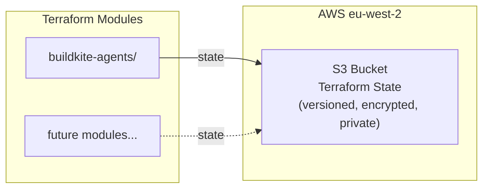
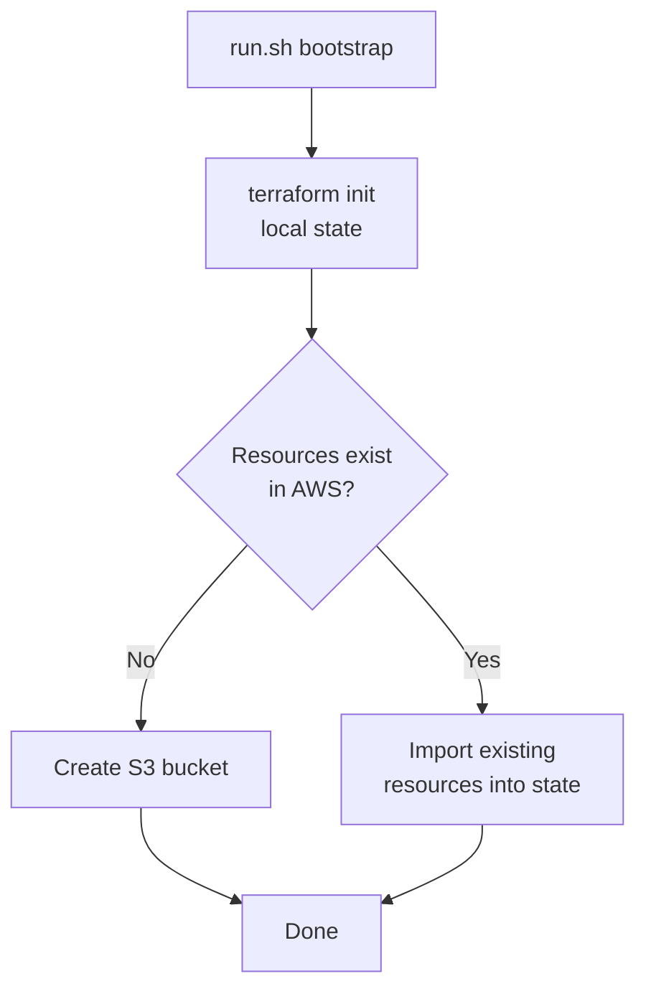

# Bootstrap — Terraform State Backend

One-time setup for the S3 bucket that stores Terraform remote state for all modules.

## What It Creates



| Resource | Purpose |
|----------|---------|
| S3 Bucket (see `~/mockserver-aws-ids.md`) | Stores `.tfstate` files with versioning and AES-256 encryption |
| S3 Public Access Block | *(on above bucket)* | Blocks all public access |

## How It Works

This bootstrap uses **local state** (no remote backend — it *is* the backend). It includes Terraform `import` blocks for every resource, which means:

- **First run:** creates the resources from scratch
- **Re-run against existing resources:** imports them into local state without error
- **Idempotent:** safe to run multiple times



## Usage

From the parent directory:

```bash
./run.sh bootstrap
```

Or directly:

```bash
cd bootstrap
terraform init
terraform apply -auto-approve
```

## State File

The bootstrap's own state is stored locally in `bootstrap/terraform.tfstate`. This file is gitignored. Losing it is harmless — re-running bootstrap will re-import the existing resources.

## Outputs

| Output | Description |
|--------|-------------|
| `state_bucket` | Name of the S3 bucket (see `~/mockserver-aws-ids.md`) |
